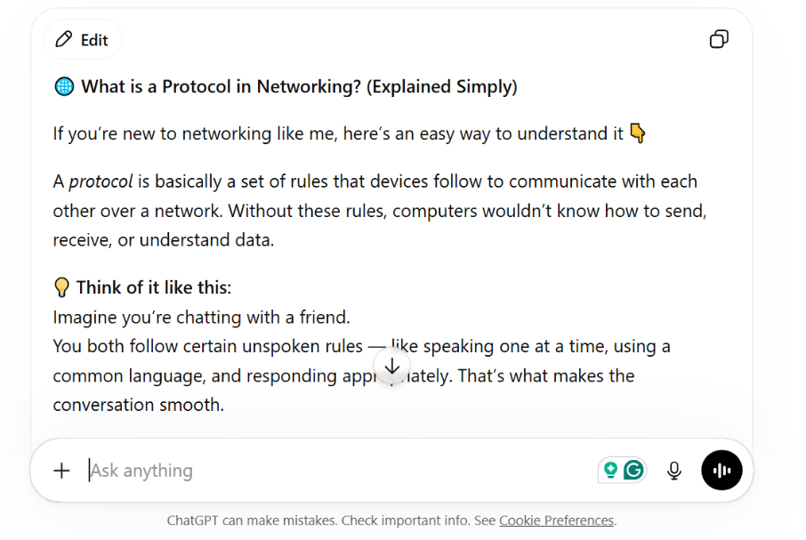
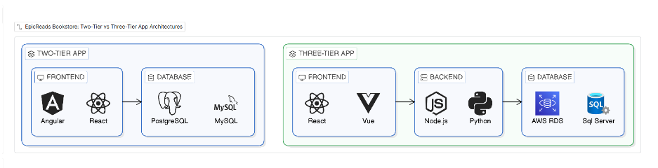
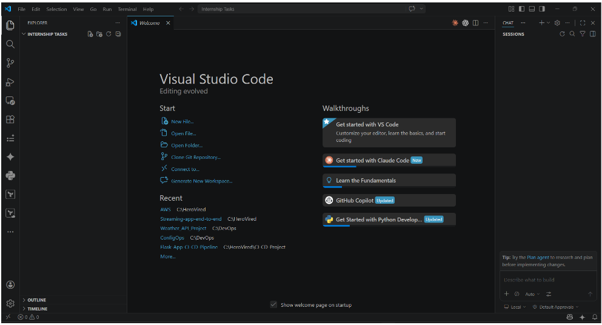
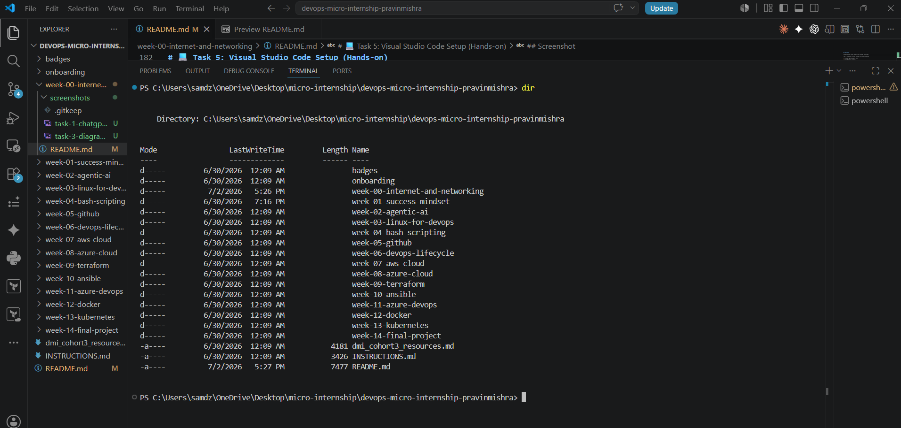
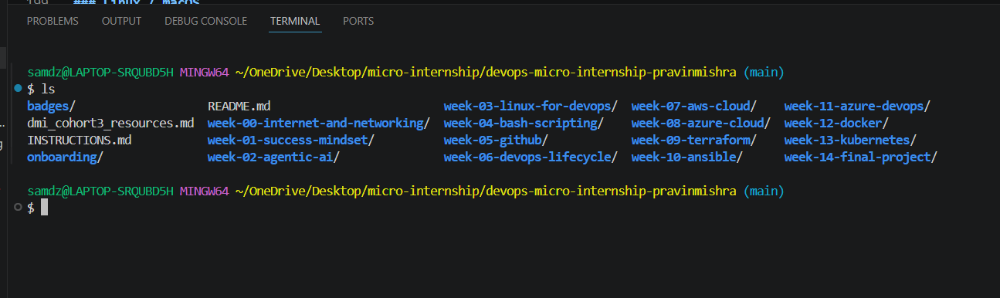

# Week 00 - Internet and Networking

Part of the DevOps Micro Internship (DMI) Cohort 3 with Agentic AI

---

# 🧑‍💻 Task 1: Using ChatGPT as Your Learning Assistant

## Scenario

You're new to DevOps and will frequently encounter technical questions. ChatGPT can be your learning companion.

## Your Task

Write a clear ChatGPT prompt to help you understand:

> "What is a protocol in networking? Explain with a simple real-life example."

Take a screenshot of your interaction showing:

* Your detailed prompt (with clear expectations)
* ChatGPT's simplified response with an example

## Screenshot

Save your screenshot in the `screenshots` folder and update the file name below.




Replace `task-1-chatgpt.png` with your actual screenshot file name.

---

## What I Learned (2–3 lines)

Through this task, I learned how to break down a technical concept like networking protocols into simple, relatable language. I also practiced using real-life analogies to make complex ideas easier for beginners to understand, especially for a non-technical audience. 

---

# 🌐 Task 2: Internet and Networking

## Scenario

Your friend is launching an online bookstore named **EpicReads**.

He asked you to explain how users globally can access his website hosted in Finland.

## Your Task

Write a short explanation (**100–150 words**) that includes:

* Packet Switching
* IP Address
* TCP/IP
* HTTP/HTTPS

💡 **Tip:** You may use ChatGPT (as demonstrated in Task 1) to refine your explanation.

## Answer

When a user visits a site like EpicReads, the journey begins with packet switching, where data is split into small packets (data packets) and routed independently across the internet before being reassembled at the destination.
The destination is identified using an IP address, which acts like a unique digital location for the server hosting the website.
Communication between the user and server follows the TCP/IP protocol suite. TCP ensures reliable, ordered delivery of packets, while IP handles routing them across networks.
Finally, web content is delivered using HTTP/HTTPS. Whereas, HTTPS adds a layer of security through encryption, ensuring safe browsing and transactions.

---

# 🏗️ Task 3: Application Architecture & Stack

## Scenario

EpicReads bookstore has two application versions:

### Two-Tier Application

* Frontend
* Database

### Three-Tier Application

* Frontend
* Backend
* Database

## Your Task

* Draw simple diagrams (hand-drawn or tool-based such as draw.io)
* Label each layer clearly
* List at least two common technologies or tools used for each layer
* Submit a screenshot or photo clearly showing your own drawing

## Diagram Screenshot / Photo

Save your diagram image in the `screenshots` folder and update the file name below.




Replace `task-3-diagram.png` with your actual diagram file name.

---

## 2 -Tier Technology Stack

### Frontend

* HTML, CSS, JavaScript
* React / Angular / Vue


### Database:

* MySQL
* PostgreSQL / MongoDB


---

## 3 -Tier Technology Stack

### Frontend

* HTML, CSS, JavaScript
* React / Angular / Vue


### Backend

* Node.js (Express)
* Python (Django / Flask)
* Java (Spring Boot)


### Database

* MySQL
* MongoDB / PostgreSQL


## Conclusion:

**Two-tier:** Simple, but less scalable \
**Three-tier:** More scalable, secure, and commonly used in real-world apps


---

# 🌍 Task 4: Domain Name & DNS (Basic Concepts)

## Scenario

Your friend's bookstore **EpicReads** is currently accessible through:

```text
52.172.142.222:3000
```

He purchased the domain:

```text
epicreads.com
```

## Your Task

In **50–100 words**, explain in your own words:

1. What is DNS (Domain Name System)?
2. Which DNS record type should be used to connect the domain to the given IP, and why?

## Answer

1. **DNS** (Domain Name System) is the internet’s naming system that translates human-readable domain names like epicreads.com into machine-readable IP addresses so browsers can find the correct server.

2. To connect **epicreads.com** to 52.172.142.222, we should use an A record, because it maps a domain directly to an **IPv4** address. The port (3000) is not handled by DNS; it is managed by the web server or application configuration after the domain resolves to the correct IP.


---

# 💻 Task 5: Visual Studio Code Setup (Hands-on)

## Your Task

Install Visual Studio Code (if not already installed).

Take a screenshot of your VS Code environment showing:

* Terminal open inside VS Code
* Running a basic command:

### Windows

```powershell
dir
```

### Linux / macOS

```bash
pwd
ls
```

* Your selected VS Code theme clearly visible

⚠️ **Important:** The screenshot must show your username or another identifiable detail to confirm it is your environment.

## Screenshot

Save your screenshot in the `screenshots` folder and update the file name below.






Replace `task-5-vscode.png` with your actual screenshot file name.

---

# 🔗 Task 6: Publish Your Assignment as a LinkedIn Post

## Objective

Publishing on LinkedIn helps you:

* Build your professional online presence
* Reinforce your learning
* Document your DevOps journey publicly

## Your Task

Summarize your answers from Tasks 1–5 into a LinkedIn post.

Clearly structure your post into the following sections:

* ChatGPT
* Internet & Networking
* App Architecture
* DNS
* VS Code Setup

Add the following credit note at the end of your post:

> **P.S. This post is part of the DevOps Micro Internship (DMI) with Agentic AI — Cohort 3 — by Pravin Mishra. My graded progress is public: https://dmi.pravinmishra.com/s/YOUR-GITHUB-USERNAME.html · Start your DevOps journey: https://dmi.pravinmishra.com/?utm_source=student&utm_medium=ps-linkedin&utm_campaign=cohort3**

---

## LinkedIn Post URL

Paste your LinkedIn post URL here:

https://tinyurl.com/yummtmue


---

## LinkedIn Post Backup Copy

Paste the full text of your LinkedIn post here:

---

🚀 My 𝐃𝐞𝐯𝐎𝐩𝐬 learning journey has been deeply focused on understanding the core building blocks of modern systems: 𝐈𝐧𝐭𝐞𝐫𝐧𝐞𝐭 & 𝐍𝐞𝐭𝐰𝐨𝐫𝐤𝐢𝐧𝐠, 𝐀𝐩𝐩𝐥𝐢𝐜𝐚𝐭𝐢𝐨𝐧 𝐀𝐫𝐜𝐡𝐢𝐭𝐞𝐜𝐭𝐮𝐫𝐞, and 𝐃𝐍𝐒 (𝐃𝐨𝐦𝐚𝐢𝐧 𝐍𝐚𝐦𝐞 𝐒𝐲𝐬𝐭𝐞𝐦).


𝐎𝐧𝐞 𝐤𝐞𝐲 𝐢𝐧𝐬𝐢𝐠𝐡𝐭: Everything we interact with online is just a well-orchestrated flow of requests, routing, and resolution. 𝐃𝐍𝐒, transforms human-friendly domains into 𝐈𝐏 𝐚𝐝𝐝𝐫𝐞𝐬𝐬𝐞𝐬, making the internet usable at scale.


For example, 𝐃𝐍𝐒 (Domain Name System) acts as the internet's phonebook. It translates human-readable domain names like **epicreads.com** into machine-readable IP addresses, allowing browsers to locate and communicate with the correct server.


I also learned that if **epicreads.com** needs to point to the IPv4 address **xx.xxx.xxx.xxx**, the correct DNS record to use is an **A record**, since it maps a domain directly to an IPv4 address. Interestingly, the application port (such as **3000**) isn't managed by DNS—it is handled by the web server or application configuration after the domain has already been resolved to the correct IP.


What’s helped me learn faster is using 𝐂𝐡𝐚𝐭𝐆𝐏𝐓 as a real-time learning companion—breaking down complex concepts, simulating scenarios, and helping me debug my understanding step by step.


Another essential tool in this journey is 𝐕𝐢𝐬𝐮𝐚𝐥 𝐒𝐭𝐮𝐝𝐢𝐨 𝐂𝐨𝐝𝐞. For DevOps workflows, it’s more than just an editor—it’s a productivity hub for writing configs, managing 𝐢𝐧𝐟𝐫𝐚𝐬𝐭𝐫𝐮𝐜𝐭𝐮𝐫𝐞-𝐚𝐬-𝐜𝐨𝐝𝐞, and integrating with 𝐂𝐈/𝐂𝐃 pipelines.


📈 Still learning, still building, and enjoying every layer of the stack. 


𝘗.𝘚. 𝘛𝘩𝘪𝘴 𝘱𝘰𝘴𝘵 𝘪𝘴 𝘱𝘢𝘳𝘵 𝘰𝘧 𝘵𝘩𝘦 𝘍𝘙𝘌𝘌 𝘋𝘦𝘷𝘖𝘱𝘴 𝘔𝘪𝘤𝘳𝘰 𝘐𝘯𝘵𝘦𝘳𝘯𝘴𝘩𝘪𝘱 𝘊𝘰𝘩𝘰𝘳𝘵 𝘳𝘶𝘯 𝘣𝘺 𝘗𝘳𝘢𝘷𝘪𝘯 𝘔𝘪𝘴𝘩𝘳𝘢. 𝘠𝘰𝘶 𝘤𝘢𝘯 𝘴𝘵𝘢𝘳𝘵 𝘺𝘰𝘶𝘳 𝘋𝘦𝘷𝘖𝘱𝘴 𝘫𝘰𝘶𝘳𝘯𝘦𝘺 𝘧𝘰𝘳 𝘧𝘳𝘦𝘦 𝘧𝘳𝘰𝘮 𝘩𝘪𝘴 𝘠𝘰𝘶𝘛𝘶𝘣𝘦 𝘗𝘭𝘢𝘺𝘭𝘪𝘴𝘵. 𝘩𝘵𝘵𝘱𝘴://𝘭𝘯𝘬𝘥.𝘪𝘯/𝘥66𝘟-𝘴𝘢𝘺


#DevOps #Networking #DNS #CloudComputing #AppArchitecture #Learning #ChatGPT #VSCode #TechJourney


---

# Reflection – Week 0

### What did you find easy?

 Understanding the basic idea of Internet & Networking and App Architecture was relatively easy 

---

### What was difficult?

The challenging part was connecting all the pieces together—how DNS, networking, and application architecture interact in real real-world systems. Also, remembering that DNS does not handle ports (like 3000) required clarification. 

---

### What will you improve next week?

Next week, I will focus on deeper hands-on practice with networking commands, understanding how requests flow through systems step-by-step, and exploring real DevOps workflows like CI/CD pipelines and cloud deployment basics.

---

## 📌 About DMI & CloudAdvisory

DevOps Micro Internship (DMI) is a project-based DevOps program run by Pravin Mishra (The CloudAdvisory) focused on real-world execution, systems thinking, and career readiness.

It helps learners build strong DevOps foundations with hands-on experience.


## 📌 Resources

- 🌐 **DMI Official Website:** https://pravinmishra.com/dmi  
- 🎓 **DevOps for Beginners (Udemy):** https://www.udemy.com/course/devops-for-beginners-docker-k8s-cloud-cicd-4-projects/  
- 🎓 **Ultimate Agentic AI DevOps with Clude Code** https://www.udemy.com/course/ultimate-agentic-ai-devops-with-claude-code/?referralCode=448389767BC96284087B
- 🎓 **DevOps with Claude Code: Terraform, EKS, ArgoCD & Helm** https://www.udemy.com/course/devops-with-claude-code-terraform-eks-argocd-helm/?referralCode=1C5B734505D65A010FA3
- ▶️ **YouTube Playlist (DMI Cohort 3):** https://www.youtube.com/playlist?list=PLFeSNDtI4Cho  
- 🔗 **Pravin Mishra (LinkedIn):** https://www.linkedin.com/in/pravin-mishra-aws-trainer/  
- 🏢 **CloudAdvisory (LinkedIn):** https://www.linkedin.com/company/thecloudadvisory/

---

*This submission is part of DevOps Micro Internship (DMI) Cohort 3 — Agentic AI Track*