# Week 01 — Success Mindset (Mindset OS)

Part of the DevOps Micro Internship (DMI) Cohort 3 with Agentic AI

---

## Purpose (Read This First)

This week is not motivation homework.

This is you building your **Mindset OS** — the system you will use for the next 5 months (and honestly, for years).

### Expectations

* Be honest.
* Be specific.
* Be practical.
* Write like an adult professional: clear sentences, no one-liners.

You will reuse this in later weeks. So do it properly once.

---

# Assignment 1. What is something you believe to be true that most people around you would disagree with?

### Rules

* No "safe" answers.
* Must be your real belief (not copied from internet).
* Minimum 50 words.

**Hint:** What do you believe about career, money, learning, discipline, relationships, health, success, life, tech industry, etc. that most people don't agree with?

## Answer

I tend to be highly work-driven and deeply committed to my tasks, even when others feel it may be excessive. I also value being direct and straightforward in my communication, though this approach is sometimes seen as too blunt by those around me.

---

# Assignment 2. What are the top 3 objective truths you discovered through experimentation and results?

### Definition

Objective truths do not depend on opinions. They hold true regardless of how people feel.

Write each truth in this format:

**Truth:** (1 sentence)

**Evidence from my life:** (2–4 lines: what you tried + what happened)

---

## Truth #1

### Truth

Being overly work-focused can affect balance in life.

### Evidence from my life

I noticed that I often spend a lot of time and energy on work-related tasks.
Even when I feel productive, others around me sometimes say I am doing too much.
This showed me that too much focus on work can reduce time for rest and balance.

---

## Truth #2

### Truth

Being straightforward is not always received the same way by everyone. People don’t always perceive intentions the way they are meant.

### Evidence from my life

At times, I communicate or act with good intentions, especially when being direct or focused on work.
However, others sometimes interpret it differently than I expected.
This helped me realize that intention and perception are not always the same. 
This taught me that communication style affects how my message is received.

---

## Truth #3

### Truth

Discipline matters more than motivation for long-term success.

### Evidence from my life

I noticed that I am more productive when I follow a routine, even on days when I don’t feel motivated.
When I rely only on motivation, my consistency drops.
This showed me that discipline is what keeps progress going, not just motivation.

---

# Assignment 3. What does your 2.0 version look like?

### Instructions

Write as if a journalist is writing about you **3 to 7 years from now** (not 20 years).

**Minimum 300 words.**

### Rules

* Write in past tense, like it already happened.
* Don't use "likes to / wants to / hopes to."
* Use specifics:

  * built
  * shipped
  * led
  * published
  * earned
  * relocated
  * contributed
* Include skills proof:

  * projects
  * portfolios
  * GitHub
  * blogs
  * certifications
  * job role
  * leadership
  * community contribution
* Add 1–3 images if you can (optional but powerful).

### Publish It Publicly On Any ONE

* LinkedIn
* Medium
* WordPress
* Blogspot
* Personal blog
* Portfolio page

Include this line:

> **P.S. This post is part of the DevOps Micro Internship (DMI) with Agentic AI — Cohort 3 — by [Pravin Mishra](https://www.linkedin.com/in/pravin-mishra-aws-trainer/). My graded progress is public: https://dmi.pravinmishra.com/s/YOUR-GITHUB-USERNAME.html · Start your DevOps journey: https://dmi.pravinmishra.com/?utm_source=student&utm_medium=ps-blog&utm_campaign=cohort3**

## Your Article

(https://www.linkedin.com/pulse/saimas-version-20-rise-ai-driven-devops-engineer-saima-usman-i9gef)

### Public Link

(https://www.linkedin.com/pulse/saimas-version-20-rise-ai-driven-devops-engineer-saima-usman-i9gef)

`Add your URL here`

---

# Assignment 4. Have you ever cut corners (unethical / dishonest / shortcut behavior — not necessarily illegal)? If yes, how did it make you feel?

### Important

You don't need to write the full story.

Focus on the feeling:

* guilt
* fear
* shame
* stress
* regret
* numbness
* etc.

This is about self-awareness, not judgment.

### Answer Format

**Yes / No**

If Yes:

**What emotion did you feel?** (minimum 50–100 words)

## Answer

**Yes**

**What emotion did you feel?**

I mostly felt stress and guilt. Even though cutting corners seemed like the easier option at the time, I kept thinking about whether it was the right thing to do. I was worried that someone might notice or that the outcome wouldn't meet the expected standard. Looking back, I also felt some regret because the short-term convenience wasn't worth the discomfort that followed. The experience reminded me that being honest and doing things properly gives me much more peace of mind, even if it takes extra time and effort.

---

# Assignment 5. What are 10 non-fiction books you plan to read in the next 1 year?

### Rules

* Mention **Title + Author**
* Any language allowed
* No fiction novels

### Tip

Choose books that improve:

* mindset
* communication
* productivity
* health
* money
* career
* leadership

## Book List

| Book | Cover | Quick Summary | Why I Chose It |
|------|:-----:|:-------------:|----------------|
| **Atomic Habits** *by James Clear* | 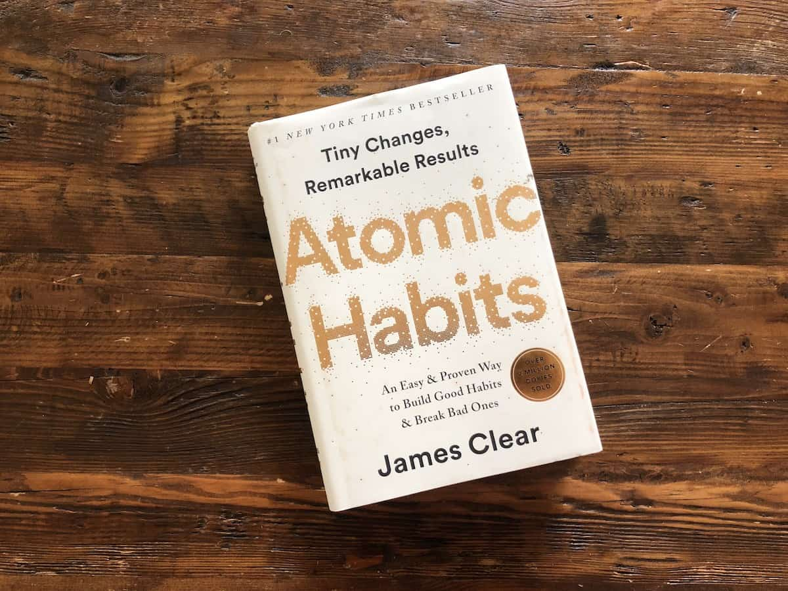 | 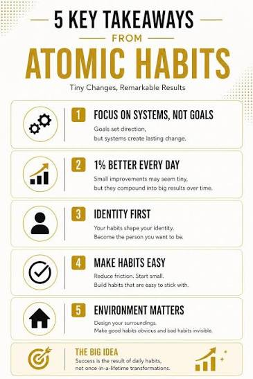 | To learn how small, consistent habits can lead to significant personal and professional growth. |
| **Deep Work** *by Cal Newport* | 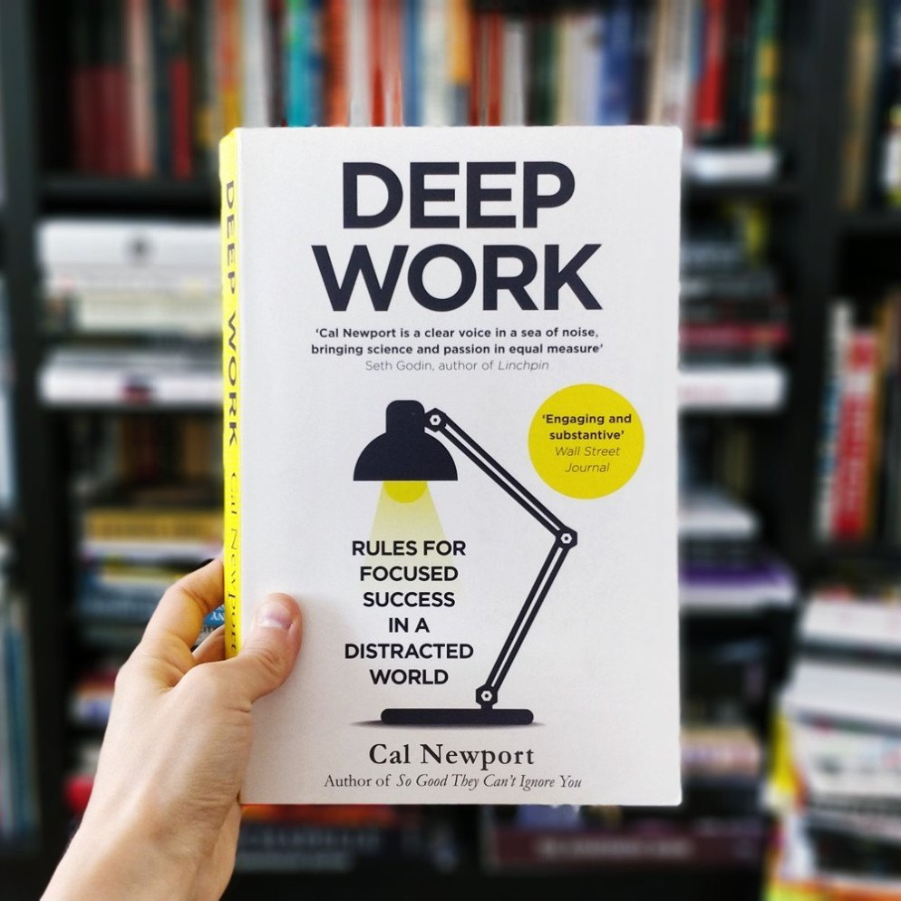 | 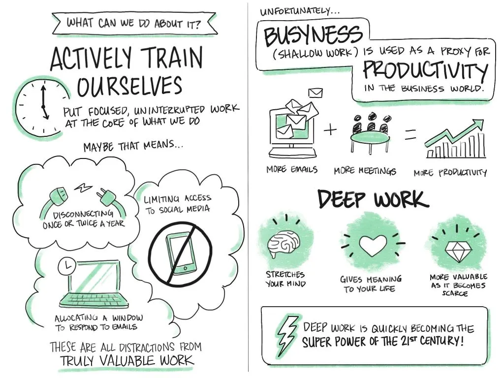 | To improve my ability to focus deeply, minimize distractions, and produce high-quality work. |
| **The Psychology of Money** *by Morgan Housel* | 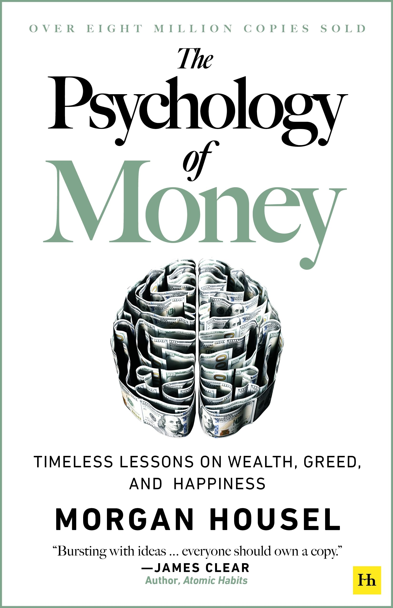 |  | To better understand financial behavior, long-term investing, and making smarter money decisions. |
| **Thinking, Fast and Slow** *by Daniel Kahneman* | 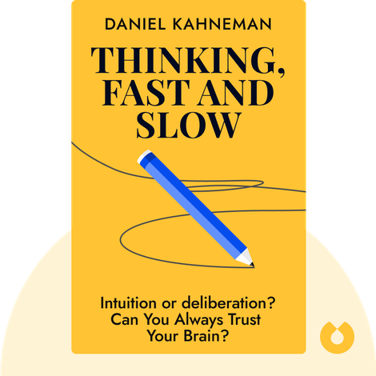 | 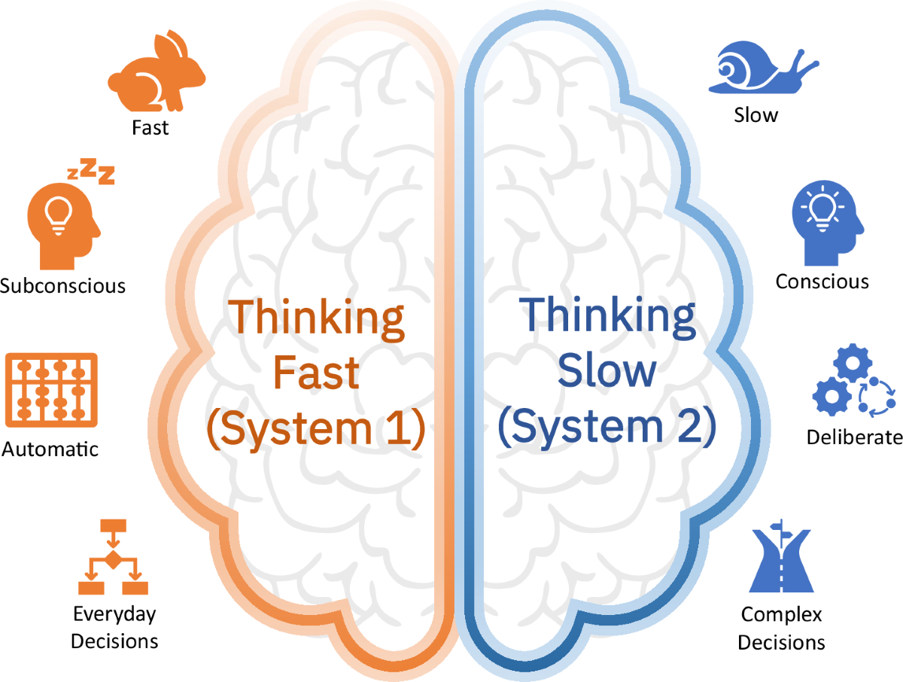 | To learn how people make decisions, recognize cognitive biases, and develop better judgment. |
| **The 7 Habits of Highly Effective People** *by Stephen R. Covey* | 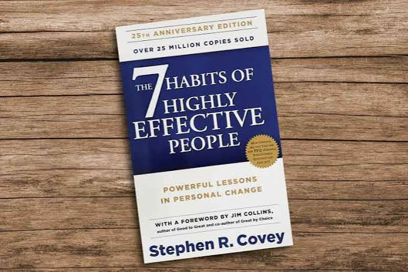 | 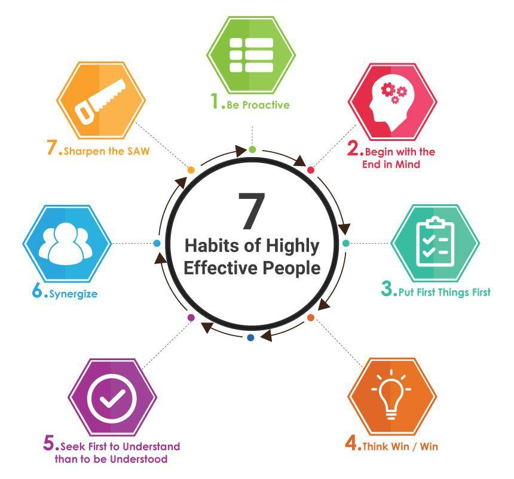 | To build strong personal values, improve effectiveness, and become more proactive in life and work. |
| **How to Win Friends and Influence People** *by Dale Carnegie* |  | 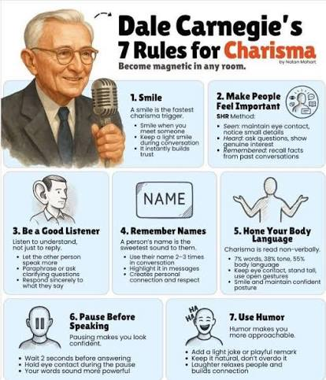 | To strengthen my communication skills, build meaningful relationships, and become better at working with others. |
| **The First 90 Days** *by Michael D. Watkins* | 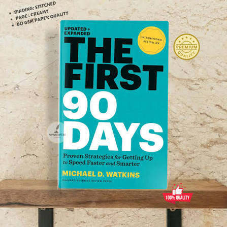 | 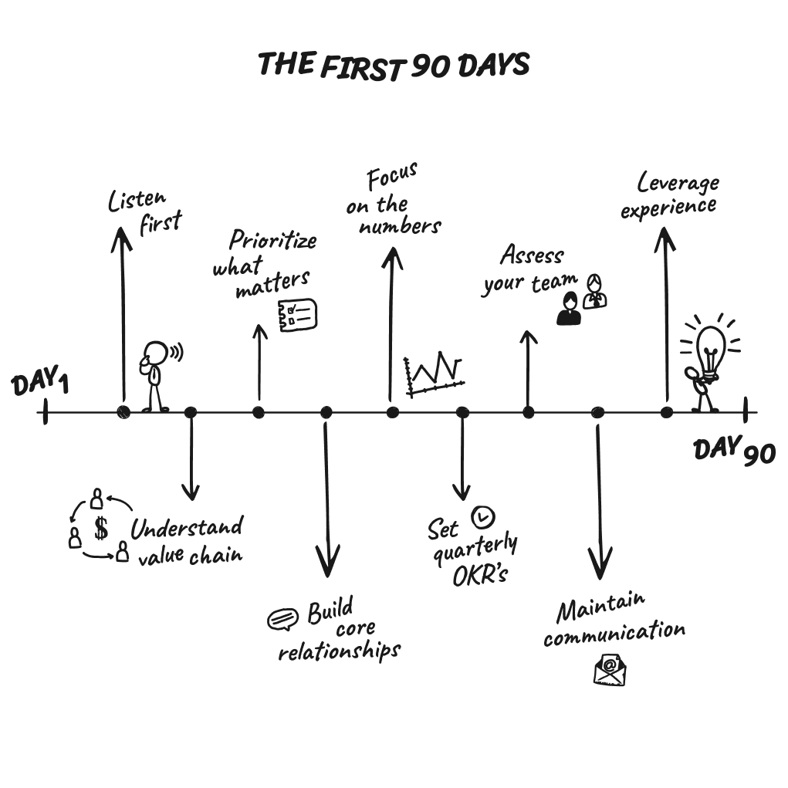 | To learn how to adapt quickly, succeed in new roles, and make a positive impact during career transitions. |
| **The Effective Executive** *by Peter F. Drucker* | 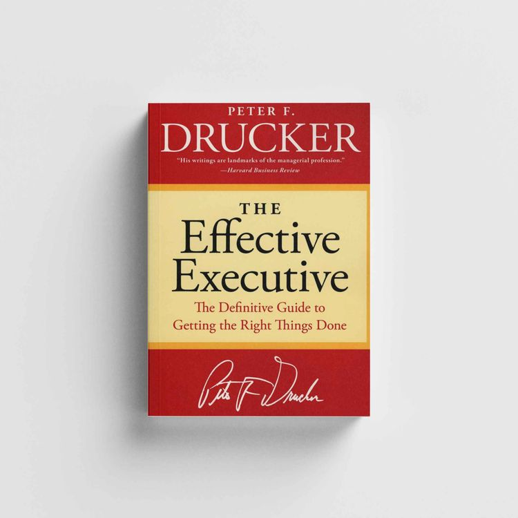 | 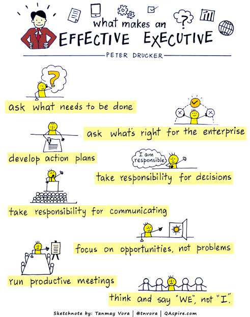 | To improve my time management, decision-making, and leadership skills to become a more effective professional. |
| **Never Split the Difference** *by Chris Voss* | 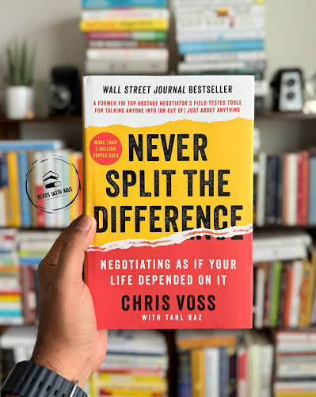 | 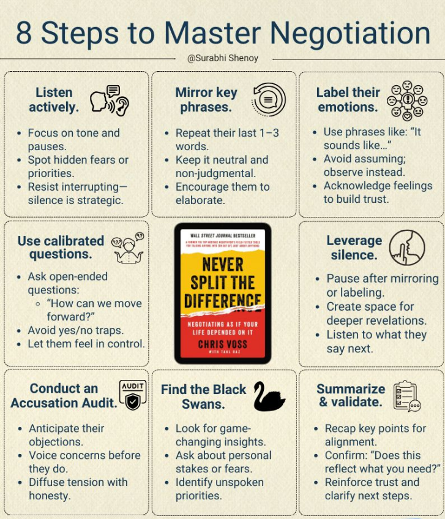 | To learn practical negotiation and communication techniques for handling difficult conversations and achieving better outcomes. |
| **Can't Hurt Me** *by David Goggins* |  |  | To develop mental resilience, self-discipline, and the determination to overcome challenges and push beyond my limits. |

---

# Assignment 6. What are the things you will measure regularly in your life and career?

### Rules

List topics only. No need to share numbers.

### Must Include

* Learning / skill
* Output / proof
* Health / energy
* Time / focus
* Money / finance (personal or business)

### Example

* Learning hours per week
* Deep work sessions per week
* Projects shipped / documented
* Steps / workouts
* Sleep hours
* Spending tracker

## My Metrics

- Learning hours per week
- New skills or certifications earned
- Projects completed
- Portfolio updates
- Deep work sessions per week
- Sleep hours
- Exercise/workout consistency
- Daily energy level
- Monthly savings and investments
- Personal spending tracker

---

# Assignment 7. Brain Dump + 5-Month System Plan

## Step 1: Brain Dump (Private)

Do a brain dump of everything in your mind into a notebook.

Examples:

* Bills
* Tasks
* Worries
* Goals
* Pending messages
* Ideas
* Responsibilities

### Did You Do It?

**Yes**

Answer:

## Step 1: Brain Dump (Private)

I wrote down everything that was on my mind without organizing it first. This included:

* Pending tasks and assignments I need to complete
* Upcoming deadlines and exams
* Personal goals I want to achieve in the next few months
* Financial responsibilities and any pending payments
* Messages and conversations I still need to respond to
* Ideas for learning, projects, and skill development
* Health-related habits I want to improve (sleep, exercise, routine)
* Career-related goals and things I want to improve professionally
* Small daily responsibilities and reminders
* Things I’ve been worrying about or overthinking

This helped me clear mental clutter and see everything in one place instead of keeping it in my head.

---

## Step 2: Your 5-Month Routine + Focus Blocks

Create a simple plan you can realistically follow for the next 5 months.

### Weekly Routine

Example:

* Mon–Thu: 60 min deep work
* Sat: DMI session
* Sun: Weekly review

My Answer:

### My Weekly Routine

* Mon–Fri: 60–90 min deep work (study, skill-building, or project work)
* Mon–Fri: 30 min learning (reading or online course)
* Mon–Fri: 20–30 min workout or physical activity
* Saturday: Attend DMI session + review of weekly progress + planning next week
* Sunday: Rest + hangingout with family + reset + light preparation for the upcoming week
* Daily: 10–15 min planning and journaling to track tasks and focus

---

### Focus Blocks

#### When Will You Do DMI Work? (Days + Time)

* Mondays & Tuesdays (9:00am till 11:00am)
* Wednesdays (9:00am till 11:00am), if needed

#### How Many Sessions Per Week?

4 sessions per week to upgrade my learning skills + practice of new tools 

---

### Distraction Rules

Examples:

* Phone rules
* Social media rules
* Environment setup

#### My Distraction Rules

* Phone is kept on silent and out of reach during deep work sessions
* No social media (Instagram/YouTube/TikTok) during study or work time
* Social media is allowed only after completing daily tasks
* Notifications are turned off for non-essential apps
* Study environment is kept clean and minimal (only laptop, notebook, and required materials)
* I will use focus timers (like Pomodoro) during work sessions
* No multitasking while studying or learning
* I will avoid random browsing and stick only to planned tasks
* I will study in a quiet space or use noise-cancelling headphones
* Entertainment is used only as a reward after completing goals

---

# Reflection – Week 1

### Biggest insight I got about myself this week

I realized that I tend to delay important tasks and only start working when deadlines feel close. I also noticed that I work better when I have a clear structure and specific time blocks instead of an open schedule.

### My biggest weakness/loop I noticed

My biggest loop is distraction, especially phone usage and switching between tasks. I also tend to lose focus when I don’t have a fixed plan for the day, which leads to stalling.

### One system I will implement from this week (exact habit + time)

I will follow a fixed daily deep work routine: 60–90 minutes of focused study/work every weekday from a set time (for example, 7:00 PM to 8:30 PM), with phone kept away and notifications off during this period.

### LinkedIn Post

https://lnkd.in/dHvbC5Z9

`Add your URL here`

---

## 10. Proof of Work

- LinkedIn Post URL: (https://www.linkedin.com/in/saima-usman/recent-activity/articles/)
- Blog / Medium : (https://tinyurl.com/mryuhkhf), (https://tinyurl.com/4tnnp3bv)

---

## 📌 About DMI & CloudAdvisory

DevOps Micro Internship (DMI) is a project-based DevOps program run by Pravin Mishra (The CloudAdvisory) focused on real-world execution, systems thinking, and career readiness.

It helps learners build strong DevOps foundations with hands-on experience.

## 📌 Resources

- 🌐 **DMI Official Website:** https://pravinmishra.com/dmi  
- 🎓 **DevOps for Beginners (Udemy):** https://www.udemy.com/course/devops-for-beginners-docker-k8s-cloud-cicd-4-projects/  
- 🎓 **Ultimate Agentic AI DevOps with Clude Code** https://www.udemy.com/course/ultimate-agentic-ai-devops-with-claude-code/?referralCode=448389767BC96284087B
- 🎓 **DevOps with Claude Code: Terraform, EKS, ArgoCD & Helm** https://www.udemy.com/course/devops-with-claude-code-terraform-eks-argocd-helm/?referralCode=1C5B734505D65A010FA3
- ▶️ **YouTube Playlist (DMI Cohort 3):** https://www.youtube.com/playlist?list=PLFeSNDtI4Cho  
- 🔗 **Pravin Mishra (LinkedIn):** https://www.linkedin.com/in/pravin-mishra-aws-trainer/  
- 🏢 **CloudAdvisory (LinkedIn):** https://www.linkedin.com/company/thecloudadvisory/

---

*This submission is part of DevOps Micro Internship (DMI) Cohort 3 — Agentic AI Track*

----

## My Badges

  