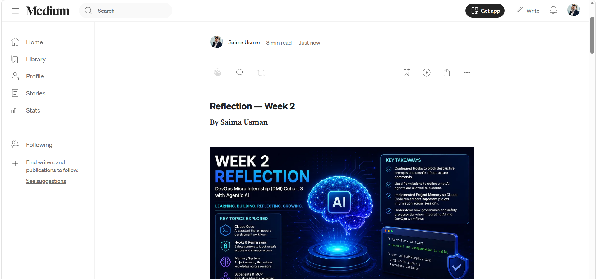
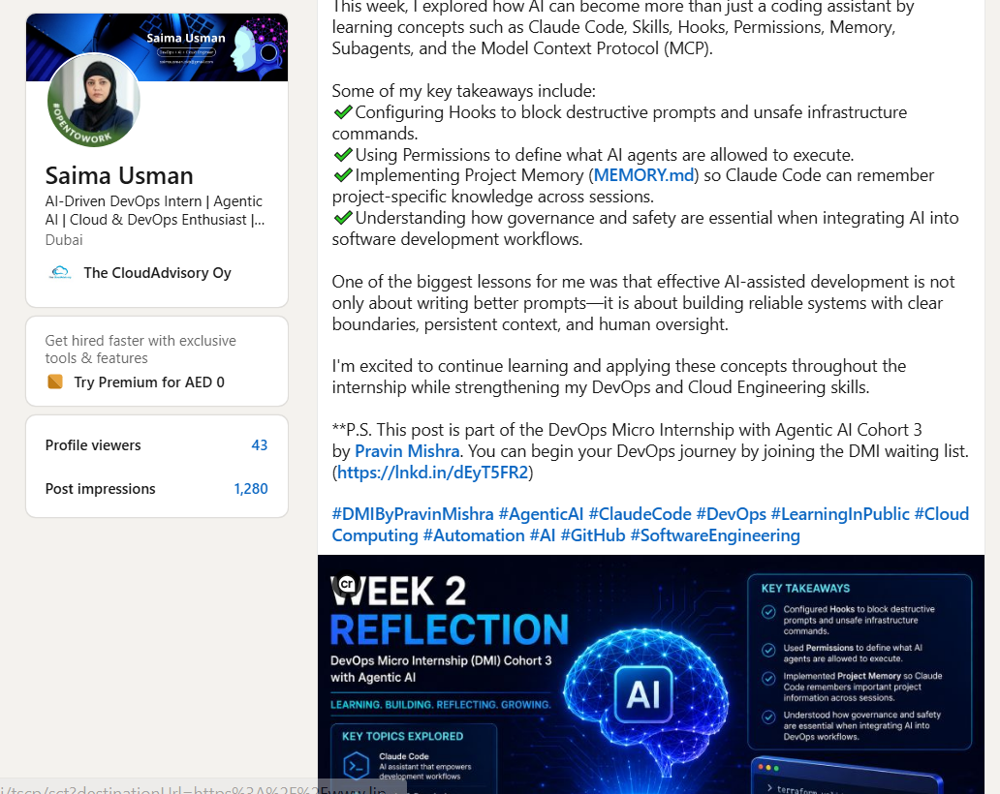

# Assignment 8 — Week 2 Reflection Blog

Part of the DevOps Micro Internship (DMI) Cohort 3 with Agentic AI

---

# Purpose

In this assignment, you will reflect on your Week 2 learning journey and write a short blog capturing your experience working with Agentic AI tools such as Claude Code, Skills, Subagents, MCP, Hooks, Permissions, and Memory.

You will also publish a LinkedIn post summarizing your learning and share both links for evaluation.

---

# Task 1 — Write Your Reflection Blog

## Goal

Write a reflection blog covering your Week 2 learning experience.

### Blog Requirements

Your blog must include:

* Title: **Reflection – Week 2**
* Minimum 300 words
* At least 2–3 topics from Week 2 (Claude Code, Skills, Subagents, MCP, Hooks, Permissions, Memory)
* Honest personal reflection (learning, challenges, mindset)
* One habit/system you plan to implement
* Your full name clearly visible

### Allowed Platforms

You can publish your blog on:

* Hashnode
* Medium
* Dev.to
* LinkedIn Article
* GitHub Markdown file
* Substack

---

### Evidence

#### Screenshot 1 — Blog published and visible

---

### Submission Field

https://medium.com/@saimausman.dxb/an-exciting-journey-into-the-world-of-agentic-ai-and-claude-code-43940d55c2f1

---

# Task 2 — Create LinkedIn Post

## Goal

Share your Week 2 learning publicly on LinkedIn.

---

### LinkedIn Post Requirements

Your post must include:

* One screenshot from any Week 2 assignment
* Short reflection (what you learned or built)
* Required P.S. line exactly as given below

---

### Required P.S. Line (Must Include Exactly)

> **P.S. This post is part of the DevOps Micro Internship (DMI) with Agentic AI — Cohort 3 — by [Pravin Mishra](https://www.linkedin.com/in/pravin-mishra-aws-trainer/). My graded progress is public: https://dmi.pravinmishra.com/s/YOUR-GITHUB-USERNAME.html · Start your DevOps journey: https://dmi.pravinmishra.com/?utm_source=student&utm_medium=ps-linkedin&utm_campaign=cohort3**

---

### Suggested Hashtags

#DMIByPravinMishra #AgenticAI #ClaudeCode #DevOps #LearningInPublic

---

### Evidence

#### Screenshot 2 — LinkedIn post published

---

### Submission Field

Week 2 of the DevOps Micro Internship (DMI) Cohort 3 has been an exciting journey into the world of Agentic AI and Claude Code.

This week, I explored how AI can become more than just a coding assistant by learning concepts such as Claude Code, Skills, Hooks, Permissions, Memory, Subagents, and the Model Context Protocol (MCP).

Some of my key takeaways include: \
✔️Configuring Hooks to block destructive prompts and unsafe infrastructure commands. \
✔️Using Permissions to define what AI agents are allowed to execute. \
✔️Implementing Project Memory (MEMORY.md) so Claude Code can remember project-specific knowledge across sessions. \
✔️Understanding how governance and safety are essential when integrating AI into software development workflows.

One of the biggest lessons for me was that effective AI-assisted development is not only about writing better prompts—it is about building reliable systems with clear boundaries, persistent context, and human oversight.

I'm excited to continue learning and applying these concepts throughout the internship while strengthening my DevOps and Cloud Engineering skills.

**P.S. This post is part of the DevOps Micro Internship with Agentic AI Cohort 3 by Pravin Mishra. You can begin your DevOps journey by joining the DMI waiting list. (https://lnkd.in/dEyT5FR2)

#DMIByPravinMishra #AgenticAI #ClaudeCode #DevOps #LearningInPublic #CloudComputing #Automation #AI #GitHub #SoftwareEngineering

---

### LinkedIn Post Link:

https://www.linkedin.com/posts/saima-usman_dmibypravinmishra-agenticai-claudecode-share-7488603332509593602-AwAO/?utm_source=share&utm_medium=member_desktop&rcm=ACoAABsfrYoBkq_t-PkQCt7fEB9Ajmp98YTHl_g

---

# Submission Instructions

* Blog must be publicly accessible
* LinkedIn post must be visible (public or unlisted where applicable)
* All required fields must be filled
* Screenshot proofs must be added to GitHub repository
* Do not include sensitive information in blog or post

---

# Completion Checklist

* [✔️] Blog written with required structure
* [✔️] Blog includes at least 2–3 Week 2 topics
* [✔️] Blog is publicly accessible
* [✔️] LinkedIn post created
* [✔️] Required P.S. line included
* [✔️] LinkedIn post content copied in submission field
* [✔️] Blog link added
* [✔️] LinkedIn post link added
* [✔️] Screenshots added to GitHub repo

---

# About DMI & CloudAdvisory

DevOps Micro Internship (DMI) is a project-based DevOps program run by Pravin Mishra (The CloudAdvisory), focused on real-world execution, systems thinking, and agentic AI workflows.

It helps learners build strong DevOps foundations through hands-on experience.

---

# Resources

* 🌐 DMI Official Website: [https://dmi.pravinmishra.com?utm_source=github&utm_medium=readme](https://dmi.pravinmishra.com?utm_source=github&utm_medium=readme)
* 🎓 University: [https://university.pravinmishra.com?utm_source=github&utm_medium=readme](https://university.pravinmishra.com?utm_source=github&utm_medium=readme)
* 💬 Discord Community: [https://discord.pravinmishra.com?utm_source=github&utm_medium=readme](https://discord.pravinmishra.com?utm_source=github&utm_medium=readme)
* 📝 Blog: [https://dmi.pravinmishra.com/blog?utm_source=github&utm_medium=readme](https://dmi.pravinmishra.com/blog?utm_source=github&utm_medium=readme)
* ▶️ YouTube Playlist: [https://www.youtube.com/playlist?list=PLFeSNDtI4Cho](https://www.youtube.com/playlist?list=PLFeSNDtI4Cho)
* 🔗 Pravin Mishra (LinkedIn): [https://www.linkedin.com/in/pravin-mishra-aws-trainer/](https://www.linkedin.com/in/pravin-mishra-aws-trainer/)
* 🏢 CloudAdvisory (LinkedIn): [https://www.linkedin.com/company/thecloudadvisory/](https://www.linkedin.com/company/thecloudadvisory/)

