# Assignment 3 — Production Maintenance Drill (OPS Checklist)

Part of the DevOps Micro Internship (DMI) Cohort 3 with Agentic AI

---

## Purpose

In this assignment, you will treat your already deployed React application (on Ubuntu VM with Nginx) as a live production system. You will perform structured operational checks covering network validation, service health, log analysis, resource monitoring, configuration verification, and incident simulation with recovery — mirroring real on-call DevOps responsibilities.

---

# Task 1 — Server Access & Networking Validation

## Goal

Verify that the deployed React application is reachable from the browser and confirm basic network connectivity of the Ubuntu VM.

### Evidence

#### Screenshot 1 — Browser showing the React app with your Full Name visible on the UI

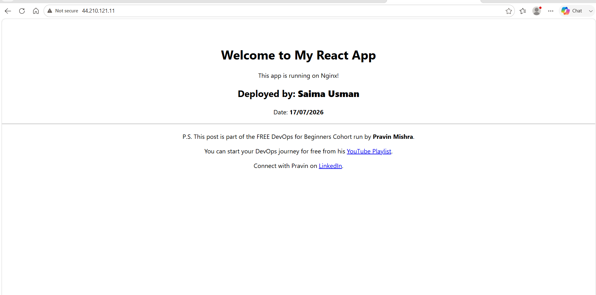

---

#### Screenshot 2 — Output of `ip a`

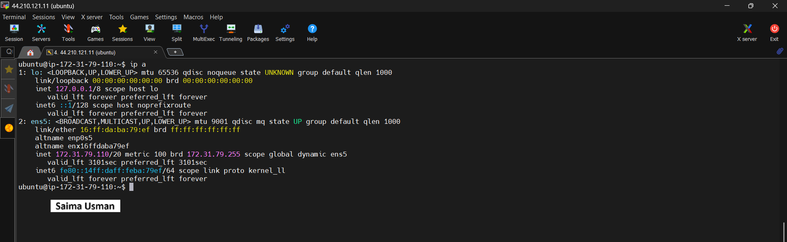

---

#### Screenshot 3 — Output of `sudo ss -tulpen`

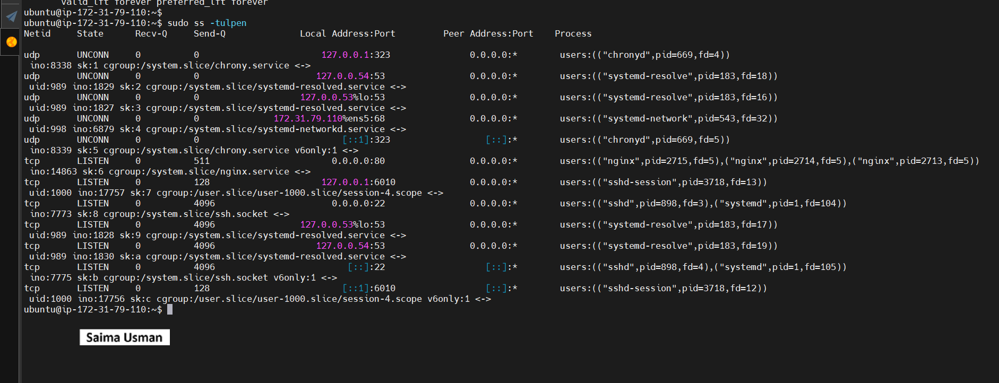

---

#### Screenshot 4 — Output of `sudo ufw status`

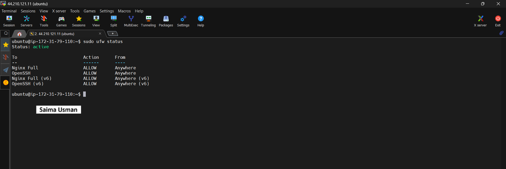

---

### Notes

Answer the following in your own words:

**1. What proves Nginx is listening on 0.0.0.0:80?**

The output of:

```
sudo ss -tulpn | grep :80
```

showing:

```
LISTEN 0 511 0.0.0.0:80
```

proves Nginx is listening on `0.0.0.0:80`

---

**2. What proves SSH is active on port 22?**

The output of:

```
sudo ss -tulpn | grep :22
```

showing:

```
LISTEN 0 128 0.0.0.0:22
```

proves that SSH is active and listening on `port 22`

---

**3. Did you find any unexpected open ports? Explain briefly.**

No. Only the expected ports were open:

22 for SSH remote access.
80 for the Nginx web server.

No unexpected open ports were found.

---

# Task 2 — Service Health & Systemd Validation (Nginx)

## Goal

Verify that Nginx is properly installed, running, enabled at boot, and safely configured.

### Evidence

#### Screenshot 1 — Output of `systemctl status nginx --no-pager`

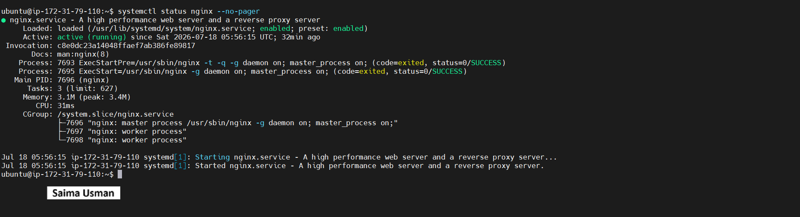

---

#### Screenshot 2 — Output of `sudo nginx -t`

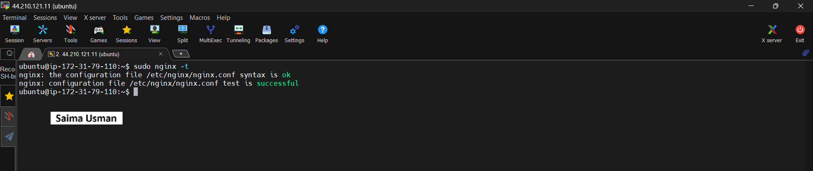

---

#### Screenshot 3 — Output of `sudo ss -lptn '( sport = :80 )'`

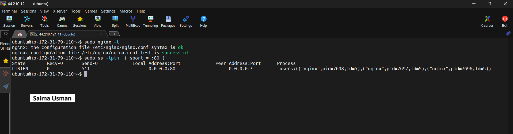

---

### Notes

Answer the following in your own words:

**1. What happens if Nginx fails to restart in production?**

If Nginx fails to restart in production, the website or web application becomes unavailable, and users will receive connection errors (such as 502, 503, or no response) until the issue is fixed and Nginx is running again.

---

**2. What's your basic rollback plan?**

If the new configuration causes problems, I would:

1. Restore the previous Nginx configuration from a backup.
2. Test the configuration with sudo nginx -t.
3. Restart Nginx using sudo systemctl restart nginx.
4. Verify the website is accessible again.

---

# Task 3 — Logs & Request Trace

## Goal

Verify real traffic flow and analyze logs to understand system behavior and errors.

### Evidence

#### Screenshot 1 — Output of `sudo tail -n 30 /var/log/nginx/access.log`

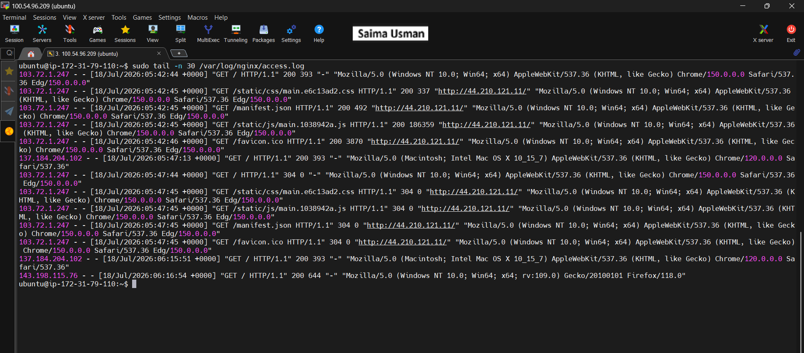

---

#### Screenshot 2 — Output of `sudo tail -n 30 /var/log/nginx/error.log`

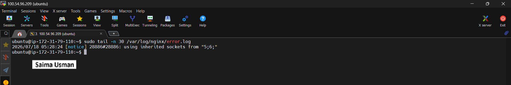

---

#### Screenshot 3 — Output of `sudo journalctl -u nginx --no-pager -n 50`

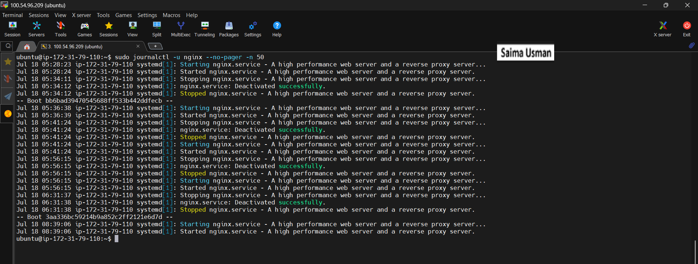

---

### Notes

Answer the following in your own words:

**1. Were there any errors in the logs?**

- If yes, mention 1–2 example error lines from the logs and explain what each one means in simple terms.
- If no, explain what it means if the error log is empty or shows no recent errors during your check.

No, I didnt get any ERROR. I got this reposnse:

```
2026/07/18 05:28:24 [notice] 28886#28886: using inherited sockets from "5;6;"
```

This message indicates that Nginx restarted or reloaded successfully and is using inherited sockets to provide a smooth transition. It does not indicate any problem with my server or configuration. If there were actual issues, I would typically see log levels such as [error], [crit], or [emerg].

---

**2. If there were no errors, what does that indicate about the system?**

If there were no errors in the Nginx error log, it indicates that Nginx is running normally, the configuration is valid, and the web server is operating without any detected issues at that time.

---

**3. Based on the access logs, were your curl requests visible in the log entries? What does that prove about traffic flow?**

Yes. The curl requests appeared in the Nginx access logs, proving that the requests successfully reached the Nginx web server, were processed, and were logged correctly. This confirms that the network traffic flow from the client to the server is working as expected.

---

# Task 4 — System Resource Health Check (Capacity Red Flags)

## Goal

Assess server capacity and detect potential performance or failure risks.

### Evidence

#### Screenshot 1 — Output of `uptime`

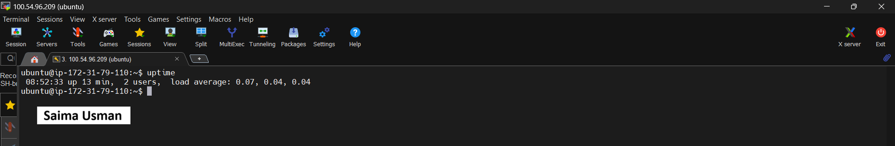

---

#### Screenshot 2 — Output of `free -h`

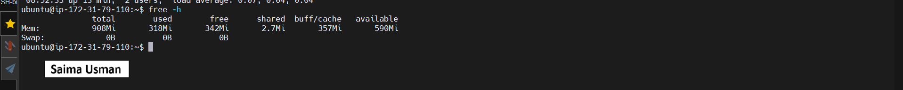

---

#### Screenshot 3 — Output of `df -h`

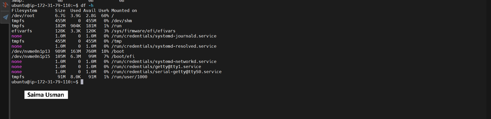

---

#### Screenshot 4 — Output of `sudo du -sh /var/* | sort -h`

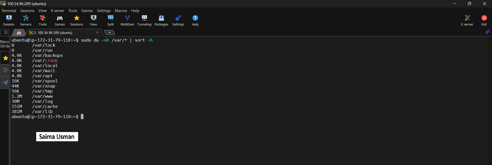

---

### Notes

Answer the following in your own words:

**1. Which resource looks most critical right now? (CPU/load, memory, or disk) Explain why.**

Disk is the most critical resource at the moment because it has the highest utilization (60% used) compared to memory (about 36% used). Although there is still 2.8 GB of free space, disk usage is the resource that should be monitored most closely to prevent running out of storage.
If disk space becomes full, Nginx cannot write logs and the server may fail to store files or operate correctly. CPU and memory are important, but in a typical React and Nginx deployment they usually remain low under normal traffic.

---

**2. What happens if disk becomes 100% full in a production server?**

If the disk reaches 100% full, the server may be unable to write log files, save data, create temporary files, or perform updates. This can cause applications such as Nginx to fail or become unstable, leading to service outages and errors for users.

---

# Task 5 — Configuration & Deployment Verification

## Goal

Ensure the correct React build is deployed and Nginx is serving it properly.

### Evidence

#### Screenshot 1 — Output of `ls -lah /var/www/html | head -n 20`

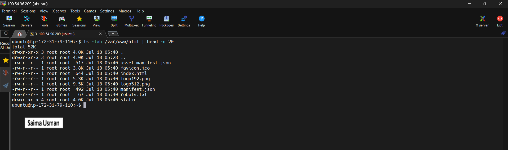

---

#### Screenshot 2 — Output of `grep -R "Deployed by" -n /var/www/html 2>/dev/null | head`

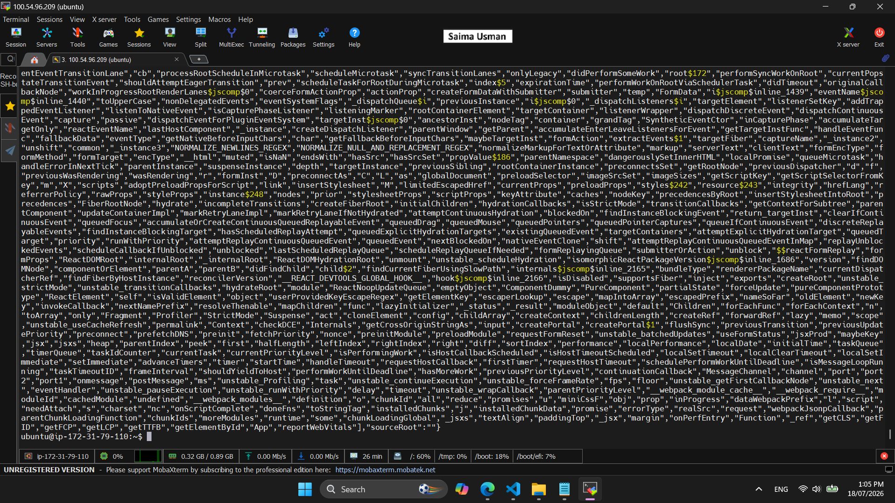

---

#### Screenshot 3 — Output of `grep -n "try_files" /etc/nginx/sites-available/default`

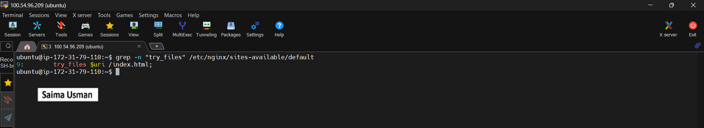

---

### Notes

Answer the following in your own words:

**1. How do you confirm that the correct version of the application is deployed?**

We can compare the deployed files in /var/www/html with the latest production build. Also I can confirm the correct version by opening the application in a browser using the server's public IP and verifying that the latest changes are displayed.

---

# Task 6 — Nginx Configuration Failure Simulation

## Goal

Simulate a real-world Nginx misconfiguration and recover the service safely.

### Evidence

#### Screenshot 1 — Output of `sudo nginx -t` showing the syntax error (broken config)

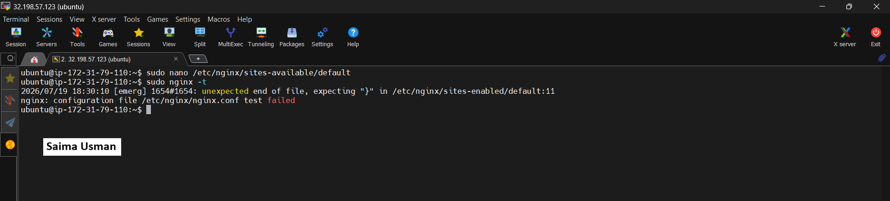

---

#### Screenshot 2 — Output of `sudo nginx -t` showing syntax ok (fixed config)

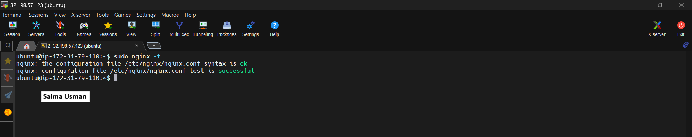

---

#### Screenshot 3 — Output of `curl -I http://<public-ip>` confirming recovery (200 OK)

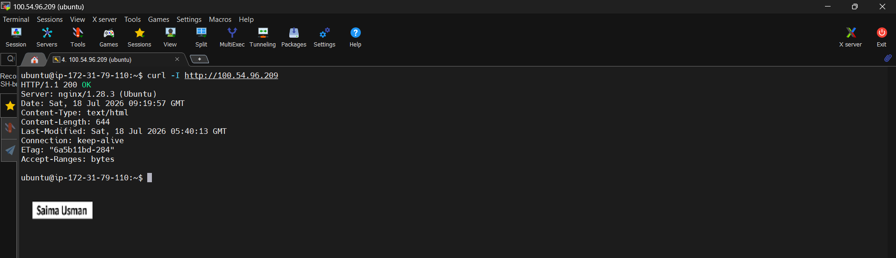

---

### Notes

Answer the following in your own words:

**1. What caused the configuration failure?**

The configuration failure was caused by a missing closing curly brace (}) in the Nginx configuration file. This created a syntax error, causing sudo nginx -t to fail until the missing bracket was restored.

---

**2. How did you fix the issue?**

I fixed the issue by manually editing the Nginx configuration file and restoring the missing closing curly brace (}). After saving the file, I verified the configuration with sudo nginx -t, which confirmed that the syntax was correct.

---

**3. How can you avoid this kind of issue in real production systems?**

To avoid this issue in production, always test the Nginx configuration with sudo nginx -t before reloading or restarting the service, keep a backup of the working configuration, and review configuration changes carefully before applying them.
---

# Task 7 — Web Application Failure Simulation

## Goal

Simulate missing deployment content and recover the application safely.

### Evidence

#### Screenshot 1 — Output of `curl -I http://<public-ip>` showing failure (non-200 response)


---

#### Screenshot 2 — Output of `curl -I http://<public-ip>` confirming recovery (200 OK)


---

### Notes

Answer the following in your own words:

**1. What caused the application to break in this scenario?**

The application broke because the Nginx configuration contained a syntax error (a missing closing }). As a result, Nginx could not load the configuration correctly, preventing the web server from serving the application until the error was fixed.

---

**2. How did you fix the issue and restore the application?**

I fixed the issue by manually editing the Nginx configuration file and restoring the missing closing curly brace (}). After saving the file, I verified the configuration with sudo nginx -t, which confirmed that the syntax was correct.

---

**3. What steps would you take to prevent this kind of issue in real production systems?**

Write your answer here.

---

# Task 8 — Security & Reliability Review

## Goal

Review and reflect on the security and reliability practices applied during this assignment.

### Security & Reliability Notes

Answer the following in your own words:

**1. Why is SSH key-based authentication more secure than sharing passwords?**

SSH key-based authentication is more secure because it uses a public/private key pair instead of a password. The private key is never transmitted over the network, making it much more resistant to brute-force attacks, password guessing, and credential theft.

---

**2. Why should only required ports be open on a production server?**

Only the required ports should be open on a production server to reduce the attack surface. Closing unnecessary ports helps prevent unauthorized access and lowers the risk of security vulnerabilities being exploited.

---

**3. Why is it important for Nginx to be enabled on boot?**

It is important for Nginx to be enabled on boot so that it starts automatically whenever the server restarts, ensuring the website remains available without requiring manual intervention.

---

**4. What are the risks of sharing secrets, keys, or credentials publicly?**

Sharing secrets, keys, or credentials publicly can allow unauthorized users to access your server or accounts, leading to data theft, service disruption, unauthorized changes, and potential financial or security losses.

---

**5. Why should cloud resources be stopped or terminated when they are no longer needed?**

Cloud resources should be stopped or terminated when they are no longer needed to avoid unnecessary costs, reduce resource waste, and minimize potential security risks from unused servers.

---

# LinkedIn Post (Required)

## Evidence

#### LinkedIn Post URL

https://www.linkedin.com/posts/saima-usman_aws-ec2-ubuntu-activity-7484687223297097728-yWpq?utm_source=share&utm_medium=member_desktop&rcm=ACoAABsfrYoBkq_t-PkQCt7fEB9Ajmp98YTHl_g

`__________________________`

---

#### Screenshot — Published LinkedIn post


---

# Submission Instructions

- Add all required screenshots in your submission
- Full name must be visible in required screenshots
- Do not expose sensitive information (keys, passwords, account IDs)

---

# Completion Checklist

- [✔️] Task 1: Screenshots (browser, ip a, ss -tulpen, ufw status) + Notes answered
- [✔️] Task 2: Screenshots (nginx status, nginx -t, ss port 80) + Notes answered
- [✔️] Task 3: Screenshots (access log, error log, journalctl) + Notes answered
- [✔️] Task 4: Screenshots (uptime, free -h, df -h, du -sh) + Notes answered
- [✔️] Task 5: Screenshots (ls html, grep deployed by, grep try_files) + Notes answered
- [✔️] Task 6: Screenshots (nginx -t fail, nginx -t pass, curl recovery) + Notes answered
- [✔️] Task 7: Screenshots (curl failure, curl recovery) + Notes answered
- [✔️] Task 8: Security & Reliability Notes answered
- [✔️] LinkedIn post published and URL submitted
- [✔️] Full Name visible in all required screenshots
- [✔️] No sensitive data exposed

---

## 📌 About DMI & CloudAdvisory

DevOps Micro Internship (DMI) is a project-based DevOps program run by Pravin Mishra (The CloudAdvisory) focused on real-world execution, systems thinking, and career readiness.

It helps learners build strong DevOps foundations with hands-on experience.

---

## 📌 Resources

- 🌐 DMI Official Website: https://pravinmishra.com/dmi  
- 🎓 DevOps for Beginners (Udemy): https://www.udemy.com/course/devops-for-beginners-docker-k8s-cloud-cicd-4-projects/  
- 🎓 Agentic AI DevOps with Claude Code: https://www.udemy.com/course/ultimate-agentic-ai-devops-with-claude-code/  
- 🎓 DevOps with Claude Code: Terraform, EKS, ArgoCD & Helm: https://www.udemy.com/course/devops-with-claude-code-terraform-eks-argocd-helm/  
- ▶️ YouTube Playlist: https://www.youtube.com/playlist?list=PLFeSNDtI4Cho  
- 🔗 Pravin Mishra (LinkedIn): https://www.linkedin.com/in/pravin-mishra-aws-trainer/  
- 🏢 CloudAdvisory (LinkedIn): https://www.linkedin.com/company/thecloudadvisory/

---

*This submission is part of DevOps Micro Internship (DMI) Cohort 3 — Agentic AI Track.*