# Assignment 6 — Building an AI-Assisted Git Safety Net (PR Ready Check)

Part of the DevOps Micro Internship (DMI) Cohort 3 with Agentic AI

---

## Purpose

In Week 2 you built Claude Code hooks that block a dangerous action *before* it happens (`PreToolUse`), and a restricted skill that could look but not touch (`allowed-tools` without `Write`). In this assignment you will discover that Git has the exact same idea, decades older: a **pre-commit hook** that blocks a commit before it's created.

You will build both halves of a real "PR Ready" workflow:

1. A **Git hook that follows fixed rules** — scans staged changes for hardcoded secrets and oversized files and refuses the commit. No AI involved, no guessing, just a rule that gives the same answer every time.
2. A **restricted Claude Code skill** (`/pr-ready`) that reads your staged diff and drafts a Pull Request title, description, and a short list of things worth a second look — the kind of judgment a fixed rule can't make (mixed changes, missing context, unclear intent). The skill never commits, pushes, or opens the PR. You do that yourself, using its draft as a starting point.

This mirrors the Agentic Loop from Week 3's Linux triage assignment: **Gather → Analyze → Human Act → Verify**. The hook and the skill both gather and analyze; only you act.

---

# Task 0 — Confirm Your Fork and Create a Feature Branch

## Goal

Confirm you are working in your own fork, then create a dedicated branch for this assignment.

### Evidence

#### Screenshot 1 — Output of git remote -v and git branch showing the new branch

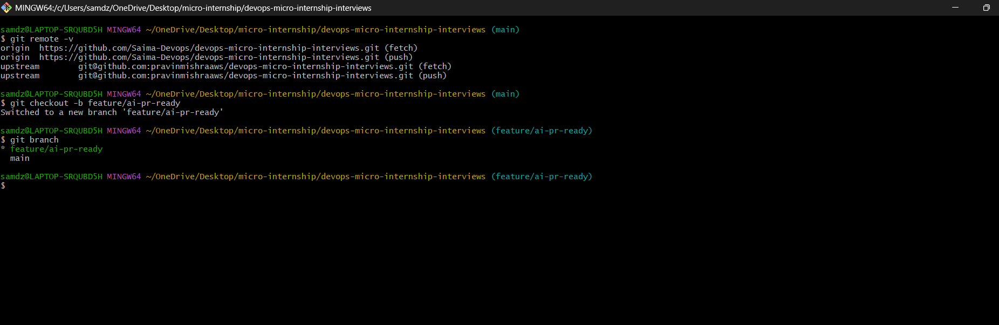

---

### Notes

**1. Why create a dedicated branch instead of doing this work on main?**

A dedicated feature branch isolates new work from the main branch, keeping the stable codebase unchanged while development is in progress. It allows changes to be reviewed through a Pull Request, makes collaboration easier, and provides a safe way to merge or discard work without affecting the production-ready branch.

---

# Task 1 — Stage a Change With Realistic Risk

## Goal

On your own fork of this repository (the one you've been submitting your DMI work in since onboarding), create a new branch and stage a change that a real reviewer should catch: a hardcoded-looking secret and a leftover debug statement.

### Evidence

#### Screenshot 1 — Output of  `git status` showing the staged file on feature/ai-pr-ready

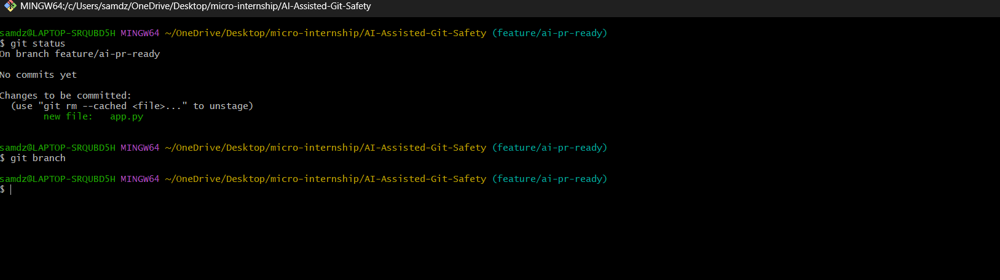

---

### Notes

**1. Why does this assignment use an obviously fake key instead of a real one?**

This assignment uses a fake AWS access key to safely simulate a real security risk without exposing actual credentials. It allows the pre-commit hook to detect a secret-like pattern while ensuring that no valid keys or sensitive information are leaked or misused.

---

# Task 2 — Write a Real Git Pre-Commit Hook

## Goal

Create a tracked, shareable pre-commit hook that blocks a commit containing secret-like patterns or files over 1MB.

### Evidence

#### Screenshot 2 — `hooks/pre-commit` open in VS Code showing the full script

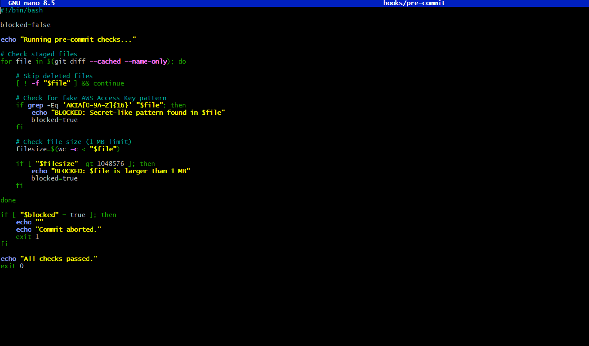

---

#### Screenshot 3 — Output of `git config core.hooksPath` confirming it points to `hooks`

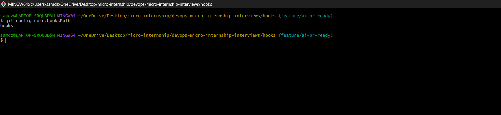

---

### Notes

**1. Why is `hooks/pre-commit` tracked in the repo instead of living only in `.git/hooks/`?**

The .git/hooks directory is local to a single repository clone and is not tracked by Git, so other developers cannot receive those hooks automatically. By storing the hook in a tracked hooks/ directory and configuring core.hooksPath, the hook becomes version-controlled, shareable, and consistent for everyone working on the project.

---

**2. Compare this to `PreToolUse` from Week 2 Assignment 6. What does each one intercept, and what do they have in common?**

The Git pre-commit hook intercepts a git commit before it is created and blocks commits that violate predefined rules, such as containing secret-like patterns or oversized files. The Week 2 PreToolUse hook intercepted Claude Code tool execution before potentially dangerous actions were performed. Both act as preventive safety gates that inspect an action before it happens and stop it when predefined conditions are not met.

---

# Task 3 — Prove the Hook Blocks the Risky Commit

## Goal

Attempt to commit the staged file from Task 1 and show the hook rejecting it.

### Evidence

#### Screenshot 4 — Terminal showing `git commit` rejected with the hook's "BLOCKED" message naming the exact file

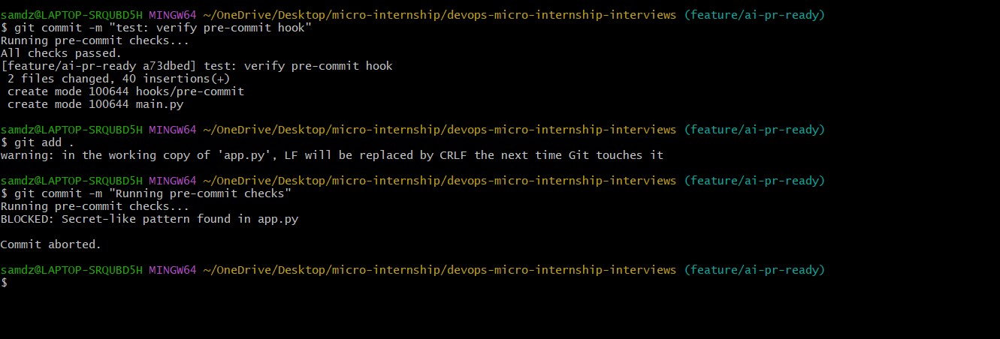

---

### Notes

**1. Which line in `hooks/pre-commit` matched your fake key, and why did it match?**

The line using grep -Eq 'AKIA[0-9A-Z]{16}' "$file" matched the fake AWS Access Key. It matched because the staged file contained a string beginning with AKIA followed by 16 uppercase letters and numbers, which follows the expected AWS Access Key ID pattern defined by the regular expression.

---

**2. Could this hook have caught a poorly-named variable that stores a secret without the `AKIA` prefix? What does that tell you about the limits of a fixed rule like this?**

No. This hook only detects secrets that match the predefined regular expression. If a secret were stored in a variable without the AKIA prefix or used a different format, the hook would not detect it. This demonstrates that fixed-rule automation is reliable for known patterns but cannot identify every possible security issue, which is why it is often complemented by AI-assisted review and more advanced secret-scanning tools.

---

# Task 4 — Build the `/pr-ready` Skill

## Goal

Create a manually invoked Claude Code skill that reads your staged changes and produces a PR-readiness report and a draft PR description — without writing, committing, or pushing anything itself.

### Evidence

#### Screenshot 5 — `SKILL.md` frontmatter showing `allowed-tools: Bash, Read, Grep` (no `Write`) and `disable-model-invocation: true`

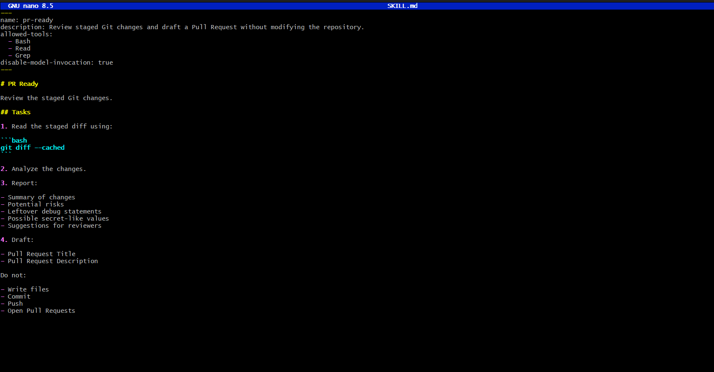

---

#### Screenshot 6 — `/pr-ready` output while the risky file is still staged, showing it flagged the secret and/or debug statement

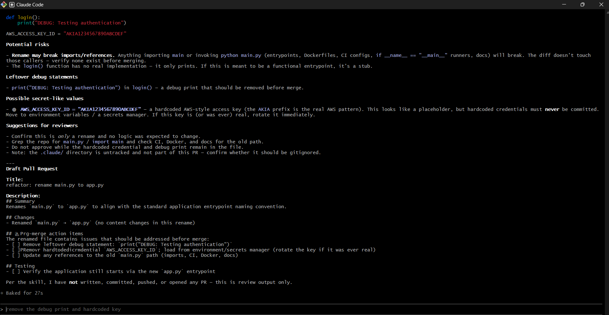

---

### Notes

**1. Why does `/pr-ready` have `Bash` and `Read` but not `Write`?**

The /pr-ready skill needs Bash to execute read-only Git commands such as git diff --cached, Read to inspect project files, and Grep to search for patterns in the staged changes. It intentionally does not have Write permission so it cannot modify files, create commits, push changes, or perform any other actions that should remain under the developer's control.

---

**2. The pre-commit hook and `/pr-ready` both looked at the same staged diff. Did they flag the same things? What did one catch that the other didn't?**

Both the pre-commit hook and /pr-ready reviewed the staged changes, but they served different purposes. The pre-commit hook detected the fake AWS access key using a fixed rule and blocked the commit automatically. The /pr-ready skill provided a broader review by identifying the secret-like value, highlighting the leftover debug statement, summarizing the changes, and drafting a Pull Request title and description. The hook enforced repository safety, while the AI skill assisted with code review and documentation.

---

# Task 5 — Fix the Issues and Re-Verify

## Goal

Remove the secret and debug statement, then prove both gates now pass clean.

### Evidence

#### Screenshot 7 — `git commit` succeeding after the fix (no BLOCKED message)

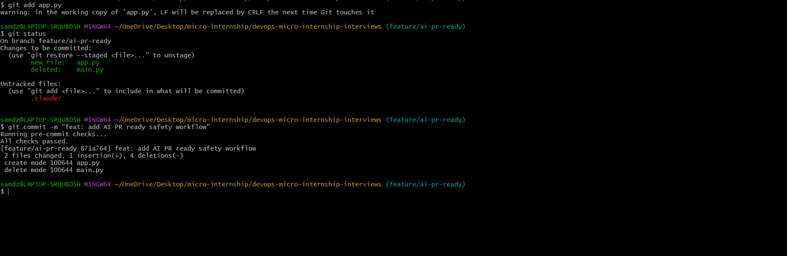

---

#### Screenshot 8 — Second `/pr-ready` run showing a clean risk report and a drafted PR title + description

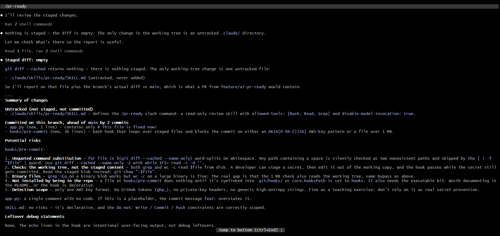

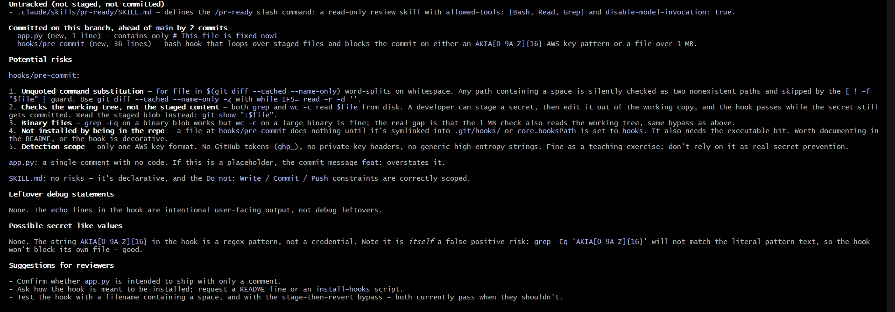

---

### Notes

**1. What exactly did you change to satisfy the pre-commit hook?**

I removed the fake AWS access key that matched the hook's secret-detection rule and deleted the leftover debug statement from the staged file. After staging the corrected changes, the pre-commit hook completed all checks successfully and allowed the commit.

---

# Task 6 — Push and Open a Pull Request Using the AI Draft

## Goal

Push your branch and open a real Pull Request, using `/pr-ready`'s drafted title and description as your starting point — read it critically and edit before you use it.

**Important:** Open this Pull Request with base repository set to **your own fork** — not the shared upstream `pravinmishraaws/devops-micro-internship-pravinmishra` repository. This assignment's hook and skill files are your own practice work, not a change meant for the shared class repo.

### Evidence

#### Screenshot 9 — Your Pull Request showing the base repository is your own fork, plus the title and description, with the `/pr-ready` draft visible for comparison (paste it in the PR conversation or your notes below)

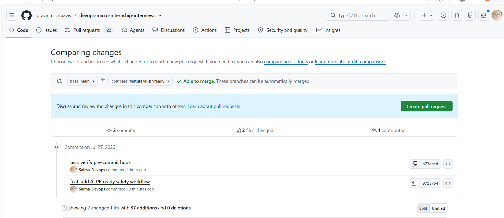

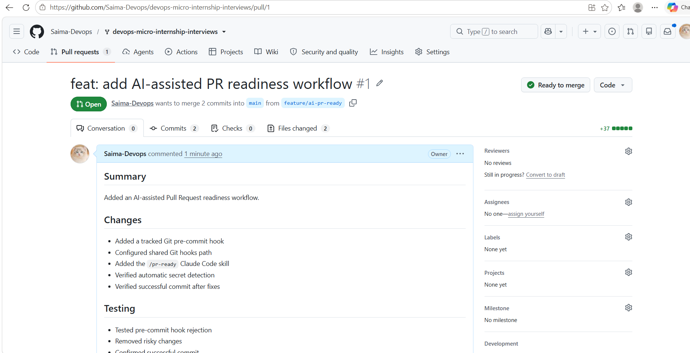

---

#### PR Link

https://github.com/Saima-Devops/devops-micro-internship-interviews/pull/1

---

### Notes

**1. What, if anything, did you edit in the AI's drafted PR description before using it? Why?**

I reviewed the AI-generated draft and made minor edits to improve clarity, ensure it accurately reflected the implemented changes, and remove any generic wording. Reviewing the draft helped ensure the Pull Request clearly communicated the purpose, testing performed, and scope of the changes.

---

**2. If you had blindly copy-pasted the AI's draft without reading it, what could go wrong?**

The AI draft could contain inaccurate assumptions, omit important implementation details, or include wording that does not accurately represent the changes. Reviewing it before submission ensures the Pull Request is correct, complete, and appropriate for reviewers.

---

**3. Why does this PR need to target your own fork instead of the shared upstream repository?**

This assignment is a personal learning exercise, so the changes are intended only for my own fork. Opening the Pull Request against my fork prevents practice work from affecting the shared upstream repository used by all participants while still demonstrating the complete Git workflow.

---

# Task 7 — Map the Workflow to the Agentic Loop

## Goal

Explain this assignment's workflow using the same Gather → Analyze → Human Act → Verify structure from Week 3.

### Notes

**1. Which step(s) represent Gather?**

The Gather stage occurred when the Git pre-commit hook scanned the staged files for secret-like patterns and oversized files, and when the /pr-ready skill read the staged Git diff and project files. Both collected the necessary information before making any decisions or recommendations.

---

**2. Which step(s) represent Analyze?**

The Analyze stage was performed by both the Git pre-commit hook and the /pr-ready skill. The hook used fixed rules to detect secret-like patterns and oversized files, while the AI skill analyzed the staged changes, summarized the modifications, highlighted review risks, and drafted a Pull Request title and description.

---

**3. Which step is Human Act, and why must a human — not Claude — run `git commit`, `git push`, and open the PR?**

The Human Act stage was when I reviewed the AI's suggestions, removed the fake AWS access key and debug statement, staged the corrected changes, committed the code, pushed the branch, and created the Pull Request. These actions must be performed by a human because they modify the repository and require accountability and final judgment. Claude only provided analysis and recommendations.

---

**4. Which step is Verify?**

The Verify stage occurred after fixing the identified issues. I reran the pre-commit hook by committing the changes successfully without any BLOCKED messages and executed the /pr-ready skill again to confirm a clean risk report and a completed Pull Request draft. This verified that both safety checks passed successfully.

---

**5. In one or two sentences: why do you need *both* the fixed-rule pre-commit hook and the AI skill? Isn't one enough?**

The **fixed-rule pre-commit hook** and the **AI skill** complement each other because they solve different problems. The hook reliably enforces objective security and repository policies, such as blocking secret-like patterns and oversized files. The AI skill provides contextual analysis by reviewing the staged changes, identifying potential review concerns, and drafting a Pull Request. Together they create a safer and more efficient development workflow while keeping the developer responsible for the final decision.

---

# Task 8 — LinkedIn Post

## Goal

Publish a LinkedIn post summarizing what you built and what you learned about combining fixed-rule safety checks with AI-assisted review.

### Evidence

#### LinkedIn Post URL

https://www.linkedin.com/posts/saima-usman_devops-git-githooks-share-7487585723110486016-3vQQ/?utm_source=share&utm_medium=member_desktop&rcm=ACoAABsfrYoBkq_t-PkQCt7fEB9Ajmp98YTHl_g

---

## Key Learnings

Add 3-5 bullet points on what you learned this week.

- Built a Git pre-commit hook to prevent commits containing secret-like patterns and oversized files.
- Created a restricted AI-assisted /pr-ready skill to review staged changes and draft Pull Request content.
- Learned the difference between deterministic rule-based automation and AI-assisted code review.
- Applied the Agentic Loop (Gather → Analyze → Human Act → Verify) to a real Git workflow.
- Improved understanding of secure, review-ready development practices used in professional DevOps teams.

---

# Submission Instructions

- Ensure `hooks/pre-commit` and `.claude/skills/pr-ready/SKILL.md` are committed to your GitHub repository
- Add all required screenshots to your submission
- All written answers must be in your own words
- Do not use a real secret or credential anywhere in your submission — the fake key in Task 1 is intentional and must stay clearly fake
- Open your Pull Request against your own fork, not the shared upstream repository
- Push your final changes to your forked repository
- Include your PR link and LinkedIn post URL

---

## GitHub Repository URL

https://github.com/Saima-Devops/devops-micro-internship-interviews/tree/feature/ai-pr-ready

---

# Completion Checklist

- [✔️] Branch `feature/ai-pr-ready` created with a staged file containing a fake secret and a debug statement
- [✔️] `hooks/pre-commit` created and tracked in the repo (not only in `.git/hooks/`)
- [✔️] `core.hooksPath` configured to point at `hooks/`
- [✔️] Pre-commit hook shown blocking the risky commit
- [✔️] `.claude/skills/pr-ready/SKILL.md` created with correct `allowed-tools` (no `Write`) and `disable-model-invocation: true`
- [✔️] `/pr-ready` run against the risky diff and shown flagging issues
- [✔️] Risky file fixed; `git commit` succeeds cleanly
- [✔️] `/pr-ready` re-run showing a clean report and drafted PR title/description
- [✔️] Pull Request opened using the AI draft as a starting point, with your own fork as the base repository (not upstream), PR link included
- [✔️] Agentic Loop mapping (Task 7) completed in your own words
- [✔️] LinkedIn post published and URL submitted
- [✔️] All required screenshots added
- [✔️] GitHub repository URL provided

---

## 📌 About DMI & CloudAdvisory

DevOps Micro Internship (DMI) is a project-based DevOps program run by Pravin Mishra (The CloudAdvisory) focused on real-world execution, systems thinking, and career readiness.

It helps learners build strong DevOps foundations with hands-on experience.

---

## 📌 Resources

- 🌐 DMI Official Website: https://dmi.pravinmishra.com?utm_source=github&utm_medium=readme  
- 🎓 University: https://university.pravinmishra.com?utm_source=github&utm_medium=readme  
- 💬 Discord Community: https://discord.pravinmishra.com?utm_source=github&utm_medium=readme  
- 📝 Blog: https://dmi.pravinmishra.com/blog?utm_source=github&utm_medium=readme  
- ▶️ YouTube Playlist: https://www.youtube.com/playlist?list=PLFeSNDtI4Cho  
- 🔗 Pravin Mishra (LinkedIn): https://www.linkedin.com/in/pravin-mishra-aws-trainer/  
- 🏢 CloudAdvisory (LinkedIn): https://www.linkedin.com/company/thecloudadvisory/

---

*This submission is part of DevOps Micro Internship (DMI) Cohort 3 — Agentic AI Track.*
