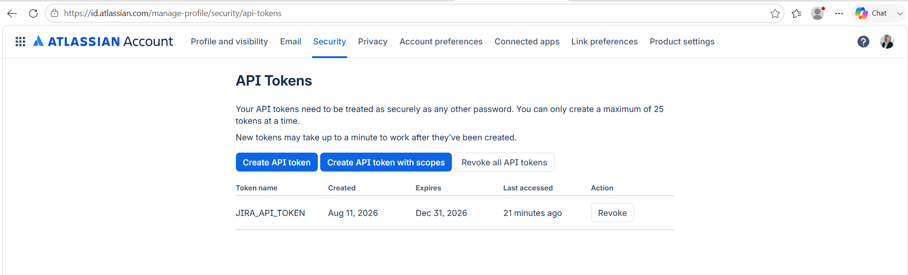
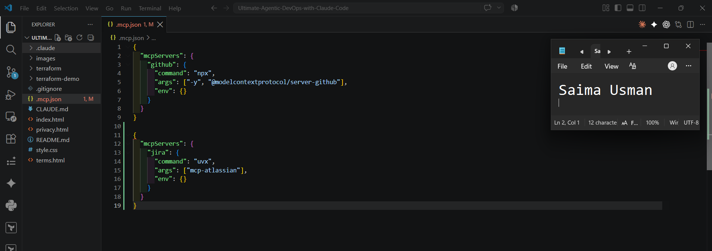
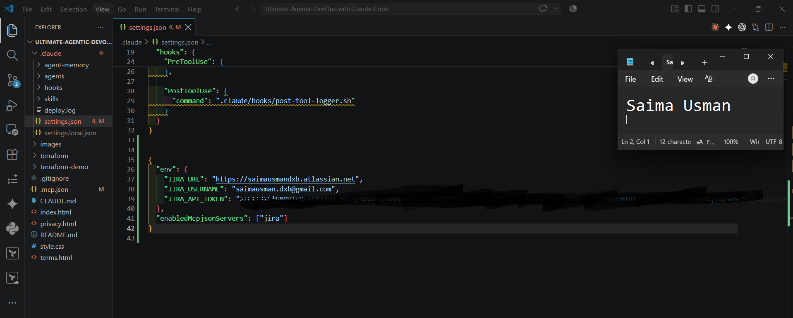
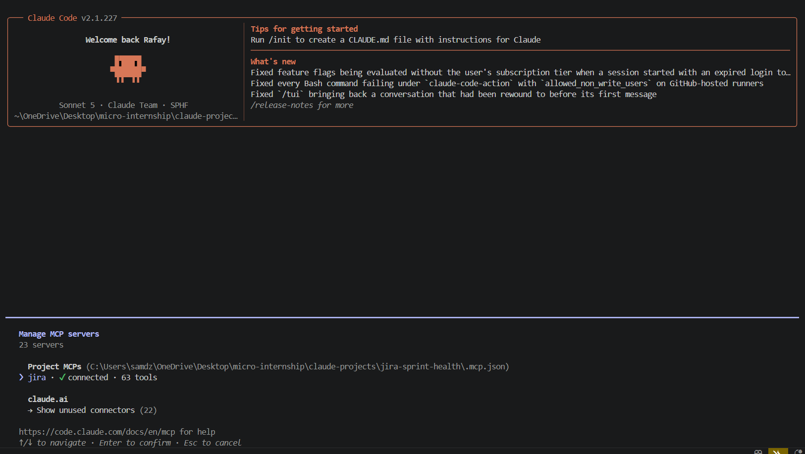
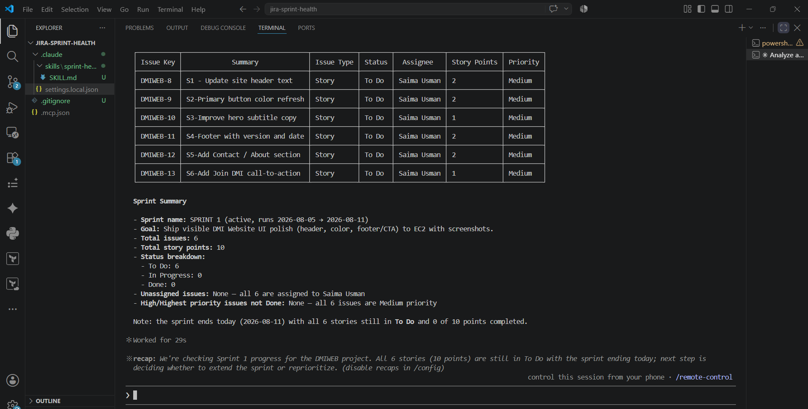
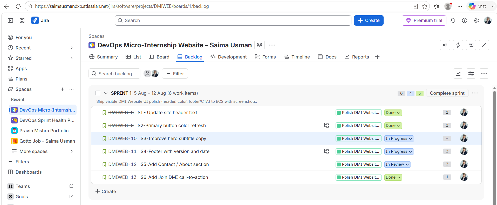
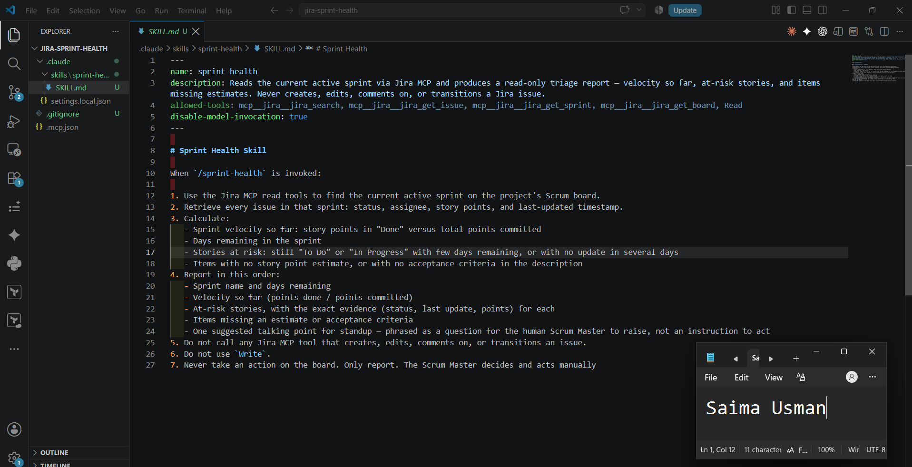
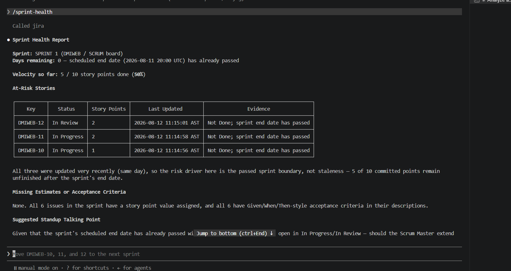
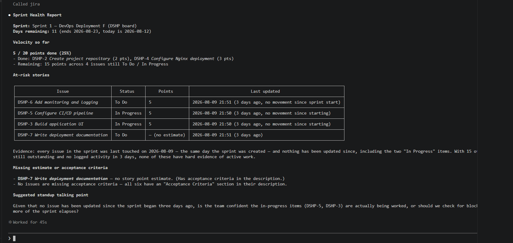

# Assignment 5 — AI-Assisted Sprint Health Report via Jira MCP

Part of the DevOps Micro Internship (DMI) Cohort 3 with Agentic AI

---

## Purpose

In this assignment, you will connect Claude Code to your Jira board through an MCP server, the same way you connected it to GitHub in Week 2, and build a read-only `/sprint-health` skill. The skill reads your current sprint through Jira's API and reports sprint velocity, stories at risk of missing the sprint, and items missing an estimate — but it must never create, edit, comment on, or transition a single ticket itself. You will prove that boundary holds by making a real change on the board yourself and confirming the skill only ever reports, never acts.

---

**I ill build this workflow as:**

```bash
Jira API Token → .mcp.json → credentials in settings.local.json → Jira MCP connection → live Jira query → /sprint-health skill → manual Jira change → verify updated report
```

**The important security boundary is:**

**Claude** can read **Jira** data, but the `/sprint-health skill` cannot modify **Jira issues.**


---

# Task 1 — Create a Jira API Token

## Goal

Generate an API token from your Atlassian account that the MCP server will use to authenticate with your Jira site. Do not screenshot the token value itself.

### Evidence

#### Screenshot 1 — Jira API token creation confirmation page showing the token name, with the token value not visible



### Notes You Must Write (Very Important):

Why does the MCP server need your site URL and account email in addition to the token?

The **Jira MCP server** needs the Jira site URL to know which Jira instance it should connect to, and it needs the account email to identify the Atlassian account being authenticated. The **API token** acts as the credential that proves the request is authorized for that account. Together, the **site URL, account email,** and **API token** allow the **MCP server** to authenticate with the correct Jira instance and retrieve the required board and sprint data.

---

# Task 2 — Create .mcp.json at the Project Root

## Goal

Create or update `.mcp.json` at your project root with a Jira MCP server block, following the same shape as the GitHub MCP server you configured in Week 2.

### Evidence

#### Screenshot 2 — `.mcp.json` open in VS Code showing the Jira server configuration



### Notes You Must Write (Very Important):

Compare this jira block to the github block from Week 2 Assignment 5. The GitHub server ran via npx (a Node.js package); this one runs via uvx (a Python package) — what stays exactly the same shape despite that difference, and why doesn't Claude Code care which language a given MCP server is written in?

**Answer:**

The Jira and GitHub MCP blocks have the same basic MCP structure: each server has a name, a command used to start the server, and an arguments list passed to that command. The main difference is that GitHub used `npx`, which runs a Node.js package, while Jira uses `uvx`, which runs a Python package. Claude Code does not need to know which programming language the MCP server was written in because MCP provides a standard communication protocol. Claude Code communicates with the MCP server through that protocol rather than directly interacting with the server's implementation language.


---

# Task 3 — Add Your Credentials to settings.local.json

## Goal

Add your Jira site URL, account email, and API token to `.claude/settings.local.json`, and confirm that file is listed in `.gitignore` so it is never committed.

### Evidence

#### Screenshot 3 — `settings.local.json` open in VS Code showing the `env` section, with the actual token value blurred or covered



### Notes You Must Write (Very Important):

Why must JIRA_API_TOKEN live in settings.local.json and never in .mcp.json?

**Answer:**

`JIRA_API_TOKEN` must live in `settings.local.json` rather than `.mcp.json` because the token is a secret credential and `.mcp.json` is project-level MCP configuration that can be shared or committed to version control. Keeping the token in `settings.local.json`, which is excluded by `.gitignore`, separates configuration from secrets and reduces the risk of accidentally exposing the credential in GitHub or other shared project files.


---

# Task 4 — Verify the Connection with /mcp

## Goal

Restart Claude Code and confirm the Jira MCP server shows as connected.

### Evidence

#### Screenshot 4 — `/mcp` output showing `jira: connected`



---

# Task 5 — Run a Live Query to Prove Real Board Data

## Goal

Ask Claude to list the issues in your current active sprint through the Jira MCP connection, and confirm the result matches what you see on your live board in the browser.

### Evidence

#### Screenshot 5 — Claude's response showing the live sprint issue list retrieved via Jira MCP




### Notes You Must Write (Very Important):

How did you confirm this was real board data and not something Claude guessed?

I confirmed that the information was real board data by comparing Claude's response with the active sprint shown on my Jira board in the browser. The issue keys, summaries, statuses, and available estimates matched the live Jira board. This demonstrated that Claude was retrieving the current sprint through the Jira MCP connection rather than generating or guessing the information.

**PROOF:**



---

# Task 6 — Build the /sprint-health Skill

## Goal

Create a `/sprint-health` skill restricted to read-only Jira tools plus `Read`, with no issue-mutating tools and no `Write`. Run it and confirm it produces a report covering sprint velocity, at-risk stories, and items missing an estimate.

### Evidence

#### Screenshot 6 — `SKILL.md` frontmatter showing `allowed-tools` limited to read-only Jira tools plus `Read`, with `disable-model-invocation: true`




#### Screenshot 7 — `/sprint-health` output showing the full triage report against your real sprint



### Notes You Must Write (Very Important):

1. Which Jira MCP tools does this skill's allowed-tools list include, and which mutating tools (create issue, update issue, transition issue, add comment) does it deliberately exclude?

The `sprint-health` skill includes only read-only Jira MCP tools required to retrieve sprint and issue information, together with the `Read` tool. It deliberately excludes all mutating capabilities such as creating an issue, updating an issue, transitioning an issue, and adding comments. It also excludes the `Write` tool. This ensures that the skill can gather and analyze sprint information but cannot directly change the Jira board.

----

2. Why does a Scrum Master need this restriction more than almost any other role in this course?

A Scrum Master needs this restriction because the Scrum Master relies on accurate and transparent sprint information to facilitate the team rather than silently changing the team's work state. A reporting skill that could modify issues might accidentally change statuses, estimates, comments, or other sprint data and compromise the integrity of the Scrum process. Read-only access allows the AI to provide useful analysis while keeping decisions and board changes under human control.

---

# Task 7 — Prove the Skill Never Mutates the Board

## Goal

Manually update one ticket on your board in the browser (for example, move a story to "Done" or add a missing estimate), then run `/sprint-health` again and confirm the new report reflects your change — proving the skill only ever reads live state and never wrote to the board itself.

### Evidence

#### Screenshot 8 — Second `/sprint-health` run showing the report now reflects your manual board change



### Notes You Must Write (Very Important):

Map this assignment to Gather → Analyze → Human Act → Verify from Week 3 Assignment 6. Which step did you perform manually in the browser, and why must that step stay human?

**Answer:**

This assignment follows the Gather → Analyze → Human Act → Verify workflow from Week 3 Assignment 6. The sprint-health skill performed the Gather step by retrieving the current sprint data from Jira and the Analyze step by calculating velocity and identifying at-risk or unestimated work. I performed the Human Act step manually in the Jira browser by changing a ticket on the board. The skill then performed the Verify step by reading the updated Jira state and reflecting the change in the next sprint-health report. The Human Act step must remain human because changing a ticket represents an operational decision that can affect the team's commitments, workflow, and sprint state. Keeping this action under human control prevents an AI reporting tool from making unauthorized changes to the project.


---

# Submission Instructions

Complete all tasks in sequence.

Your submission must include:
- All 8 required screenshots
- All the required notes

---

# Completion Checklist

- [✔️] Task 1: Jira API token created, value never screenshotted (Screenshot 1)
- [✔️] Task 2: `.mcp.json` has the Jira server block (Screenshot 2)
- [✔️] Task 3: Credentials stored in `settings.local.json`, token blurred, file gitignored (Screenshot 3)
- [✔️] Task 4: `/mcp` shows the Jira server connected (Screenshot 4)
- [✔️] Task 5: Live query returned real sprint data, verified against the browser (Screenshot 5)
- [✔️] Task 6: `/sprint-health` skill created with correct read-only `allowed-tools`, and produced a full report (Screenshots 6–7)
- [✔️] Task 7: A manual board change was reflected in a second `/sprint-health` run (Screenshot 8)
- [✔️] Skill never created, edited, transitioned, or commented on any issue
- [✔️] Reflection answered (Notes)
- [✔️] No API token value exposed

---

## 📌 About DMI & CloudAdvisory

DevOps Micro Internship (DMI) is a project-based DevOps program run by Pravin Mishra (The CloudAdvisory) focused on real-world execution, systems thinking, and career readiness.

It helps learners build strong DevOps foundations with hands-on experience.

---

## 📌 Resources

- 🌐 DMI Official Website: https://dmi.pravinmishra.com?utm_source=github&utm_medium=readme  
- 🎓 University: https://university.pravinmishra.com?utm_source=github&utm_medium=readme  
- 💬 Discord Community: https://discord.pravinmishra.com?utm_source=github&utm_medium=readme  
- 📝 Blog: https://dmi.pravinmishra.com/blog?utm_source=github&utm_medium=readme  
- ▶️ YouTube Playlist: https://www.youtube.com/playlist?list=PLFeSNDtI4Cho  
- 🔗 Pravin Mishra (LinkedIn): https://www.linkedin.com/in/pravin-mishra-aws-trainer/  
- 🏢 CloudAdvisory (LinkedIn): https://www.linkedin.com/company/thecloudadvisory/

---

*This submission is part of DevOps Micro Internship (DMI) Cohort 3 — Agentic AI Track.*
