# Assignment 6 — Capstone Assignment — Deploy Book Review App (Three-Tier Architecture) on AWS

Part of the DevOps Micro Internship (DMI) Cohort 3 with Agentic AI

---

## Purpose

This is the most important assignment of the course. You will deploy the Book Review App in a fully production-style three-tier architecture on AWS: a Next.js Web Tier behind Nginx and a public ALB, a private Node.js/Express App Tier behind an internal ALB, and a private Multi-AZ MySQL RDS database with a read replica. You are expected to design, deploy, isolate, debug, and document the result independently.

---

# Task 1 — Architecture Diagram

## Goal

Create an architecture diagram showing the custom VPC (10.0.0.0/16), the six subnets across two Availability Zones (two public Web Tier, two private App Tier, two private Database Tier), the public ALB, Web Tier EC2/Nginx, internal ALB, private App Tier EC2, private Multi-AZ RDS with its read replica, and the permitted traffic flow.

### Evidence

#### Diagram image or link

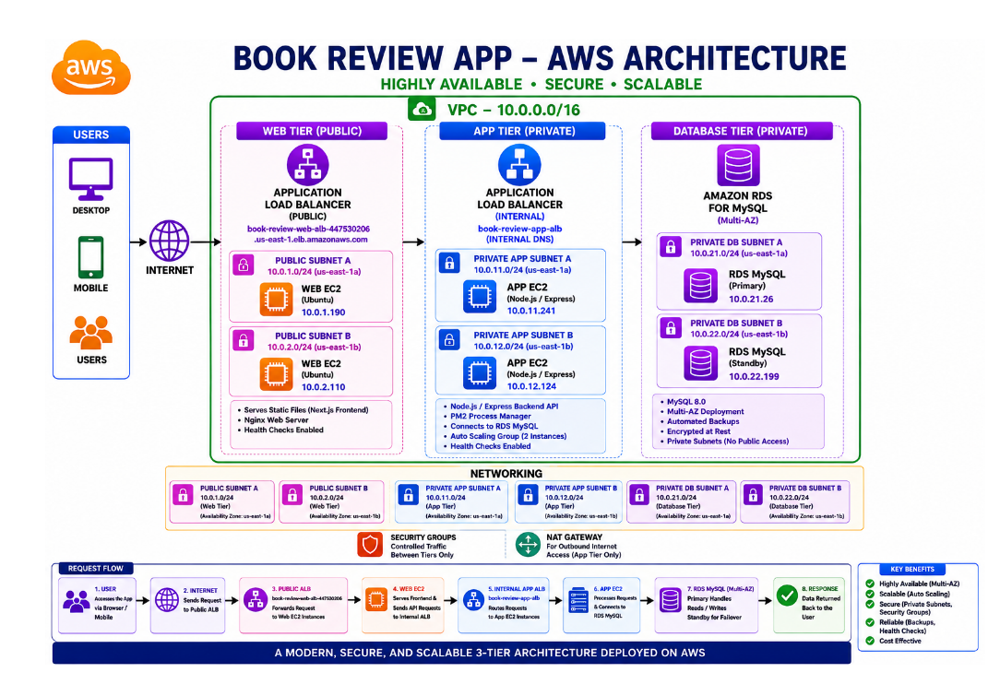

```
                         INTERNET
                             |
                             |
                    +----------------+
                    |  Public ALB    |
                    |   HTTP :80     |
                    +-------+--------+
                            |
                 -----------------------
                 |                     |
          Public Subnet AZ-1    Public Subnet AZ-2
                 |                     |
          +-------------+       +-------------+
          | Web EC2 #1  |       | Web EC2 #2  |
          | Ubuntu      |       | Ubuntu      |
          | Nginx       |       | Nginx       |
          | Next.js     |       | Next.js     |
          +------+------+       +------+------+
                 |                     |
                 -----------+-----------
                            |
                     Internal ALB
                     HTTP :3001
                            |
                 -----------------------
                 |                     |
          Private App AZ-1       Private App AZ-2
                 |                     |
          +-------------+       +-------------+
          | App EC2 #1  |       | App EC2 #2  |
          | Node/Express|       | Node/Express|
          | :3001       |       | :3001       |
          +------+------+       +------+------+
                 |                     |
                 -----------+-----------
                            |
                     Private DB Subnets
                            |
                    +---------------+
                    | RDS MySQL     |
                    | Multi-AZ      |
                    +-------+-------+
                            |
                    +---------------+
                    | Read Replica  |
                    +---------------+
```
---

## Execution Order

### Phase 1 — Planning
- Choose AWS Region
- Calculate CIDRs
- Design VPC
- Prepare architecture diagram

### Phase 2 — Networking
- VPC
- 6 subnets
- Internet Gateway
- Route tables
- NAT strategy if required

### Phase 3 — Security
- Web Security Group
- App Security Group
- Database Security Group
- Phase 4 — Database
- RDS subnet group
- RDS MySQL
- Multi-AZ
- Database security
- Read replica
- Test connectivity

### Phase 5 — App Tier
- Launch private EC2 instances
- Install Node.js
- Clone Book Review App
- Configure backend
- Connect to RDS
- Create internal ALB
- Health checks

### Phase 6 — Web Tier
- Launch Web EC2 instances
- Install Node.js
- Install Nginx
- Deploy Next.js
- Configure frontend → internal ALB
- Create public ALB


### Phase 7 — Testing
- Public ALB
- Web → App
- App → DB
- Private App verification
- ALB health checks


### Phase 8 — Submission
- Task 1 diagram
- Task 2 region/services
- Task 3 public ALB DNS
- Task 5 summary

---

# Task 2 — AWS Region & Services Used

## Goal

Record the AWS Region used and list every AWS service used across networking, compute, load balancing, security, and the database.

### Notes

**Region:**

us-east-1

---

**Services:**

Amazon VPC, Subnets, Internet Gateway, Route Tables, Amazon EC2, Application Load Balancer (public and internal), Security Groups, Amazon RDS for MySQL with Multi-AZ and Read Replica, Nginx, and Node.js/Express. These services are used to implement the three-tier architecture consisting of the Web/Presentation Tier, App/Business Tier, and Database/Data Tier.

This assignment specifically requires the six-subnet VPC architecture, EC2-based Web and App tiers, public and internal ALBs, Security Groups, and private RDS MySQL with Multi-AZ and a read replica.

---

### Checklist:

 - [✔️] Primary RDS is Available
 - [✔️] RDS is private (Publicly accessible: No)
 - [✔️] RDS uses book-db-sg
 - [✔️] Multi-AZ is enabled
 - [✔️] Read replica book-review-db-replica created
 - [✔️] Read replica becomes Available
 - [✔️] NAT Gateway created
 - [✔️] App private route table uses NAT Gateway
 - [✔️] book-app-1 launched in book-app-private-1
 - [✔️] book-app-2 launched in book-app-private-2
 - [✔️] Both App EC2 instances have no public IP
 - [✔️] SSM IAM role attached
 - [✔️] Session Manager connection works
 - [✔️] App EC2 can reach the Internet outbound through NAT
 - [✔️] App EC2 can reach RDS on TCP 3306


----

# Task 3 — Public Entry Point

## Goal

Confirm the Book Review App loads through the public ALB DNS name.

### Evidence

#### Public ALB DNS

public-facing-ALB-776627799.us-east-1.elb.amazonaws.com

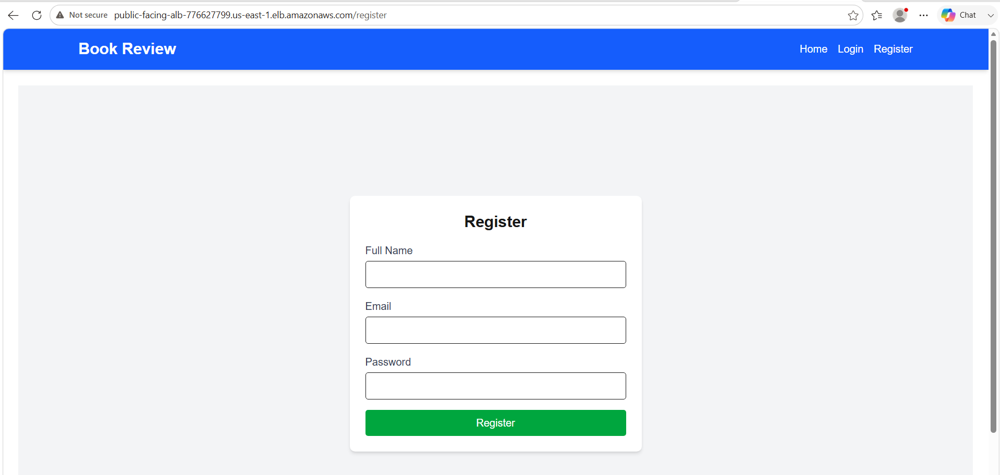


---

# Task 4 — Evidence Screenshots

## Goal

Capture visual proof of every tier and load balancer.

### Evidence

#### How do we SSH into private App EC2?

Because there is no public IP.

For management, we'll use `AWS Systems Manager Session Manager` if the necessary SSM setup is available.

**Check SSM prerequisites**

For Ubuntu EC2, the instance needs:

- SSM Agent
- IAM role allowing Systems Manager
- Outbound HTTPS connectivity

**Our NAT Gateway provides outbound connectivity.**


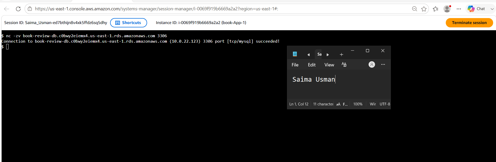

---

#### RDS endpoint Connectivity:

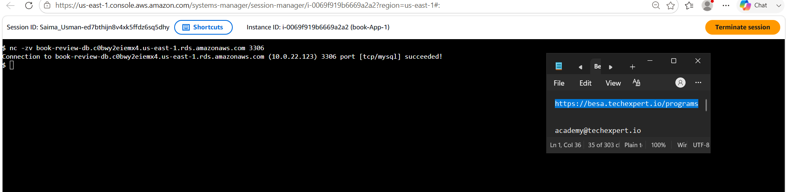


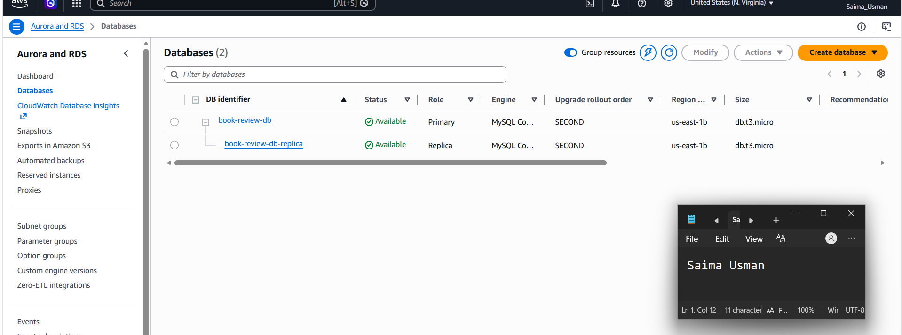

---

#### Web EC2

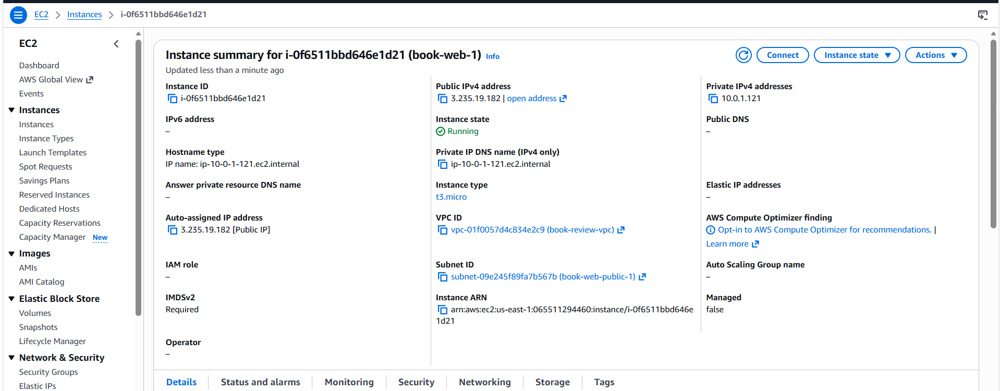

---

#### App EC2

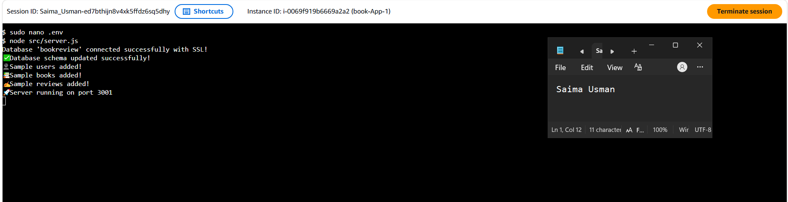

---

#### Public ALB

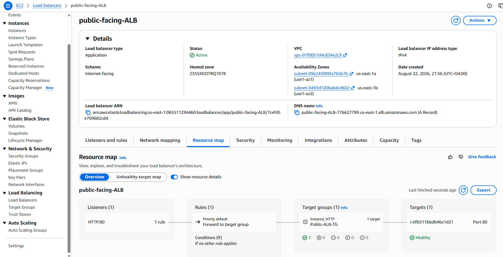

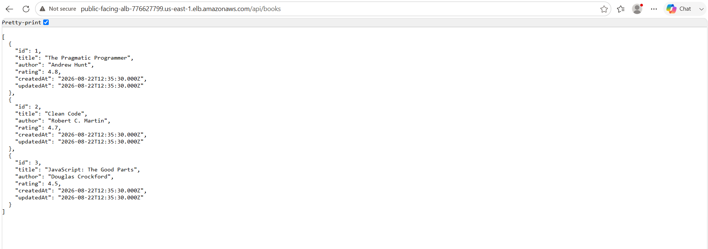

---

#### Internal ALB

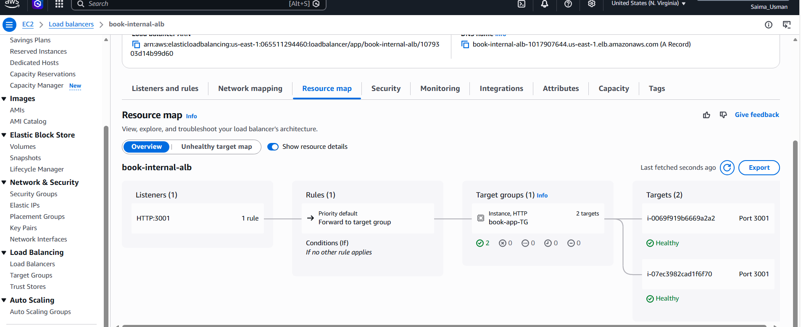

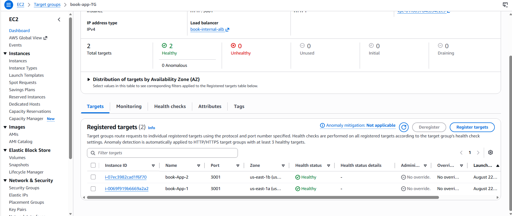

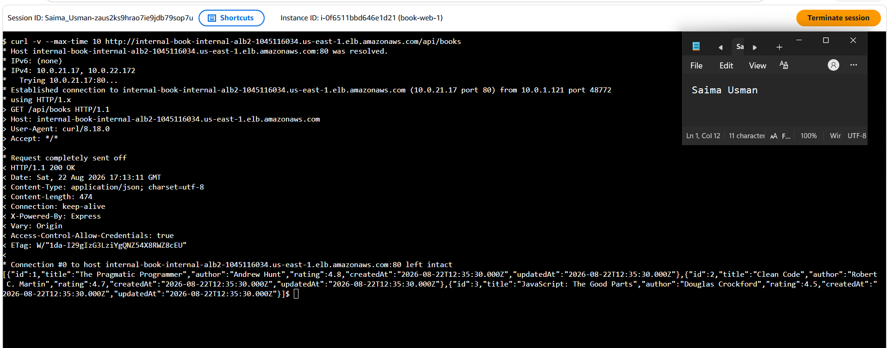

---

#### RDS + Replica


---

#### App UI proof

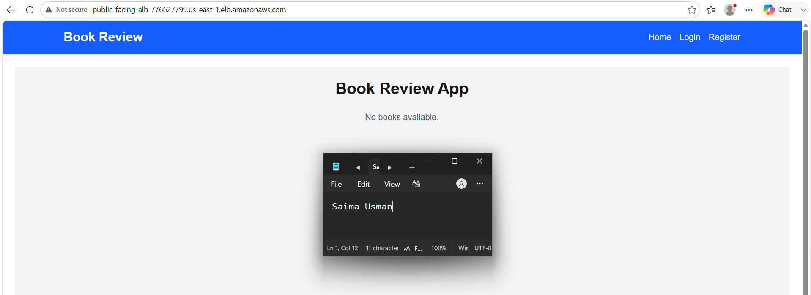

---

# Task 5 — Summary

## Goal

Summarize what worked in the final deployment, the issues encountered and how each was fixed, and the tools or sources used to research and debug.

### Notes

**What worked:**

Successfully deployed the three-tier Book Review application on AWS with:

- Public ALB and two Web EC2 instances.
- Internal ALB and two private App EC2 instances.
- RDS MySQL Multi-AZ with a read replica.
- Nginx reverse proxy and Next.js frontend.

---

**Issues + fixes:**

- App EC2 had no public IP: Kept instances private and used NAT Gateway/SSM.
- ALB was initially Internet-facing: Created a new Internal ALB because the scheme cannot be changed.
- Nginx API requests timed out: Corrected the Internal ALB and security-group configuration.
- Application connectivity issues: Used curl, ALB health checks, and MySQL tests to identify and fix connectivity problems.

---

**Tools/sources used:**

- AWS Management Console
- AWS Systems Manager Session Manager
- EC2, VPC, ALB, RDS, Security Groups
- Nginx
- Node.js, npm, PM2
- MySQL client
- curl and Linux troubleshooting commands
- GitHub repository and instructor-provided deployment instructions

---

# LinkedIn Post (Required)

## Goal

Publish a LinkedIn post sharing the capstone deployment, including the public ALB DNS (or a redacted screenshot), three to five lines on what you built and why it is production-style, and one proof screenshot.

## Evidence

#### LinkedIn Post URL

https://lnkd.in/p/d68Rp-HD

---

#### Screenshot of LinkedIn post

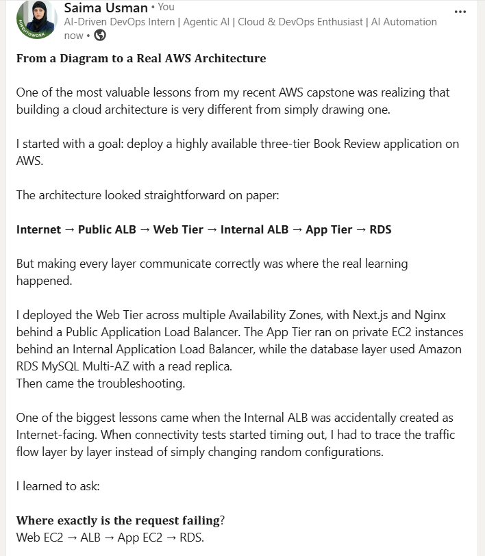

---

# Submission Instructions

- Add all required screenshots and links in your submission
- Do not expose passwords, RDS credentials, connection strings, private keys, or account IDs

---

# Completion Checklist

- [✔️] Task 1: Architecture diagram completed
- [✔️] Task 2: AWS Region and services documented
- [✔️] Task 3: Public ALB DNS confirmed working
- [✔️] Task 4: All six evidence screenshots captured (Web Tier, App Tier, both ALBs, RDS + replica, app UI)
- [✔️] Task 5: Deployment summary completed (what worked, issues/fixes, tools/sources)
- [✔️] LinkedIn post published and URL submitted
- [✔️] App Tier and Database Tier confirmed not publicly accessible
- [✔️] No sensitive data exposed

---

## 📌 About DMI & CloudAdvisory

DevOps Micro Internship (DMI) is a project-based DevOps program run by Pravin Mishra (The CloudAdvisory) focused on real-world execution, systems thinking, and career readiness.

It helps learners build strong DevOps foundations with hands-on experience.

---

## 📌 Resources

- 🌐 DMI Official Website: https://dmi.pravinmishra.com?utm_source=github&utm_medium=readme  
- 🎓 University: https://university.pravinmishra.com?utm_source=github&utm_medium=readme  
- 💬 Discord Community: https://discord.pravinmishra.com?utm_source=github&utm_medium=readme  
- 📝 Blog: https://dmi.pravinmishra.com/blog?utm_source=github&utm_medium=readme  
- ▶️ YouTube Playlist: https://www.youtube.com/playlist?list=PLFeSNDtI4Cho  
- 🔗 Pravin Mishra (LinkedIn): https://www.linkedin.com/in/pravin-mishra-aws-trainer/  
- 🏢 CloudAdvisory (LinkedIn): https://www.linkedin.com/company/thecloudadvisory/

---

*This submission is part of DevOps Micro Internship (DMI) Cohort 3 — Agentic AI Track.*