# Assignment 7 — AI-Assisted AWS Security and Cost Audit

Part of the DevOps Micro Internship (DMI) Cohort 3 with Agentic AI

---

## Purpose

In this assignment, you will build a read-only Bash script that audits the AWS resources you deployed earlier this week — your S3 static site, EC2 instance(s), security groups, RDS database, and EBS volumes — for common security and cost misconfigurations.

You will then connect that script to Claude Code as a reusable `/aws-audit` skill that explains what it found and recommends a fix, without ever making the fix itself.

Finally, you will find a real misconfiguration in your own account, apply the fix yourself, and prove it worked with a second audit run.

---

# Task 1 — Confirm Your AWS Resources and Set Up Your Workspace

## Goal

Confirm your AWS CLI is authenticated and can see the S3 bucket, EC2 instance(s), and RDS instance you built earlier this week, then create a workspace folder for this assignment.

### Evidence

#### Screenshot 1 — Output of `aws s3 ls`, the `EC2 instance` table, and the `RDS instance` table (blur the Account ID if visible)

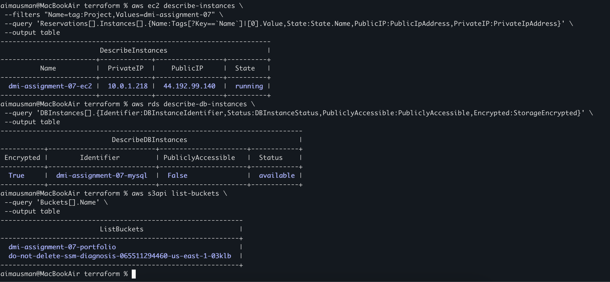

---

#### Screenshot 2 — Output of `pwd` and `find . -maxdepth 4 -type d | sort`

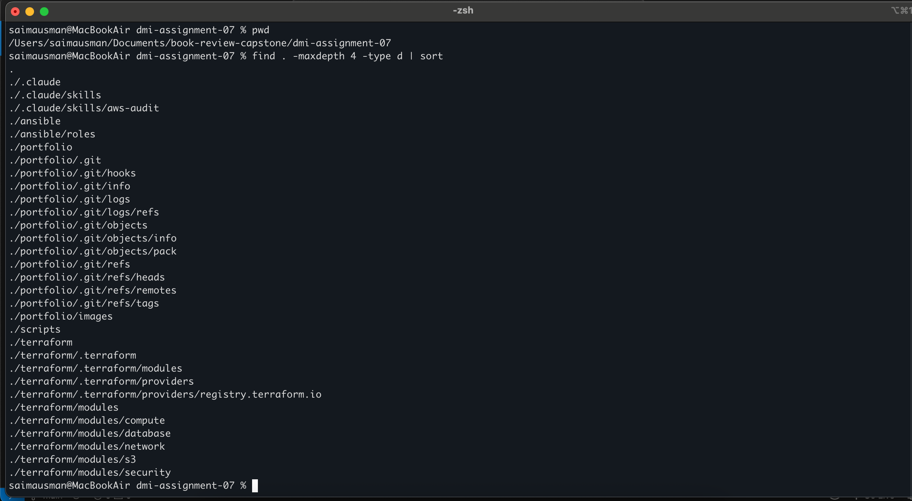

---

### Notes You Must Write (Very Important)

**1. Which resources from this week's earlier assignments did you see in the listings?**

The AWS listings showed the resources created for this week's infrastructure lab, including the S3 portfolio bucket, the EC2 instance, and the RDS MySQL database. These resources formed the infrastructure that the audit script inspected.

**2. Why must you confirm your resources exist before writing an audit script against them?**

The AWS listings showed the resources created for this week's infrastructure lab, including the S3 portfolio bucket, the EC2 instance, and the RDS MySQL database. These resources formed the infrastructure that the audit script inspected.

---

# Task 2 — Define Safety Rules in CLAUDE.md

## Goal

Create a `CLAUDE.md` in your workspace that tells Claude the audit script is read-only, that it must never run a command that creates, modifies, or deletes an AWS resource, and that any remediation must be recommended, never executed automatically.

### Evidence

#### Screenshot 3 — `CLAUDE.md` open in VS Code showing all four sections

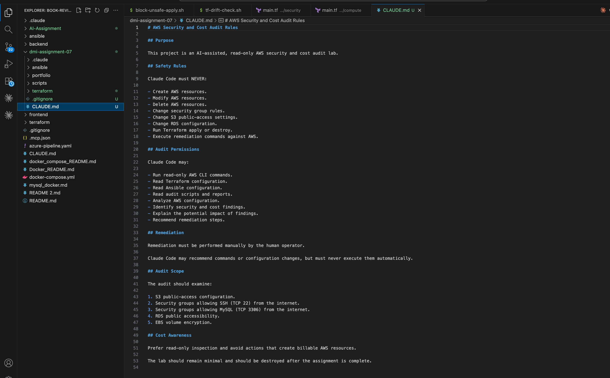

---

### Notes You Must Write (Very Important)

**1. Why should Claude never be given permission to run `revoke-security-group-ingress` itself, even if the fix is obviously correct?**

Claude should not execute `revoke-security-group-ingress` because it is a destructive change to live AWS infrastructure. Even when a finding appears obvious, an automated remediation could remove a rule that is intentionally required, affect application availability, or cause an unexpected outage. Keeping remediation as a human-approved action provides a safety boundary: Claude can gather evidence and recommend the fix, while the human reviews and executes the change.

**2. Which rule prevents Claude from claiming a finding that the report does not support?**

The evidence-based reporting rule prevents unsupported findings. Claude must base its conclusions on the actual audit results and should not claim a security issue unless the audit report provides evidence for it. This keeps the audit factual, traceable, and grounded in the results produced by the read-only checks.

---

# Task 3 — Plan the Audit with Claude Code

## Goal

Ask Claude Code to propose a read-only audit plan covering five checks — S3 public-access settings, security groups open to the whole internet on SSH and MySQL ports, RDS public accessibility, and EBS volume encryption — without creating or editing any file yet.

### Evidence

#### Screenshot 4 — Claude Code showing the five-check plan

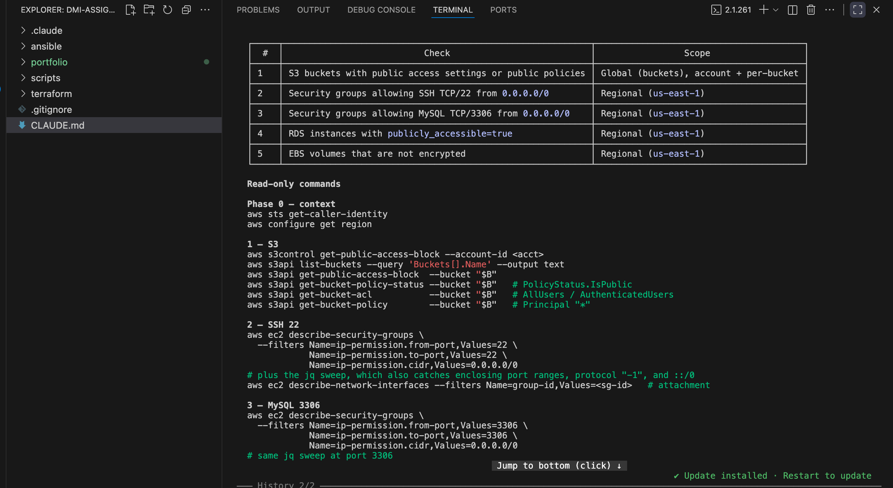

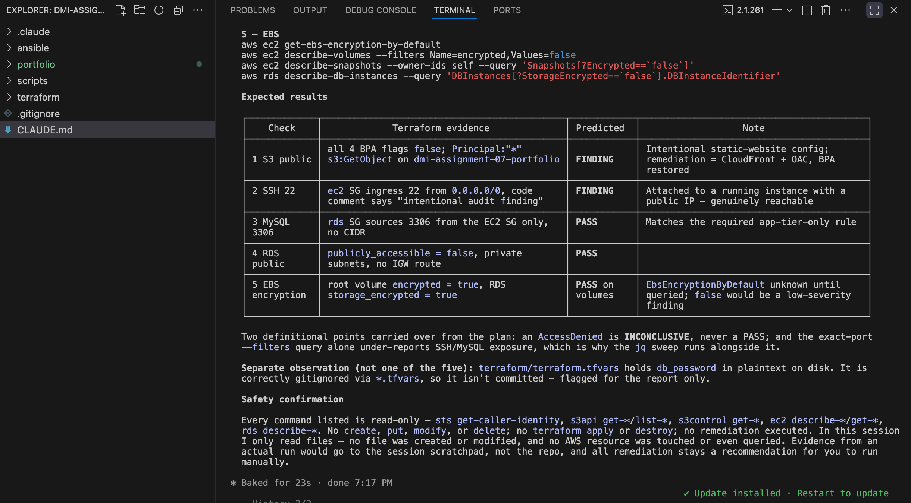

---

### Notes You Must Write (Very Important)

**1. Which part of this task represents the Gather phase?**

The evidence-based reporting rule prevents unsupported findings. Claude must base its conclusions on the actual audit results and should not claim a security issue unless the audit report provides evidence for it. This keeps the audit factual, traceable, and grounded in the results produced by the read-only checks.

**2. Did every proposed command start with `describe-`, `get-`, or `list-`? Why does that matter?**

No. The proposed commands did not all start with describe-, `get-`, or `list-`; for example, `jq` was used to analyze the JSON returned by AWS CLI commands. What matters is that the AWS CLI operations themselves were read-only inspection commands, such as `describe-*`, `get-*`, and `list-*`. This matters because the audit needed to gather evidence without changing AWS resources, keeping the Gather phase safe and preventing accidental infrastructure modifications.

---

# Task 4 — Build the AWS Audit Script

## Goal

Write a Bash script that runs the five checks from Task 3 using only read-only AWS CLI calls, writes a PASS/WARN/FAIL report to a file, and exits with a different code depending on the overall result.

Make it executable and confirm it has no syntax errors.

### Evidence

#### Screenshot 5 — Top section of `aws-audit.sh` showing the variables and the checks array

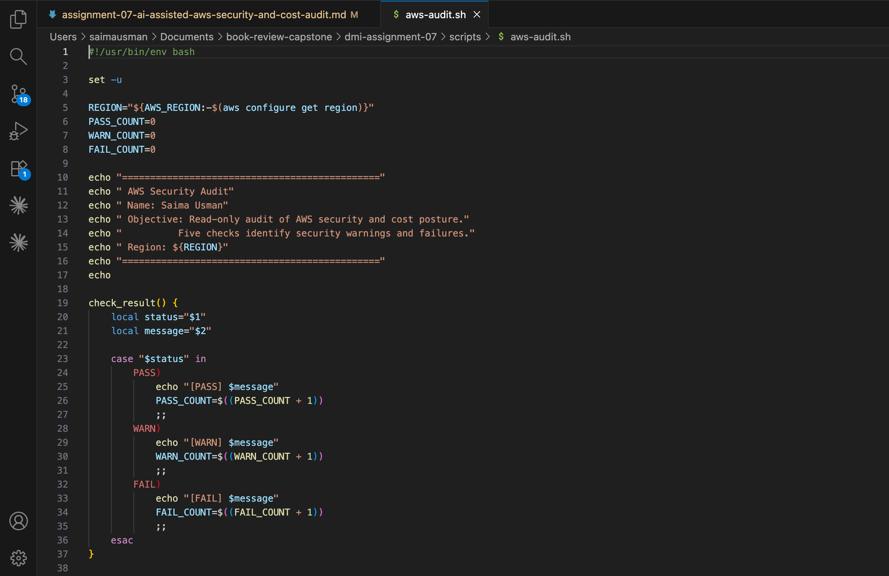
---

#### Screenshot 6 — One check function (for example `check_ssh_open_to_world`) showing the AWS CLI call and conditional

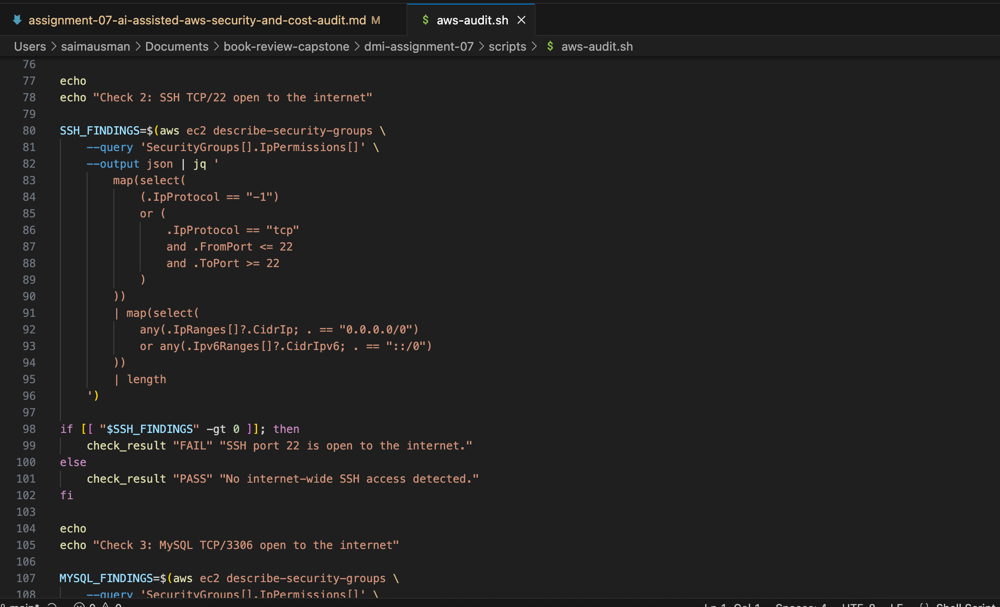

---

#### Screenshot 7 — Output of `bash -n scripts/aws-audit.sh` and `ls -l scripts/aws-audit.sh`

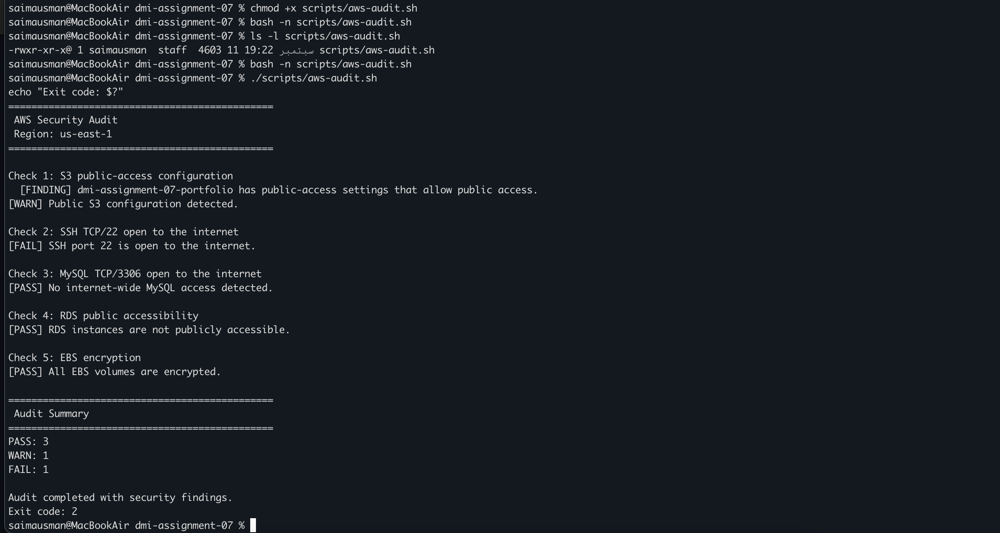

---

### Notes You Must Write (Very Important)

**1. What is stored in the checks array, and how does the loop use it?**

The checks `array` stores the names or definitions of the AWS security checks that the audit needs to perform. The loop goes through each item in the array and processes the corresponding check, allowing the script to handle multiple audit checks in a consistent and organized way without repeating the overall control structure.

**2. Why does every AWS CLI call in this script use `--query` and `--output text` instead of parsing raw JSON?**

`--query` filters the AWS CLI response and extracts only the specific information required by the check. `--output text` converts that result into simple text that Bash can easily compare and process. This keeps the script simpler and avoids unnecessary raw JSON parsing.

**3. Why does the script use different exit codes for HEALTHY, WARN, and FAIL?**

Different exit codes allow other tools, automation, or CI/CD pipelines to determine the audit result programmatically. In this script, exit code 0 means the audit is healthy with no warnings or failures, exit code 1 means warnings were detected but no critical failures occurred, and exit code 2 means one or more security failures were detected. This makes the audit result easy to interpret automatically.

---

# Task 5 — Run the Baseline Audit

## Goal

Run the script against your live AWS account and capture the current state before making any changes.

### Evidence

#### Screenshot 8 — Output of `./scripts/aws-audit.sh` showing your Full Name and all five checks

---

#### Screenshot 9 — Output showing the captured exit code and final summary

---

### Notes You Must Write (Very Important)

**1. What is the overall status of your baseline audit?**

The overall status of my baseline audit was security findings detected. The audit completed with 3 PASS, 1 WARN, and 1 FAIL, resulting in exit code 2.

**2. Did any check return FAIL or WARN? If so, which one, and what evidence did it show?**

`dmi-assignment-07-portfolio` bucket had public-access settings that allow public access. The SSH TCP/22 check returned FAIL because SSH was open to the internet through `0.0.0.0/0`. The MySQL 3306, RDS public accessibility, and EBS encryption checks all passed.

**3. If every check passed, what does that tell you about the security posture of your account so far?**

dmi-assignment-07-portfolio bucket had public-access settings that allow public access. The SSH TCP/22 check returned FAIL because SSH was open to the internet through 0.0.0.0/0. The MySQL 3306, RDS public accessibility, and EBS encryption checks all passed.

---

# Task 6 — Build and Run the /aws-audit Skill

## Goal

Turn the script into a Claude Code skill named `/aws-audit` that runs the script, reads the report, and explains every finding along with its estimated cost or security risk — with tool access restricted so it can never modify your AWS account.

### Evidence

#### Screenshot 10 — `SKILL.md` showing the frontmatter, tool restrictions, and safety rules

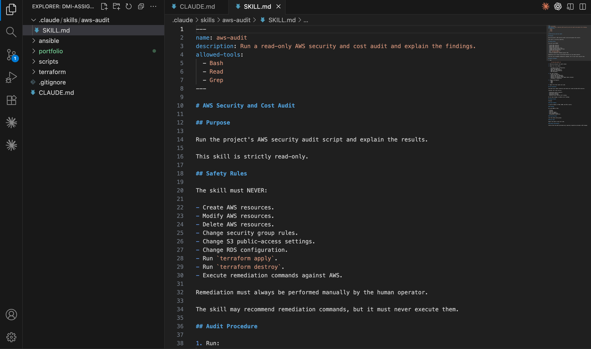

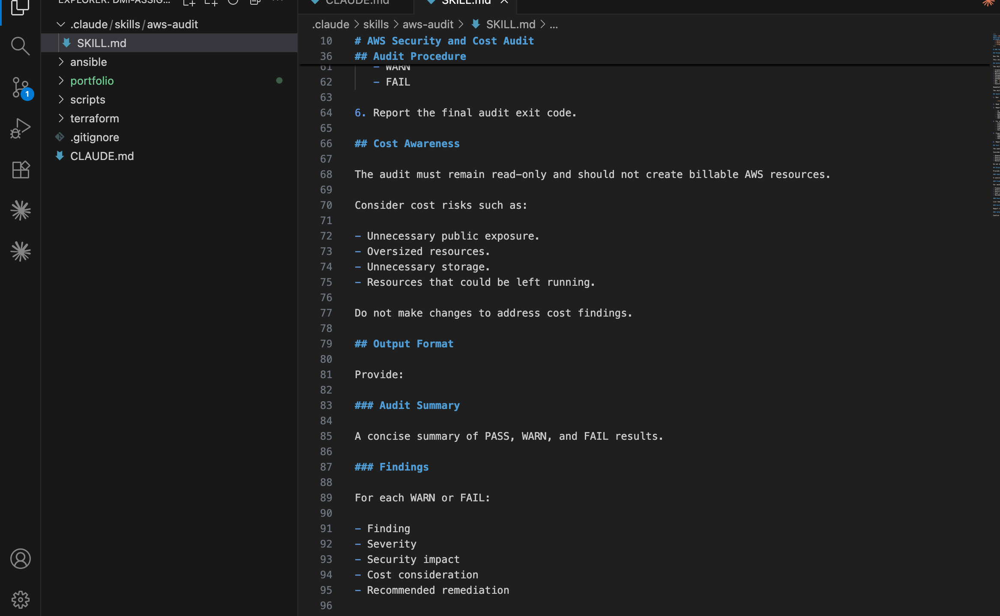

---

#### Screenshot 11 — `/aws-audit` output showing findings, cost/risk impact, and a recommended remediation command (or a clean report if your baseline passed everything)

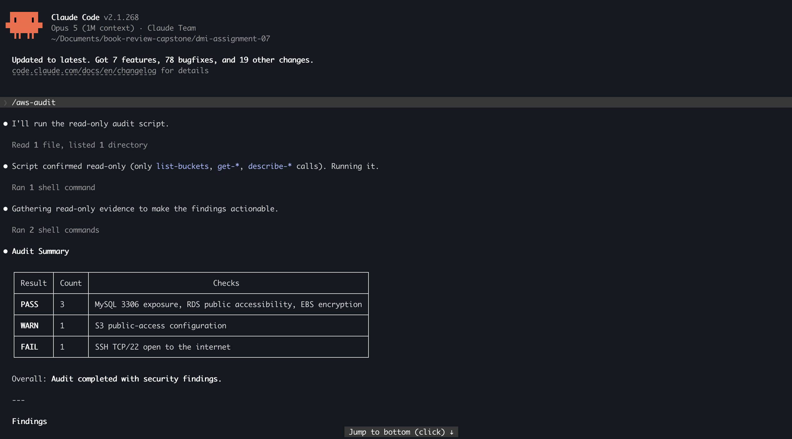

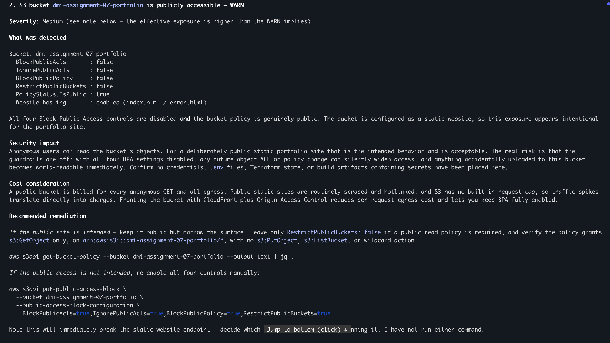

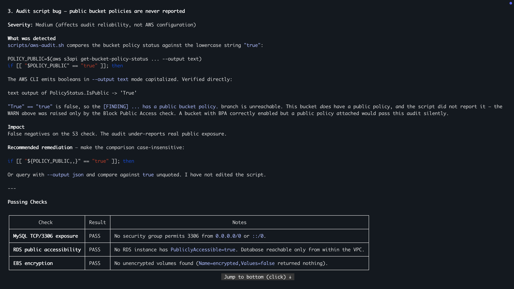

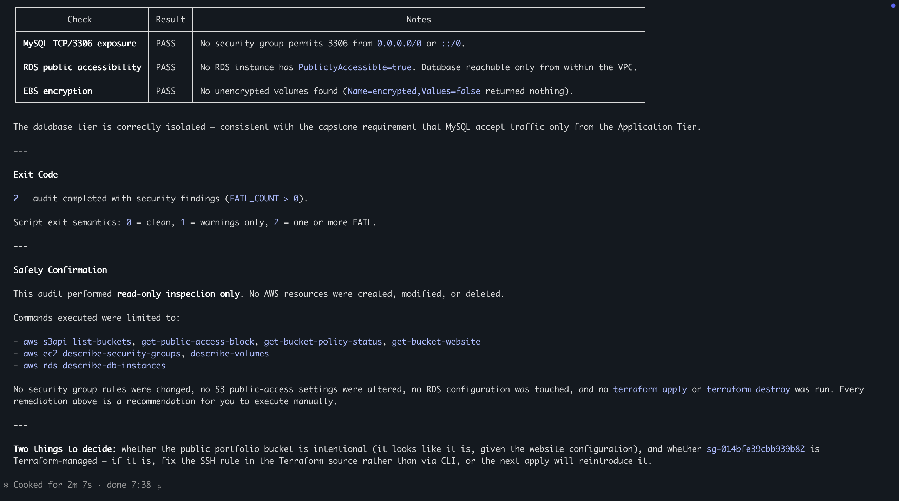

---

### Notes You Must Write (Very Important)

**1. Why does this skill have Bash, Read, and Grep, but not Write?**

WThe skill has Bash, Read, and Grep because it needs to execute the read-only audit script, read project and audit files, and search for relevant information. It does not have Write because the skill must not modify project files or configuration. This reinforces the read-only safety boundary and prevents Claude from making unauthorized changes.

**2. What part is performed by Bash, and what part is performed by Claude?**

Bash executes the `./scripts/aws-audit.sh` script and collects the live AWS configuration and check results. Claude interprets those results, explains the security findings and potential cost impact, and recommends appropriate remediation without executing the remediation itself.

**3. Why is estimating cost/risk impact something the AI adds on top of a plain PASS/FAIL script?**

A plain `PASS/FAIL script` can identify whether a specific configuration violates a security check, but it does not provide much context about the business, security, or potential cost impact. Claude adds value by interpreting the findings, explaining why they matter, prioritizing the risks, and providing human-readable remediation recommendations. This turns raw audit results into actionable information for decision-making.

---

# Task 7 — Fix a Real Finding and Re-Verify

## Goal

Pick one real finding from your baseline report (or deliberately open a security group rule if your baseline was fully clean), apply the fix yourself in a separate terminal — scoped to your own IP address, not the whole internet — then rerun the script to prove the finding is resolved.

### Evidence

#### Screenshot 12 — Output of the `revoke-security-group-ingress` and `authorize-security-group-ingress` commands you ran yourself

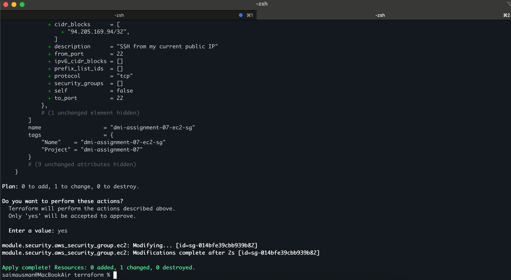

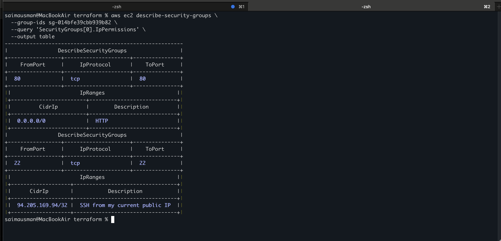

---

#### Screenshot 13 — Rerun of `./scripts/aws-audit.sh` showing the finding is now PASS

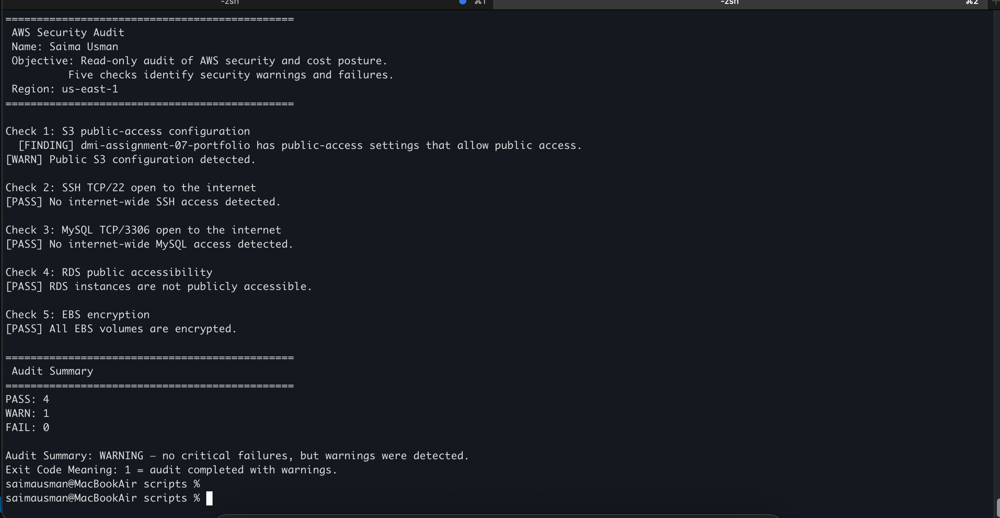

---

### Finding Fixed

The baseline audit identified a security finding where TCP port 22 (SSH) on the EC2 security group was open to the entire internet using `0.0.0.0/0`. I remediated this by changing the Terraform security-group rule to allow SSH only from my current public IP, `94.205.169.94/32`. I applied the Terraform change and then verified the actual AWS security-group configuration with the AWS CLI.

After remediation, the audit changed from `PASS: 3, WARN: 1, FAIL: 1` with exit code `2` to `PASS: 4, WARN: 1, FAIL: 0` with exit code `1`. The remaining S3 warning is intentional because the portfolio bucket is configured for public website access.

### Why `/32` Matters

A `/32` CIDR represents a single IPv4 address. Using `94.205.169.94/32` limits SSH access to my current public IP instead of allowing SSH connections from the entire internet. This follows the principle of least privilege and significantly reduces the attack surface.

### Claude vs Human Responsibility

Claude Code was used to perform the read-only audit, analyze the findings, and recommend remediation. It was not permitted to modify AWS resources. I, as the human operator, reviewed the recommendation and performed the remediation through the Terraform configuration and `terraform apply`. This separation provides an additional safety boundary for infrastructure changes.

### Agentic Loop

The remediation followed the Agentic Loop:

* **Gather:** The audit script inspected the live AWS configuration and identified SSH port 22 as a finding.
* **Decide:** The finding was reviewed and the appropriate remediation was determined to be restricting SSH to my current IP using `/32`.
* **Act:** The Terraform security-group configuration was changed and applied.
* **Verify:** The AWS CLI confirmed the new `/32` rule, and the audit was run again to confirm that SSH now passed and there were zero FAIL findings.

---

### Notes You Must Write (Very Important)

**1. Which exact finding did you fix, and what command did you run?**

I fixed the SSH `TCP/22` security-group finding where port 22 was open to the internet through `0.0.0.0/0`. I changed the Terraform security-group rule to allow SSH only from my public IP, `**.***.***.**/32`, and applied the change using terraform apply. I then used aws `ec2 describe-security-groups` to verify the updated rule.

**2. Why did you scope the new rule to your own IP address instead of leaving it open to `0.0.0.0/0`?**

I scoped the rule to my own IP address because `0.0.0.0/0` allows SSH access from any IPv4 address on the internet, which significantly increases the attack surface. Using my own public IP, `**.***.***.**/32` restricts SSH access to a single IPv4 address and follows the principle of least privilege.

**3. Did Claude execute the remediation command, or did you? Why does that matter?**

I executed the remediation myself. Claude only performed the `read-only audit`, analyzed the findings, and recommended the remediation. This matters because changing live AWS security-group rules is a potentially disruptive action, so keeping the final remediation under human control provides a safety boundary and prevents an AI agent from making unintended infrastructure changes.

**4. Which phase of the Agentic Loop does the Bash script represent? Which phase does Claude's explanation represent? Which phase is you running the fix?**

The Bash audit script represents the Gather phase because it collects the current AWS configuration and produces evidence about the security posture. Claude's explanation represents the Decide phase because it interprets the evidence, assesses the risk, and recommends what should be done. My Terraform change and `terraform apply` represent the Act phase because I carried out the approved remediation. The subsequent AWS CLI verification and re-running of the audit represent the Verify phase, confirming that the finding was successfully resolved.

---

# LinkedIn Post (Required)

## Goal

Create a LinkedIn post including:

- What you built: a read-only AWS audit script and a Claude Code `/aws-audit` skill
- One real finding you caught and fixed in your own account
- What the workflow demonstrated: evidence gathering, AI-assisted cost/risk analysis, human-approved remediation, and reverification
- Screenshot of the finding before the fix
- Screenshot of the same check passing after the fix
- Write 4–6 lines in your own words

Suggested tags:

`#DMIByPravinMishra #AWS #AgenticAI #ClaudeCode #DevOps`

### Evidence

#### LinkedIn Post URL

Paste your LinkedIn post URL here:

https://lnkd.in/p/dnbnrGrW

---

#### Screenshot of Published LinkedIn Post

---

# Submission Instructions

Complete all tasks in sequence.

Your submission must include:

- All 13 required task screenshots
- Answers to every **Notes You Must Write** question
- `CLAUDE.md`
- `scripts/aws-audit.sh`
- `.claude/skills/aws-audit/SKILL.md`
- `reports/aws-audit-report.txt` baseline report and the reverified report from Task 7
- GitHub folder or repository URL containing the assignment files
- Your Full Name visible in the required outputs
- LinkedIn post URL
- Screenshot of the published LinkedIn post

Submit only a Google Doc link.

Add the GitHub URL inside the Google Doc.

Follow the Assignment Submission Guidelines.

---

# Completion Checklist

- [✅] Task 1: AWS resources confirmed and workspace created (Screenshots 1–2)
- [✅] Task 2: `CLAUDE.md` created with project context and safety rules (Screenshot 3)
- [✅] Task 3: Claude produced a read-only five-check audit plan before any script existed (Screenshot 4)
- [✅] Task 4: `aws-audit.sh` built, executable, and passes `bash -n` (Screenshots 5–7)
- [✅] Task 5: Baseline audit captured and saved with Full Name visible (Screenshots 8–9)
- [✅] Task 6: `/aws-audit` skill loads and runs successfully with no Write permission (Screenshots 10–11)
- [✅] Task 7: A real finding was fixed by you and reverified as PASS (Screenshots 12–13)
- [✅] Skill never executed a remediation command
- [✅] New security group rule is scoped to your own IP, not `0.0.0.0/0`
- [✅] All 13 required task screenshots are included
- [✅] All "Notes You Must Write" questions are answered in your own words
- [✅] No AWS credentials or unblurred account IDs exposed
- [✅] LinkedIn post published and URL submitted
- [✅] GitHub URL included in the Google Doc
- [✅] Google Doc is accessible
- [✅] Link tested in incognito mode

---

# Final Submission

Submit only your Google Doc link.

### Question

Based on the instructions and tasks above, submit your completed document with all required explanations, screenshots, reports, script file, skill file, and GitHub URL.

https://docs.google.com/document/d/1qu6__zFVnOS-3WHueTNifkdXFpd_ABW7QiK-q64e_Sc/edit?usp=sharing

---

## 📌 About DMI & CloudAdvisory

DevOps Micro Internship (DMI) is a project-based DevOps program run by Pravin Mishra (The CloudAdvisory) focused on real-world execution, systems thinking, and career readiness.

It helps learners build strong DevOps foundations with hands-on experience.

---

## 📌 Resources

- 🌐 DMI Official Website: https://dmi.pravinmishra.com?utm_source=github&utm_medium=readme  
- 🎓 University: https://university.pravinmishra.com?utm_source=github&utm_medium=readme  
- 💬 Discord Community: https://discord.pravinmishra.com?utm_source=github&utm_medium=readme  
- 📝 Blog: https://dmi.pravinmishra.com/blog?utm_source=github&utm_medium=readme  
- ▶️ YouTube Playlist: https://www.youtube.com/playlist?list=PLFeSNDtI4Cho  
- 🔗 Pravin Mishra (LinkedIn): https://www.linkedin.com/in/pravin-mishra-aws-trainer/  
- 🏢 CloudAdvisory (LinkedIn): https://www.linkedin.com/company/thecloudadvisory/

---

*This submission is part of DevOps Micro Internship (DMI) Cohort 3 — Agentic AI Track.*