# Assignment 6 — Capstone: Deploy Book Review App (Three-Tier Architecture) on Azure

Part of the DevOps Micro Internship (DMI) Cohort 3 with Agentic AI

---

## Purpose

This is the most important assignment of the course. You will deploy the Book Review App in a production-ready, best-practice-compliant three-tier architecture on Azure: separated presentation, application, and database tiers, least-privilege network access, a controlled public entry point, protected secrets, and availability/monitoring evidence.

---

# Task 1 — Design the Azure Three-Tier Architecture

## Goal

Create an architecture diagram and implementation plan identifying the presentation, application, and database components, the chosen Azure services, the public entry point, and the internal traffic paths.

### Evidence

#### Screenshot 1 — Architecture diagram showing the public entry point, three tiers, network boundaries, and traffic flow


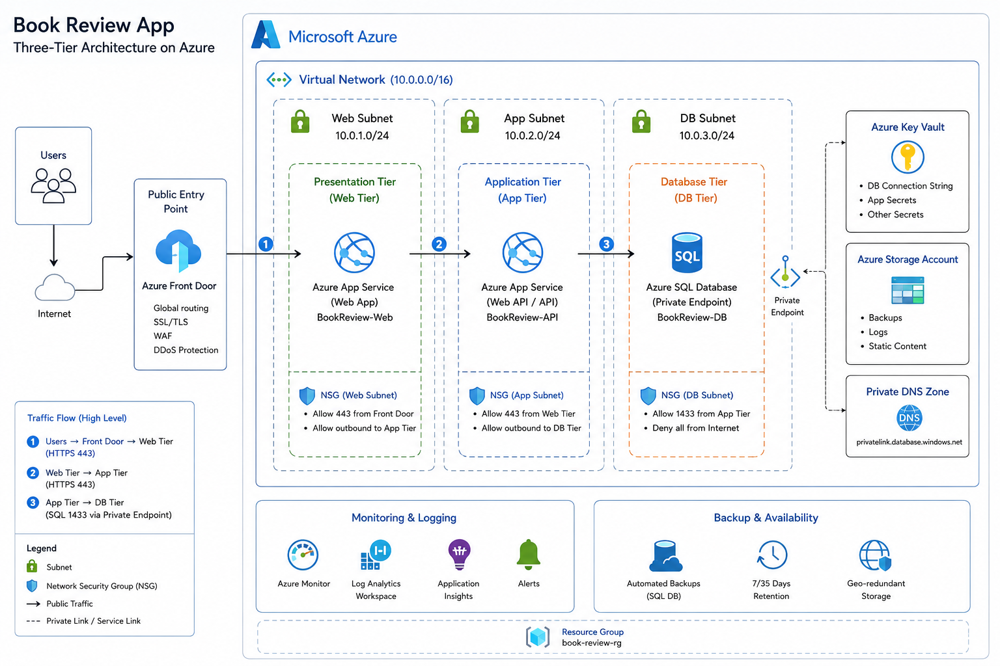

---

#### Screenshot 2 — Written architecture assumptions and selected Azure services

```
Internet → Public Entry Point → Web Tier → Application Tier → Private Database
```

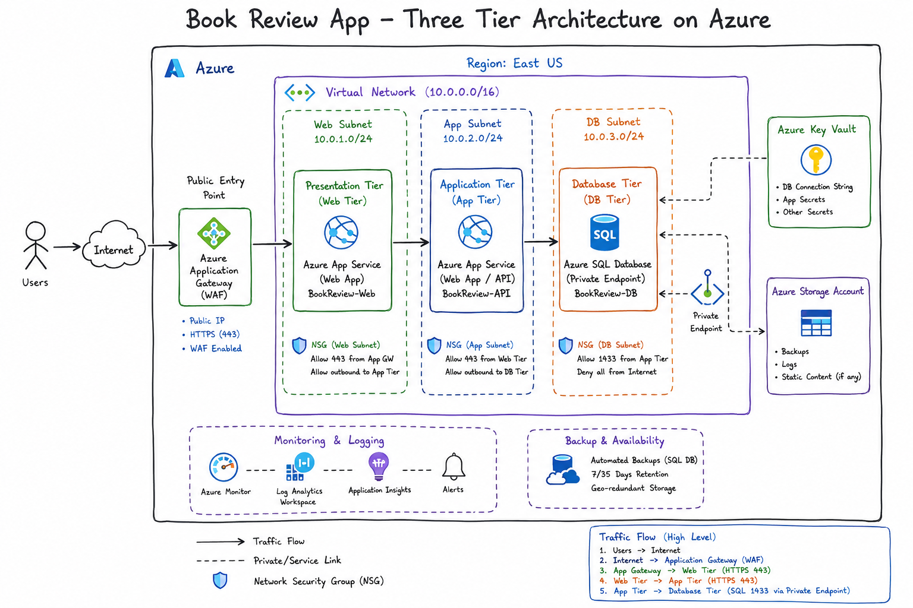


## Services Will Be Used:


- Azure Resource Group, 
- Azure Virtual Network (VNet), 
- Web/App/DB Subnets, 
- Network Security Groups (NSGs), 
- Azure Front Door (WAF), 
- Azure App Service (Web Tier), 
- Azure App Service (Application/API Tier), 
- Azure SQL Database, 
- Private Endpoint, 
- Private DNS Zone, 
- Azure Key Vault, 
- Azure Storage Account, 
- Azure Monitor, 
- Log Analytics Workspace, 
- Application Insights, 
- Azure Alerts, and 
- Azure Backup/automated SQL backups.


---

# Task 2 — Create the Azure Network Foundation

## Goal

Create a dedicated Resource Group and VNet with separate subnets for the web, application, and database tiers, keeping the application and database tiers without direct public access.

### Evidence

#### Screenshot 3 — Resource Group overview showing the assignment resources

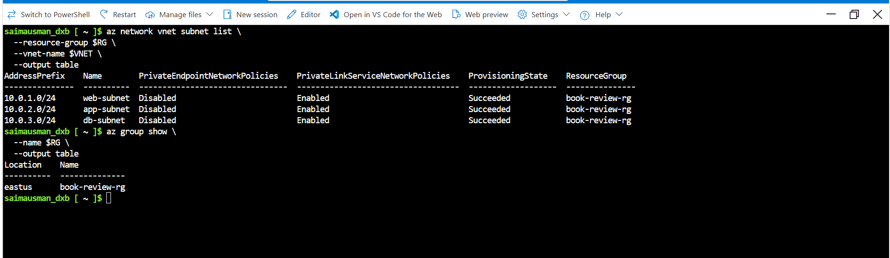

---

#### Screenshot 4 — VNet overview showing the address space and all required subnets

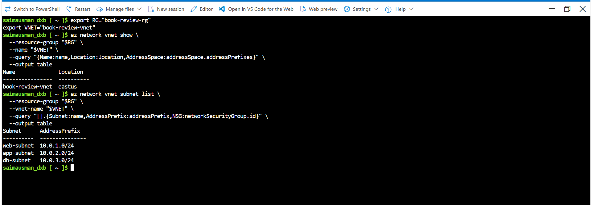

---

#### Screenshot 5 — Route-table or Private DNS evidence where applicable

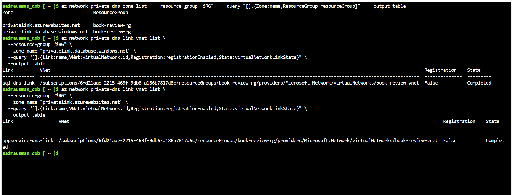

---

# Task 3 — Configure Security and Secret Management

## Goal

Apply least-privilege NSG rules so traffic flows Internet → public entry point → web tier → application tier → database tier, and store credentials in Azure Key Vault or another approved secure mechanism.

### Evidence

#### Screenshot 6 — NSG rules proving least-privilege access between the tiers

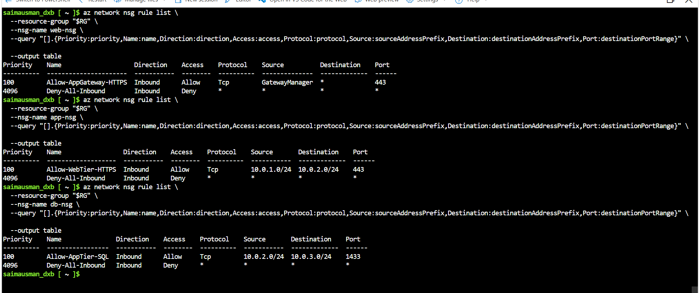

---

#### Screenshot 7 — Key Vault or approved secret-management configuration (without displaying secret values)

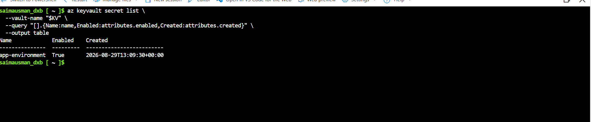

---

### Our Initial Azure Foundation:

```
book-review-rg
│
├── book-review-vnet
│   ├── web-subnet
│   ├── app-subnet
│   └── db-subnet
│
├── web-nsg
├── app-nsg
├── db-nsg
│
├── Azure Key Vault
│
└── Log Analytics Workspace

```

### Our Security Model

```
Internet
   │ HTTPS 443
   ▼
Application Gateway
   │
   │ HTTPS 443
   ▼
WEB TIER
   │
   │ HTTPS 443
   ▼
APPLICATION TIER
   │
   │ TCP 1433
   ▼
DATABASE / SQL PRIVATE ENDPOINT

```

---

# Task 4 — Deploy the Presentation (Web) Tier

## Goal

Deploy the Book Review App presentation layer on the approved web-tier compute service, configured to route requests to the internal application-tier endpoint, and not directly exposed except through the public entry service.

### Target Web-Tier Architecture

```
                         INTERNET
                            │
                         HTTPS :443
                            │
                            ▼
                ┌────────────────────────┐
                │ Azure Application      │
                │ Gateway WAF v2         │
                │ Public IP              │
                └───────────┬────────────┘
                            │
                            │ Private HTTPS
                            ▼
                ┌────────────────────────┐
                │ Web App Private        │
                │ Endpoint                │
                └───────────┬────────────┘
                            │
                            ▼
                ┌────────────────────────┐
                │ Azure App Service      │
                │ BookReview-Web         │
                └───────────┬────────────┘
                            │
                            │ HTTPS / API
                            ▼
                       App Tier

```

---

### Evidence

#### Screenshot 8 — Web-tier compute overview showing subnet and availability configuration

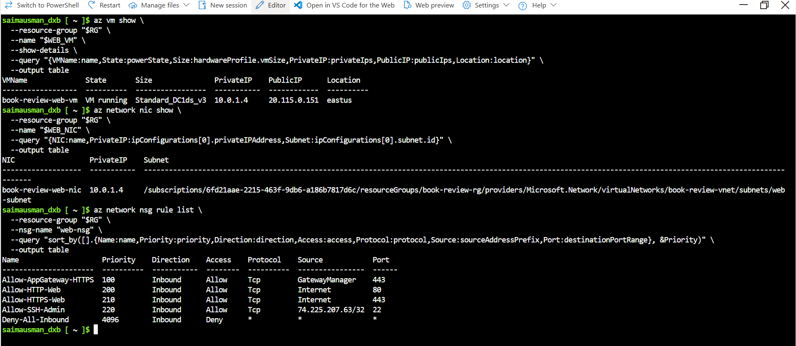

---

#### Screenshot 9 — Terminal or service output proving the presentation layer is running

```
az vm run-command invoke \
  --resource-group "book-review-rg" \
  --name "book-review-web-vm" \
  --command-id RunShellScript \
  --scripts '
echo ""
echo "========================================"
echo "       PRESENTATION LAYER CHECK"
echo "========================================"
echo ""
echo "NGINX SERVICE:"
echo "----------------------------------------"
systemctl is-active nginx
echo ""
echo "NGINX CONFIGURATION:"
echo "----------------------------------------"
nginx -t
echo ""
echo "HTTP RESPONSE:"
echo "----------------------------------------"
curl -I http://localhost
echo ""
echo "========================================"
echo "       PRESENTATION LAYER: OK"
echo "========================================"
' \
  --query "value[0].message" \
  --output tsv

```

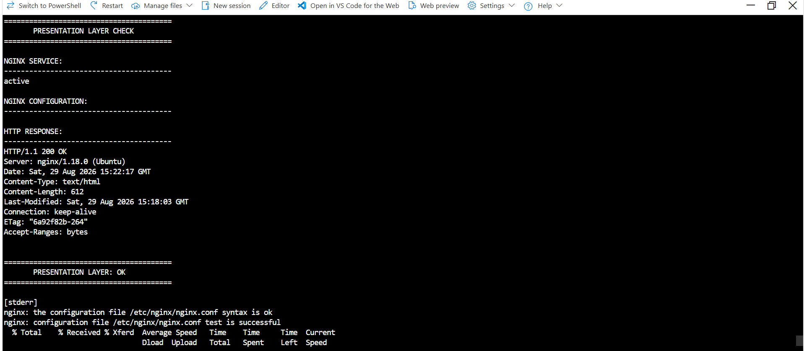

---

# Task 5 — Deploy the Business (Application) Tier

## Goal

Deploy the Book Review App backend privately in the application subnet, configured to use the private database endpoint and secured environment values, reachable only through its internal endpoint.

### Target Architecture

```
                    INTERNET
                        │
                        ▼
              ┌─────────────────┐
              │   Web Tier      │
              │ Linux VM + Nginx│
              │ 10.0.1.0/24     │
              └────────┬────────┘
                       │
                       │ HTTP :8080
                       ▼
              ┌─────────────────┐
              │ Application Tier│
              │ Linux VM        │
              │ 10.0.2.0/24     │
              │ Business Logic  │
              └────────┬────────┘
                       │
                       ▼
              ┌─────────────────┐
              │   Database Tier │
              │ 10.0.3.0/24     │
              └─────────────────┘

```

---

### Evidence

#### Screenshot 10 — Application-tier compute overview showing private subnet placement

```
echo ""
echo "=============================================="
echo "       APPLICATION TIER COMPUTE OVERVIEW"
echo "=============================================="
echo ""

echo "VM:"
az vm show \
  --resource-group "$RG" \
  --name "$APP_VM" \
  --show-details \
  --query "{Name:name,State:powerState,Size:hardwareProfile.vmSize,PrivateIP:privateIps,PublicIP:publicIps}" \
  --output table

echo ""
echo "NETWORK INTERFACE:"
az network nic show \
  --resource-group "$RG" \
  --name "$APP_NIC" \
  --query "{NIC:name,PrivateIP:ipConfigurations[0].privateIPAddress,Subnet:ipConfigurations[0].subnet.id}" \
  --output table

echo ""
echo "=============================================="
echo "       APPLICATION TIER: PRIVATE"
echo "=============================================="

```

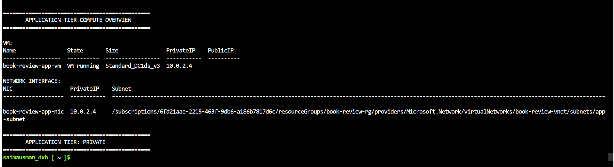

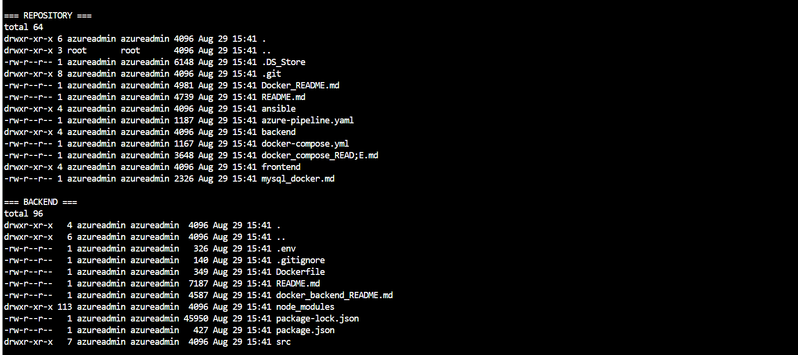

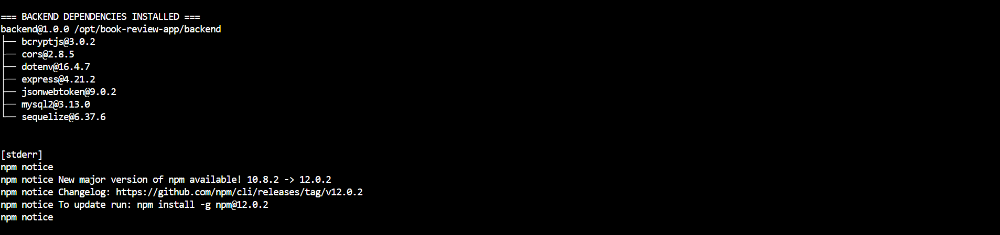


---

#### Screenshot 11 — Backend process, service, or listening-port evidence

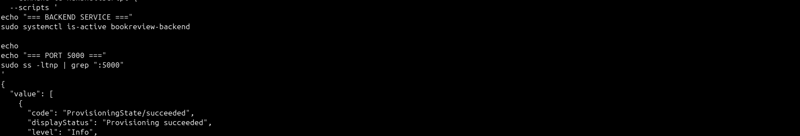

---

#### Screenshot 12 — Internal health-check or API response (without exposing secrets)

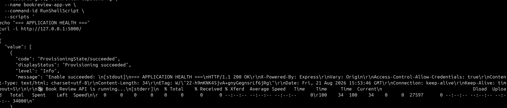


---

# Task 6 — Deploy the Managed Database Tier

## Goal

Create a private Azure managed database (public access disabled), with availability/backup/retention settings, the Book Review App schema imported, and access restricted to the application tier only.

### Evidence

#### Screenshot 13 — Database overview showing private connectivity and public access disabled

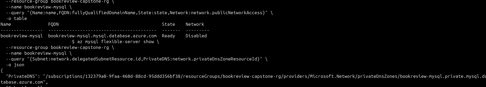

---

#### Screenshot 14 — Availability, backup, and retention configuration

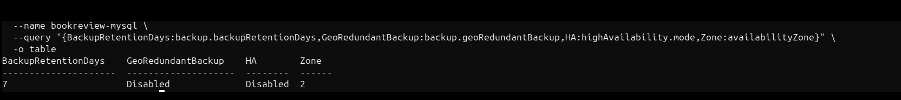

---

#### Screenshot 15 — Successful schema or connectivity verification (without exposing credentials)

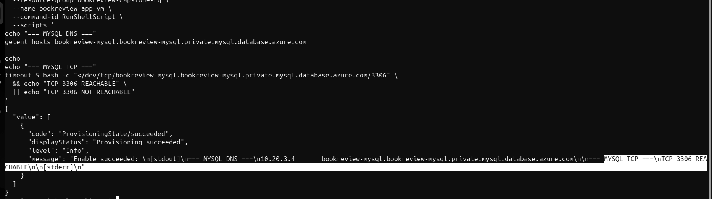


---

# Task 7 — Configure Traffic Management, Availability, and Monitoring

## Goal

Configure the approved public entry service with health probes and backend pools, internal routing for the application tier where required, and enable Azure Monitor/diagnostics/logs/alerts for the key resources.

### Evidence

#### Screenshot 16 — Public entry service showing listener, frontend endpoint, and healthy web targets

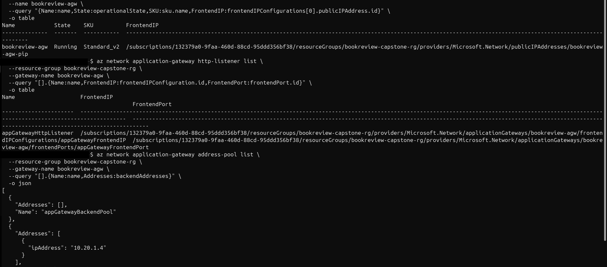

---

#### Screenshot 17 — Internal application-tier load-balancing or routing configuration where applicable

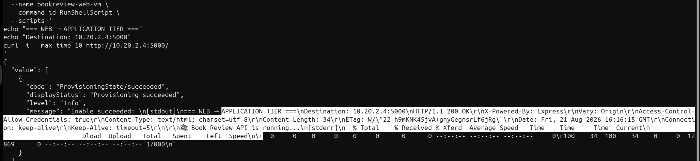

---

#### Screenshot 18 — Azure Monitor, diagnostic settings, logs, metrics, or alert evidence

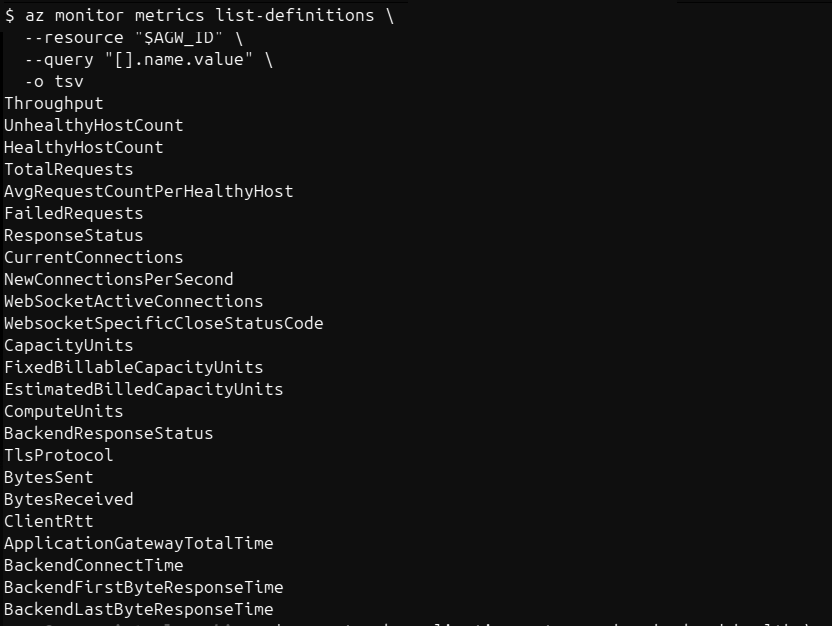

---

# Task 8 — Validate the Production-Style Deployment

## Goal

Confirm the Book Review App works end to end through the public endpoint, with at least one database read and one write, confirm private tiers are not internet-reachable, and complete a safe availability test.

### Evidence

#### Screenshot 19 — Browser showing the Book Review App through the public endpoint

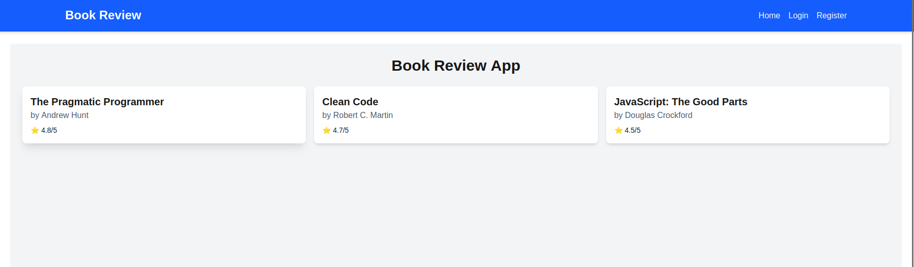

---

#### Screenshot 20 — Proof of successful database-backed read and write operations

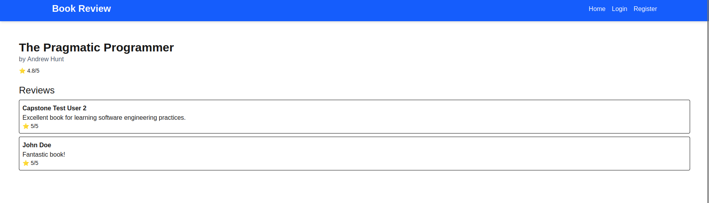

---

#### Screenshot 21 — Evidence that private tiers are not publicly accessible

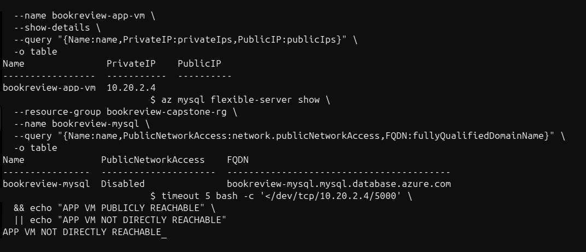
---

#### Screenshot 22 — Availability-test and healthy-target evidence

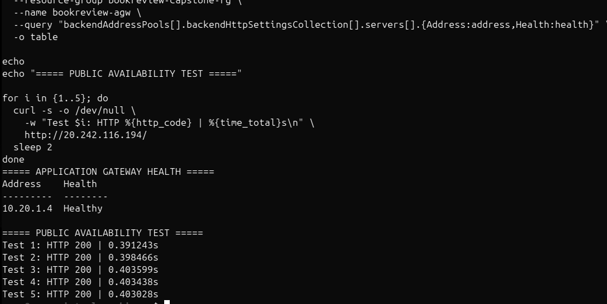

---

### Notes

Summarize what worked, issues encountered and how they were fixed, and the availability/security/secrets/monitoring/backup choices made.


### Short Summary

The Book Review application was successfully deployed on Azure using a secure three-tier architecture:

- Presentation: Next.js frontend on a private Web VM behind Nginx.
- Application: Node.js/Express backend on a private App VM.
- Database: Azure Database for MySQL Flexible Server with private connectivity and SSL.
- Application Gateway: Public entry point with a healthy backend.
- Security: Private networking, NSGs, Key Vault, JWT authentication, SSL, and no exposed secrets.
- Reliability: Managed MySQL backups/retention and Azure Monitor with an Action Group.
- Validation: Verified Web → App → MySQL communication, API/database operations, frontend access, and Application Gateway health.


### Main Challenges

Several configuration issues were resolved, including MySQL networking, CLI limitations, backend environment variables, missing JWT_SECRET, incorrect API routes, systemd configuration, frontend deployment, Next.js API paths, Application Gateway conflicts, and monitoring CLI limitations.

### Final Architecture

```
Internet
   ↓
Application Gateway
   ↓
Private Web VM
   ↓
Nginx
   ├── Next.js Frontend
   └── /api
        ↓
Private App VM
   ↓
Private Azure MySQL

```

### Final Outcome

The complete application was successfully deployed, secured, monitored, and validated end-to-end. The key lesson was that individual healthy resources aren't enough—the frontend, backend, routing, secrets, health checks, and database must all work together.

---

# Submission Instructions

- Add all required screenshots and links in your submission
- Do not expose passwords, keys, connection strings, or subscription IDs

---

# Completion Checklist

- [✔️] Task 1: Architecture diagram and assumptions documented (Screenshots 1–2)
- [✔️] Task 2: Network foundation created with isolated tiers (Screenshots 3–5)
- [✔️] Task 3: Least-privilege security and secret management configured (Screenshots 6–7)
- [✔️] Task 4: Presentation tier deployed (Screenshots 8–9)
- [✔️] Task 5: Application tier deployed privately (Screenshots 10–12)
- [✔️] Task 6: Managed database tier deployed privately (Screenshots 13–15)
- [✔️] Task 7: Public entry, internal routing, and monitoring configured (Screenshots 16–18)
- [✔️] Task 8: End-to-end validation and availability test completed (Screenshots 19–22, Public Endpoint, Notes)
- [✔️] No sensitive data exposed

---

## 📌 About DMI & CloudAdvisory

DevOps Micro Internship (DMI) is a project-based DevOps program run by Pravin Mishra (The CloudAdvisory) focused on real-world execution, systems thinking, and career readiness.

It helps learners build strong DevOps foundations with hands-on experience.

---

## 📌 Resources

- 🌐 DMI Official Website: https://dmi.pravinmishra.com?utm_source=github&utm_medium=readme  
- 🎓 University: https://university.pravinmishra.com?utm_source=github&utm_medium=readme  
- 💬 Discord Community: https://discord.pravinmishra.com?utm_source=github&utm_medium=readme  
- 📝 Blog: https://dmi.pravinmishra.com/blog?utm_source=github&utm_medium=readme  
- ▶️ YouTube Playlist: https://www.youtube.com/playlist?list=PLFeSNDtI4Cho  
- 🔗 Pravin Mishra (LinkedIn): https://www.linkedin.com/in/pravin-mishra-aws-trainer/  
- 🏢 CloudAdvisory (LinkedIn): https://www.linkedin.com/company/thecloudadvisory/

---

*This submission is part of DevOps Micro Internship (DMI) Cohort 3 — Agentic AI Track.*
