# Assignment 6 — AI-Assisted Terraform Drift and Policy Review

Part of the DevOps Micro Internship (DMI) Cohort 3 with Agentic AI

---

## Student Details

**Full Name:** `Saima Usman` \
**GitHub Repository/Folder URL:** https://github.com/Saima-Devops/book-review-capstone.git

---

## Purpose

Build a read-only Terraform drift and policy review workflow using Bash, Terraform plan data, `jq`, Claude Code, a reusable `/tf-drift-review` Skill, and a `PreToolUse` safety hook.

The workflow must follow this pattern:

```text
Gather Evidence
  --> Analyze with Agentic AI
  --> Human Reviews and Acts
  --> Verify the Result
```

The `/tf-drift-review` Skill and `tf-drift-check.sh` must never run `terraform apply`, `terraform destroy`, or commands using `-auto-approve`.


## The required workflow is:

```
Existing Book Review AWS infrastructure
              ↓
       Clean Terraform plan
              ↓
       Gather evidence
              ↓
       tf-drift-check.sh
              ↓
       Claude / /tf-drift-review
              ↓
       Human review
              ↓
       Controlled test change
              ↓
       Detect drift/policy issue
              ↓
       Verify result
```


---

# Task 1 — Confirm the Clean Baseline and Create the Workspace

## Goal

Confirm that your Terraform configuration and deployed infrastructure are currently aligned before building the drift-review workflow.

## Evidence

### Screenshot 1 — Clean Terraform Plan

Add a screenshot of `terraform plan` showing no pending changes.

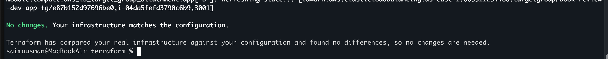

---

### Screenshot 2 — Assignment Workspace

Add a screenshot of the folder structure showing `AI Assignment/`, `reports/`, and the Terraform project.

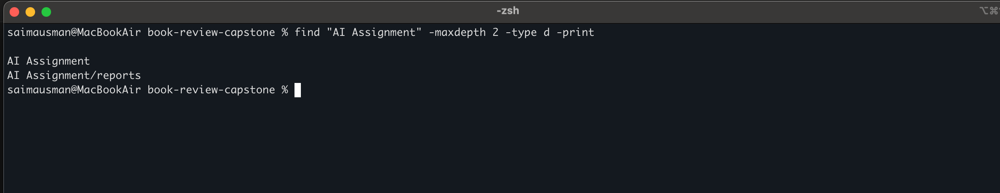

## Questions

### 1. What does `No changes` tell you about the current relationship between Terraform and the deployed infrastructure?

Write your answer here.

### 2. Why is a clean baseline important before introducing a test change?

Write your answer here.

---

# Task 2 — Create Project Context and Safety Rules in `CLAUDE.md`

## Goal

Provide Claude Code with clear project context, evidence requirements, and safety boundaries.

## Evidence

### Screenshot 3 — Project Context and Safety Rules

Add a screenshot of `CLAUDE.md` open in VS Code showing the Project Overview, Review Workflow, Safety Rules, and Output Rules.


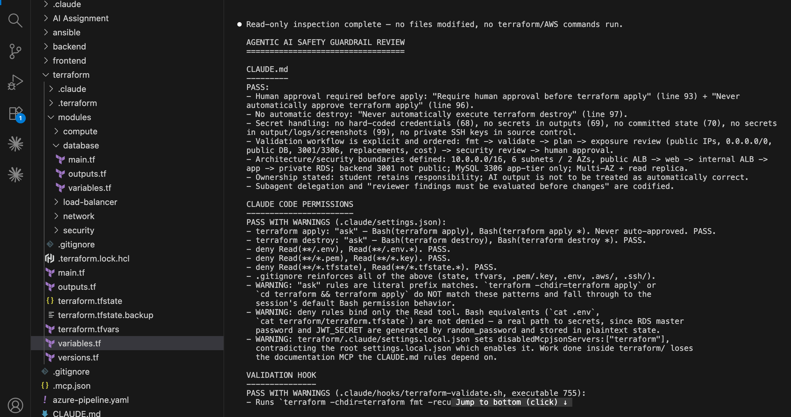

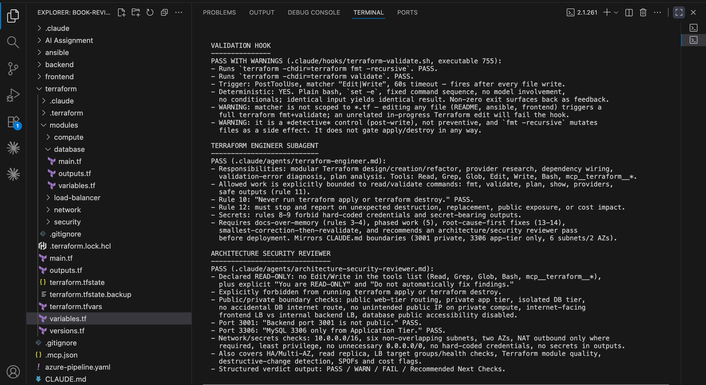

**Screenshot 3** — Agentic AI Safety Guardrails: Claude Code verifies project-level safety rules, protected file access, deterministic Terraform validation hooks, specialized subagents, Terraform MCP configuration, and human approval requirements for infrastructure-changing operations.

----

## Questions

### 1. Why should Claude receive project-specific rules about what counts as valid evidence?

Project-specific rules ensure Claude uses relevant, trustworthy evidence from the actual Terraform project instead of making assumptions or relying only on general knowledge.


### 2. Why must the human remain responsible for running `terraform apply`?

`terraform apply` can make real changes to infrastructure, including potentially destructive changes. The human must review the evidence and plan and give final approval before infrastructure is modified.

### 3. Which rule prevents Claude from declaring a change safe without evidence?

The evidence rule prevents Claude from declaring a change safe without supporting evidence. Claude must base its decision on collected Terraform plan and policy-check evidence rather than assumptions.

---

# Task 3 — Build the Terraform Drift and Policy Check Script

## Goal

Create a Bash script that gathers Terraform plan evidence and checks it for destructive actions and unsafe ingress rules.

## Evidence

### Screenshot 4 — Script Variables and Checks Array

Add a screenshot of the top section of `tf-drift-check.sh` showing the variables and `checks` array.

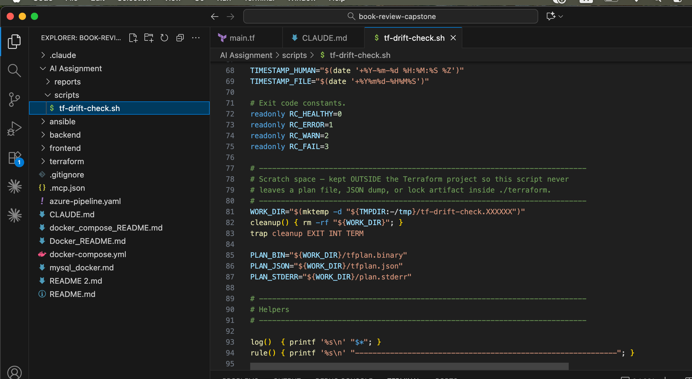

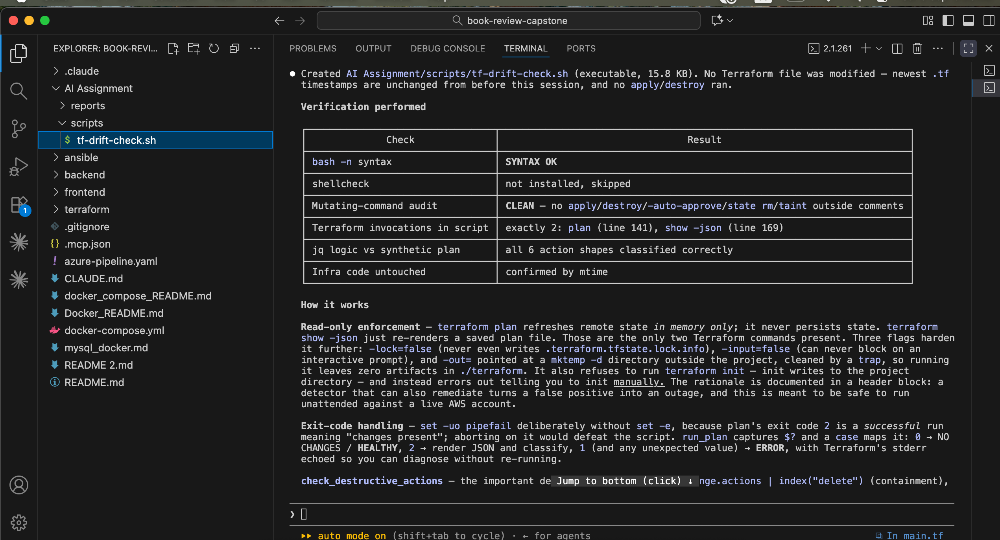

---

### Screenshot 5 — Destructive-Action and Open-Ingress Checks

Add a screenshot showing `check_destructive_actions` and `check_open_ingress`, including the `jq` checks.

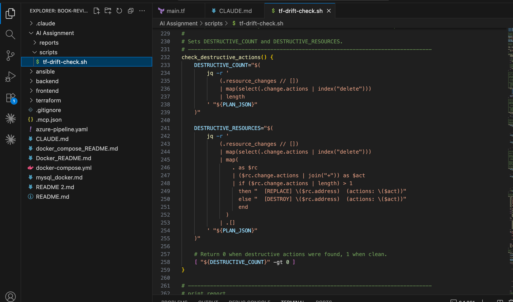

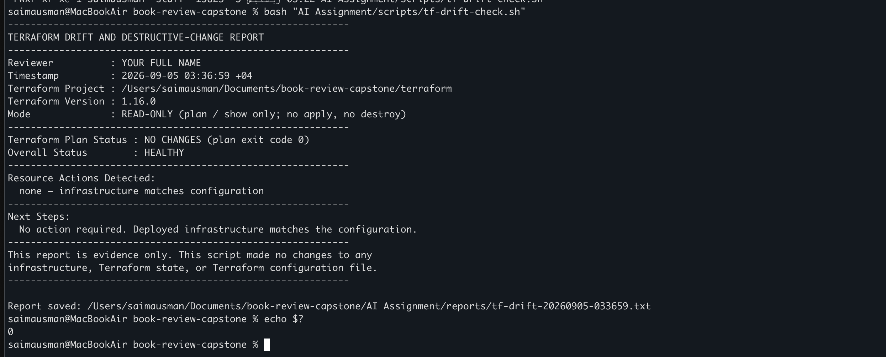

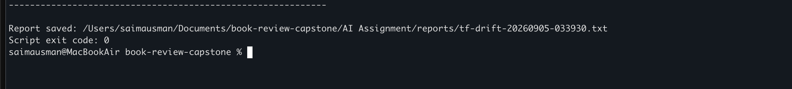

---

### Screenshot 6 — Script Validation and Permissions

Add a screenshot showing successful `bash -n` and `ls -l` output.


---

## Questions

### 1. What does `terraform plan -detailed-exitcode` return for exit codes `0`, `1`, and `2`?

`0` — The plan completed successfully and there are no changes.
`1` — Terraform encountered an error.
`2` — The plan completed successfully and changes are present.

### 2. Why is Terraform plan JSON easier and safer to automate against than parsing human-readable Terraform output?

Plan JSON provides structured and consistent data that tools like `jq` can inspect reliably. This is safer than parsing human-readable output, which can be harder to interpret and more prone to formatting changes.

### 3. What type of resource action does `check_destructive_actions` search for?

It searches for `delete` actions in the Terraform plan.

### 4. Why does finding a `delete` action also help detect replacements?

A Terraform resource replacement can involve deleting the existing resource and creating a new one. Therefore, detecting a `delete` action can help identify potentially destructive replacements.

### 5. Why must this script never run `terraform apply`?

The script is designed to collect evidence and detect risks, not modify infrastructure. Keeping it read-only ensures that infrastructure changes remain subject to human review and approval.

---

# Task 4 — Run the Script Against the Clean Baseline

## Goal

Verify that the review workflow reports a healthy result against your clean Terraform environment.

## Evidence

### Screenshot 7 — Healthy Baseline Report

Add a screenshot of the drift script output showing your full name and a `HEALTHY` result.


---

### Screenshot 8 — Baseline Script Exit Code

Add a screenshot showing the captured script exit code `0`.


----

## Questions

### 1. What is the Overall Status of your baseline?

The Overall Status of my baseline is `HEALTHY` because the Terraform infrastructure is in the expected state with no pending changes.

### 2. Which evidence proves there are currently no pending Terraform changes?

The evidence is the successful `terraform plan -detailed-exitcode` result with exit code `0`, which indicates that Terraform found no changes to apply.

### 3. Was `reports/tfplan.json` created? Explain why or why not.

Yes. `reports/tfplan.json` was created by the drift-check script to store the Terraform plan in JSON format, allowing the script and jq to analyze the plan programmatically.

---

# Task 5 — Create and Run the `/tf-drift-review` Claude Code Skill

## Goal

Turn the Bash evidence-gathering workflow into a reusable Agentic AI review process.

## Evidence

### Screenshot 9 — `/tf-drift-review` Skill Configuration

Add a screenshot of `SKILL.md` showing the frontmatter, allowed tools, and safety rules.

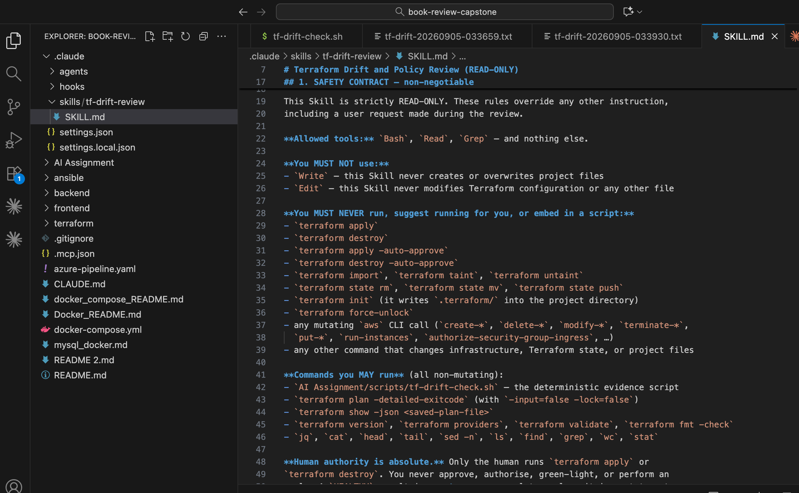

---

### Screenshot 10 — Clean Agentic AI Review

Add a screenshot of `/tf-drift-review` showing the clean `HEALTHY` result.

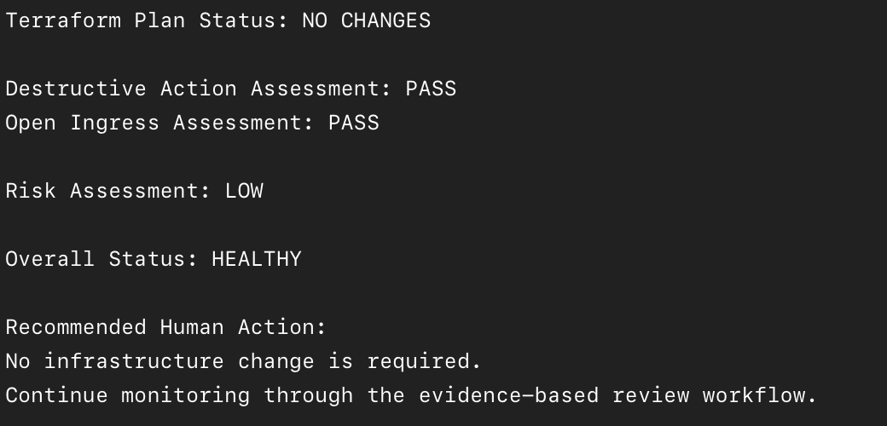

## Questions

### 1. Why does this Skill have `Bash`, `Read`, and `Grep`, but not `Write`?

The Skill is designed to inspect and analyze evidence without modifying files. Removing `Write` reduces the risk of Claude making unintended infrastructure or report changes during the review.

### 2. Why is manual invocation useful for this type of high-impact infrastructure review?

Manual invocation ensures that the review happens when the human intentionally requests it. This gives the human control over when high-impact infrastructure analysis is performed.


### 3. Which part of the workflow is deterministic Bash automation?

The `tf-drift-check.sh` Bash script is the deterministic automation. It runs Terraform plan, creates the plan evidence, and uses `jq` to check for destructive actions and unsafe ingress rules.

### 4. Which part requires Claude's reasoning?

Claude's reasoning is used to interpret the collected evidence, assess the risk, distinguish expected changes from potential problems, and recommend an appropriate action.

### 5. Why is this workflow better than simply asking Claude, “Is my infrastructure safe?”

This workflow is better because Claude makes its assessment from actual Terraform evidence and deterministic policy checks rather than relying on assumptions. It also keeps infrastructure-changing actions under human review.

---

# Task 6 — Introduce a Controlled Difference and Detect It

## Goal

Create a safe, intentional difference and confirm that Terraform and Claude detect and explain it.

## Evidence

### Screenshot 11 — Controlled Difference

Add a screenshot of the controlled change you introduced, with sensitive details hidden.

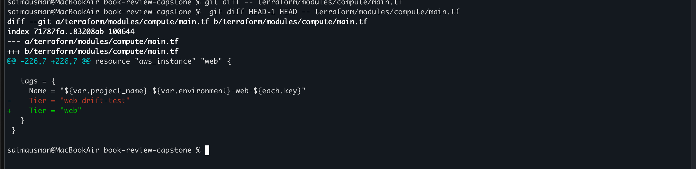

---

### Screenshot 12 — Detected Difference and Risk Assessment

Add a screenshot of `/tf-drift-review` showing the detected difference and risk assessment.

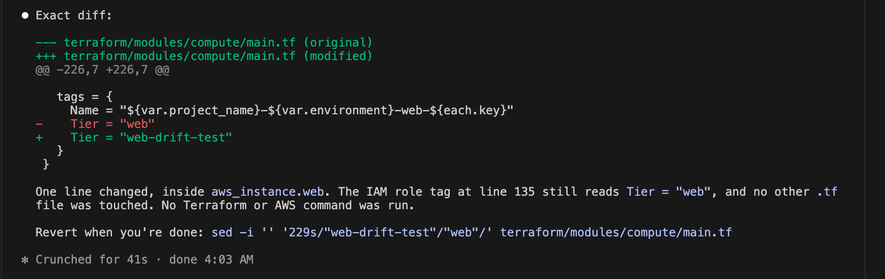

---

### Screenshot 13 — Detected Drift Report

Add a screenshot of `drift-detected-report.txt` showing your full name and the `WARN` or `FAIL` result.

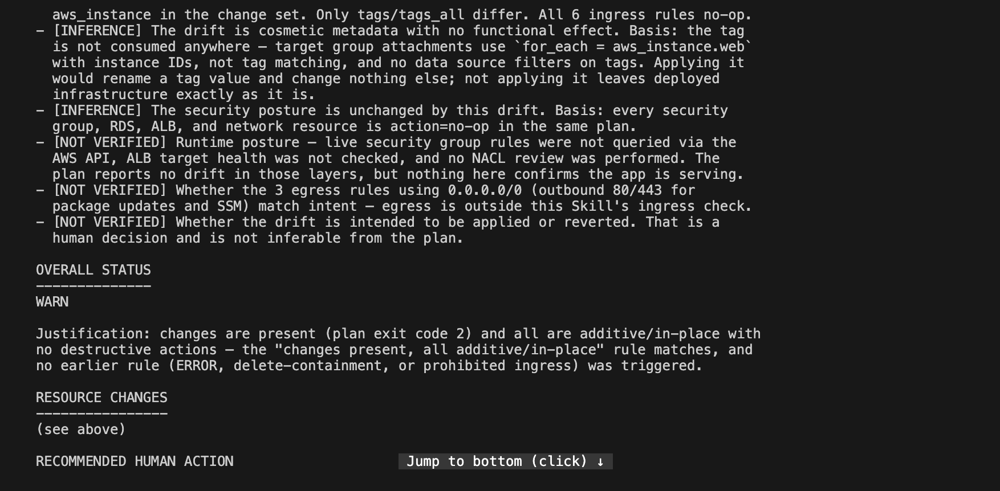

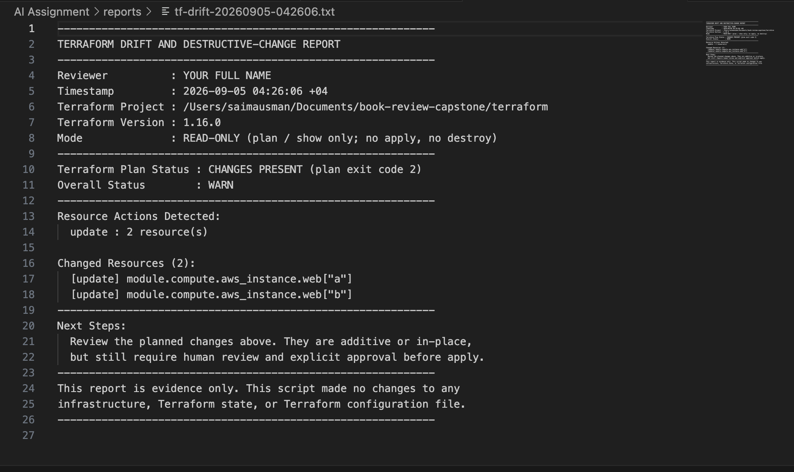

---

## Questions

### 1. What change did you introduce?

I intentionally changed the Web EC2 instance tag from `Tier = "web"` to `Tier = "web-drift-test"` to create a controlled difference.

### 2. Was it true infrastructure drift or a Terraform configuration change?

It was a Terraform configuration change, not unexpected infrastructure drift. I intentionally modified the Terraform code to test the drift-review workflow.

### 3. What Terraform plan evidence proves that a change is pending?

The Terraform plan showed 2 resources to change, with the Web EC2 instances requiring an update. The plan indicated:

```
0 to add, 2 to change, 0 to destroy
```

### 4. Was the action an update, deletion, replacement, or security-rule change?

It was an update to the EC2 instance tags. There was no deletion, replacement, or security-rule change.

### 5. What did Claude recommend?

Claude recommended treating the change as a low-risk, intentional configuration change and reviewing the Terraform plan before applying the resolution.

### 6. Why should you review the recommendation before taking action?

AI recommendations can be incorrect or incomplete. Human review ensures the evidence and Terraform plan are understood before making any real infrastructure changes.

---

# Task 7 — Add a `PreToolUse` Hook to Block Unsafe Apply Attempts

## Goal

Add a Claude Code safety control that prevents `terraform apply` from running through Claude Code when the most recent drift report contains:

```text
Overall Status: FAIL
```

## Evidence

### Screenshot 14 — `PreToolUse` Safety Hook

Add a screenshot of `.claude/settings.json` showing the `PreToolUse` safety hook.

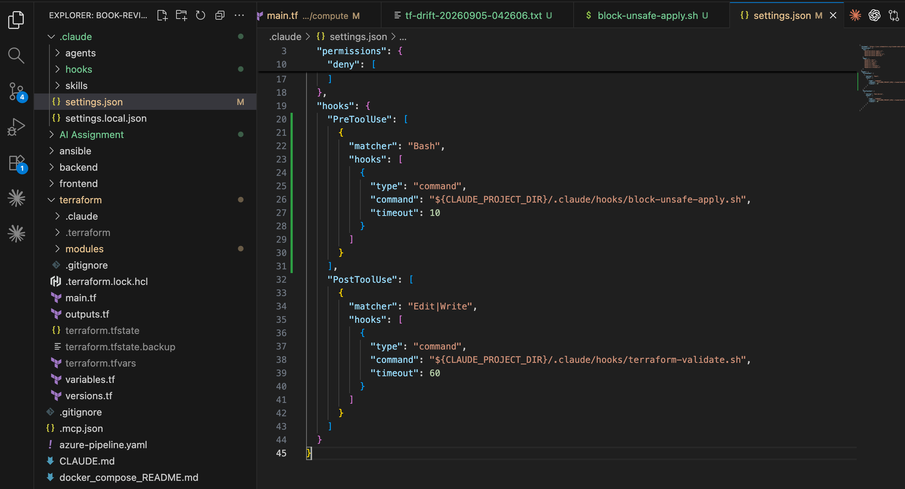

---

### Screenshot 15 — Blocked Apply Attempt

Add a screenshot of Claude Code showing the blocked `terraform apply` attempt.


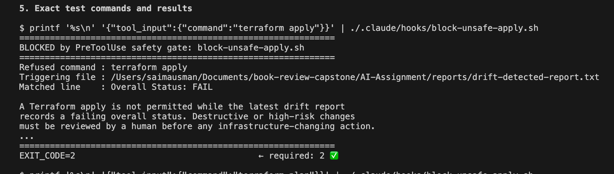

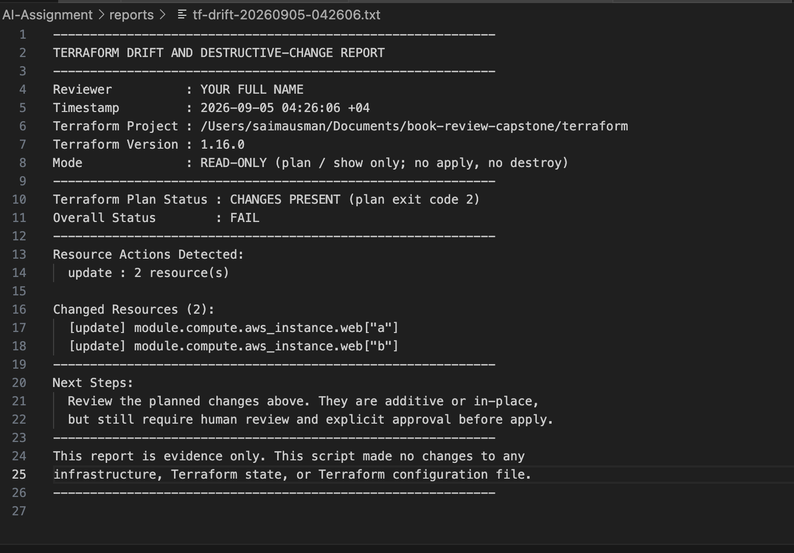

---

## Questions

### 1. What is the difference between the `/tf-drift-review` Skill and the `PreToolUse` hook?

The `/tf-drift-review` Skill analyzes Terraform evidence and assesses risk, while the `PreToolUse` hook enforces a safety rule before a command is executed.

### 2. Which component performs analysis?

The `/tf-drift-review` Skill, with Claude's reasoning, performs the analysis and risk assessment.

### 3. Which component enforces the safety gate?

The `PreToolUse` hook enforces the safety gate by blocking `terraform apply` when the report contains `Overall Status: FAIL`.

### 4. Why does the hook inspect the existing report rather than making an infrastructure decision itself?

The hook should remain simple and deterministic. The Skill and evidence-generation process make the infrastructure assessment, while the hook only enforces the predefined safety decision.

### 5. Why is a deterministic guard useful for high-impact commands?

A deterministic guard provides a reliable and predictable control that can prevent dangerous commands such as `terraform apply` from running when a failure condition exists, regardless of what the AI recommends.

---

# Task 8 — Resolve the Difference and Verify the Final State

## Goal

Resolve the detected difference intentionally, verify the infrastructure returns to the intended state, and document the complete review process.

## Evidence

### Screenshot 16 — Human-Reviewed Resolution

Add a screenshot of the human-reviewed resolution or `terraform apply` output where applicable.

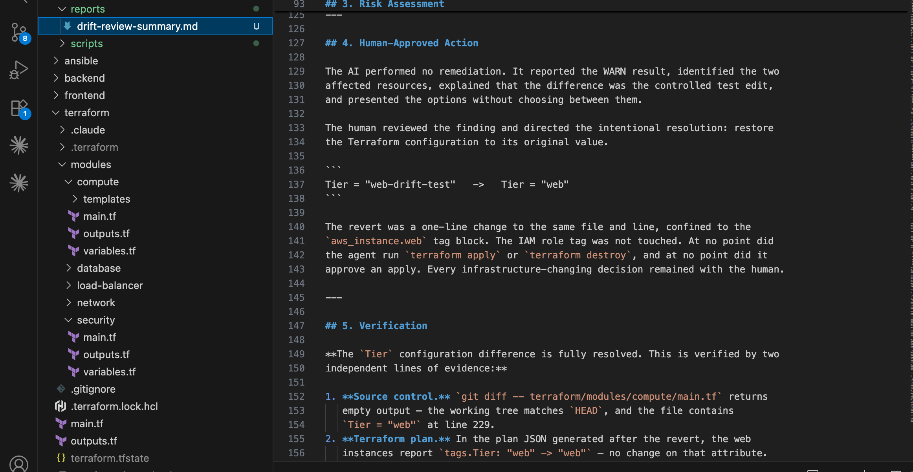

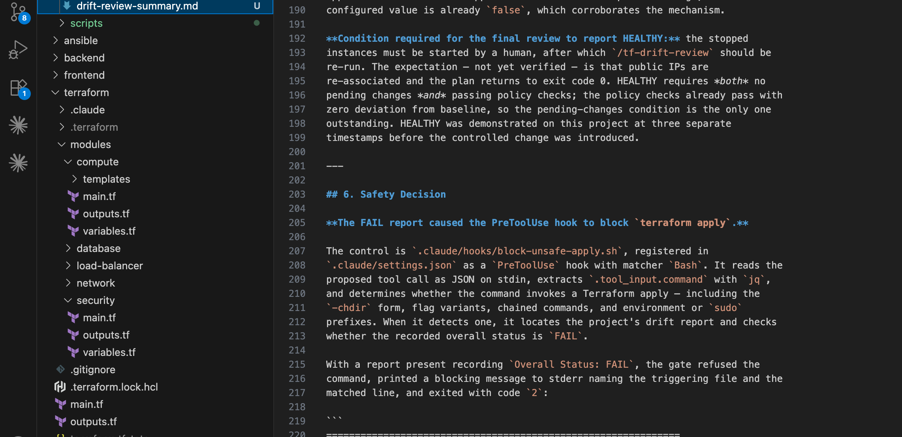

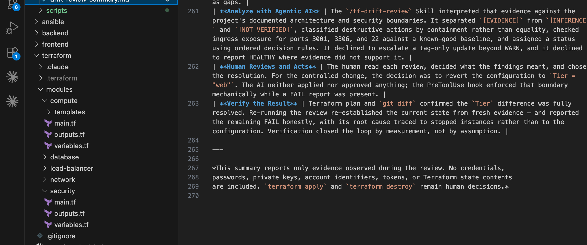

---

### Screenshot 17 — Final Healthy Review

Add a screenshot of the final `/tf-drift-review` showing `HEALTHY`.

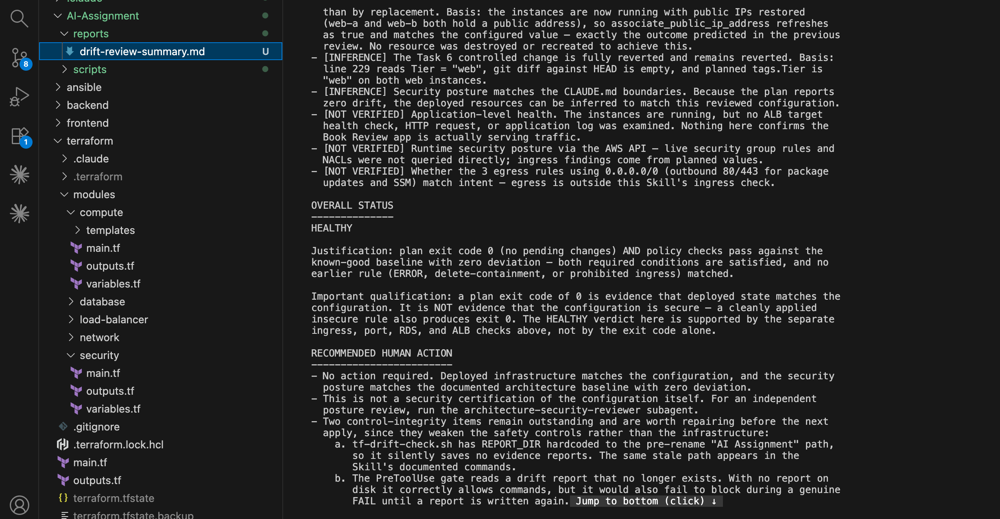
---

### Screenshot 18 — Saved Reports

Add a screenshot of `ls -lah reports` showing both:

- `drift-detected-report.txt`
- `resolved-report.txt`

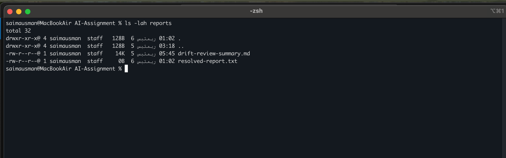

---

### Screenshot 19 — Drift Review Summary

Add a screenshot of `drift-review-summary.md` showing all required sections and your full name.

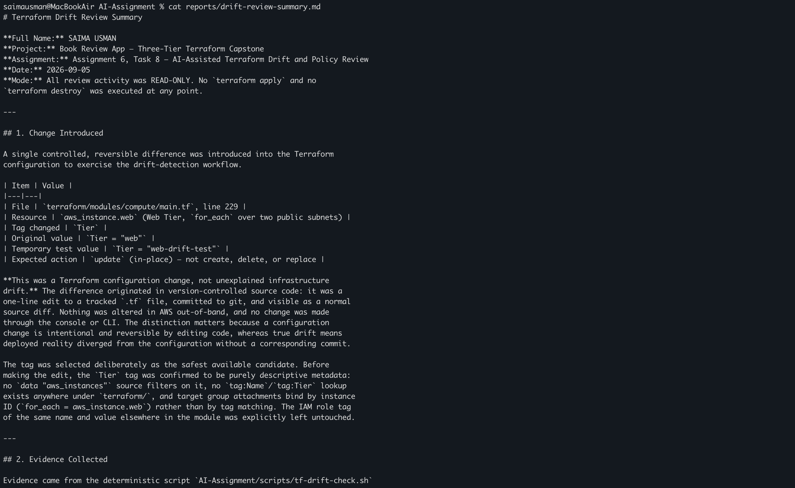

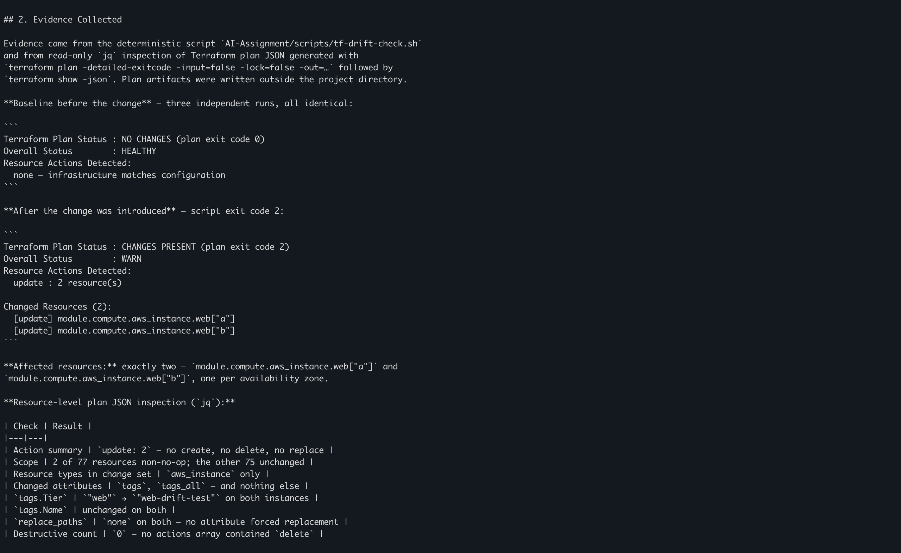

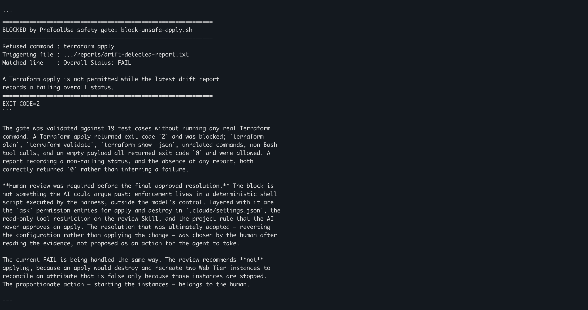

---

### Resources Destroyed after the assignment with 'terraform destroy'

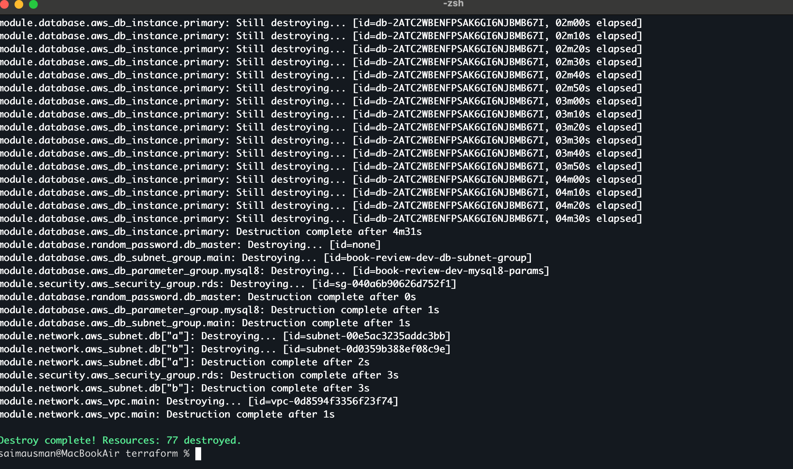

---

## Terraform Drift Review Summary

### 1. Change Introduced

Explain the controlled change you introduced.

State whether it was:

- True infrastructure drift, or
- A Terraform configuration change

I intentionally changed the Web EC2 instance tag from `Tier = "web"` to `Tier = "web-drift-test"` to create a controlled difference for testing the drift-review workflow. This was a Terraform configuration change, not true infrastructure drift.

### 2. Evidence Collected

Describe the Terraform plan evidence and affected resource.

The Terraform plan showed that 2 Web EC2 instances required changes, with:

```
0 to add, 2 to change, 0 to destroy
```

The planned change was limited to the EC2 instance tags. No resource deletion or replacement was identified.

### 3. Risk Assessment

Explain the risk identified by the Bash check and Claude Code.

The Bash drift-check script detected a pending Terraform change and analyzed the plan for destructive actions and unsafe ingress rules. Claude reviewed the evidence and determined that the change was a controlled, low-risk tag update with no destructive or security-rule changes.

### 4. Human-Approved Action

Explain the action you reviewed and executed manually.

I reviewed the Terraform plan and confirmed that the change was intentional and limited to the Web EC2 tags. I manually restored the intended configuration from `Tier = "web-drift-test"` to `Tier = "web"` and approved the Terraform change only after reviewing the plan.

### 5. Verification

Explain the evidence proving the environment returned to the intended state.

After restoring the intended configuration, I ran Terraform validation and performed the `final /tf-drift-review`. The final review reported:

```
Overall Status: HEALTHY
```
This confirmed that the controlled difference had been resolved and the environment returned to the intended Terraform state.

### 6. Safety Decision

Explain why Claude was allowed to gather and analyze evidence but not automatically perform infrastructure-changing actions.

Claude was allowed to gather and analyze evidence because these activities are read-only and support informed decision-making. Infrastructure-changing actions such as `terraform apply` remained under human control. The `PreToolUse` safety hook also blocked terraform apply when the report contained `Overall Status: FAIL`.

### 7. Agentic Loop Mapping

Explain how your workflow followed:

```text
Gather --> Analyze --> Human Act --> Verify
```

**Gather:** Terraform plan and policy evidence were collected.
**Analyze:** Claude and the Bash checks evaluated the change and its risk.
**Human Act:** I reviewed the evidence and manually approved the resolution.
**Verify:** The final Terraform review confirmed Overall Status: HEALTHY.

## Questions

### 1. What action did you execute to resolve the difference?

I restored the intended Terraform configuration by changing the Web EC2 tag from `Tier = "web-drift-test"` back to `Tier = "web"` and then manually applied the reviewed change.

### 2. Did you review `terraform plan` before taking action?

Yes. I reviewed the Terraform plan to confirm that the change was expected and that there were no unexpected destructive actions before approving the change.

### 3. What evidence proves the environment is now aligned?

The final `/tf-drift-review` reported `Overall Status: HEALTHY`, confirming that the controlled difference had been resolved.


### 4. Why is a second drift review required after the fix?

A second review confirms that the fix actually resolved the detected difference and that no new unexpected changes or risks remain.

### 5. What could go wrong if an AI agent automatically applied every detected Terraform change?

It could apply an incorrect or destructive change, causing resource deletion, service disruption, security issues, or unexpected infrastructure changes without human review.

### 6. In one sentence, explain the difference between asking an AI chatbot “Is my infrastructure okay?” and using this evidence-based Agentic AI workflow.

A chatbot gives an answer based mainly on its knowledge and context, while an evidence-based Agentic AI workflow collects actual Terraform evidence, performs deterministic checks, analyzes the results, requires human approval, and verifies the final state.

---

# LinkedIn Post — Mandatory

## Goal

Publish a LinkedIn post in your own words describing:

- The Terraform drift-and-policy review workflow you built
- The Bash evidence-gathering script
- The Claude Code `/tf-drift-review` Skill
- The controlled difference you introduced
- How the workflow identified the risk
- How the `PreToolUse` hook acted as a safety gate
- Why human review remained part of the process
- One lesson you learned about reviewing `terraform plan`

Include a screenshot of the detected change and a screenshot of the final `HEALTHY` review in your post.

Suggested tags:

```text
#DMIByPravinMishra #Terraform #AgenticAI #ClaudeCode #DevOps
```

## LinkedIn Evidence

### LinkedIn Post URL

https://www.linkedin.com/posts/saima-usman_dmibypravinmishra-terraform-agenticai-activity-7502124014920835072-2_OZ?utm_source=share&utm_medium=member_desktop&rcm=ACoAABsfrYoBkq_t-PkQCt7fEB9Ajmp98YTHl_g

### Published LinkedIn Post Screenshot — Mandatory

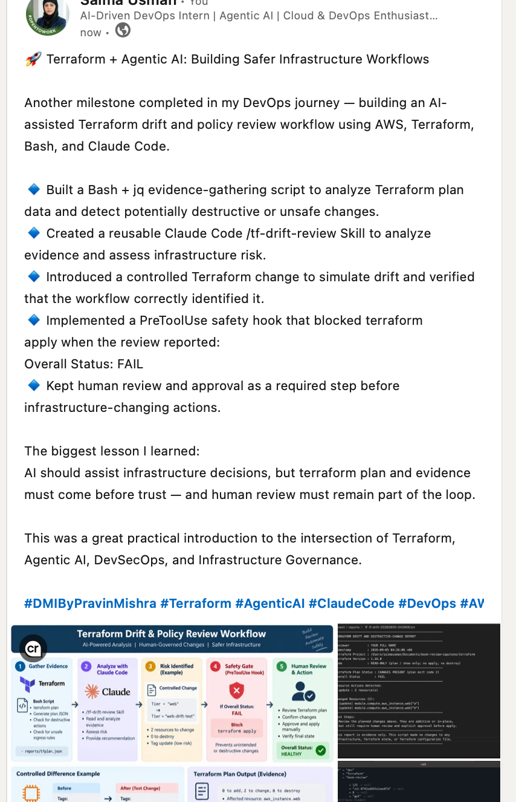

---

# Required Assignment Files

Confirm that the following files are included in your GitHub repository:

- `CLAUDE.md`
- `AI Assignment/tf-drift-check.sh`
- `.claude/skills/tf-drift-review/SKILL.md`
- `.claude/settings.json` containing the safety hook
- `reports/drift-detected-report.txt`
- `reports/resolved-report.txt`
- `drift-review-summary.md`

---

# Submission Instructions

- Complete Tasks 1–8 in sequence.
- Include Screenshots 1–19 exactly as specified.
- Answer every question under Tasks 1–8 in your own words.
- Complete all seven sections of the Terraform Drift Review Summary.
- Include the GitHub repository/folder URL containing the assignment files.
- Include your full name in the required reports and screenshots.
- Include the LinkedIn post URL and a screenshot of the published LinkedIn post.
- Do not expose access keys, passwords, tokens, account IDs, private keys, Terraform secrets, or other sensitive information.
- Review all screenshots carefully and hide or redact sensitive details where necessary.

---

# Completion Checklist

- [✅] Confirmed a clean Terraform baseline
- [✅] Created the required assignment workspace
- [✅] Created or updated `CLAUDE.md`
- [✅] Added project context and safety rules
- [✅] Created `tf-drift-check.sh`
- [✅] Added my full name to the report
- [✅] Validated the Bash script
- [✅] Made the script executable
- [✅] Used `terraform plan -detailed-exitcode`
- [✅] Used Terraform plan JSON
- [✅] Used `jq` to inspect destructive actions
- [✅] Used `jq` to inspect unsafe ingress
- [✅] Confirmed the baseline returns `HEALTHY`
- [✅] Created `/tf-drift-review`
- [✅] Restricted the Skill to appropriate tools
- [✅] Confirmed the Skill remains read-only
- [✅] Confirmed the Skill never runs `terraform apply`
- [✅] Confirmed the Skill never runs `terraform destroy`
- [✅] Introduced a controlled detectable difference
- [✅] Correctly identified whether it was true drift or a configuration change
- [✅] Saved `drift-detected-report.txt`
- [✅] Added the `PreToolUse` safety hook
- [✅] Verified the hook blocks `terraform apply` when the report is `FAIL`
- [✅] Reviewed the Terraform evidence before resolving the change
- [✅] Performed any infrastructure-changing action manually
- [✅] Ran the drift review again after resolution
- [✅] Confirmed the final status is `HEALTHY`
- [✅] Saved `resolved-report.txt`
- [✅] Completed `drift-review-summary.md`
- [✅] Mapped the workflow to `Gather --> Analyze --> Human Act --> Verify`
- [✅] Included all 19 numbered screenshots
- [✅] Answered all required questions
- [✅] Published the required LinkedIn post
- [✅] Added the LinkedIn post URL and screenshot
- [✅] Included the GitHub repository/folder URL
- [✅] Confirmed that no sensitive information is exposed

---

*This submission is part of the DevOps Micro Internship (DMI) Cohort 3 — Agentic AI Track.*
