# Assignment 1 — Onboarding: Workstation Setup, Standards & AI (Go Beyond)

Part of the DevOps Micro Internship (DMI) Cohort 3 with Agentic AI

---

## Purpose

In this assignment, you will set up a production-ready Ansible development workstation following real-world team standards: an isolated Python environment, VS Code tooling, SSH readiness, Git hygiene, pre-commit hooks, and reproducible onboarding documentation.

---

# Task 1 — Environment & Ansible Install

## Goal

Create and activate an isolated `.venv` inside `ansible-onboarding/`, install `ansible`, `ansible-lint`, and `yamllint`, and save dependencies to `requirements.txt`.

### Evidence

#### Screenshot 1 — Terminal showing the activated `.venv` and successful `ansible --version` output

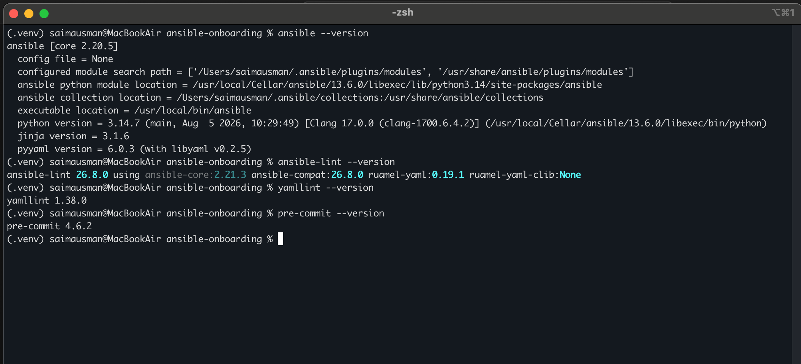
---

#### Screenshot 2 — Terminal showing successful `ansible-lint --version` output and `requirements.txt`

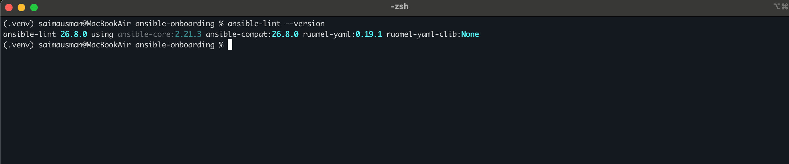

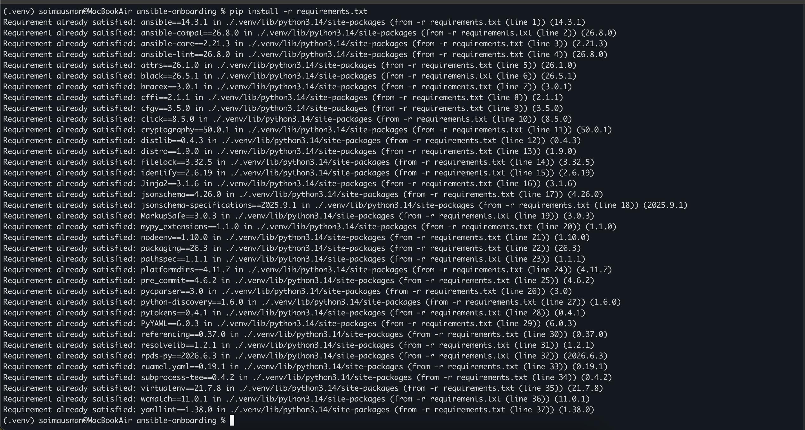

---

# Task 2 — VS Code Setup (Tooling That Teams Expect)

## Goal

Install the Ansible, YAML, and Python VS Code extensions, and create `.vscode/settings.json` and `.editorconfig` with the team-standard settings.

### Evidence

#### Screenshot 3 — VS Code Extensions panel showing Ansible, YAML, and Python installed

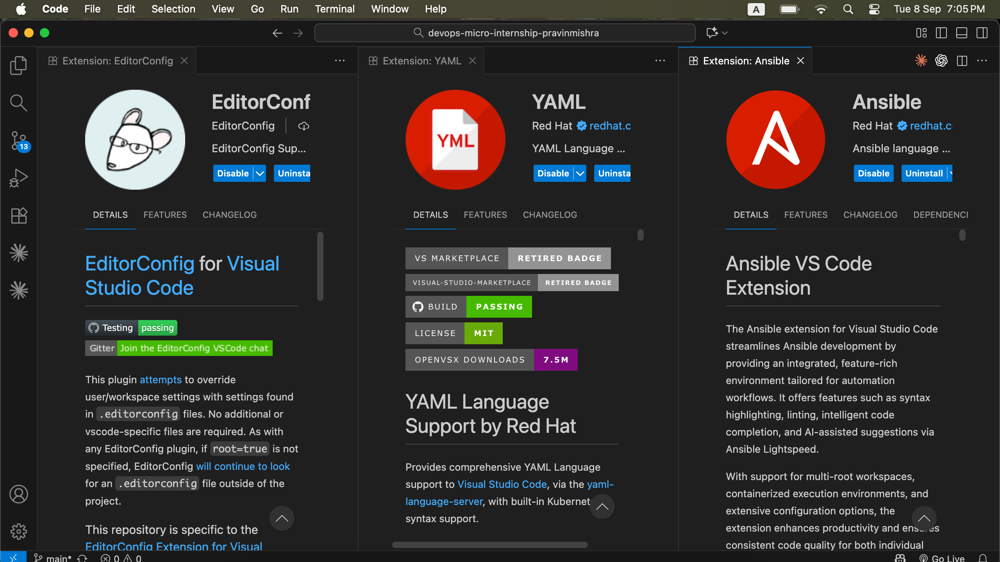

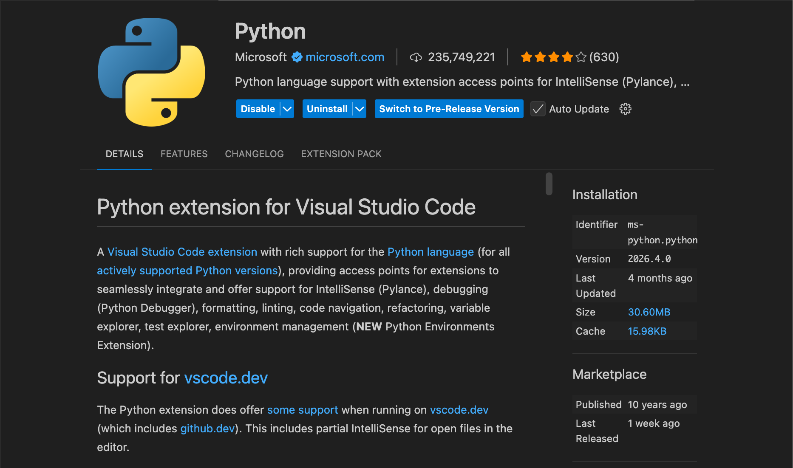

---

#### Screenshot 4 — VS Code showing `.vscode/settings.json` and `.editorconfig`

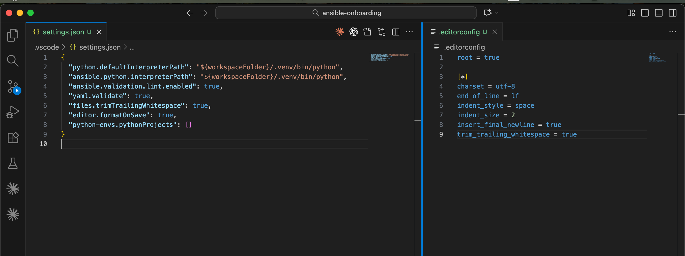

---

# Task 3 — Baseline ansible.cfg (Team-Friendly Defaults)

## Goal

Create `ansible.cfg` in the project root with the team-friendly defaults and SSH connection settings, and confirm Ansible reads it.

### Evidence

#### Screenshot 5 — VS Code or terminal showing `ansible.cfg` in the project root with the supplied settings

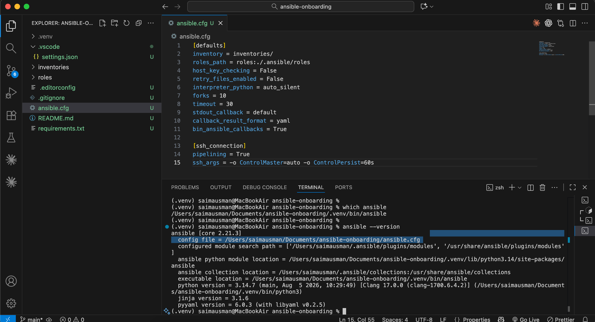

---

# Task 4 — SSH Readiness (Enterprise Basics)

## Goal

Generate or use an Ed25519 SSH key, load it into `ssh-agent`, and configure `~/.ssh/config` with safe defaults.

### Evidence

#### Screenshot 6 — Terminal showing `ssh-add -l` with the key loaded (do not expose private-key contents)

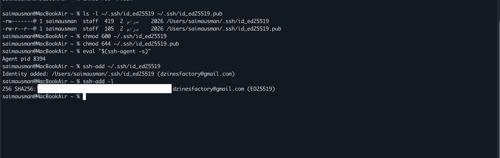

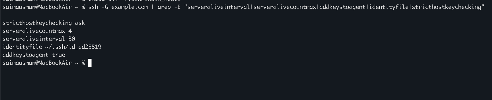

---

# Task 5 — Git Identity, Signing & Hooks

## Goal

Configure Git identity and the `main` default branch, install `pre-commit`, add `.pre-commit-config.yaml` with `yamllint` and `ansible-lint` hooks, and run the hooks as a smoke test.

### Evidence

#### Screenshot 7 — Terminal showing `pre-commit install` output

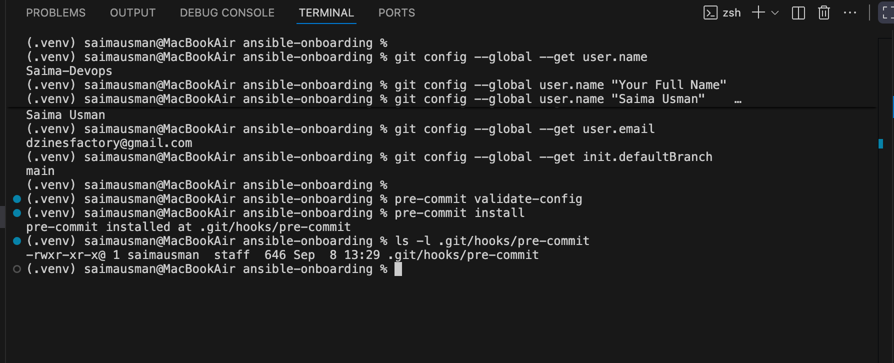

---

#### Screenshot 8 — Terminal showing `pre-commit run --all-files` passing

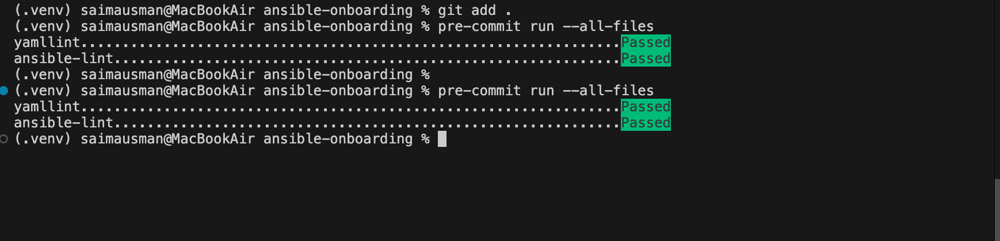

---

# Task 6 — README + Checklist

## Goal

Document the workstation setup in `README.md`, including a "New Machine? Do This" checklist with 10–12 bullet points.

### Evidence

#### Screenshot 9 — Repository tree showing the required files

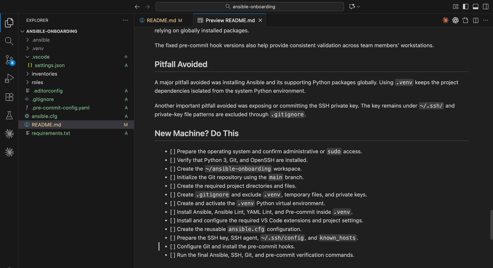

---

#### Screenshot 10 — `README.md` showing machine details and the "New Machine? Do This" checklist

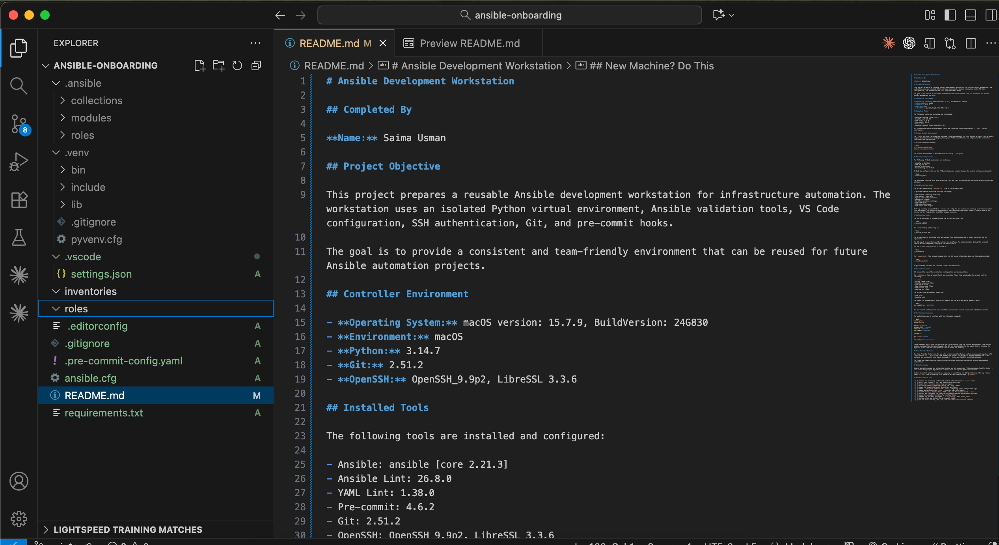

---

### Notes

State one thing that makes this setup team-friendly, and one pitfall you avoided (e.g. global pip, missing SSH agent). Note any corporate proxy or CA certificate steps, if applicable.

#### Team-Friendly Feature

One team-friendly feature is the use of a project-specific Python virtual environment (`.venv`) and `requirements.txt`. This keeps Ansible and its supporting tools isolated and makes it easier for another team member to reproduce the same development environment.

#### Pitfall Avoided

I avoided installing Ansible and its dependencies globally with `pip`. Instead, they were installed inside the `.venv` virtual environment. I also ensured that the SSH private key remains outside the project and that the SSH agent is configured to load the key securely.

#### Corporate Proxy / CA Certificate

No corporate proxy or custom CA certificate configuration was required for this setup.

---

### Write Answers for the follwing Questions

1. **What is one feature that makes your workstation setup team-friendly?**

The project uses a Python virtual environment and a `requirements.txt` file to keep dependencies isolated and reproducible. Fixed pre-commit hook versions also provide consistent validation across team members' workstations.

2. **What is one pitfall you avoided while completing the setup?**

I avoided installing Ansible globally by installing Ansible and the supporting tools inside the project-specific `.venv` virtual environment. I also avoided exposing or committing my SSH private key.

3. **Why should Ansible be installed inside a Python virtual environment?**

Installing Ansible inside a Python virtual environment isolates its dependencies from the system Python installation. This reduces dependency conflicts and makes the Ansible development environment easier to reproduce and maintain.

4. **Why must SSH private keys and .venv/ remain outside version control?**

SSH private keys are sensitive credentials and committing them could allow unauthorized access to systems. The `.venv/` directory contains locally installed Python packages and environment-specific files, so it should not be committed; dependencies can instead be reproduced using `requirements.txt`.

---

# Submission Instructions

- Add all required screenshots in your submission
- Do not commit the `.venv` directory, SSH private keys, passwords, tokens, or other secrets

---

# Completion Checklist

- [✅] Task 1: Isolated environment created, Ansible and lint tools installed (Screenshots 1–2)
- [✅] Task 2: VS Code extensions and workspace settings configured (Screenshots 3–4)
- [✅] Task 3: `ansible.cfg` created with team defaults (Screenshot 5)
- [✅] Task 4: SSH key generated and loaded into agent (Screenshot 6)
- [✅] Task 5: Git identity configured and pre-commit hooks passing (Screenshots 7–8)
- [✅] Task 6: README and checklist completed (Screenshots 9–10)
- [✅] Team-friendly choice / pitfall notes written (Notes)
- [✅] No private keys or secrets exposed

---

## 📌 About DMI & CloudAdvisory

DevOps Micro Internship (DMI) is a project-based DevOps program run by Pravin Mishra (The CloudAdvisory) focused on real-world execution, systems thinking, and career readiness.

It helps learners build strong DevOps foundations with hands-on experience.

---

## 📌 Resources

- 🌐 DMI Official Website: https://dmi.pravinmishra.com?utm_source=github&utm_medium=readme  
- 🎓 University: https://university.pravinmishra.com?utm_source=github&utm_medium=readme  
- 💬 Discord Community: https://discord.pravinmishra.com?utm_source=github&utm_medium=readme  
- 📝 Blog: https://dmi.pravinmishra.com/blog?utm_source=github&utm_medium=readme  
- ▶️ YouTube Playlist: https://www.youtube.com/playlist?list=PLFeSNDtI4Cho  
- 🔗 Pravin Mishra (LinkedIn): https://www.linkedin.com/in/pravin-mishra-aws-trainer/  
- 🏢 CloudAdvisory (LinkedIn): https://www.linkedin.com/company/thecloudadvisory/

---

*This submission is part of DevOps Micro Internship (DMI) Cohort 3 — Agentic AI Track.*
