# Assignment 2 — Ad-Hoc Automation on Azure: 4 VMs, Inventory & Passwordless SSH

Part of the DevOps Micro Internship (DMI) Cohort 3 with Agentic AI

---

## Purpose

In this assignment, you will provision three/four Azure Linux VMs with Terraform, configure passwordless SSH, build a custom Ansible inventory with web/app/db groups, and run ad-hoc commands across individual hosts and groups.

---

# Task 1 — Provision 2 AWS VMs (Terraform)

## Goal

Provision three Ubuntu 22.04 VMs (`web1`, `app1`, Standard_B1s/Standard_D2als_v7) with SSH key authentication and public IPs, in a VNet with an NSG allowing SSH (22) and HTTP (80), and output all three public IPs.

### Evidence

#### Screenshot 1 — Terminal showing successful `terraform apply` output and `terraform output public_ips`

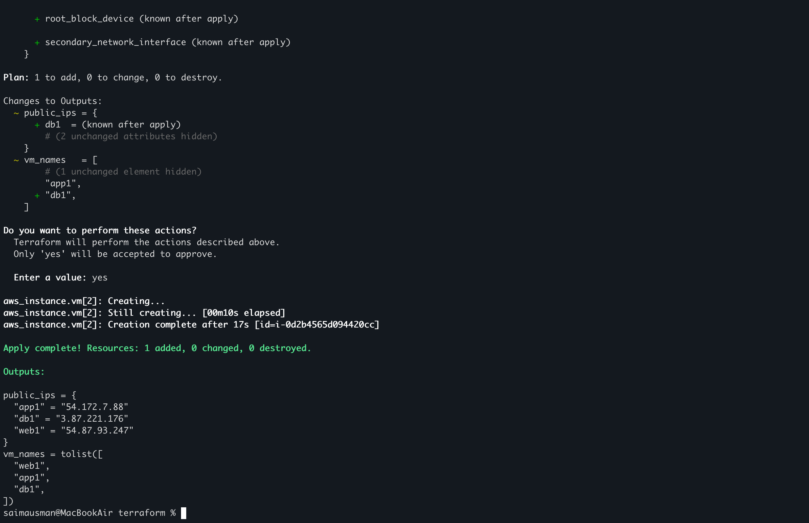

---

#### Screenshot 2 — Azure Portal showing all four running Ubuntu VMs

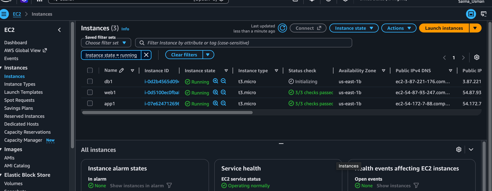

---

#### Screenshot 3 — Network Security Group inbound rules showing SSH 22 and HTTP 80

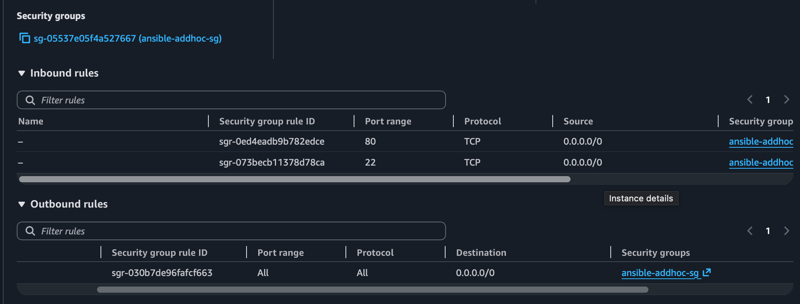

---

# Task 2 — Configure Passwordless SSH

## Goal

Connect to each of the four VMs as `azureuser` and run `hostname` remotely without a password prompt.

### Evidence

#### Screenshot 4 — Terminal showing successful `hostname` output from all four passwordless SSH tests

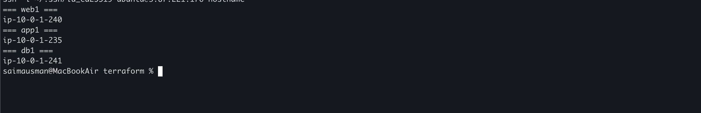

---

# Task 3 — Create a Custom Ansible Inventory

## Goal

Create `inventory.ini` mapping VM indices 0–1 to `[web]`, index 2 to `[app]`, and index 3 to `[db]`, with `ansible_user` and `ansible_ssh_private_key_file` set under `[all:vars]`.

### Evidence

#### Screenshot 5 — Editor or terminal showing `inventory.ini` with the web, app, db, and all:vars sections

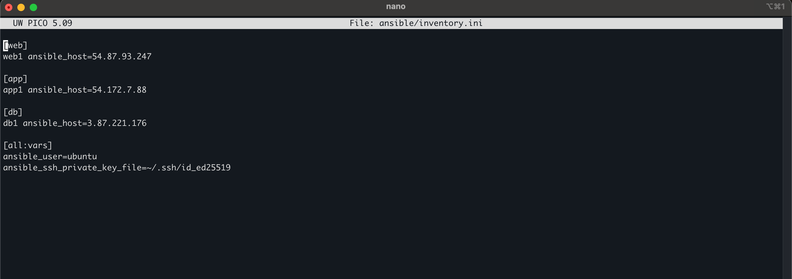

---

# Task 4 — Run Your First Ansible Ad-Hoc Commands

## Goal

Run `ping`, `whoami`, and `uptime` against all hosts; install and start Nginx on the `web` group with `--become`; install `htop` on all hosts; and run `df -h` on `db` and `free -m` on all hosts.

### Evidence

#### Screenshot 6 — Terminal showing `ansible ping` SUCCESS for all four hosts

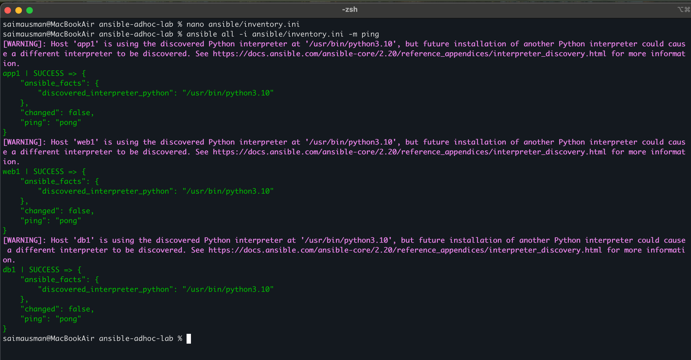

---

#### Screenshot 7 — Terminal showing `uptime` output for all four hosts

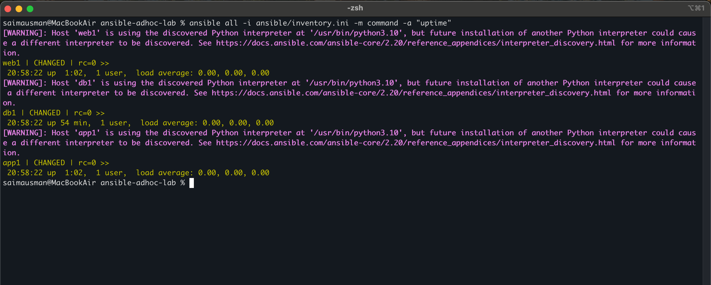

---

#### Screenshot 8 — Terminal showing Nginx installation and service start on the web group

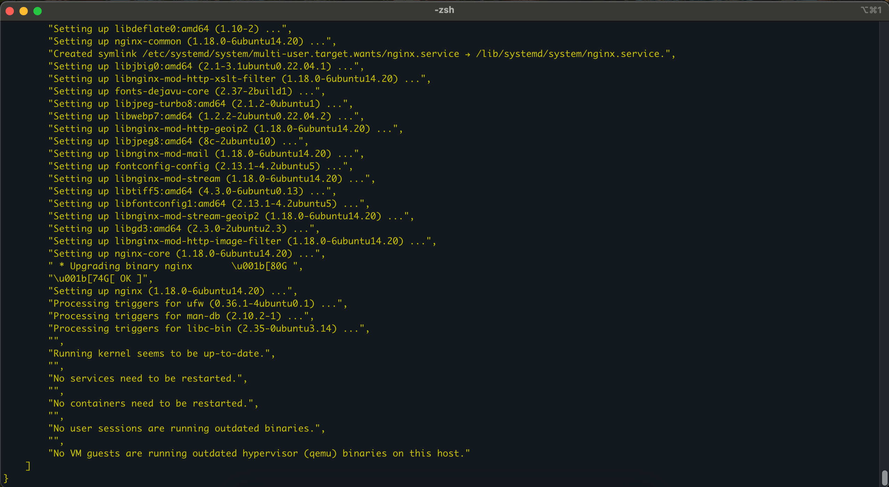

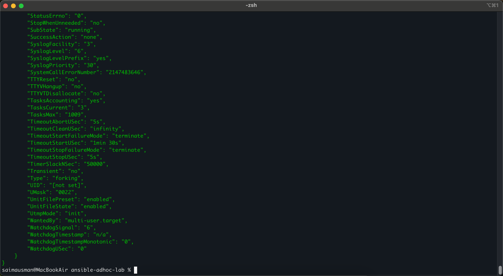

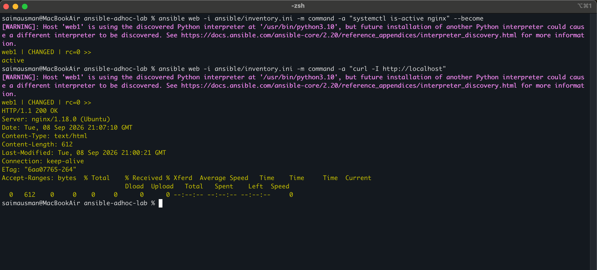

---

#### Screenshot 9 — Terminal showing `htop` installation on all hosts and group-targeted command output

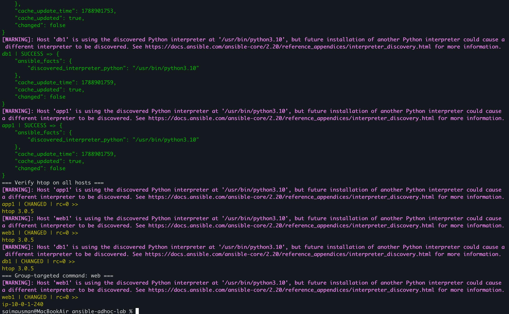

---

### Notes

**Describe an issue you faced and how you fixed it, what you learned, when you'd use an ad-hoc command instead of a playbook, and one challenge you faced during SSH or inventory setup.**

One issue I faced was `Azure VM size` and `regional capacity restrictions`, which prevented the required VMs from being deployed reliably. I resolved this by migrating the lab to `AWS EC2` and recreating the infrastructure with Terraform in the `us-east-1` region.

I learned how Terraform can be used to provision the complete infrastructure and how Ansible can manage multiple Linux hosts through an inventory. I also learned the importance of checking cloud-provider availability and capacity instead of assuming that a VM size will always be deployable.

I would use an a`d-hoc` Ansible command for quick, one-time tasks such as checking uptime, testing connectivity, installing a package, or verifying a service. For repeatable configuration and multi-step deployments, I would use an `Ansible playbook` because it is easier to maintain, document, and reuse.

One challenge during `SSH setup` was ensuring that Ansible used the correct `Ed25519 private key` and the correct `ubuntu` user. Direct SSH testing confirmed `passwordless authentication` before configuring the Ansible inventory, which helped isolate SSH issues from inventory issues.

---

# Submission Instructions

- Add all required screenshots in your submission
- Public IP addresses may be redacted
- Do not expose, upload, or commit the SSH private key

---

# Completion Checklist

- [✅] Task 1: Four Azure VMs provisioned with Terraform (Screenshots 1–3)
- [✅] Task 2: Passwordless SSH verified on all four VMs (Screenshot 4)
- [✅] Task 3: `inventory.ini` created with web/app/db groups (Screenshot 5)
- [✅] Task 4: Ad-hoc ping, uptime, Nginx, and htop commands run successfully (Screenshots 6–9)
- [✅] Reflection notes written (Notes)
- [✅] No private key material exposed

---

## 📌 About DMI & CloudAdvisory

DevOps Micro Internship (DMI) is a project-based DevOps program run by Pravin Mishra (The CloudAdvisory) focused on real-world execution, systems thinking, and career readiness.

It helps learners build strong DevOps foundations with hands-on experience.

---

## 📌 Resources

- 🌐 DMI Official Website: https://dmi.pravinmishra.com?utm_source=github&utm_medium=readme  
- 🎓 University: https://university.pravinmishra.com?utm_source=github&utm_medium=readme  
- 💬 Discord Community: https://discord.pravinmishra.com?utm_source=github&utm_medium=readme  
- 📝 Blog: https://dmi.pravinmishra.com/blog?utm_source=github&utm_medium=readme  
- ▶️ YouTube Playlist: https://www.youtube.com/playlist?list=PLFeSNDtI4Cho  
- 🔗 Pravin Mishra (LinkedIn): https://www.linkedin.com/in/pravin-mishra-aws-trainer/  
- 🏢 CloudAdvisory (LinkedIn): https://www.linkedin.com/company/thecloudadvisory/

---

*This submission is part of DevOps Micro Internship (DMI) Cohort 3 — Agentic AI Track.*
