# Assignment 3 — Multi-Play Web Deploy on Azure

Part of the DevOps Micro Internship (DMI) Cohort 3 with Agentic AI

---

## Purpose

In this assignment, you will create one Ansible playbook (`site.yml`) with three plays — install Nginx, deploy a static website with the `copy` module, and verify the deployment from the controller — against the `[web]` group from your existing inventory.

---

# Task 1 — Set Up Folder Layout

## Goal

Create the `static-web` project directory with `inventory.ini`, `site.yml`, a `files/` subdirectory, and `README.md`.

### Evidence

#### Screenshot 1 — Terminal or editor showing the complete `static-web` folder layout


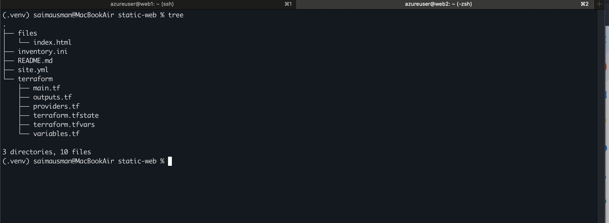

---

# Task 2 — Get the Content

## Goal

Stage `index.html` from `https://github.com/pravinmishraaws/Azure-Static-Website` locally under `static-web/files/`.

### Evidence

#### Screenshot 2 — Editor or terminal showing `files/index.html` staged inside the `static-web` project

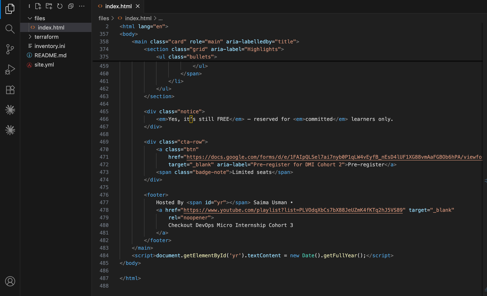

---

# Task 3 — Create the Multi-Play Playbook: site.yml

## Goal

Write `site.yml` with three plays: Play 1 (install/start Nginx on `web`), Play 2 (`copy` `files/index.html` to `/var/www/html/index.html` with owner `www-data`/mode `0644`, notifying an Nginx reload handler), and Play 3 (verify every web host with the `uri` module from `localhost`, asserting HTTP 200).

### Evidence

#### Screenshot 3 — Editor showing the three plays in `site.yml`

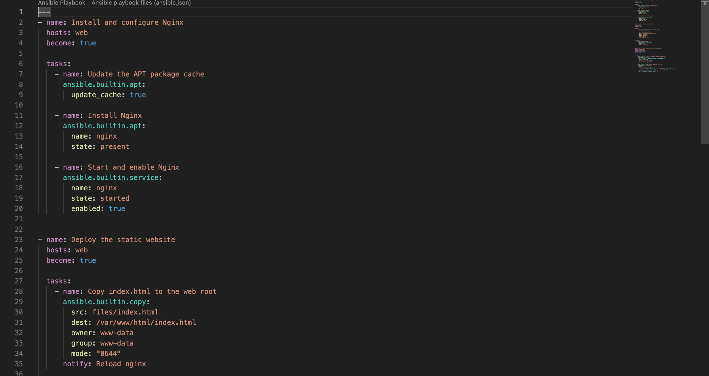

---

#### Screenshot 4 — Editor showing the copy task, file ownership/mode, handler, uri task, and HTTP 200 assertion

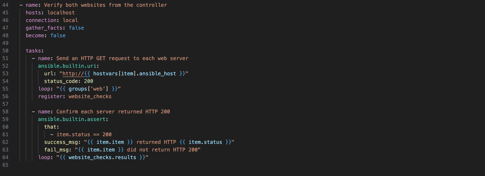

---

# Task 4 — Run the Playbook

## Goal

Run `ansible-playbook -i inventory.ini site.yml` and confirm all plays complete with no failures.

### Evidence

#### Screenshot 5 — Terminal showing the `ansible-playbook` run and final recap with OK/changed results and no failures

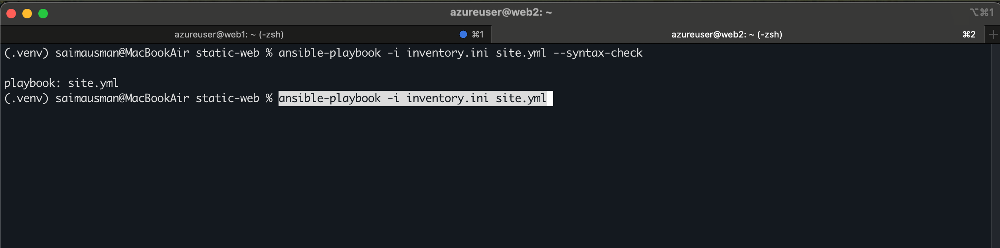

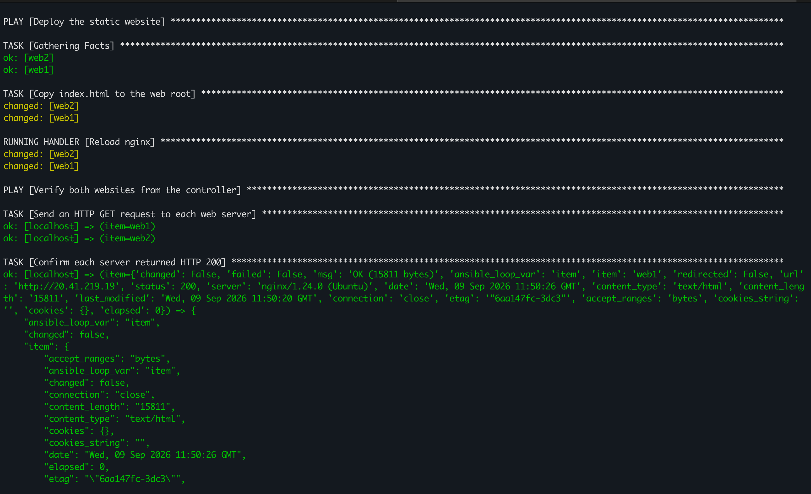

---

#### Screenshot 6 — Terminal showing the successful localhost URI verification results

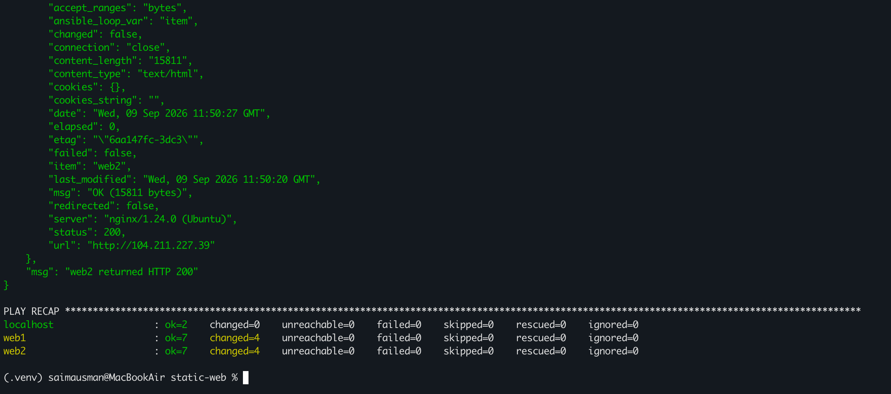

---

# Task 5 — Manual Verification

## Goal

Confirm the deployed static website is reachable directly from a web-server public IP via `curl` and a browser.

### Evidence

#### Screenshot 7 — Browser showing the static website loaded from a web-server public IP

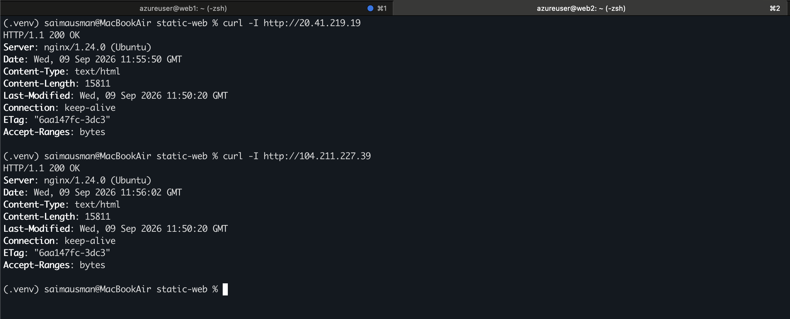

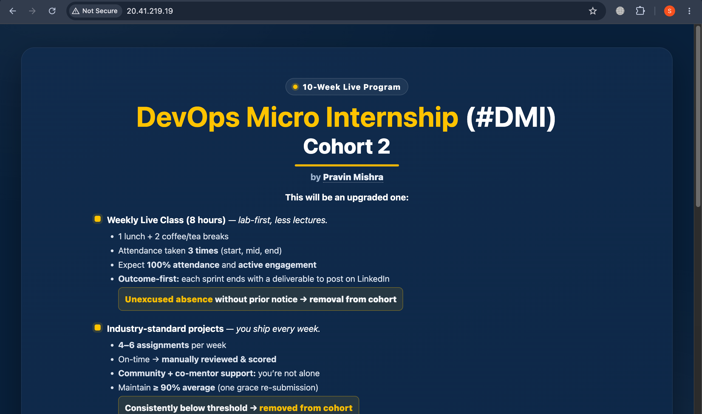

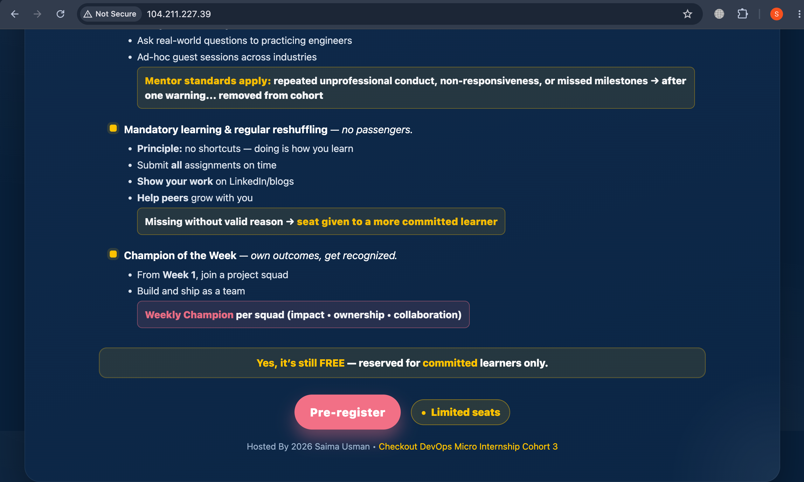

---

After the change in code, both servers updated simultaneously, I just ran the following command again:

```
ansible-playbook -i inventory.ini site.yml
```

### PROOF

**[Web1 Server]**

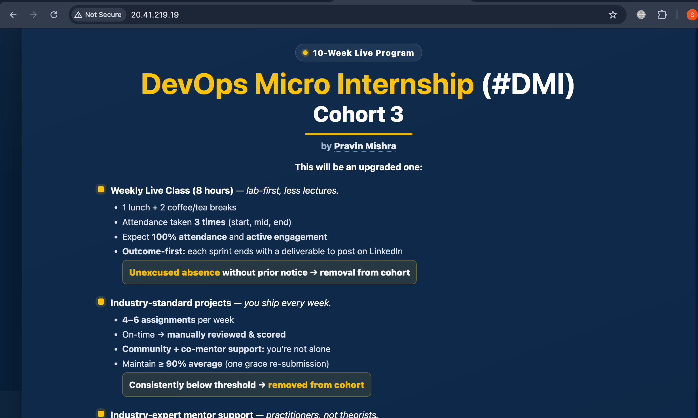

**[Web2 Server]**

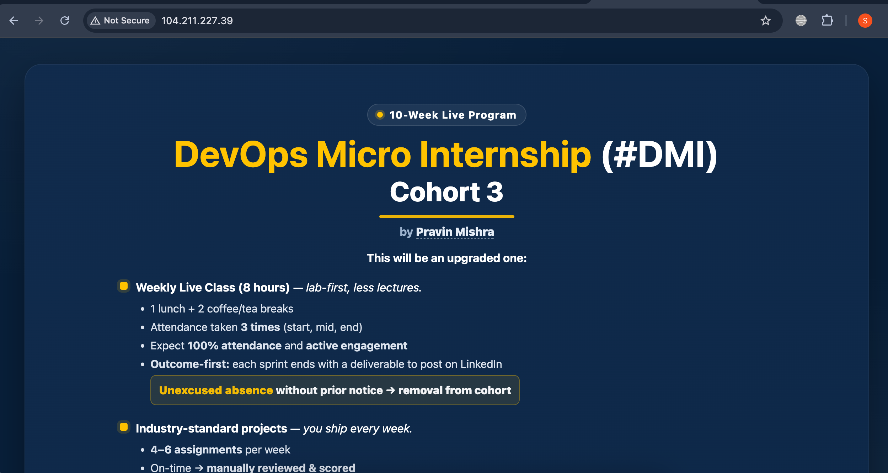

----

### Notes

Describe an issue you faced and how you fixed it, what you learned, why installation and deployment were split into separate plays, and one benefit of using `copy` instead of cloning from Git directly.

#### Issue faced: 

I initially faced issues with `SSH` connectivity and inventory configuration while setting up the Azure servers. I also had to search through different Azure regions to find a suitable region with the required VM size and available quota. I fixed these issues by verifying the public IP addresses, SSH key path, username, and ensuring that the required ports were allowed in the Azure Network Security Group. I also selected a region where the required VM quota was available.

#### What I learned: 

I learned how `Terraform` can be used to create the Azure infrastructure and `Ansible` can then manage and configure the servers without manually logging into each VM.

#### Why installation and deployment were split into separate plays: 

They were separated to keep the `playbook` organized and follow a clear sequence. The first play installs and configures `Nginx`, while the second play deploys the website files. This makes the playbook easier to understand, maintain, and troubleshoot.

#### Benefit of using copy instead of cloning from Git directly: 

Using copy keeps the website source under Ansible's control and allows me to deploy the exact local version of `index.html` to all servers consistently. It also avoids requiring Git to be installed or accessing the Git repository directly from the managed servers.

---

# Submission Instructions

- Add all required screenshots in your submission
- IP addresses in `inventory.ini` may be redacted
- Do not expose SSH private keys

---

# Completion Checklist

- [✅] Task 1: `static-web` project structure created (Screenshot 1)
- [✅] Task 2: `index.html` staged under `files/` (Screenshot 2)
- [✅] Task 3: Three-play `site.yml` written (Screenshots 3–4)
- [✅] Task 4: Playbook run successfully with no failures (Screenshots 5–6)
- [✅] Task 5: Site verified manually via browser (Screenshot 7)
- [✅] Reflection notes written (Notes)
- [✅] No sensitive data exposed

---

## 📌 About DMI & CloudAdvisory

DevOps Micro Internship (DMI) is a project-based DevOps program run by Pravin Mishra (The CloudAdvisory) focused on real-world execution, systems thinking, and career readiness.

It helps learners build strong DevOps foundations with hands-on experience.

---

## 📌 Resources

- 🌐 DMI Official Website: https://dmi.pravinmishra.com?utm_source=github&utm_medium=readme  
- 🎓 University: https://university.pravinmishra.com?utm_source=github&utm_medium=readme  
- 💬 Discord Community: https://discord.pravinmishra.com?utm_source=github&utm_medium=readme  
- 📝 Blog: https://dmi.pravinmishra.com/blog?utm_source=github&utm_medium=readme  
- ▶️ YouTube Playlist: https://www.youtube.com/playlist?list=PLFeSNDtI4Cho  
- 🔗 Pravin Mishra (LinkedIn): https://www.linkedin.com/in/pravin-mishra-aws-trainer/  
- 🏢 CloudAdvisory (LinkedIn): https://www.linkedin.com/company/thecloudadvisory/

---

*This submission is part of DevOps Micro Internship (DMI) Cohort 3 — Agentic AI Track.*
