# Assignment 4 — Deploy Mini Finance Project Using Terraform and Ansible

Part of the DevOps Micro Internship (DMI) Cohort 3 with Agentic AI

---

## Purpose

In this assignment, you will provision an Azure VM with Terraform and use Ansible to automate the install, deploy, and verify workflow for the Mini Finance static website — a clean separation between infrastructure and configuration management.

---

# Task 1 — Set Up Folder Layout

## Goal

Create the `mini-finance` project with separate `terraform/` and `ansible/` subdirectories.

### Overall plan

```
Ubuntu Controller
        │
        │ Terraform
        ▼
┌──────────────────────────── Azure ────────────────────────────┐
│                                                               │
│  rg-mini-finance                                              │
│       │                                                       │
│       └── vnet-mini-finance                                   │
│              │                                                │
│              └── subnet-mini-finance                          │
│                       │                                       │
│                       └── nic-mini-finance                    │
│                              │                                │
│                              ├── pip-mini-finance             │
│                              │                                │
│                              └── NSG: nsg-mini-finance        │
│                                    ├── SSH 22 → your IP       │
│                                    └── HTTP 80 → Internet     │
│                                                               │
│                       vm-mini-finance                         │
│                       Ubuntu 22.04                            │
│                       azureuser                               │
│                                                               │
└───────────────────────────────────────────────────────────────┘
        │
        │ SSH
        ▼
   Ansible
        │
        ├── Install Nginx
        ├── Install Git + rsync
        ├── Clone Mini Finance
        ├── Synchronize website
        ├── Reload Nginx
        └── HTTP 200 verification
                 │
                 ▼
       http://PUBLIC_IP
                 │
                 ▼
      Mini Finance Website
```

### Evidence

#### Screenshot 1 — Terminal or editor showing the complete `mini-finance` project tree

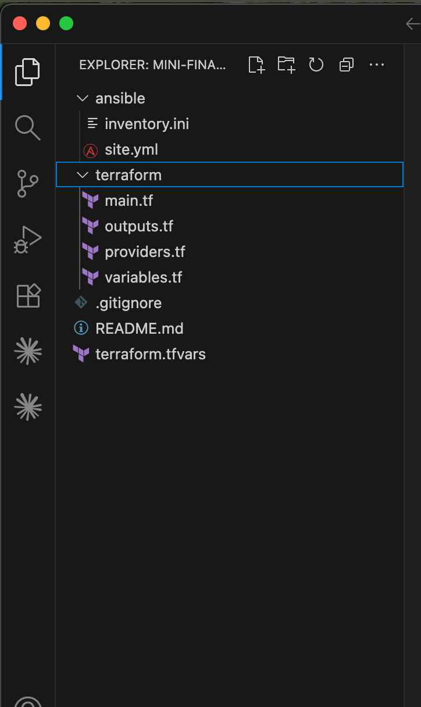

---

# Task 2 — Terraform — Azure VM + NSG (Ports 22/80)

## Goal

Provision an Ubuntu 22.04 Standard_B1s VM with a public IP, SSH key authentication, and an NSG allowing SSH (22) and HTTP (80), and output the public IP.

### Evidence

#### Screenshot 2 — Terminal showing the end of a successful `terraform apply`

```
terraform plan \
  -var="location=southindia" \
  -var="ssh_source_cidr=YOUR_IP/32" \
  -var="vm_size=Standard_B2as_v2"
```

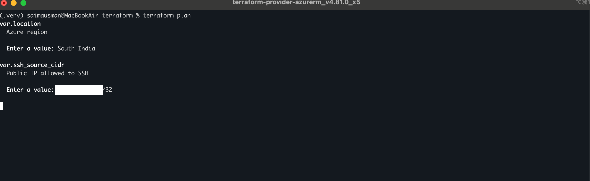

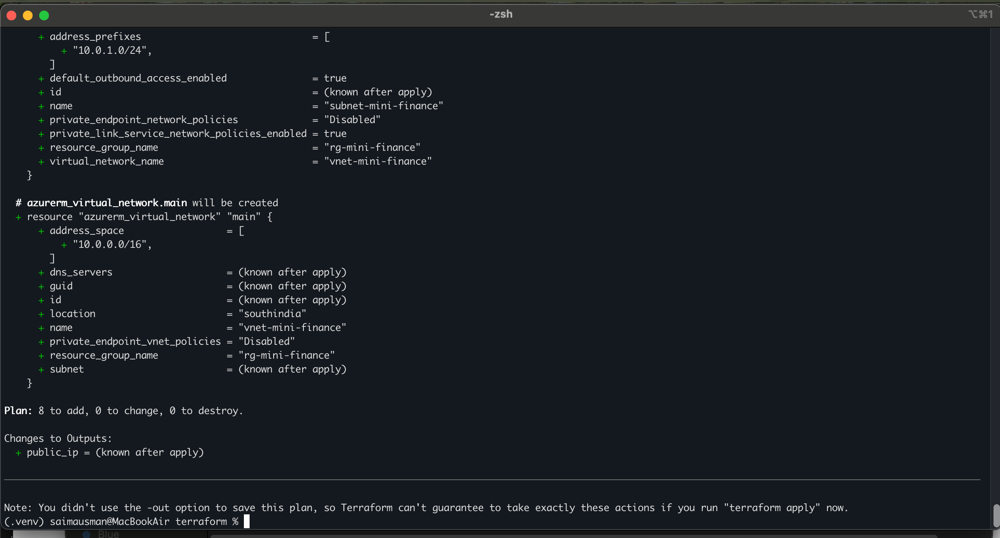

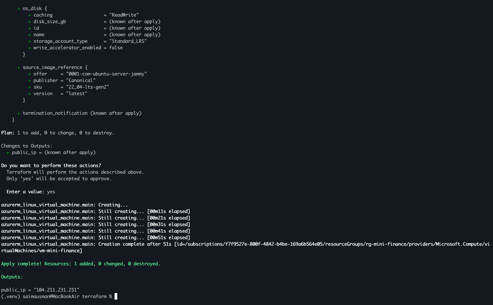

---

#### Screenshot 3 — Terminal showing `terraform output public_ip`

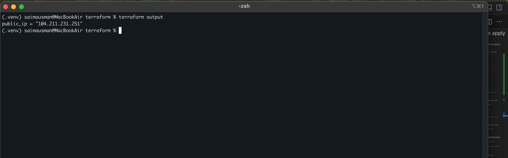

---

#### Screenshot 4 — Terraform code or Azure Portal showing NSG inbound rules for ports 22 and 80

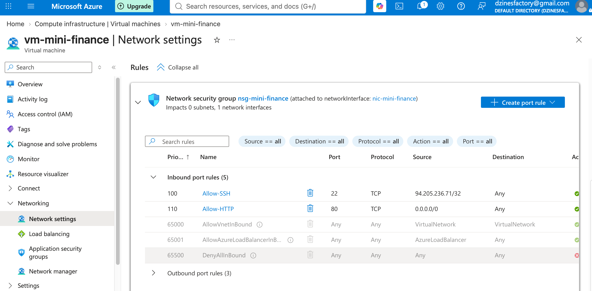

---

# Task 3 — Configure Passwordless SSH

## Goal

Connect to the VM with SSH using the injected key and run `hostname` remotely without a password prompt.

### Evidence

#### Screenshot 5 — Terminal showing the successful passwordless SSH hostname check

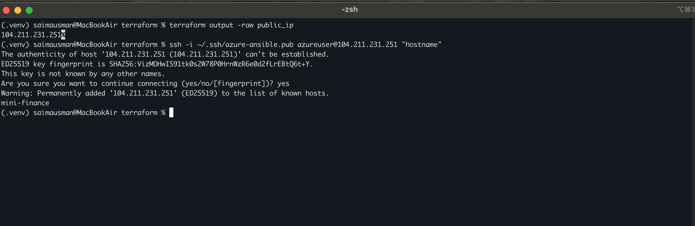

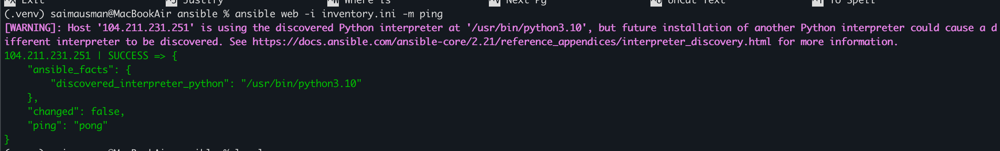

---

# Task 4 — Ansible — Multi-Play: Install → Deploy → Verify

## Goal

Create `ansible/inventory.ini` and a three-play `site.yml` that installs Nginx and Git, clones and deploys the Mini Finance repository to `/var/www/html/` with a reload handler, and verifies HTTP 200 from `localhost`.

`site.yml` must contain the following three plays:

```
Play 1 → Install Nginx + Git + rsync
Play 2 → Clone + synchronize website + reload Nginx
Play 3 → Verify HTTP 200 from localhost
```

---

### Evidence

#### Screenshot 6 — Editor showing `inventory.ini` and the three plays in `site.yml`

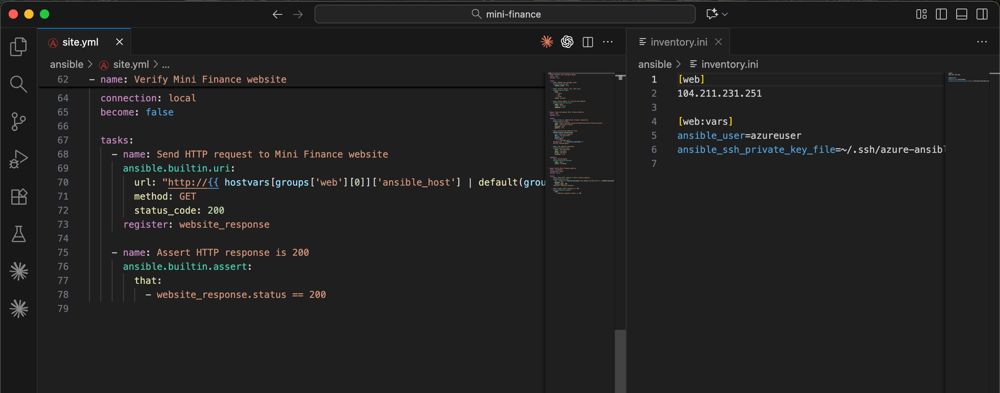

---

#### Screenshot 7 — Terminal showing `ansible-playbook -i inventory.ini site.yml` with HTTP 200, assertion OK, and no failures

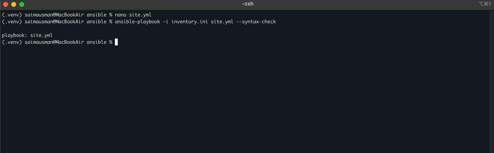

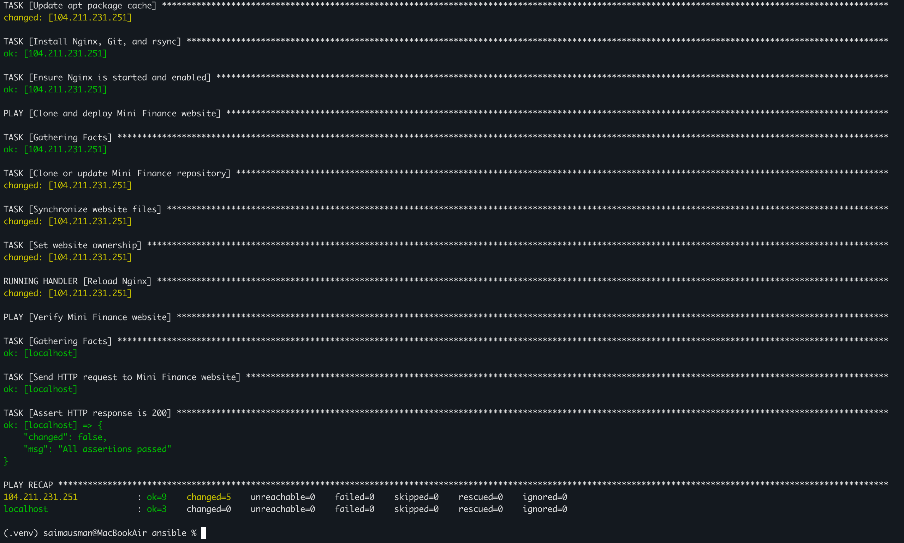

---

# Task 5 — Test End-to-End Functionality

## Goal

Confirm the Mini Finance site is publicly accessible and correctly served by Nginx.

### Evidence

#### Screenshot 8 — Browser showing the Mini Finance site loaded from `http://<public_ip>` with the URL visible

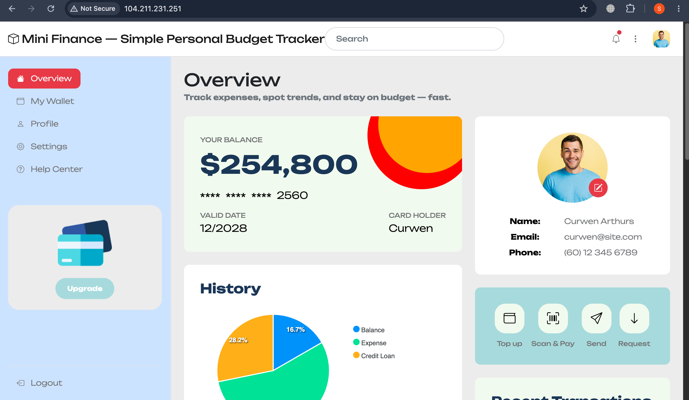

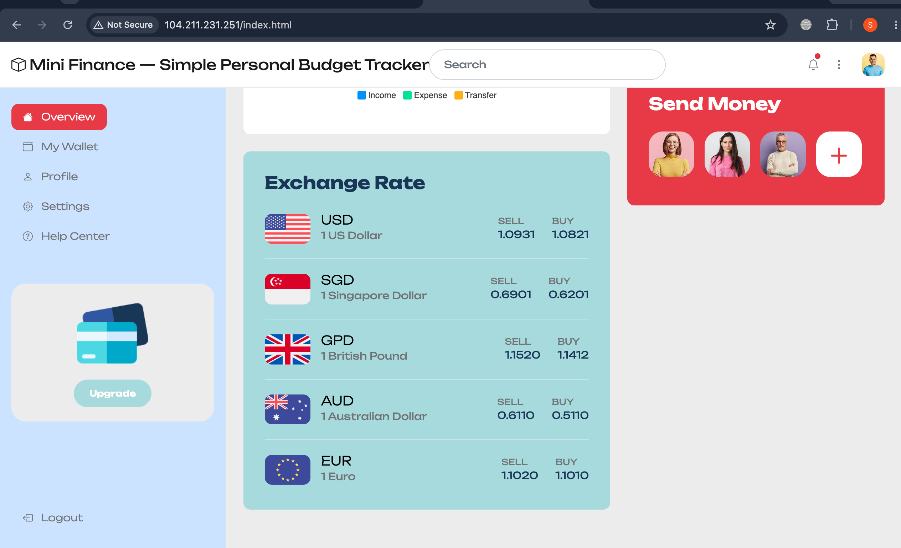

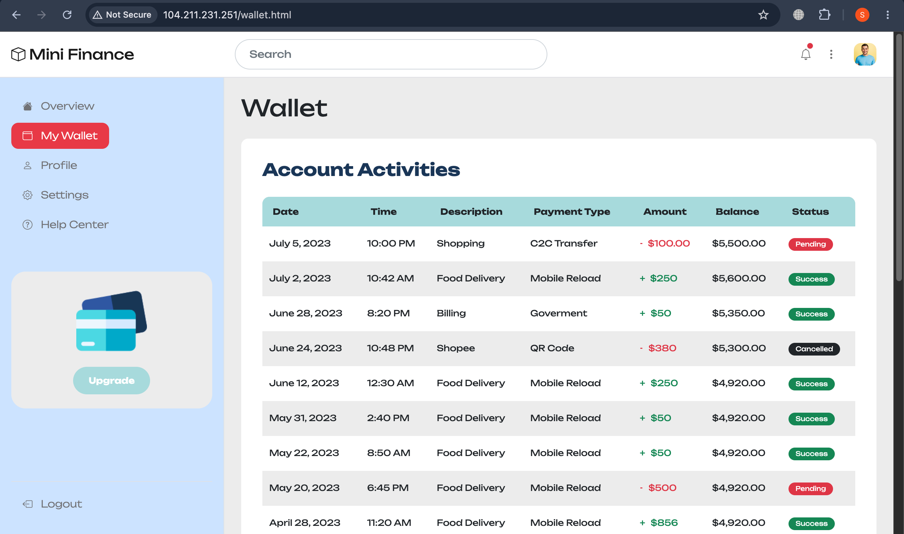

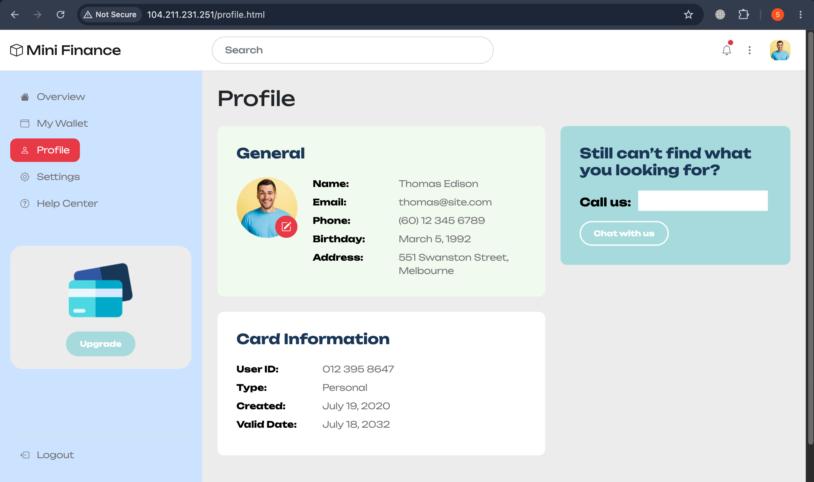

---

### Notes

Describe an issue you faced and how you fixed it, and what you learned.

**Issue Faced:**
The Mini Finance repository URL provided in the assignment instructions was misleading. The expected URL was https://github.com/pravinmishraaws/mini-finance-project, but the existing and actual repository was https://github.com/pravinmishraaws/mini_finance.git. This caused confusion when configuring the Ansible Git task.

**How I Fixed It:**
I verified the correct repository URL and updated the ansible.builtin.git task in site.yml to use the working repository URL. After updating it, I reran the playbook and confirmed that the website was successfully cloned, deployed to /var/www/html/, and verified with `HTTP status 200`.

**What I Learned:**
I learned the importance of verifying repository URLs before automating deployments. I also learned how `Ansible` can use `Git` to retrieve application source code, `rsync to deploy the files` to the Nginx web root, and a verification play to confirm that the deployed application is actually accessible.

---

# LinkedIn Post (Required)

## Goal

Publish a LinkedIn post about the Terraform + Ansible deployment, mentioning the Azure VM, secure networking, passwordless SSH, Nginx deployment, and HTTP verification, with one challenge you faced and how you fixed it, and one real-world example of this workflow.

## Evidence

#### LinkedIn Post URL

Paste your LinkedIn post URL here:

https://www.linkedin.com/posts/saima-usman_devops-terraform-ansible-activity-7503559859448037376-Xbbn?utm_source=share&utm_medium=member_desktop&rcm=ACoAABsfrYoBkq_t-PkQCt7fEB9Ajmp98YTHl_g

---

#### Screenshot — Published LinkedIn post showing the text and at least one image or proof

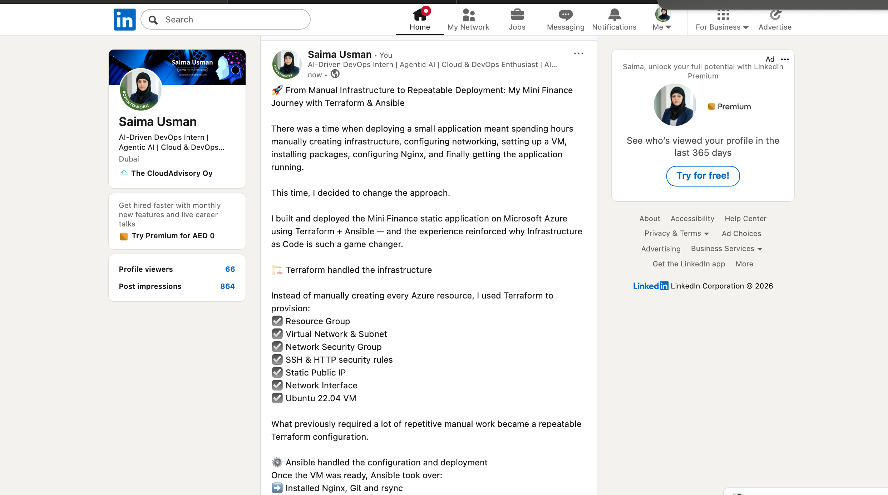

---

# Submission Instructions

- Add all required screenshots in your submission
- The `mini-finance` project tree and `inventory.ini` may have the final IP octet masked
- Do not expose private keys or other secrets

---

# Completion Checklist

- [✅] Task 1: `mini-finance` project structure created (Screenshot 1)
- [✅] Task 2: Azure VM and NSG provisioned with Terraform (Screenshots 2–4)
- [✅] Task 3: Passwordless SSH verified (Screenshot 5)
- [✅] Task 4: Ansible install/deploy/verify plays run successfully (Screenshots 6–7)
- [✅] Task 5: Site verified in the browser (Screenshot 8)
- [✅] Reflection notes written (Notes)
- [✅] LinkedIn post published and URL submitted
- [✅] No sensitive data exposed

---

## 📌 About DMI & CloudAdvisory

DevOps Micro Internship (DMI) is a project-based DevOps program run by Pravin Mishra (The CloudAdvisory) focused on real-world execution, systems thinking, and career readiness.

It helps learners build strong DevOps foundations with hands-on experience.

---

## 📌 Resources

- 🌐 DMI Official Website: https://dmi.pravinmishra.com?utm_source=github&utm_medium=readme  
- 🎓 University: https://university.pravinmishra.com?utm_source=github&utm_medium=readme  
- 💬 Discord Community: https://discord.pravinmishra.com?utm_source=github&utm_medium=readme  
- 📝 Blog: https://dmi.pravinmishra.com/blog?utm_source=github&utm_medium=readme  
- ▶️ YouTube Playlist: https://www.youtube.com/playlist?list=PLFeSNDtI4Cho  
- 🔗 Pravin Mishra (LinkedIn): https://www.linkedin.com/in/pravin-mishra-aws-trainer/  
- 🏢 CloudAdvisory (LinkedIn): https://www.linkedin.com/company/thecloudadvisory/

---

*This submission is part of DevOps Micro Internship (DMI) Cohort 3 — Agentic AI Track.*
