# Assignment 5 — Production-Grade EpicBook: Terraform + Ansible Roles (Azure or AWS)

Part of the DevOps Micro Internship (DMI) Cohort 3 with Agentic AI

---

## Purpose

In this assignment, you will deploy the EpicBook web application on a cloud VM provisioned with Terraform (Azure or AWS — pick one) and configured through reusable Ansible roles (`common`, `nginx`, `epicbook`) orchestrated by one playbook, using group variables, templates, and handlers, with a verified idempotent second run.

---

# Task 1 — Set Up Folder Layout

## Goal

Create the `epicbook-prod` project with `terraform/azure` or `terraform/aws`, `ansible/inventory.ini`, `ansible/site.yml`, `ansible/group_vars/web.yml`, and the `common`, `nginx`, and `epicbook` role directories.

### Evidence

#### Screenshot 1 — Terminal or editor showing the complete `epicbook-prod` project tree

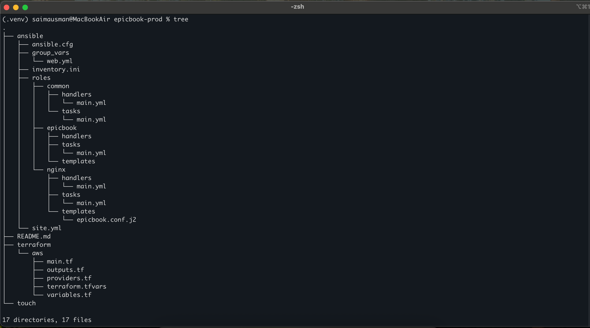

---

# Task 2 — Terraform (Pick One: Azure or AWS)

## Goal

Provision one secure Ubuntu 22.04 VM with SSH key authentication, inbound SSH (22) and HTTP (80), and `public_ip`/`admin_user` outputs, on your chosen cloud.

I will choose AWS. Our Terraform will create:

```
AWS
│
├── VPC
│   ├── Public subnet
│   │   └── EC2 Ubuntu 22.04
│   │
│   └── Private subnets
│       └── RDS MySQL
│
├── Internet Gateway
│
├── Route tables
│
├── EC2 Security Group
│   ├── SSH 22 → YOUR_PUBLIC_IP/32
│   └── HTTP 80 → 0.0.0.0/0
│
├── RDS Security Group
│   └── MySQL 3306 → EC2 Security Group
│
├── EC2 key pair
│
└── RDS MySQL
```

### Evidence

#### Screenshot 2 — Terminal showing successful `terraform apply` and `terraform output` with `public_ip` and `admin_user`

### Terraform has created:

🌐 Custom VPC \
🌐 Internet Gateway \
📡 Public subnet \
🔒 Two private subnets for RDS \
🛣️ Public route table \
🔐 EC2 security group \
🔐 RDS security group \
🔑 EC2 SSH key pair \
💻 Ubuntu EC2 instance \
🗄️ MySQL RDS database

<br>

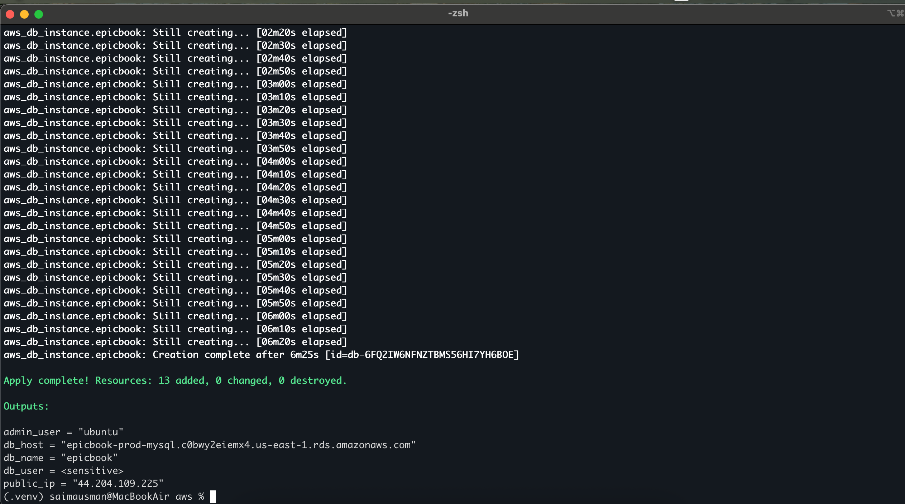
---

#### Screenshot 3 — Terraform code or cloud console showing inbound rules for ports 22 and 80

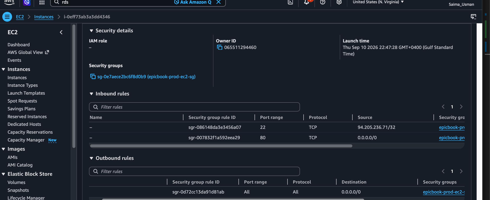

---

# Task 3 — Ansible Inventory

## Goal

Create the `[web]` inventory using the Terraform `public_ip` and `admin_user` outputs, and verify passwordless SSH and `ansible ping`.

### Evidence

#### Screenshot 4 — Terminal showing the successful passwordless SSH hostname check

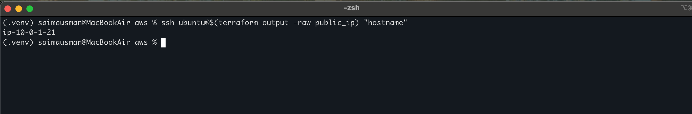

---

#### Screenshot 5 — Editor or terminal showing `inventory.ini` and a successful Ansible ping

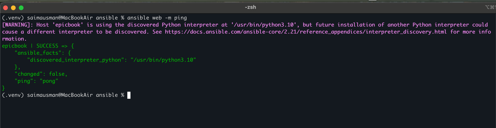

---

# Task 4 — Create site.yml (Role Orchestration)

## Goal

Create `site.yml` invoking the `common`, `nginx`, and `epicbook` roles in that exact order.

### Evidence

#### Screenshot 6 — Editor showing `ansible/site.yml` with the three roles in the required order

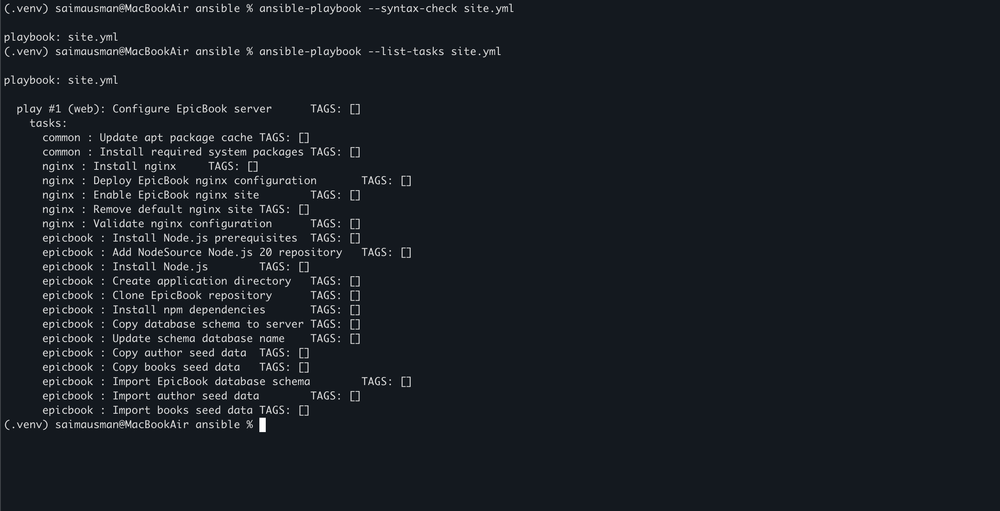

---

# Task 5 — Role: common

## Goal

Create `roles/common/tasks/main.yml` to update apt, upgrade packages, install baseline packages (`git`, `curl`, `unzip`, `software-properties-common`), with optional SSH hardening applied only after key-based access is confirmed.

### Evidence

#### Screenshot 7 — Editor showing `roles/common/tasks/main.yml`

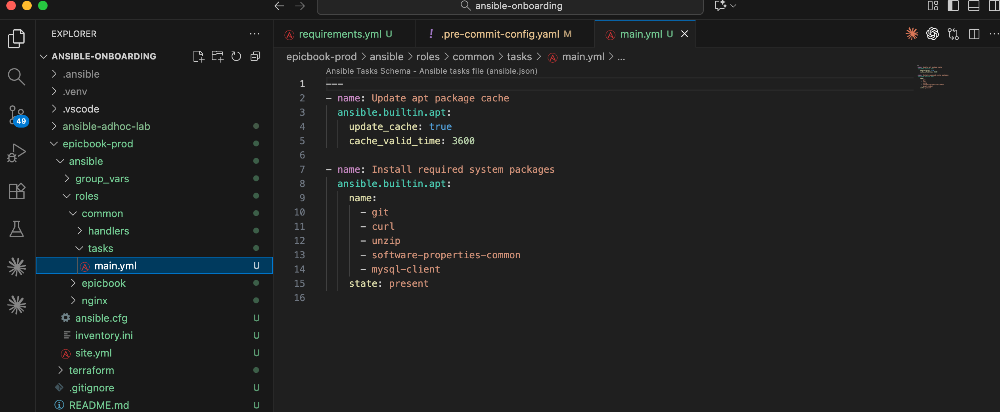

---

# Task 6 — Role: nginx

## Goal

Create the `nginx` role to install Nginx, deploy the `epicbook.conf.j2` template to `/etc/nginx/sites-available/epicbook`, enable the site, remove the default site, and reload via handler.

### Evidence

#### Screenshot 8 — Editor showing the Nginx role tasks, handler, and `epicbook.conf.j2` template

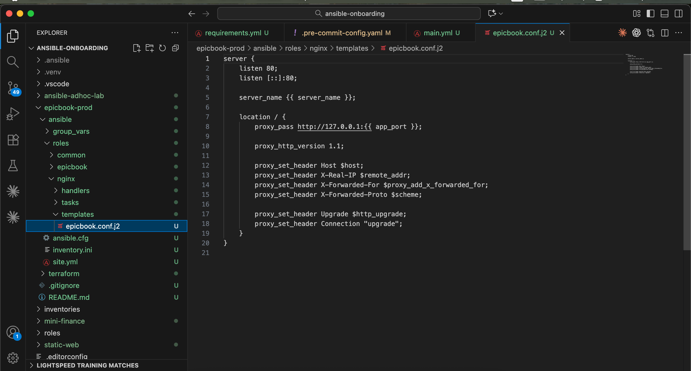

---

#### Screenshot 9 — Terminal showing `/etc/nginx/sites-available/epicbook` and a successful Nginx configuration test

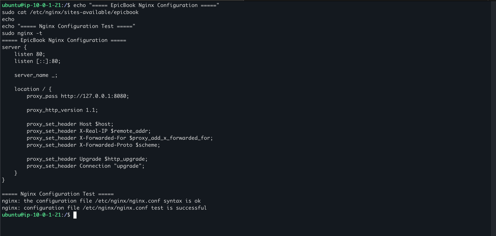

---

# Task 7 — Role: epicbook

## Goal

Create the `epicbook` role to clone the repository to `{{ app_dest }}`, set ownership/permissions using group variables, and notify the Nginx reload handler on change.

### Evidence

#### Screenshot 10 — Editor showing `roles/epicbook/tasks/main.yml`

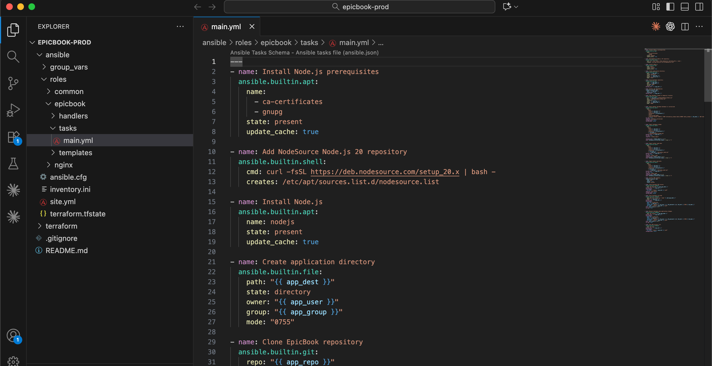

---

# Task 8 — Group Variables

## Goal

Define `app_repo`, `app_dest`, `app_user`, and `app_group` in `ansible/group_vars/web.yml`.

### Evidence

#### Screenshot 11 — Editor showing `ansible/group_vars/web.yml`

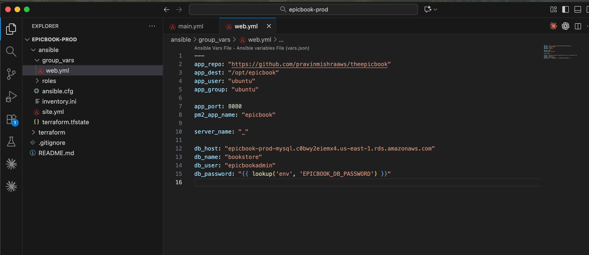

---

# Task 9 — Run the Playbook

## Goal

Run `ansible-playbook -i inventory.ini site.yml` and confirm `common` → `nginx` → `epicbook` all complete with `failed=0`.

### Evidence

#### Screenshot 12 — Terminal showing the role-based Ansible run and final recap with `failed=0`

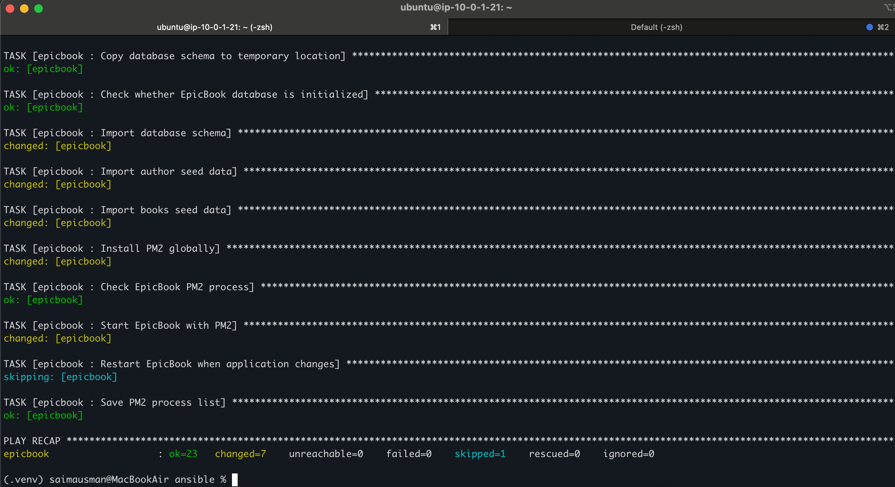

---

# Task 10 — Verify

## Goal

Confirm the EpicBook site loads with HTTP 200, inspect the Nginx configuration, and rerun the playbook to confirm the second run is mostly OK/UNCHANGED with `failed=0`.

### Evidence

#### Screenshot 13 — Browser showing the EpicBook site with the public IP visible

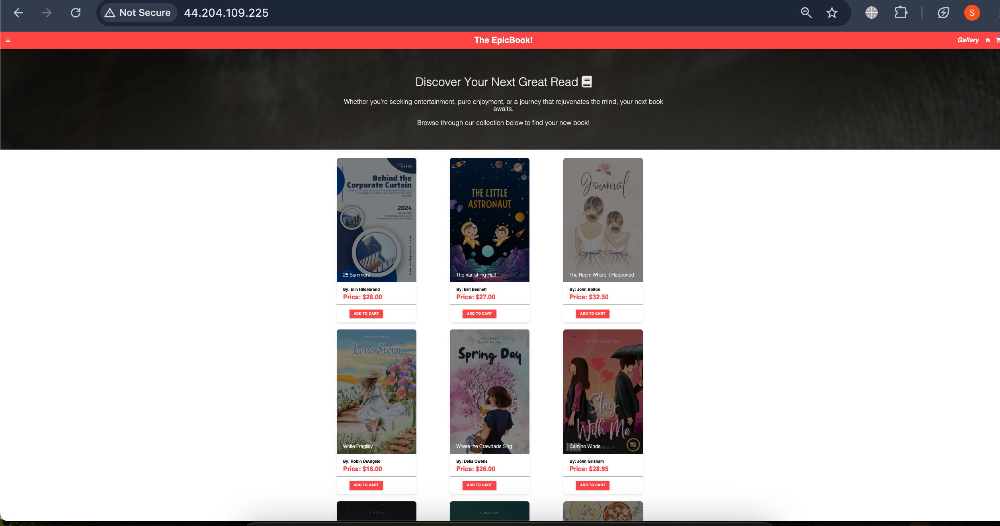

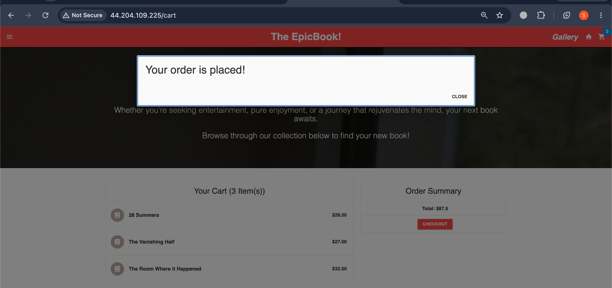

---

#### Screenshot 14 — Terminal showing HTTP 200 and the Nginx site-file snippet

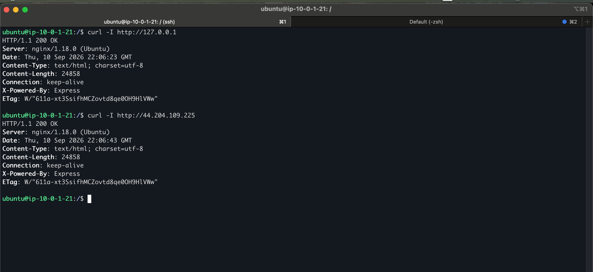

---

#### Screenshot 15 — Terminal showing the idempotent second Ansible run with mostly OK/UNCHANGED and `failed=0`

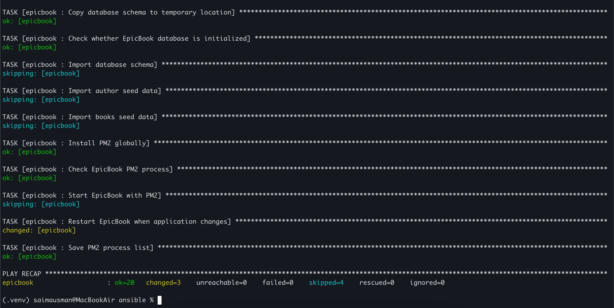

---

### Notes

**Describe an issue you faced and how you fixed it, what you learned, any security issues you identified, and your production remediation plan.**


During the deployment, I faced several issues that helped me better understand the interaction between Terraform and Ansible. Initially, the Terraform `AMI filter returned no results` because the Ubuntu AMI naming pattern was incorrect. I resolved this by checking the available AWS AMIs and updating the filter to match the actual Ubuntu 22.04 image. I also encountered an issue with the database name because the application and SQL files consistently used `bookstore`, while Terraform was initially configured with `epicbook`. I changed the RDS database name to `bookstore` so the infrastructure matched the application.

Another issue occurred when the Ansible database task received empty values for the RDS host, username, and database name. This caused MySQL to fall back to the local socket. I fixed this by configuring the non-sensitive database values directly in Ansible variables and keeping the password in an environment variable. I also encountered the default Nginx welcome page instead of EpicBook; removing the default site, enabling the EpicBook configuration, and reloading Nginx fixed the issue. Finally, I corrected an obsolete PM2 handler reference and made the deployment tasks idempotent so the second Ansible run completed with `failed=0` and minimal changes.

I learned that Terraform is responsible for creating consistent infrastructure, while Ansible should configure and deploy the application in a repeatable and idempotent way. Testing each layer separately—SSH, RDS connectivity, Node.js, PM2, Nginx, and finally the browser—made troubleshooting much easier.

From a security perspective, SSH was restricted to my controller's /32 address, RDS was made private, and port 3306 was allowed only from the EC2 security group. However, I identified some areas that would need improvement for production. During troubleshooting, the database password was temporarily exposed in a command/output, and MySQL warned about passwords supplied on the command line. The password was also stored in Terraform state because RDS credentials are managed through Terraform.

For production, I would store database credentials in `AWS Secrets Manager` or another secure secret-management solution, use `Ansible Vault` where appropriate, rotate the exposed database password, avoid passing passwords through command-line arguments, enable HTTPS with a valid `TLS certificate`, restrict administrative access further, `enable stronger RDS backups` and `deletion protection`, and `review logging`, `monitoring`, `IAM permissions`, and `network controls`.

---

# LinkedIn Post (Required)

## Goal

Publish a LinkedIn post describing the Terraform + Ansible roles deployment (cloud chosen, role structure, Nginx deployment, idempotency result), and add a 4–6 line video reflection covering one challenge/fix, security issues observed, and your production remediation plan.

## Evidence

#### LinkedIn Post URL

Paste your LinkedIn post URL here:

https://lnkd.in/p/dR-Q7ubc

---

#### Screenshot — Published LinkedIn post

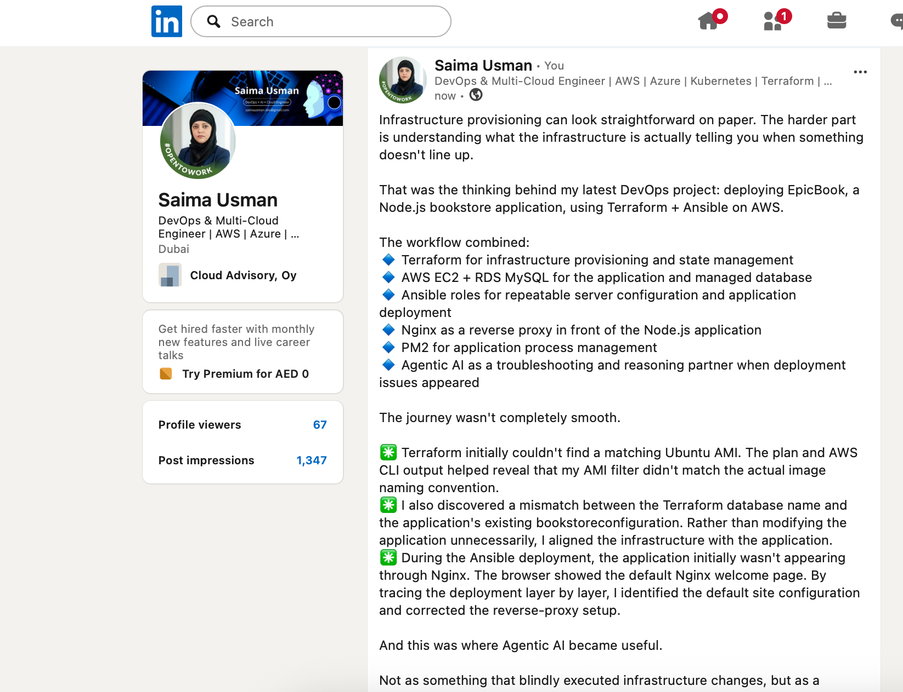
---

#### Video reflection screenshot

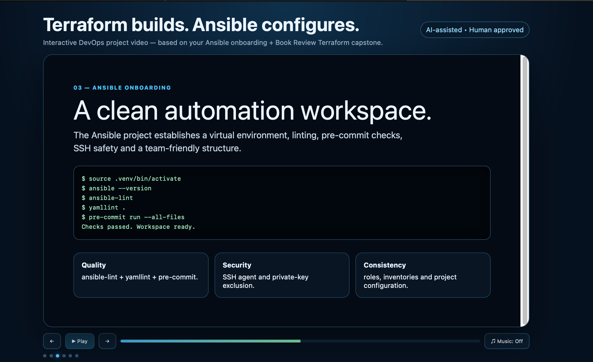

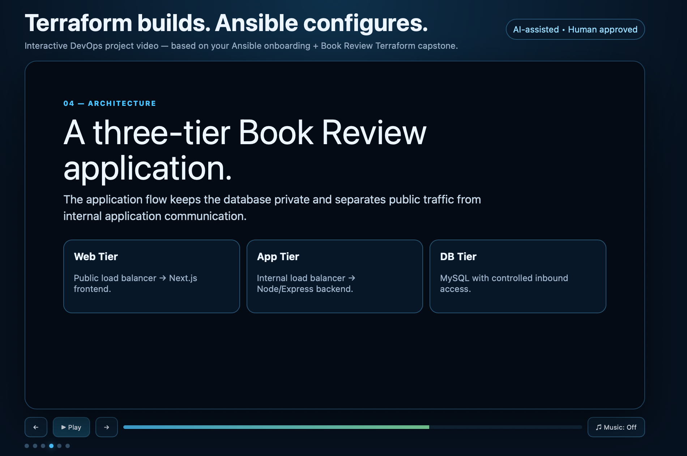


---

# Submission Instructions

- Add all required screenshots in your submission
- Do not expose private keys, credentials, tokens, or unrestricted management access

---

# Completion Checklist

- [✅] Task 1: `epicbook-prod` project and role structure created (Screenshot 1)
- [✅] Task 2: Cloud VM provisioned with Terraform (Screenshots 2–3)
- [✅] Task 3: Passwordless SSH and Ansible ping verified (Screenshots 4–5)
- [✅] Task 4: `site.yml` orchestrates roles in common → nginx → epicbook order (Screenshot 6)
- [✅] Task 5: `common` role created (Screenshot 7)
- [✅] Task 6: `nginx` role, template, and handler created (Screenshots 8–9)
- [✅] Task 7: `epicbook` role created (Screenshot 10)
- [✅] Task 8: Group variables defined (Screenshot 11)
- [✅] Task 9: Playbook run successfully with `failed=0` (Screenshot 12)
- [✅] Task 10: Site verified and idempotent rerun confirmed (Screenshots 13–15)
- [✅] Reflection and security remediation notes written (Notes)
- [✅] LinkedIn post and video reflection submitted
- [✅] No sensitive data exposed

---

## 📌 About DMI & CloudAdvisory

DevOps Micro Internship (DMI) is a project-based DevOps program run by Pravin Mishra (The CloudAdvisory) focused on real-world execution, systems thinking, and career readiness.

It helps learners build strong DevOps foundations with hands-on experience.

---

## 📌 Resources

- 🌐 DMI Official Website: https://dmi.pravinmishra.com?utm_source=github&utm_medium=readme  
- 🎓 University: https://university.pravinmishra.com?utm_source=github&utm_medium=readme  
- 💬 Discord Community: https://discord.pravinmishra.com?utm_source=github&utm_medium=readme  
- 📝 Blog: https://dmi.pravinmishra.com/blog?utm_source=github&utm_medium=readme  
- ▶️ YouTube Playlist: https://www.youtube.com/playlist?list=PLFeSNDtI4Cho  
- 🔗 Pravin Mishra (LinkedIn): https://www.linkedin.com/in/pravin-mishra-aws-trainer/  
- 🏢 CloudAdvisory (LinkedIn): https://www.linkedin.com/company/thecloudadvisory/

---

*This submission is part of DevOps Micro Internship (DMI) Cohort 3 — Agentic AI Track.*
