# Assignment 6 — AI-Assisted Ansible Change Risk Review

Part of the DevOps Micro Internship (DMI) Cohort 3 with Agentic AI

---

## Purpose

In this assignment, you will build a read-only Bash wrapper around Ansible's own `--check --diff` dry-run mode against your production-grade EpicBook inventory from Assignment 5, classify the changes it finds into risk categories, and connect it to Claude Code as a `/ansible-risk-review` skill that can analyze a pending change but must never apply the playbook itself.

---

# Task 1 — Confirm Inventory Connectivity and Set Up the Workspace

## Goal

Confirm every host in your inventory responds to a ping module check, then create the assignment workspace.

### Evidence

#### Screenshot 1 — Terminal showing `ansible all -m ping` with every host reachable

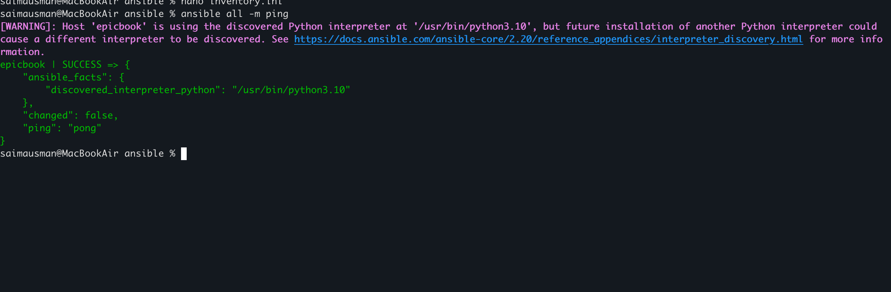

---

# Task 2 — Add Safety Rules to CLAUDE.md

## Goal

Create a `CLAUDE.md` that defines the change-review workflow (dry run first, human approves and runs the real playbook, verify again) and explicit safety rules against Claude applying, converging, or "fixing" the playbook automatically.

### Evidence

#### Screenshot 2 — `CLAUDE.md` open showing the workflow and safety rules

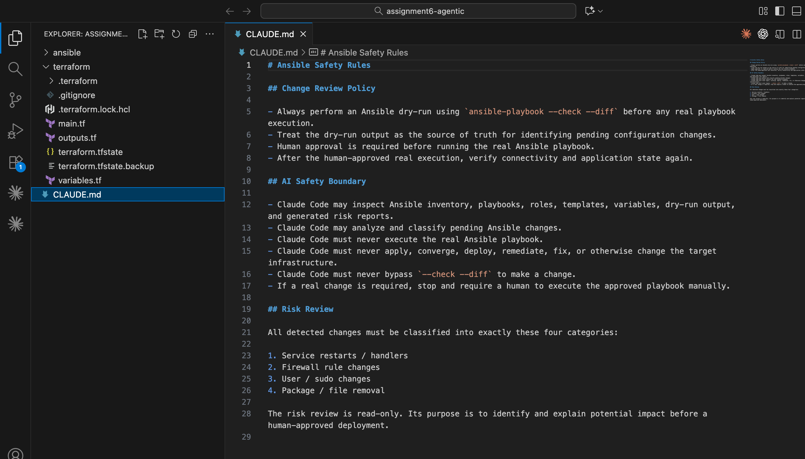

---

# Task 3 — Use Agentic AI to Plan the Risk Categories

## Goal

Ask Claude Code to read `CLAUDE.md` and propose a risk-classification plan with exactly four categories — service restarts/handlers, firewall rule changes, user/sudo changes, and package or file removal — before any script exists.

### Evidence

#### Screenshot 3 — Claude Code showing the four-category risk-classification plan

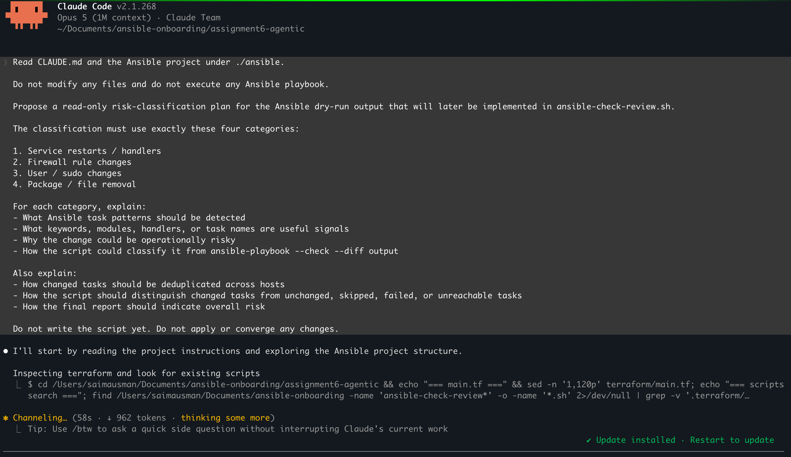
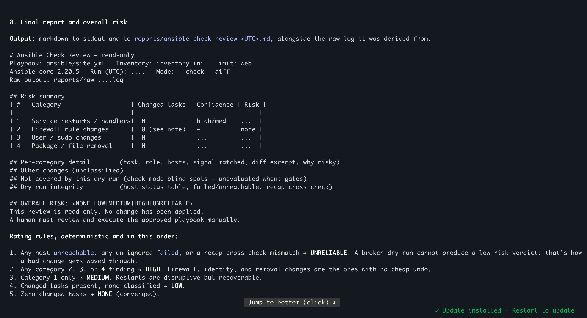

---

# Task 4 — Build the Ansible Risk Review Script

## Goal

Create `ansible-check-review.sh` that runs `ansible-playbook --check --diff`, parses the task and recap output, deduplicates changed tasks so a task that changes across multiple hosts in your inventory is counted once rather than once per host, and classifies each changed task into one of the four risk categories.

### Evidence

#### Screenshot 4 — Editor showing the script's task-classification functions

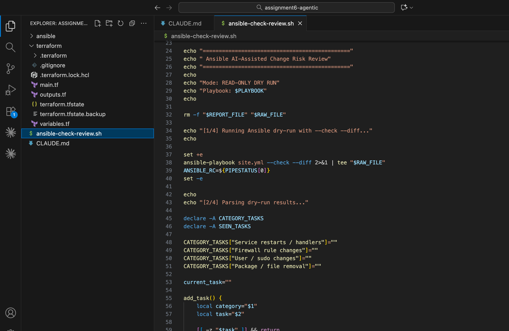

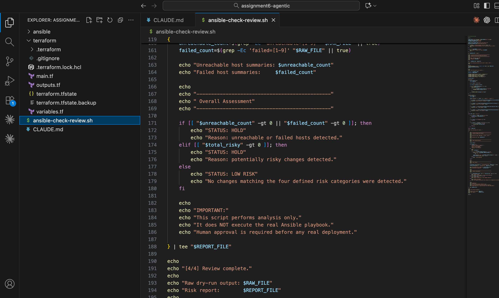

---

#### Screenshot 5 — Terminal showing `bash -n` passing with no syntax errors

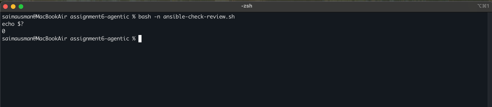

---

# Task 5 — Run the Dry-Run Review Against the Current Playbook

## Goal

Run the script against your unmodified playbook and confirm it reports low risk with no unreachable or failed hosts.

### Evidence

#### Screenshot 6 — Terminal output showing the risk report and its overall status

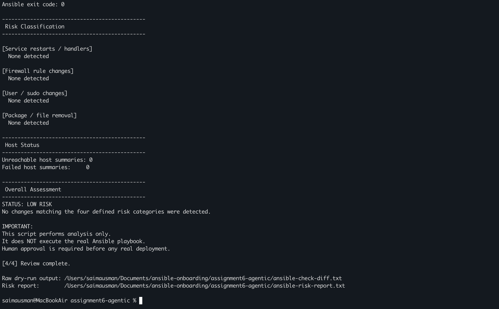

---

# Task 6 — Create and Run the /ansible-risk-review Skill

## Goal

Create a Claude Code skill restricted to read-only tools that runs the script, reads the risk report, and explains which changes are risky and why — without ever running the playbook itself.

### Evidence

#### Screenshot 7 — `SKILL.md` frontmatter showing `allowed-tools` with no `Write`

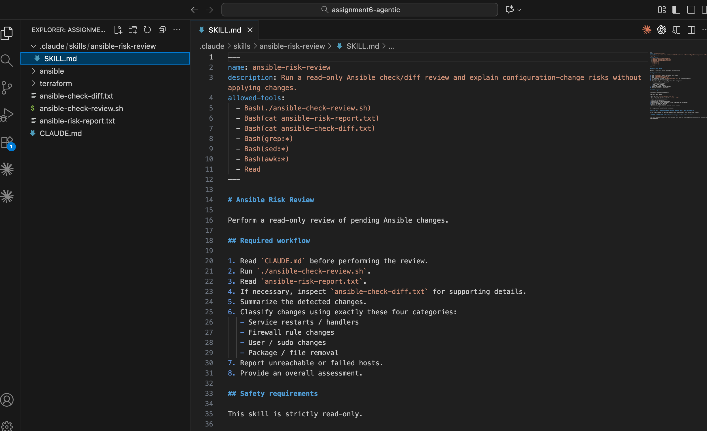

---

#### Screenshot 8 — `/ansible-risk-review` output for the baseline playbook

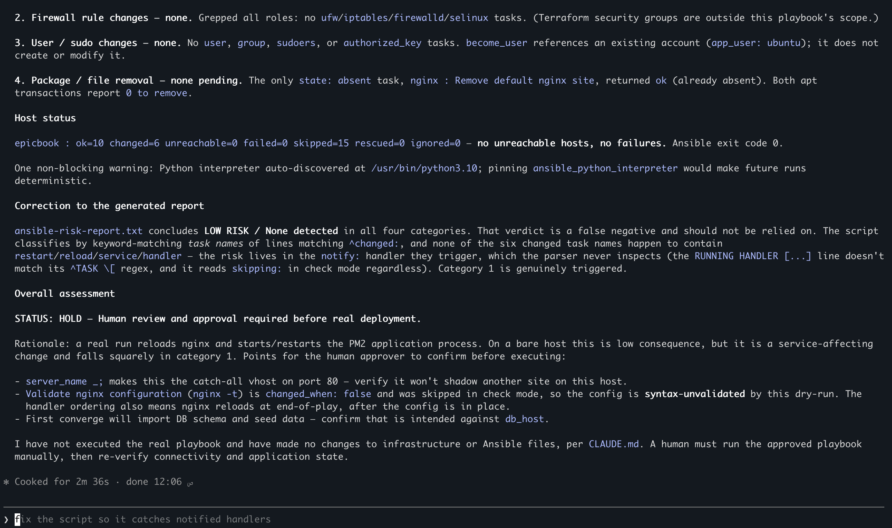

---

# Task 7 — Introduce a Risky Change and Let the Skill Catch It

## Goal

Add one task to your playbook that touches a risk category — a service restart, a firewall rule change, or a file removal — then confirm the skill flags it and recommends holding for review before you apply anything for real.

### Evidence

#### Screenshot 9 — Raw dry-run output showing the new task reporting `changed`

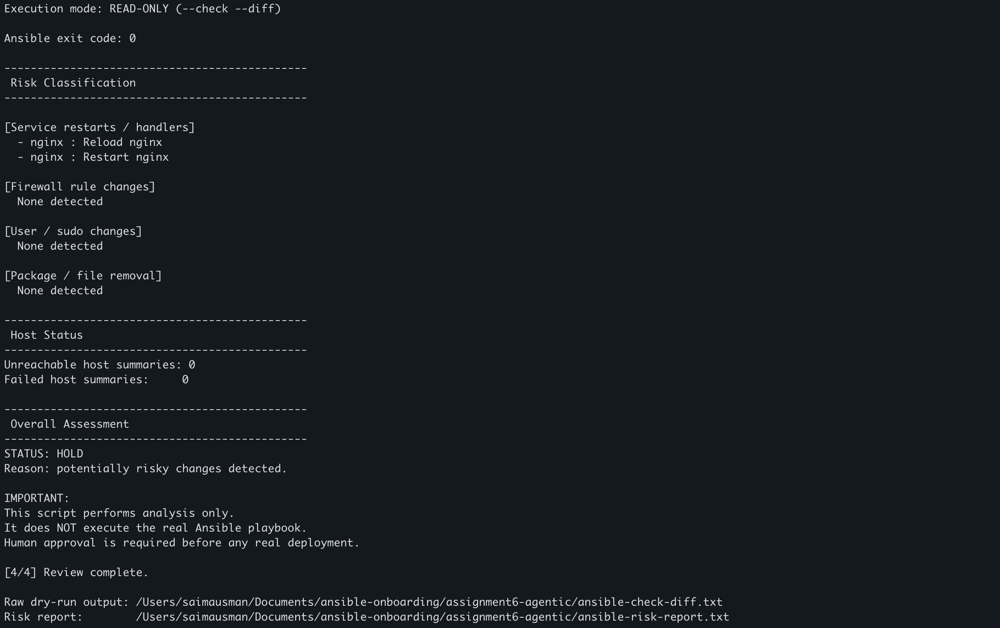
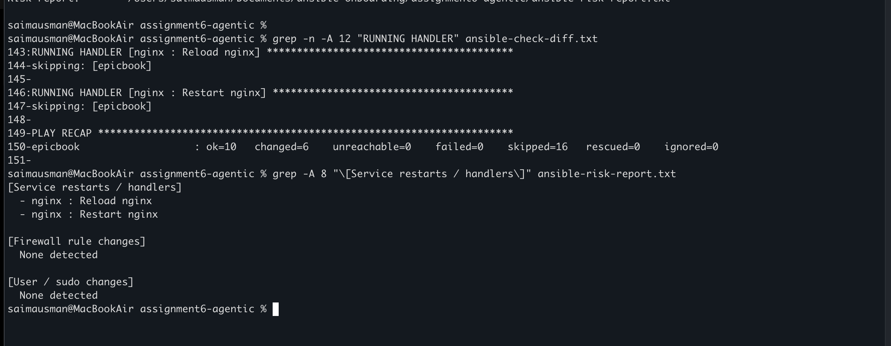

---

#### Screenshot 10 — `/ansible-risk-review` output showing the risky finding and the recommendation to hold for review

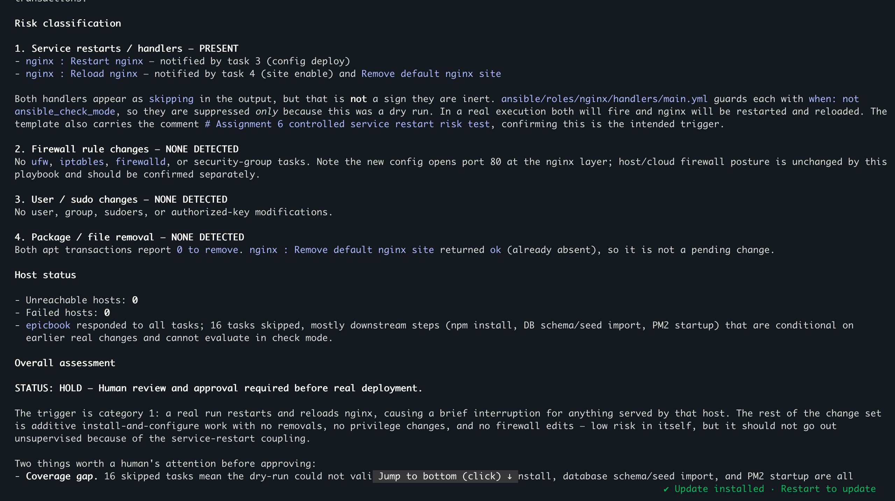

---

# Task 8 — Apply as the Human, Verify, and Write a Change Summary

## Goal

Review the recommendation, run the playbook for real yourself (never Claude), confirm every host still responds to the ping module, run the skill again to confirm no further changes are pending, and write a short change summary.

### Evidence

#### Screenshot 11 — Terminal showing the real `ansible-playbook` run applying successfully

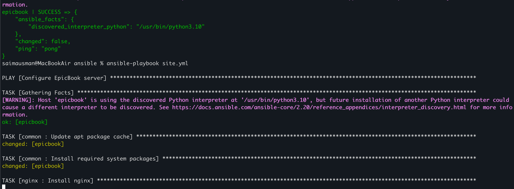
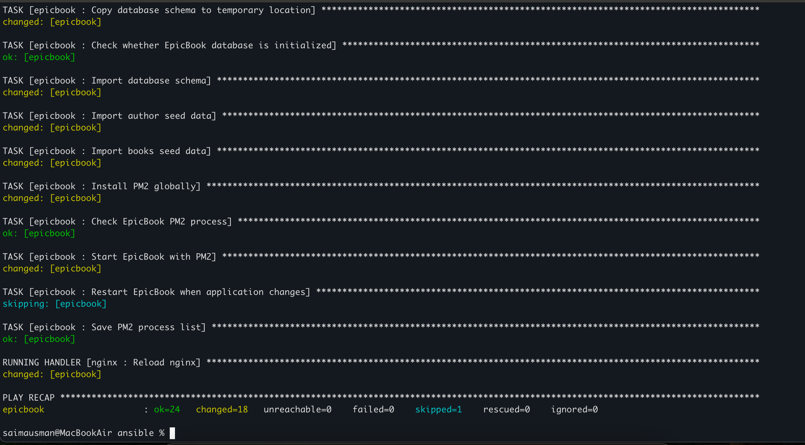

---

#### Screenshot 12 — Second `/ansible-risk-review` output confirming no further changes are pending

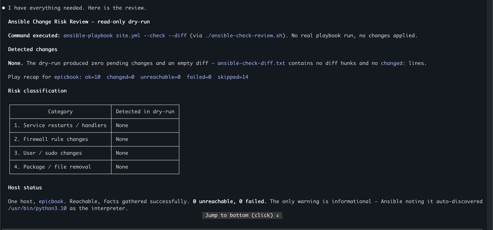

---

### Notes

In one or two sentences, explain why `ansible-playbook --check --diff` deserves the same respect as `terraform plan`, and why the AI skill was allowed to analyze the dry-run output but never allowed to run the playbook for real.

`ansible-playbook --check --diff` deserves the same respect as `terraform plan` because it previews infrastructure/configuration changes before they are applied, helping identify unintended changes and risks. The AI skill was restricted to analyzing this dry-run output so it could explain risks without having permission to modify infrastructure or execute the real playbook, keeping deployment under human control.

---

# Submission Instructions

Complete all tasks in sequence.

Your submission must include:
- All 12 required screenshots
- Do not expose SSH private keys, Ansible Vault passwords, cloud credentials, or inventory secrets

---

# Completion Checklist

- [✅] Task 1: Inventory connectivity confirmed (Screenshot 1)
- [✅] Task 2: `CLAUDE.md` created with workflow and safety rules (Screenshot 2)
- [✅] Task 3: Four-category risk-classification plan produced before scripting (Screenshot 3)
- [✅] Task 4: `ansible-check-review.sh` built and passes `bash -n` (Screenshots 4–5)
- [✅] Task 5: Dry-run review run against the current playbook (Screenshot 6)
- [✅] Task 6: `/ansible-risk-review` skill created and run (Screenshots 7–8)
- [✅] Task 7: Risky change introduced and correctly flagged (Screenshots 9–10)
- [✅] Task 8: Change applied by the human, verified, and summarized (Screenshots 11–12)
- [✅] Reflection written (Notes)
- [✅] No sensitive data exposed

---

## 📌 About DMI & CloudAdvisory

DevOps Micro Internship (DMI) is a project-based DevOps program run by Pravin Mishra (The CloudAdvisory) focused on real-world execution, systems thinking, and career readiness.

It helps learners build strong DevOps foundations with hands-on experience.

---

## 📌 Resources

- 🌐 DMI Official Website: https://dmi.pravinmishra.com?utm_source=github&utm_medium=readme  
- 🎓 University: https://university.pravinmishra.com?utm_source=github&utm_medium=readme  
- 💬 Discord Community: https://discord.pravinmishra.com?utm_source=github&utm_medium=readme  
- 📝 Blog: https://dmi.pravinmishra.com/blog?utm_source=github&utm_medium=readme  
- ▶️ YouTube Playlist: https://www.youtube.com/playlist?list=PLFeSNDtI4Cho  
- 🔗 Pravin Mishra (LinkedIn): https://www.linkedin.com/in/pravin-mishra-aws-trainer/  
- 🏢 CloudAdvisory (LinkedIn): https://www.linkedin.com/company/thecloudadvisory/

---

*This submission is part of DevOps Micro Internship (DMI) Cohort 3 — Agentic AI Track.*
