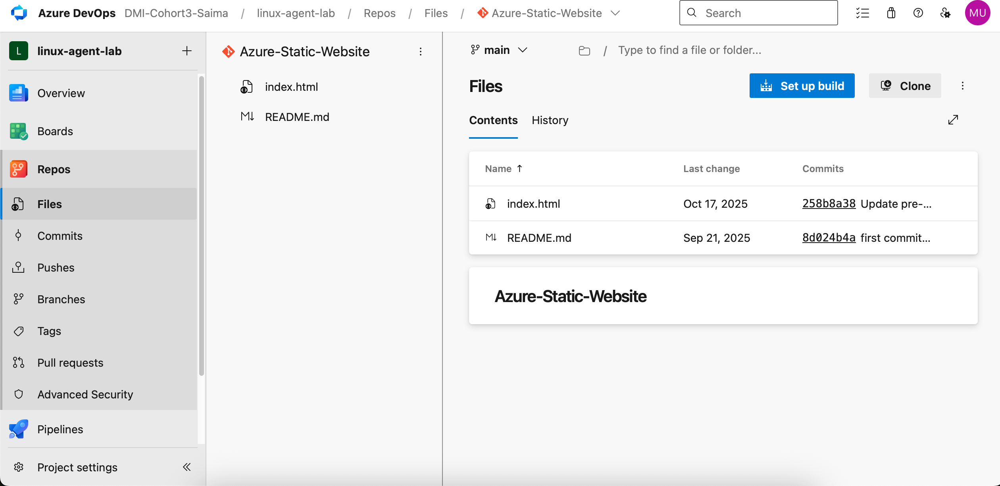
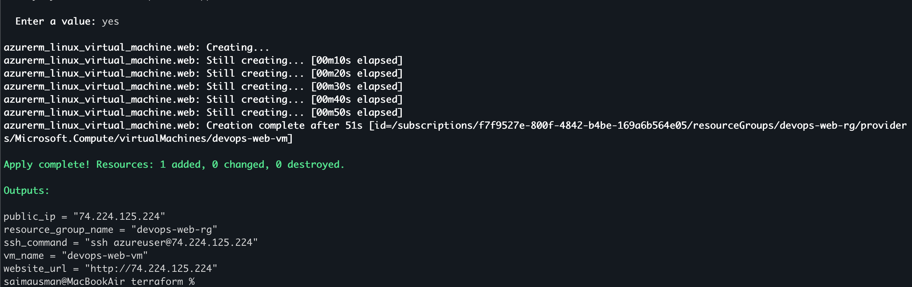
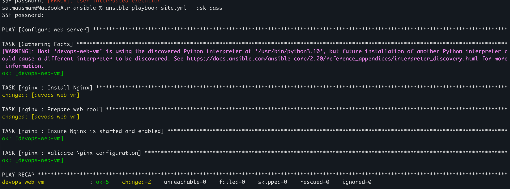
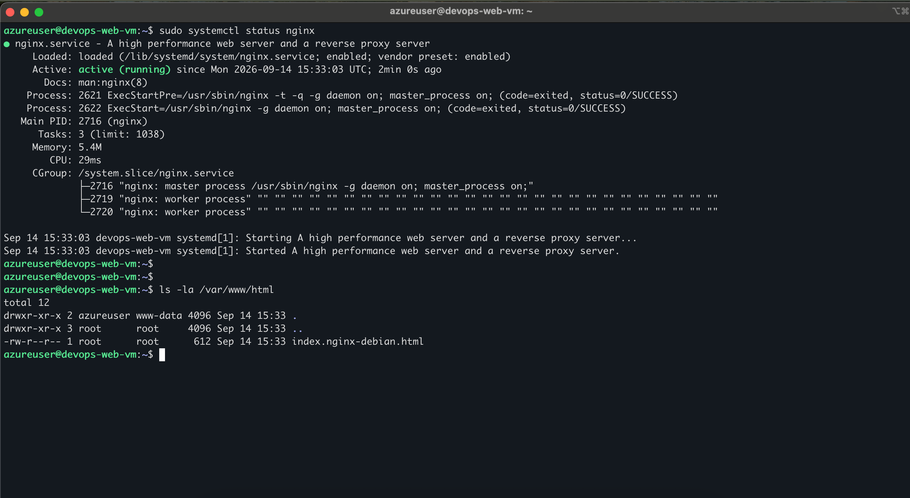
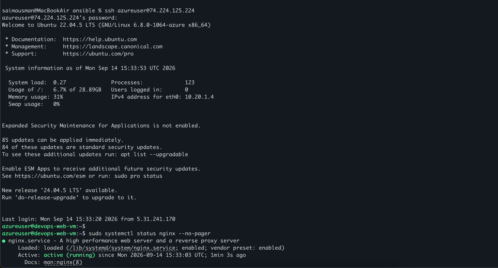
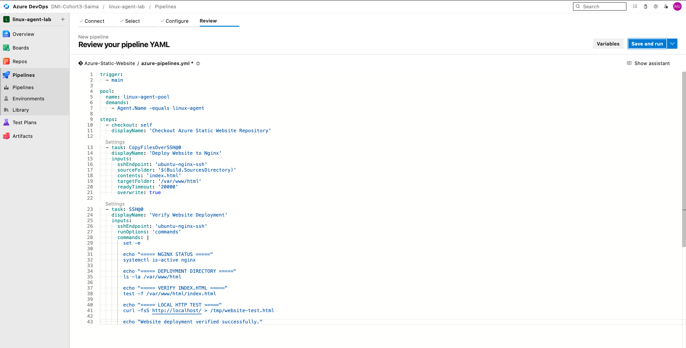
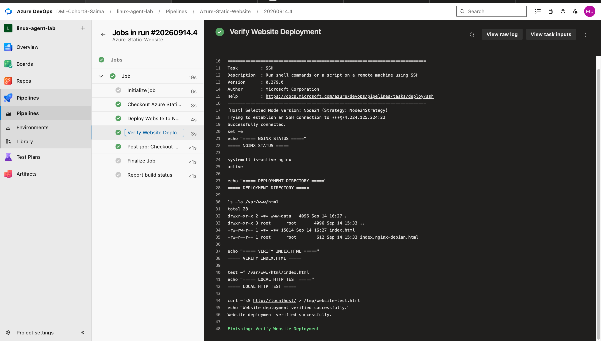
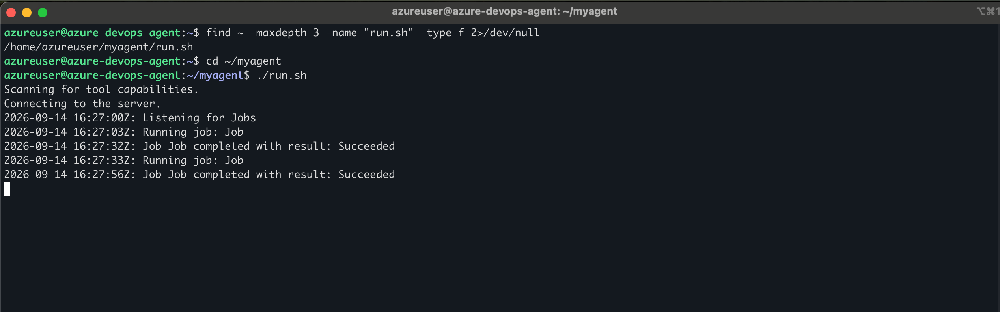
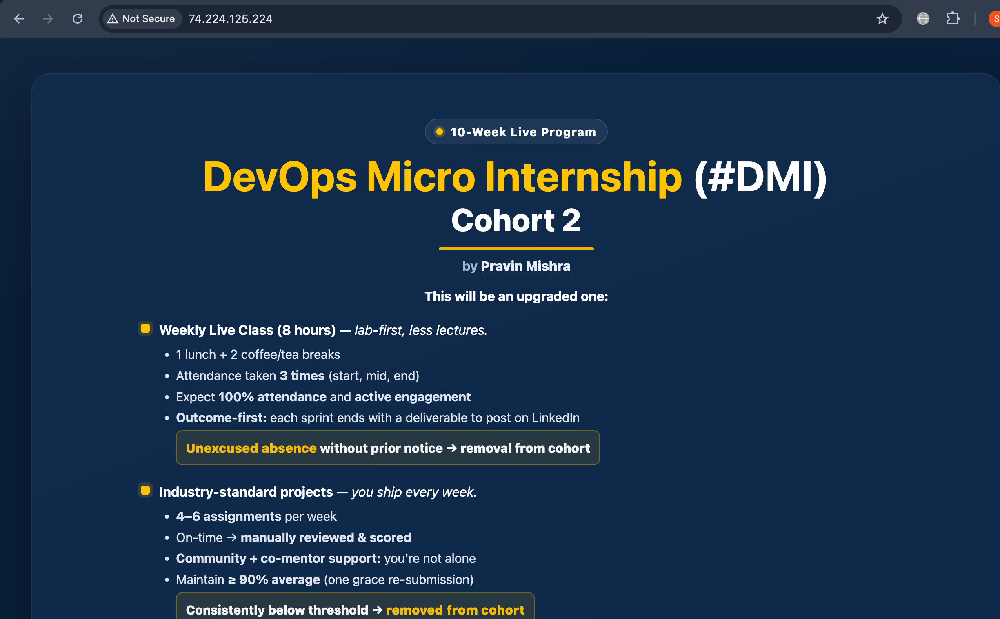

# Assignment 2 — Deploy Mini Finance Project via Azure DevOps Pipeline

Part of the DevOps Micro Internship (DMI) Cohort 3 with Agentic AI

---

## Purpose

In this assignment, you will build an Azure DevOps CI/CD pipeline that deploys the Mini Finance static website to an Ubuntu VM running Nginx: importing the repo into Azure Repos, provisioning the VM with Terraform and Ansible, connecting via an SSH Service Connection, and deploying on every commit to `main`.

---

# Task 1 — Import the Repository

## Goal

Import `https://github.com/pravinmishraaws/Azure-Static-Website` into Azure Repos and confirm `index.html` is present.

### Evidence

#### Screenshot 1 — Azure Repos showing the imported repository files with `index.html` visible

---

# Task 2 — Prepare the Target VM

## Goal

Provision a Linux VM with Terraform (ports 22/80 open), then use Ansible to install and start Nginx and prepare `/var/www/html`.

### Evidence

#### Screenshot 2 — Terraform output or cloud console showing the running VM and public IP

---

#### Screenshot 3 — Terminal showing Ansible completed successfully and Nginx is active

---

# Task 3 — Create an SSH Service Connection

## Goal

Create the password-based SSH Service Connection `ubuntu-nginx-ssh` pointing to the VM, and validate it.

### Evidence

#### Screenshot 4 — SSH Service Connection configuration page showing the connection details and successful validation, with the password hidden

---

# Task 4 — Author the YAML Pipeline

## Goal

Write a pipeline triggered on `main` that checks out the repo, copies files to `/var/www/html` via `CopyFilesOverSSH@0`, and verifies the deployment directory via an `SSH@0` task, using `ubuntu-nginx-ssh` and the self-hosted (or available Microsoft-hosted) pool.

### Evidence

#### Screenshot 5 — Pipeline YAML definition open in the Azure DevOps editor

---

# Task 5 — Verify Deployment

## Goal

Confirm the pipeline run succeeded (checkout, SSH connection, file transfer, remote verification) and the Mini Finance website is live at the VM's public IP.

### Evidence

#### Screenshot 6 — Successful Azure DevOps pipeline run log summary

---

#### Screenshot 7 — Browser showing the deployed website with the VM public IP visible

---

### Notes

Include the VM public URL. Describe any issue you faced and how you fixed it (e.g. parallelism/agent-pool issues).

### VM Public URL: 
http://74.224.125.224

The website was successfully deployed to the Azure Linux VM using an Azure DevOps YAML pipeline. The pipeline checked out the main branch, copied index.html to /var/www/html using CopyFilesOverSSH@0, and verified the deployment using SSH@0.

### Issues faced and resolutions:

VM SKU availability: The initial Standard_B1s VM size was unavailable in the South India region due to Azure capacity restrictions. I changed the VM size to Standard_B2ats_v2, after which Terraform successfully provisioned the VM.

### Azure DevOps agent offline: 
The self-hosted linux-agent was initially offline, causing the deployment pipeline to remain queued. I restarted the Azure DevOps agent on the azure-devops-agent VM using ./run.sh. The agent returned to Online, allowing the queued pipeline to execute successfully.

### Service connection: 
The pipeline initially could not find ubuntu-nginx-ssh. The SSH service connection was created and configured in the linux-agent-lab project with the web VM's public IP and azureuser credentials.

Overall, the deployment was completed successfully using Terraform + Ansible + Azure DevOps + self-hosted Linux agent + Nginx.

---

# Submission Instructions

- Add all required screenshots in your submission
- Do not commit the VM password to the repository or write it directly in YAML

---

# Completion Checklist

- [✅] Task 1: Repository imported into Azure Repos (Screenshot 1)
- [✅] Task 2: VM provisioned and Nginx configured (Screenshots 2–3)
- [✅] Task 3: SSH Service Connection created and validated (Screenshot 4)
- [✅] Task 4: YAML pipeline authored (Screenshot 5)
- [✅] Task 5: Pipeline run succeeded and site verified (Screenshots 6–7)
- [✅] VM URL and issue notes written (Notes)
- [✅] No passwords, tokens, or credentials exposed

---

## 📌 About DMI & CloudAdvisory

DevOps Micro Internship (DMI) is a project-based DevOps program run by Pravin Mishra (The CloudAdvisory) focused on real-world execution, systems thinking, and career readiness.

It helps learners build strong DevOps foundations with hands-on experience.

---

## 📌 Resources

- 🌐 DMI Official Website: https://dmi.pravinmishra.com?utm_source=github&utm_medium=readme  
- 🎓 University: https://university.pravinmishra.com?utm_source=github&utm_medium=readme  
- 💬 Discord Community: https://discord.pravinmishra.com?utm_source=github&utm_medium=readme  
- 📝 Blog: https://dmi.pravinmishra.com/blog?utm_source=github&utm_medium=readme  
- ▶️ YouTube Playlist: https://www.youtube.com/playlist?list=PLFeSNDtI4Cho  
- 🔗 Pravin Mishra (LinkedIn): https://www.linkedin.com/in/pravin-mishra-aws-trainer/  
- 🏢 CloudAdvisory (LinkedIn): https://www.linkedin.com/company/thecloudadvisory/

---

*This submission is part of DevOps Micro Internship (DMI) Cohort 3 — Agentic AI Track.*
