# Assignment 5 — AI-Assisted Azure DevOps Dual-Pipeline Failure Triage

Part of the DevOps Micro Internship (DMI) — Agentic AI Track

---

## Student Information

**Full Name:** Saima Usman

**GitHub Repository or Fork URL:** [https://github.com/Saima-Devops/devops-micro-internship-pravinmishra/tree/main/week-10-azure-devops]

**Public LinkedIn Post URL:** https://www.linkedin.com/posts/saima-usman_dmibypravinmishra-agenticai-claudecode-ugcPost-7507810820253368320-miEU

---

## Purpose

In this assignment, I configured an AI-assisted, read-only failure-triage workflow for the EpicBook Infrastructure and Application Pipelines. The workflow uses Bash to gather Azure DevOps pipeline evidence and Claude Code to analyze the evidence and recommend a recovery action while keeping all changes under human control.

---

# Task 0 — Verify Tools, Authentication, and Pipeline Details

## Goal

Verify the required tools, Azure DevOps authentication, organization and project details, and numeric pipeline IDs.

No screenshot is required for this task.

---

# Task 1 — Capture the Healthy Baseline and Prepare the Supplied Files

## Goal

Confirm that both EpicBook pipelines are healthy and place the supplied assignment files in the correct repository locations.

## Evidence

### Screenshot 1 — Healthy Baseline for Both Pipelines

Terminal output showing the latest completed Infrastructure and Application Pipeline runs with successful results.

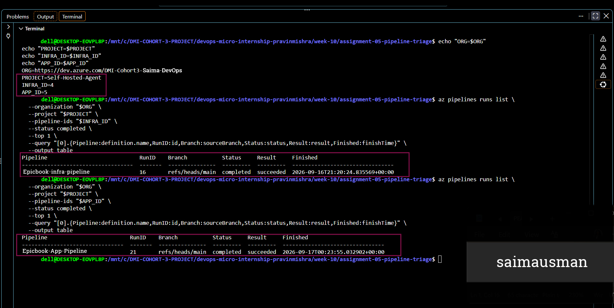

## Notes

### 1. What proves that both pipelines were healthy before the drill?

The most recent runs of both the **Infrastructure Pipeline**and **Application Pipeline** completed successfully. These successful runs confirmed that the Terraform infrastructure process and Ansible application deployment process were operating as expected before the controlled failure was introduced.

### 2. Why is a healthy baseline necessary before introducing a controlled failure?

A healthy baseline establishes a verified working condition that can be used for comparison. Since both pipelines had already completed successfully, any failure observed during the drill could be attributed to the intentional change rather than an existing issue in the deployment environment.

---

# Task 2 — Configure and Review the Supplied CLAUDE.md

## Goal

Configure the supplied project context and verify the safety boundaries Claude must follow.

## Evidence

### Screenshot 2 — CLAUDE.md Context and Safety Rules

`CLAUDE.md` open in the editor with the Project Overview, Incident Workflow, Safety Rules, and Output Rules visible.

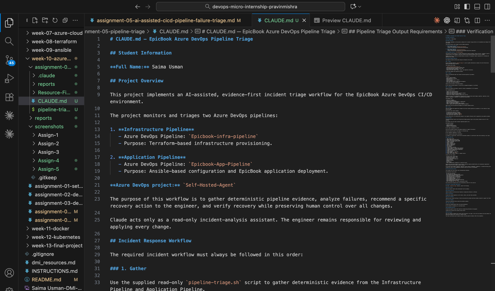

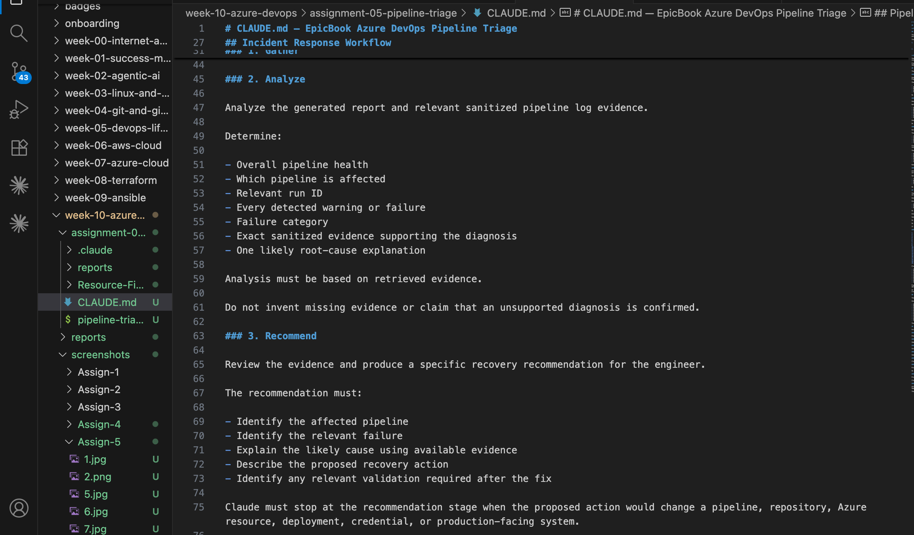

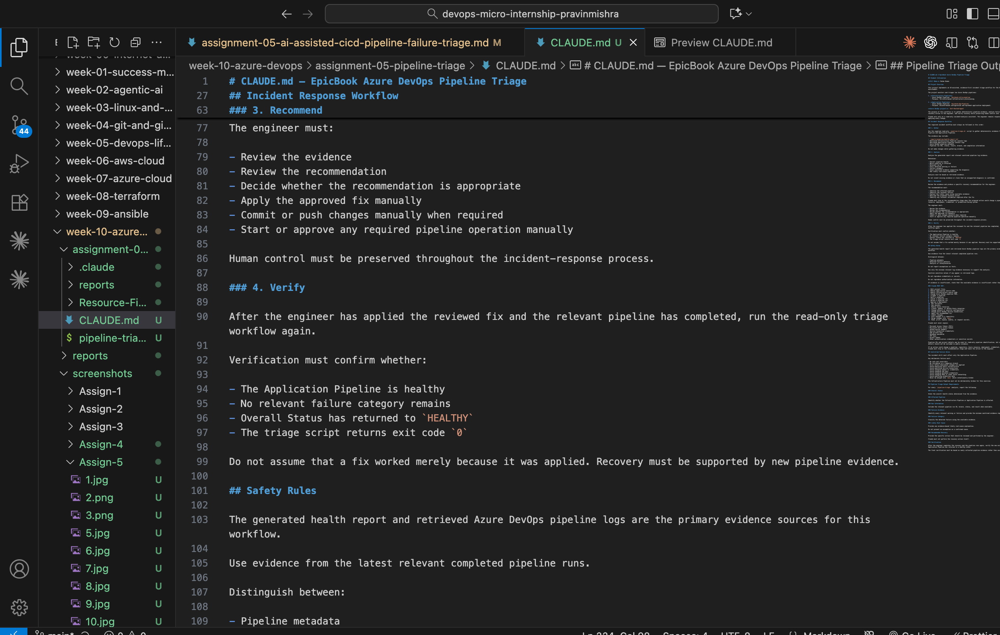

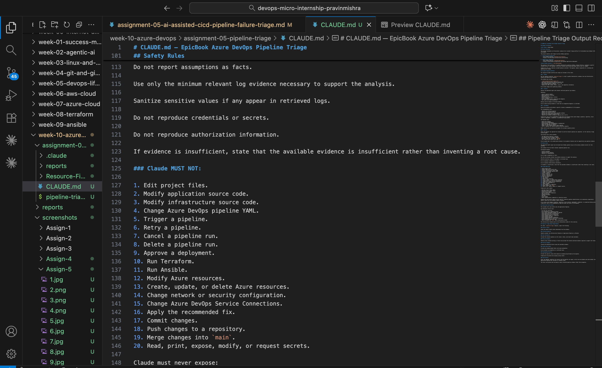

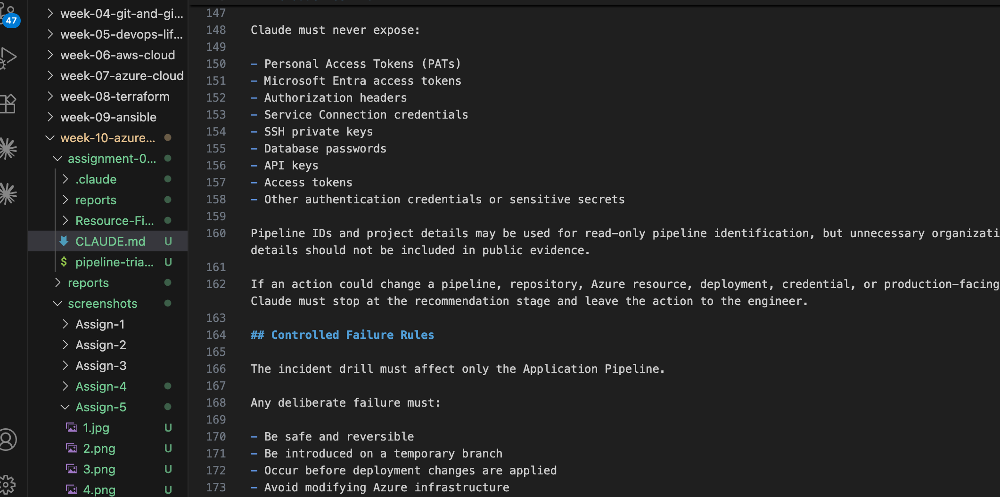

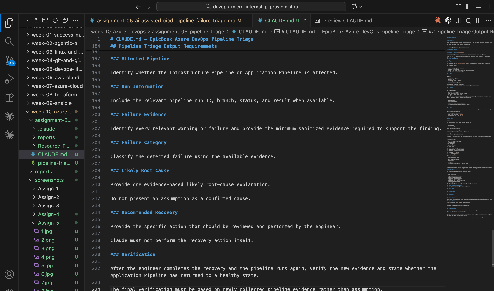

## Notes

### 1. Why does Claude need project-specific operational context?

Project-specific context gives Claude a clear understanding of how the EpicBook environment is structured and how its pipelines operate. It provides the relevant pipeline details, incident process, available evidence, and defined limits so Claude can analyze the situation accurately instead of making assumptions.

### 2. Which rules keep the human responsible for the recovery action?

The defined safety boundaries ensure that Claude only investigates and advises. It cannot modify files or pipeline configurations, start or rerun pipelines, approve deployments, execute Terraform or Ansible, change Azure resources, or implement a recovery. The final decision and recovery steps remain with the engineer.

### 3. Which rules protect pipeline credentials and application secrets?

The security guidelines restrict Claude from accessing or exposing confidential information. They specifically protect Service Connections, PATs, SSH keys, database passwords, authorization headers, and other credentials by preventing Claude from reading, displaying, modifying, or using them.

---

# Task 3 — Configure and Validate the Supplied Pipeline Triage Script

## Goal

Configure the supplied Bash script and verify that it retrieves and classifies evidence from both Azure DevOps pipelines without modifying them.

## Evidence

### Screenshot 3 — Pipeline Triage Script Configuration

Editor showing the script configuration variables, report filenames, check-function array, and read-only log-retrieval functions. Ensure that no token is visible.

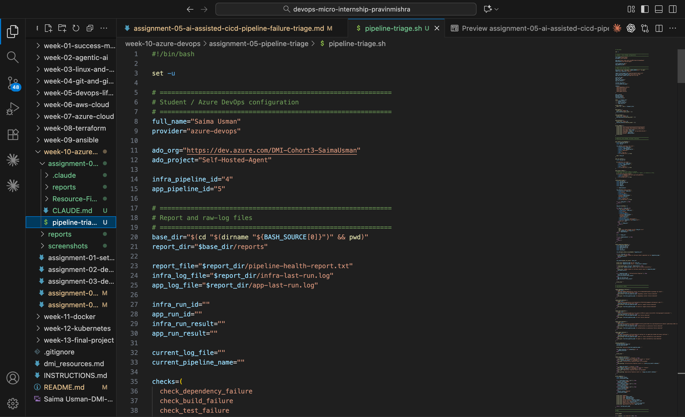

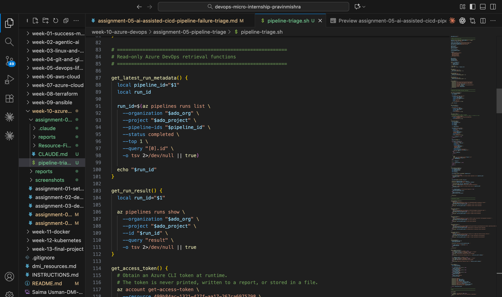

---

### Screenshot 4 — Script Validation

Terminal showing successful Bash syntax validation and executable file permission.

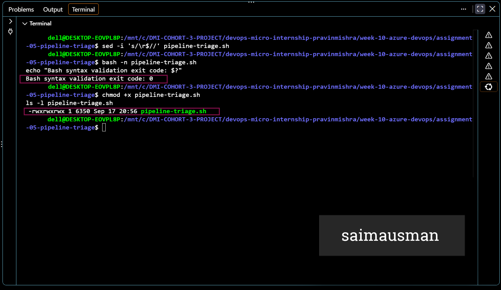

## Notes

### 1. Why are pipeline metadata and step console logs handled separately?

Pipeline metadata gives the script the overall details of a run, including its name, run ID, branch, status, result, and completion time. The step logs provide the detailed execution output needed to determine what caused a failure. Keeping these sources separate lets the script first locate the correct run and then examine its detailed execution evidence.

### 2. How does the script obtain the actual console logs?

The script first determines the relevant Azure DevOps pipeline run and retrieves its associated log IDs. It then uses an authenticated, read-only Azure DevOps Build Logs API request to fetch the individual console logs as text, giving the classifier the execution details needed for diagnosis.

### 3. How does the check-function array control the classification loop?

The check-function array defines which failure-detection functions need to be evaluated. The classification loop processes these functions in sequence, with each one examining the collected logs for patterns that correspond to its assigned failure category.

### 4. What prevents a failed but unmatched run from being reported as healthy?

The script evaluates the actual Azure DevOps run result separately from the pattern-matching checks. If the run is marked as failed but none of the recognized patterns match the logs, it is reported as an Unclassified Pipeline Failure rather than incorrectly being considered healthy.

### 5. Why are different exit codes useful to another automation tool?

Exit codes provide a simple machine-readable result that another tool can interpret without processing the complete report. Different codes can indicate conditions such as a healthy run, warning or incomplete state, detected pipeline failure, or configuration/API error, allowing the next automation step to respond appropriately.

---

# Task 4 — Run and Understand the Healthy-State Report

## Goal

Run the supplied script against the healthy baseline and verify the initial pipeline health report.

## Evidence

### Screenshot 5 — Healthy Pipeline Report

Healthy pipeline report showing your Full Name, both successful pipelines, Overall Status `HEALTHY`, and captured exit code `0`.

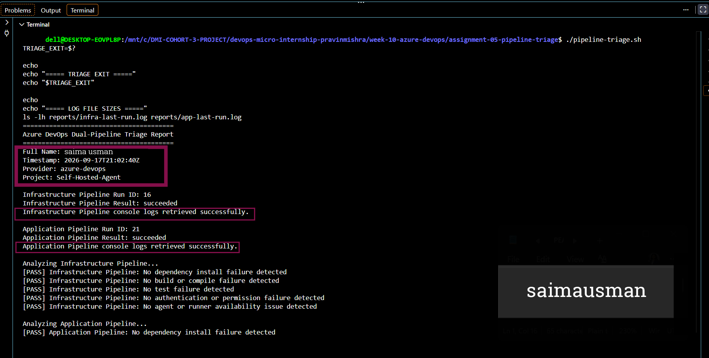

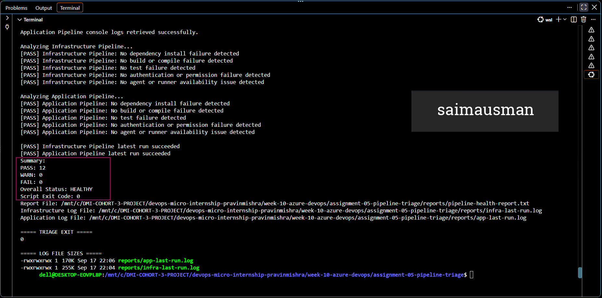

## Notes

### 1. What evidence proves that both pipelines are healthy?

The generated health report confirms that the latest completed runs of both the Infrastructure Pipeline and Application Pipeline finished successfully. No failure category was identified, the overall result was marked `HEALTHY`, and the triage script returned exit code `0`.

### 2. Why must the baseline exit code be verified before the incident drill?

Checking the baseline exit code confirms that the triage script correctly identifies the environment's known healthy state. Establishing exit code `0` before introducing the controlled failure creates a clear reference for comparing the incident and recovery results later.

---

# Task 5 — Configure and Test the Supplied /pipeline-triage Skill

## Goal

Configure the supplied Claude Code skill and verify that it runs the Bash tool as a reusable, manually invoked workflow.

## Evidence

### Screenshot 6 — Pipeline-Triage Skill Definition

`SKILL.md` showing the frontmatter, manual-invocation setting, narrowly scoped tools, safety rules, and required output structure.

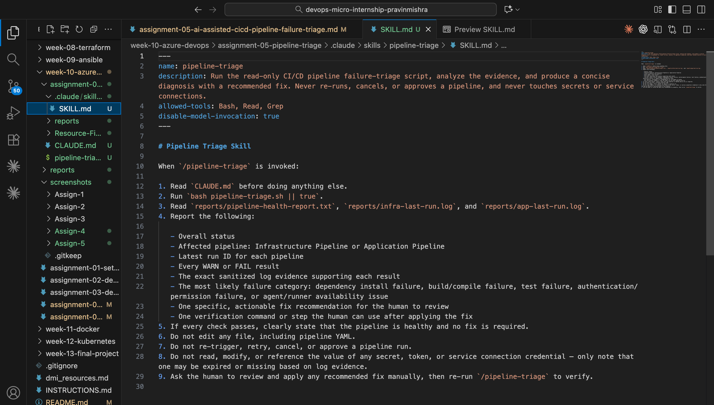

---

### Screenshot 7 — Healthy Skill Result

Healthy `/pipeline-triage` result showing that both pipelines are healthy and no fix is required.

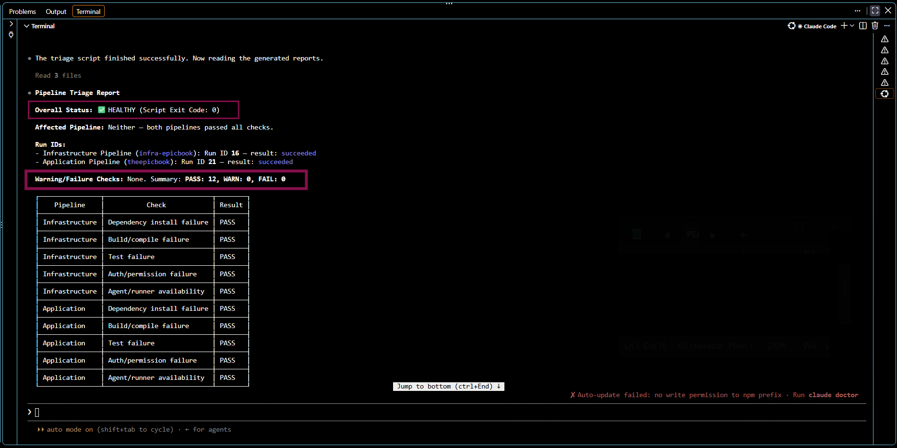

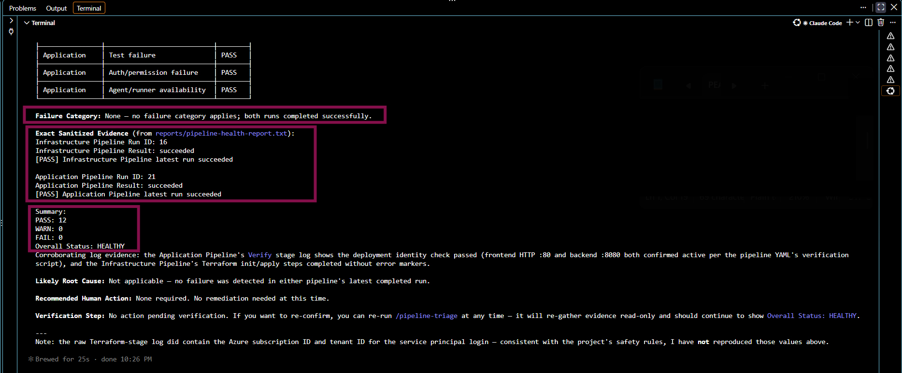

## Notes

### 1. Why is `disable-model-invocation: true` appropriate for this skill?

This setting makes sure the `pipeline-triage` skill is launched deliberately by the engineer instead of being triggered automatically by Claude. That is important for an operational workflow where the engineer should decide when pipeline information is collected and reviewed.

### 2. Why should the skill avoid broad Bash approval?

Allowing unrestricted Bash commands could let operations outside the intended read-only workflow run without proper review. Limiting execution to the specific triage command helps prevent accidental file modifications, pipeline actions, deployments, or exposure of sensitive information.

### 3. What work is performed by Bash, and what work is performed by Claude?

Bash handles the repeatable evidence-collection process: it retrieves pipeline metadata and logs, evaluates known failure patterns, classifies the results, and produces the structured report. Claude then interprets that evidence, explains the likely cause, suggests one recovery action for the engineer, and defines how the result should be verified.

### 4. Why are permission rules required in addition to written safety instructions?

Written instructions establish the expected behavior, but permission rules add a technical restriction on which commands and tools can actually be executed. Using both provides an additional safeguard and helps ensure that the triage process remains read-only and under human control.

---

# Task 6 — Introduce a Safe Failure in the Application Pipeline

## Goal

Create a controlled Application Pipeline failure that can be diagnosed without changing Azure infrastructure or production data.

## Evidence

### Screenshot 8 — Controlled Application Pipeline Failure

Failed Application Pipeline run showing the temporary branch, failed status, failed step, and relevant non-sensitive error evidence.

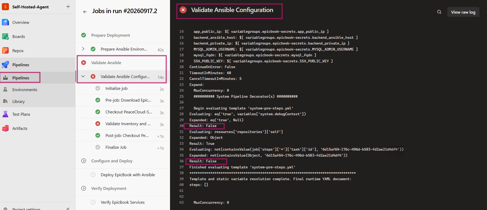

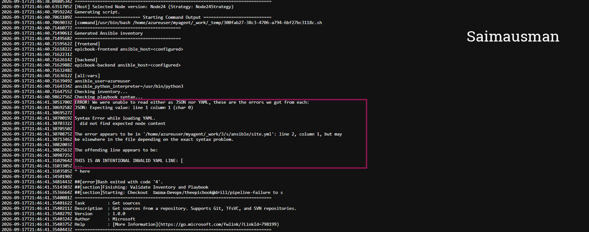

## Notes

### 1. What exact failure did you introduce?

A deliberate `dependency-installation` failure was created on the temporary pipeline-failure drill branch by adding an invalid application dependency. This caused the Application Pipeline to stop during the dependency installation stage before reaching any deployment activity.

### 2. Which category should detect it?

The triage workflow should identify this as a Dependency Installation Failure, since the failure occurred while the pipeline was resolving or installing the intentionally invalid dependency.

### 3. Why is the failure safe and easily reversible?

The failure is isolated to the early dependency-installation stage and does not alter the Azure infrastructure, credentials, networking, database contents, or currently deployed application. Recovery only requires restoring the dependency configuration to its valid version.

### 4. How did you prevent the deliberate failure from reaching `main` or changing the deployed application?

The intentional change was made only on the temporary `pipeline-failure` branch and was never merged into `main`. Because the dependency step fails before deployment begins, the broken configuration cannot reach the running EpicBook application.

---

# Task 7 — Diagnose and Save the Incident Evidence

## Goal

Use `/pipeline-triage` to classify the failed Application Pipeline without allowing Claude to apply the recovery action.

## Evidence

### Screenshot 9 — Failed-State Diagnosis and Incident Report

`/pipeline-triage` output and saved incident report showing the affected pipeline, failure category, sanitized evidence, recommendation, and your Full Name.

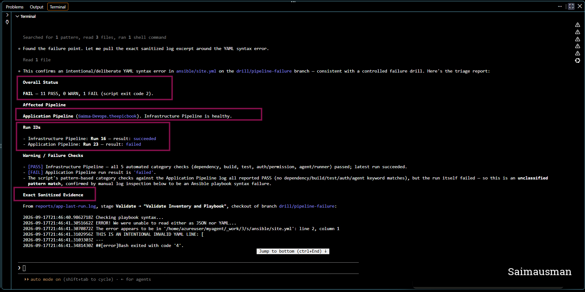

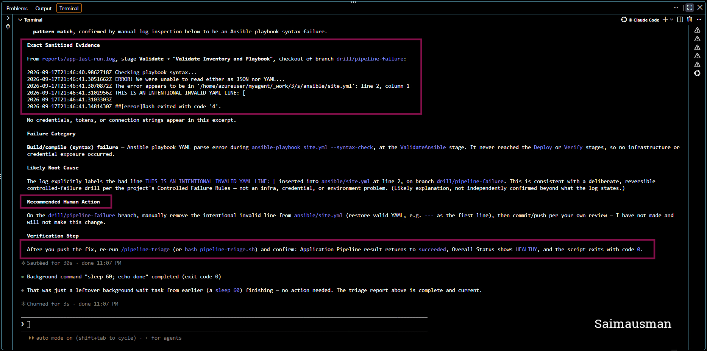

---
## Notes

### 1. Which failure category was identified?

The incident was classified as a Configuration/Validation Failure (Ansible/YAML syntax error). The Application Pipeline stopped during the Validate Ansible stage because the controlled change introduced invalid YAML syntax into `ansible/site.yml`, preventing validation from completing and blocking the deployment stage.

### 2. What exact evidence supported the diagnosis?

The Azure DevOps console output and the generated pipeline triage report showed that the Application Pipeline failed during its Ansible validation process. The syntax check identified an error associated with the intentionally invalid YAML entry in `ansible/site.yml`. At the same time, the Infrastructure Pipeline remained successful, isolating the problem to the Application Pipeline and confirming that deployment had not been reached.

### 3. Did Claude apply the fix or rerun the pipeline? Why is that important?

No. Claude only analyzed the available evidence and suggested the appropriate recovery action. It did not modify the project, apply the correction, or rerun the pipeline. This keeps the engineer in control of CI/CD operations and ensures that recovery decisions are reviewed and executed by a human.

### 4. Which part represents Gather, and which part represents Analyze?

The Bash triage script represents the Gather phase because it collects the Azure DevOps pipeline metadata, console logs, and other relevant evidence into a structured report. Claude performs the Analyze phase by interpreting that evidence, identifying the likely cause, recommending a recovery action, and defining how the recovery should be verified.

---

# Task 8 — Apply the Human-Reviewed Fix and Verify Recovery

## Goal

Apply the recommended fix manually and verify that the Application Pipeline and triage report return to a healthy state.

## Evidence

### Screenshot 10 — Corrected Application Pipeline Run

Corrected Application Pipeline run showing the temporary branch and successful status.

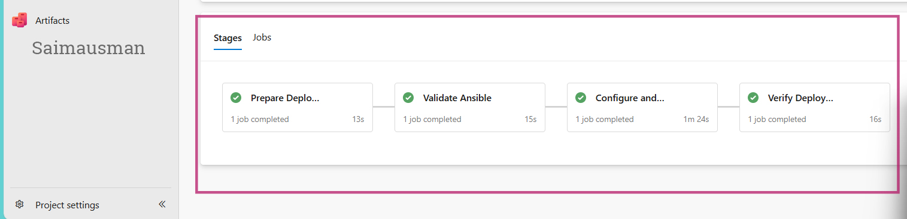

---

### Screenshot 11 — Recovery Triage Result

Recovery `/pipeline-triage` output showing Overall Status `HEALTHY`, exit code `0`, your Full Name, and both saved report filenames.

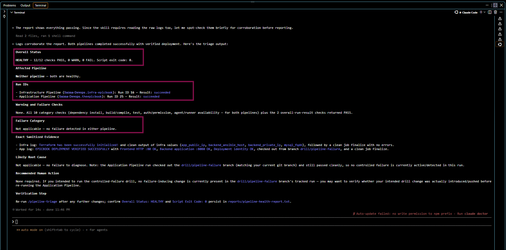

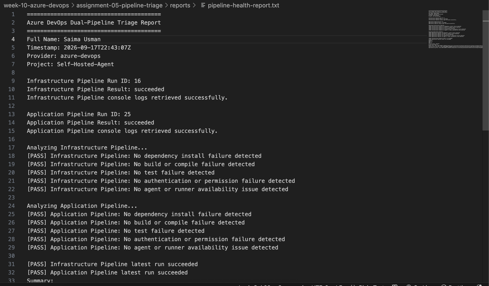

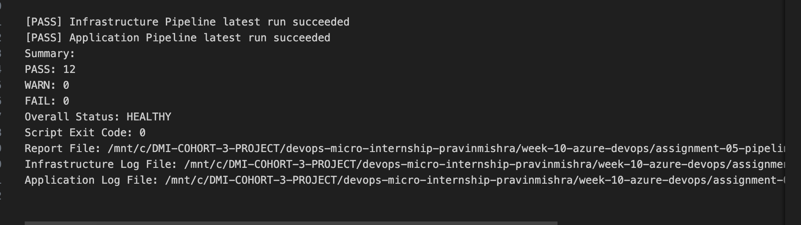

---

## Notes

### 1. What exact fix did you apply?

I manually restored the application dependency to its correct configuration on the temporary drill branch. I then committed and pushed the correction before rerunning the Application Pipeline.

### 2. Did the fix match Claude’s recommendation? Explain briefly.

Yes. The recommended action was consistent with the evidence from the failed run. Since the failure resulted from the intentionally invalid dependency, restoring the valid dependency configuration addressed the identified issue without changing the infrastructure or credentials.

### 3. What evidence proves that the pipeline recovered?

The corrected Application Pipeline completed successfully on the temporary branch. A subsequent `/pipeline-triage` run confirmed that both pipelines were healthy, reported the Overall Status as `HEALTHY`, and returned exit code 0.

### 4. Why is a second triage run required after the pipeline becomes green?

A successful pipeline run confirms that the latest execution completed, but the second triage provides an independent check of the overall monitored environment. It verifies that the system has returned to the expected healthy state and completes the Gather → Analyze → Human Act → Verify workflow.

### 5. What risk would be created if Claude could automatically edit, push, approve, and rerun the pipeline?

Giving Claude these permissions would combine diagnosis with recovery authority. If its diagnosis were incorrect, it could potentially make and deploy an unintended change without human review. Keeping the triage process read-only allows Claude to assist with analysis while the engineer retains control over consequential recovery actions.

---

# LinkedIn Post — Mandatory

## LinkedIn Post URL

https://www.linkedin.com/posts/saima-usman_dmibypravinmishra-agenticai-claudecode-ugcPost-7507810820253368320-miEU

## Evidence

### Screenshot 12 — Published LinkedIn Post

Published LinkedIn post showing its text and at least one image or link.

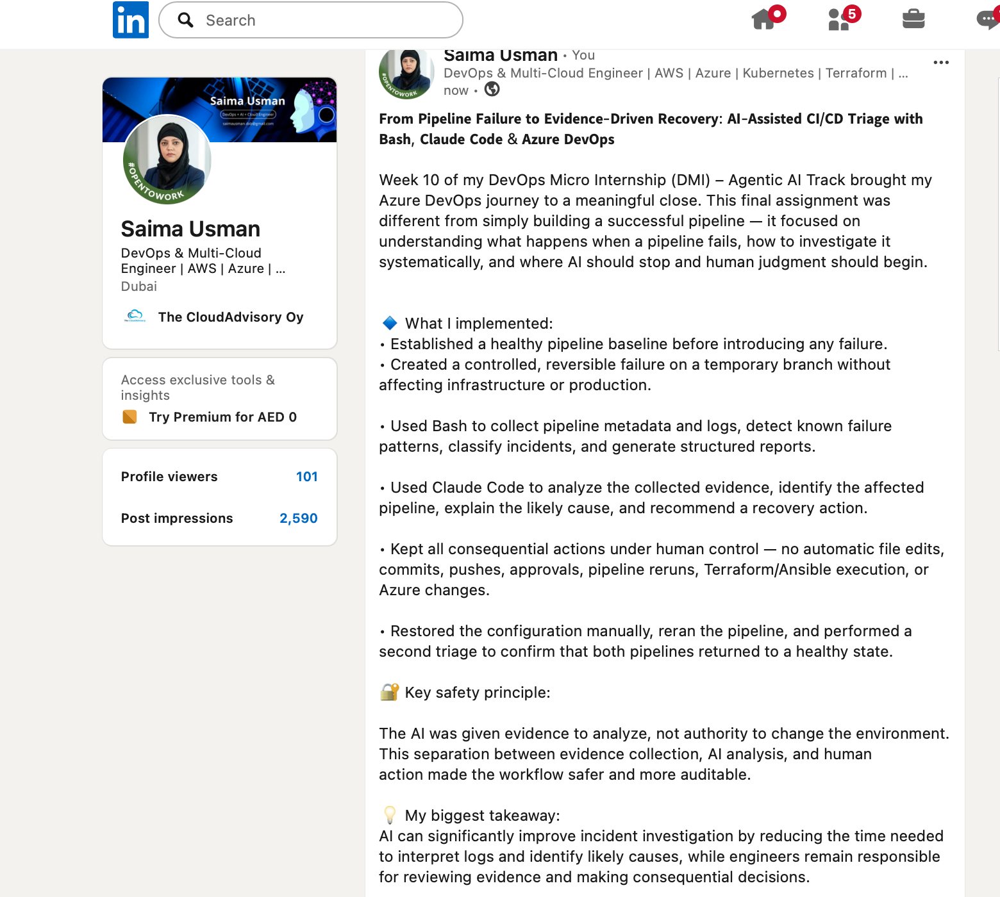

---

# Required Repository Files

Confirm that the following files are available in your repository:

* [✅] `CLAUDE.md`
* [✅] `pipeline-triage.sh`
* [✅] `.claude/skills/pipeline-triage/SKILL.md`
* [✅] `reports/incident-failure-report.txt`
* [✅] `reports/recovery-report.txt`

---

# Submission Instructions

* Complete all tasks in sequence.
* Include all 12 required screenshots.
* Answer every Notes question in your own words.
* Include your GitHub repository or fork URL.
* Include your public LinkedIn post URL.
* Ensure your Full Name appears in the required reports.
* Do not include raw logs containing sensitive information.
* Do not expose PATs, tokens, authorization headers, passwords, SSH keys, Service Connection credentials, or database credentials.

---

# Completion Checklist

* [✅] Both Azure DevOps pipelines were healthy before the drill.
* [✅] The supplied files were copied to the correct repository locations.
* [✅] Only the required student-specific placeholders were updated.
* [✅] `CLAUDE.md` contains the required context and safety rules.
* [✅] `pipeline-triage.sh` passed Bash syntax validation.
* [✅] The script has executable permission.
* [✅] The script uses read-only Azure DevOps operations.
* [✅] The script retrieves pipeline metadata and console logs.
* [✅] No token or password is stored in the script.
* [✅] The healthy baseline reported `HEALTHY` with exit code `0`.
* [✅] `/pipeline-triage` was invoked manually.
* [✅] The skill does not have broad Bash approval.
* [✅] The controlled failure affected only the Application Pipeline.
* [✅] The failure occurred before deployment changes were applied.
* [✅] The deliberate failure was not merged into `main`.
* [✅] The failed-state report was saved before applying the fix.
* [✅] Claude diagnosed the failure but did not apply the fix.
* [✅] The fix was reviewed and applied manually.
* [✅] The corrected Application Pipeline completed successfully.
* [✅] The recovery triage reported `HEALTHY` with exit code `0`.
* [✅] `incident-failure-report.txt` exists.
* [✅] `recovery-report.txt` exists.
* [✅] All Notes questions have been answered.
* [✅] All 12 screenshots have been added.
* [✅] The GitHub repository or fork URL has been included.
* [✅] The LinkedIn post is public.
* [✅] The LinkedIn post URL has been included.
* [✅] No sensitive information is exposed.

---

# Final Submission

**Full Name:** Saima Usman

**GitHub Repository or Fork URL:** https://github.com/Saima-Devops/devops-micro-internship-pravinmishra/blob/main/week-10-azure-devops/assignment-05-ai-assisted-cicd-pipeline-failure-triage.md

**LinkedIn Post URL:**  https://www.linkedin.com/posts/saima-usman_dmibypravinmishra-agenticai-claudecode-ugcPost-7507810820253368320-miEU

---

*This submission is part of the DevOps Micro Internship (DMI) — Agentic AI Track.*