# Assignment 7 — Capstone: Deploy a Production-Grade Stack for The EpicBook

Part of the DevOps Micro Internship (DMI) with Agentic AI

---

## Purpose

In this assignment, you will deploy the EpicBook application as a production-oriented Docker Compose stack on a cloud VM. You will use optimized container images, isolated networks, health checks, persistent MySQL storage, a selected reverse proxy, logging, backup and restore testing, and reliability procedures.

---

# Task 0 — App Discovery and Architecture

## Goal

Review the EpicBook repository and design the intended application architecture.

### Evidence

#### Screenshot 1 — EpicBook Project Structure

Add a terminal screenshot showing the EpicBook project structure after cloning the repository.

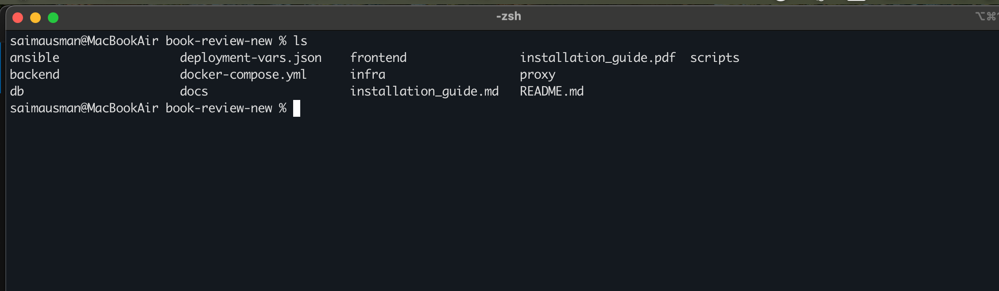

---

#### Screenshot 2 — Architecture Diagram

Add a screenshot of your architecture diagram showing:

- Public user
- Reverse proxy
- Frontend
- Backend
- Database
- Docker networks
- Public and private ports
- Persistent database storage

Add your full name inside the diagram or as a clear caption below it.

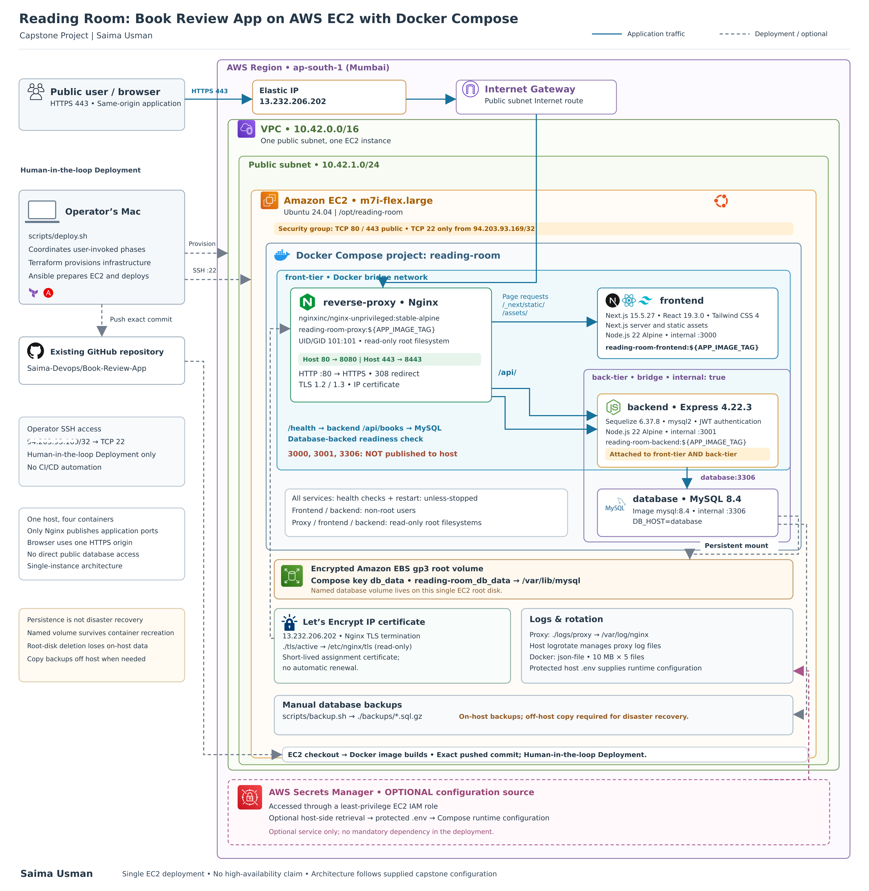

---

#### Screenshot 3 — Environment Variables and Ports Document

Add a screenshot showing the contents of:

```text
docs/02-env-and-ports.md
```

It must document environment-variable names, internal ports, persistent-data details, and the health-check method. Do not expose real credentials or values.

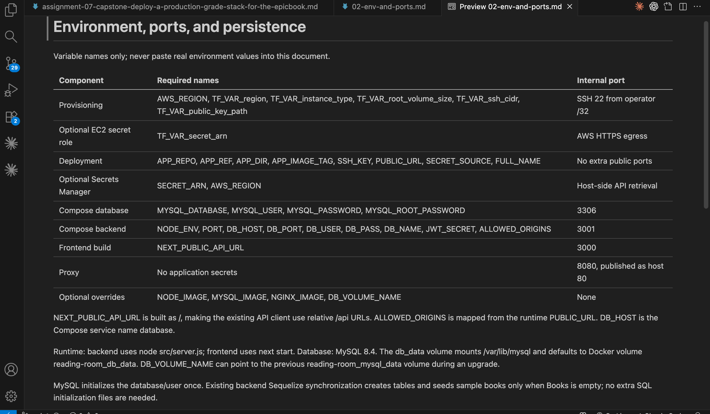

---

# Task 1 — Create Production Docker Images

## Goal

Create optimized production images for the EpicBook backend and frontend.

### Evidence

#### Screenshot 4 — Backend Dockerfile

Add a screenshot showing `backend/Dockerfile`, including:

- Dependency stage
- Minimal runtime stage
- Production startup command
- Internal backend port
- Non-root user configuration

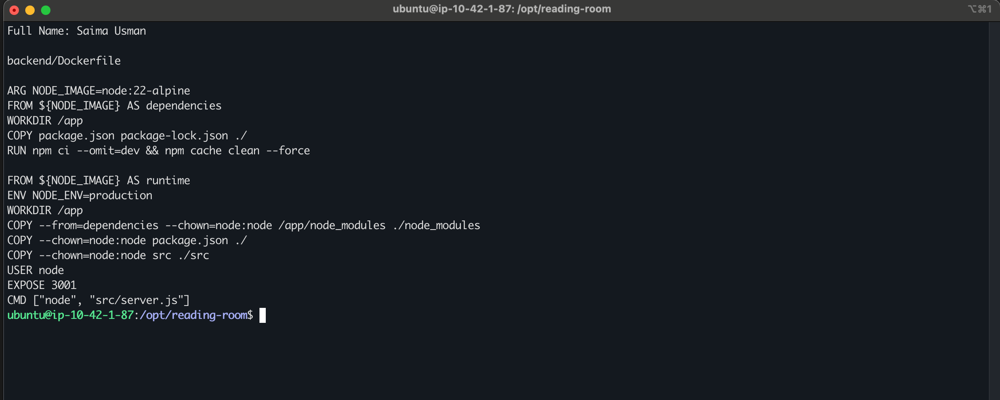

---

#### Screenshot 5 — Frontend Dockerfile

Add a screenshot showing `frontend/Dockerfile`, including:

- Nginx runtime image
- Static frontend files copied to the Nginx web root

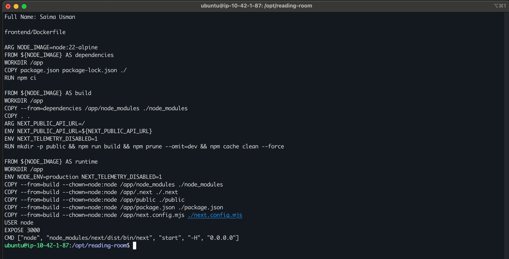

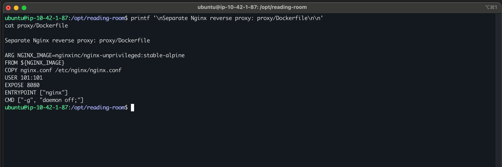

---

#### Screenshot 6 — Docker Ignore Files

Add a screenshot showing both:

```text
backend/.dockerignore
frontend/.dockerignore
```

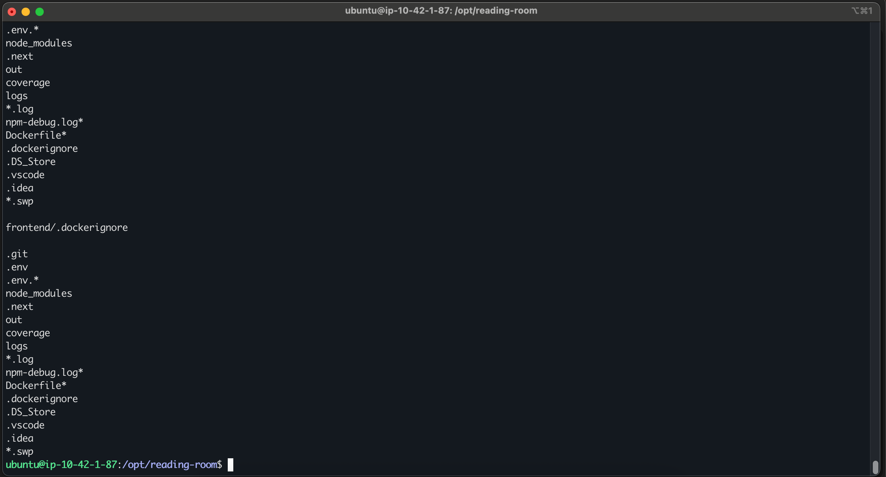

---

#### Screenshot 7 — Docker Image Builds and Size Comparison

Add a terminal screenshot showing successful builds of:

- Baseline backend image
- Optimized backend image
- Frontend image

The screenshot must also show the baseline and optimized backend image-size comparison.

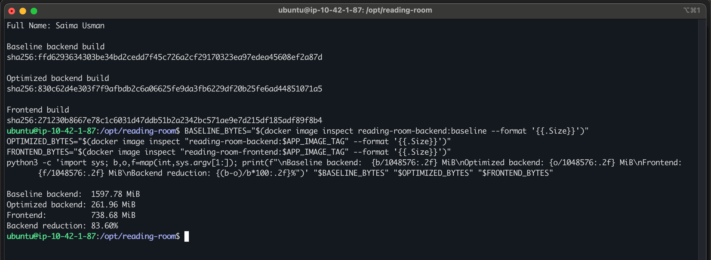

---

#### Screenshot 8 — Backend Running as Non-Root User

Add a terminal screenshot showing the optimized backend container running as a non-root user.

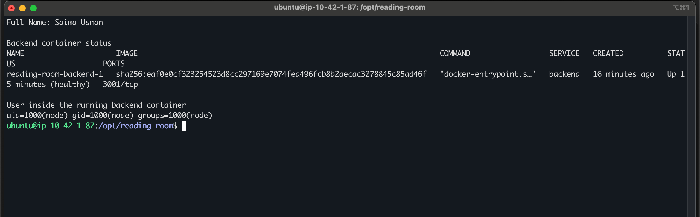
---

### Notes

Write a short note covering:

- Baseline and optimized backend image sizes
- The image-size reduction achieved
- One Docker layer-caching optimization used
- The security benefit of running the backend as a non-root user

The baseline backend image was `1597.78 MiB`, while the optimized image was `261.96 MiB`, achieving a `83.60%` reduction. The optimized image uses a minimal Alpine runtime and includes only production dependencies and application files.

For layer caching, dependency manifests are copied and installed before application source. Source-only changes can therefore reuse the dependency layer.

The backend runs as the non-root node user, reducing its privileges and limiting the damage a compromised application could cause.

---

# Task 2 — Create the Docker Compose Stack and Networks

## Goal

Create one Docker Compose stack containing the reverse proxy, frontend, backend, and MySQL database.

### Evidence

#### Screenshot 9 — Docker Compose Services

Add a screenshot showing `docker-compose.yml` with all four services:

```text
reverse-proxy
frontend
backend
database
```

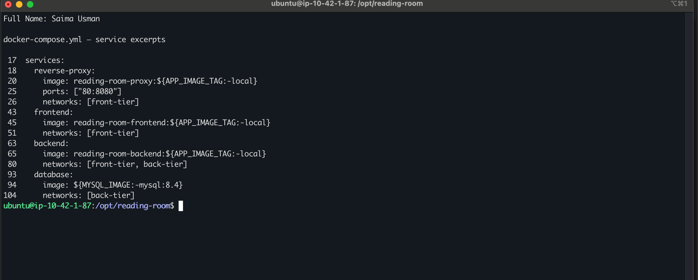

---

#### Screenshot 10 — Networks and Named Volume

Add a screenshot showing:

- `front-tier` network
- `back-tier` network
- `db_data` named volume

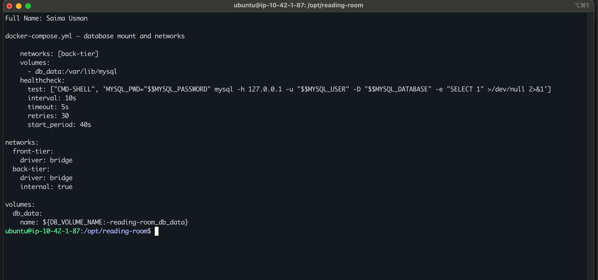

---

#### Screenshot 11 — Docker Compose Validation

Add a terminal screenshot showing successful Docker Compose validation without exposing environment-variable values or secrets.

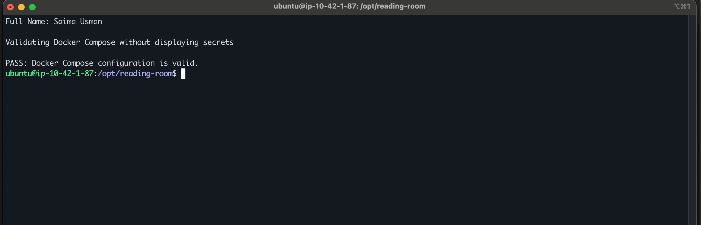

---

# Task 3 — Configure Health Checks and Startup Dependencies

## Goal

Configure health checks and ensure services start only after their dependencies are healthy.

### Evidence

#### Screenshot 12 — Backend Health Endpoint

Add a screenshot showing the backend application configuration for the `/health` endpoint.

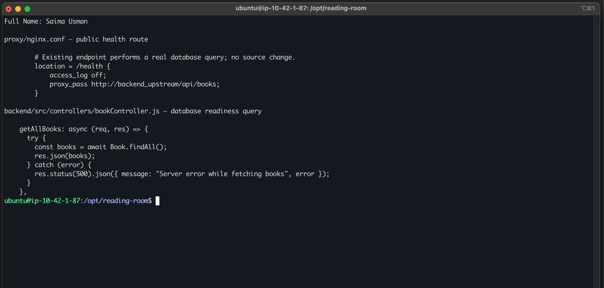

---

#### Screenshot 13 — MySQL and Backend Health Checks

Add a screenshot showing `docker-compose.yml` with health checks for MySQL and the backend.

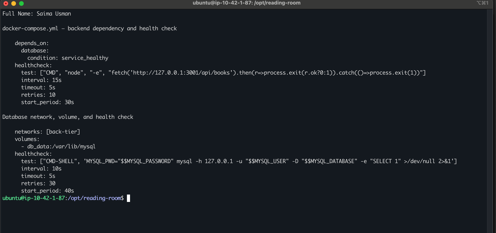

---

#### Screenshot 14 — Frontend and Reverse-Proxy Health Checks

Add a screenshot showing:

- Frontend health check
- Reverse-proxy health check
- `depends_on` conditions using `service_healthy`

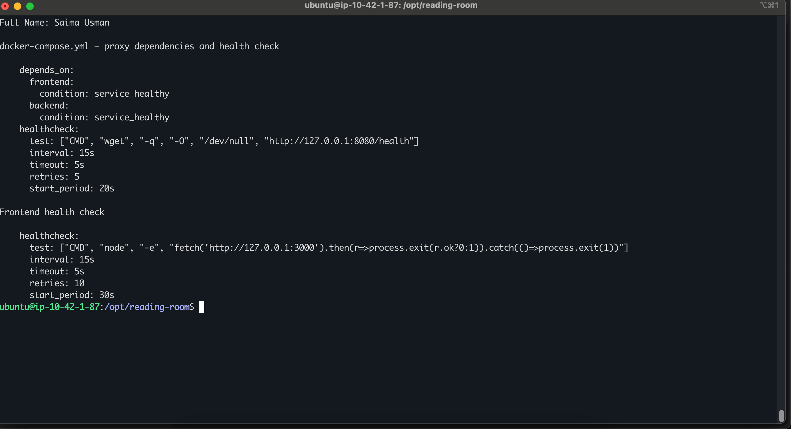

---

#### Screenshot 15 — Running Healthy Services

Add a terminal screenshot showing Docker Compose service status. The database, backend, frontend, and reverse proxy must be running successfully.

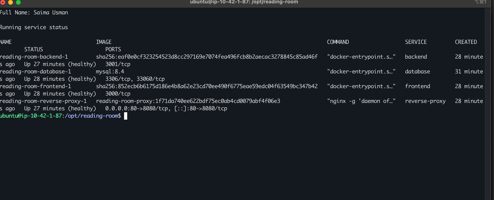

---

#### Screenshot 16 — Public Health Endpoint

Add a terminal screenshot showing a successful response from the public application health endpoint through the reverse proxy.

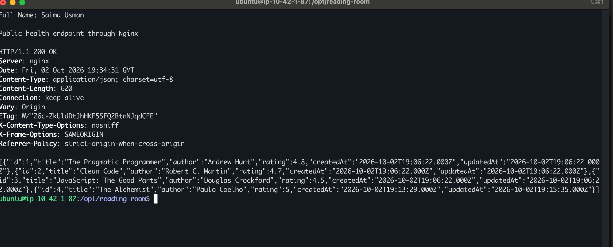

---

#### Screenshot 17 — Health-Check and Startup-Order Document

Add a screenshot showing the contents of:

```text
docs/03-healthchecks-and-depends-on.md
```

Explain the health-check method for each service and the startup dependency order.

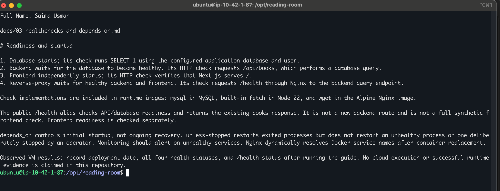

---

# Task 4 — Configure the Reverse Proxy and Same-Origin Routing

## Goal

Use either Nginx or Traefik as the only public entry point for the EpicBook application.

### Evidence

#### Screenshot 18 — Selected Reverse-Proxy Configuration

Add a screenshot showing the configuration for your selected reverse proxy.

It must show routes for:

- Static frontend assets
- Application pages
- API requests
- Health endpoint


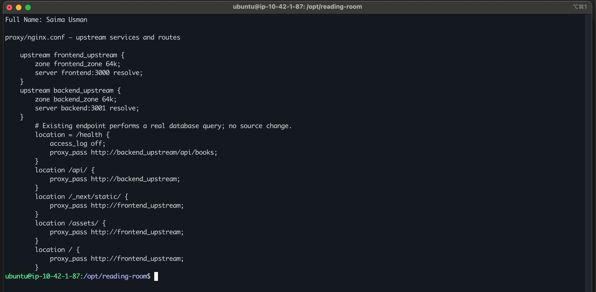

---

#### Screenshot 19 — Only Reverse Proxy Publishes Port 80

Add a screenshot of `docker-compose.yml` showing that only the `reverse-proxy` service publishes port 80.


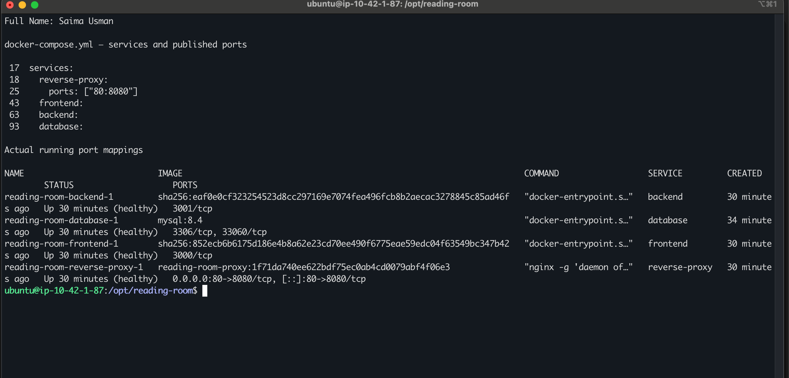

---

#### Screenshot 20 — Reverse-Proxy Route Testing

Add a terminal screenshot showing successful requests through the selected reverse proxy to:

- Application page
- One API endpoint
- One static asset
- Health endpoint


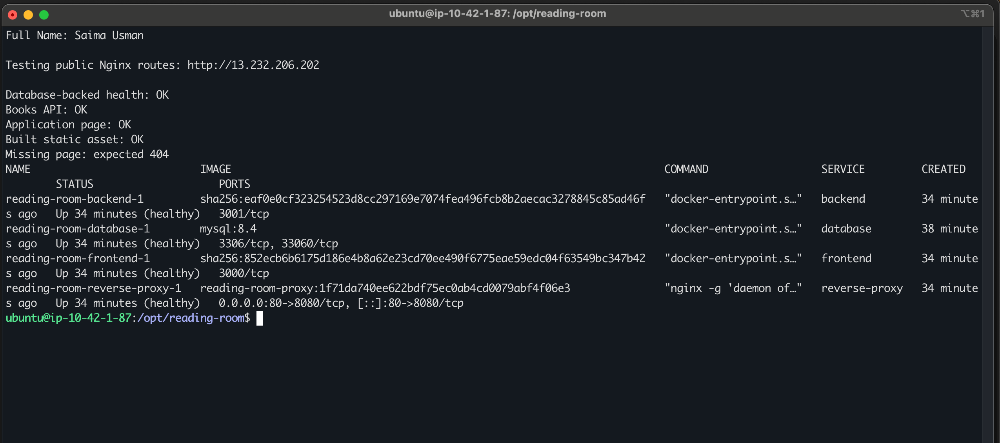

---

#### Screenshot 21 — EpicBook Application Through Public IP

Add a browser screenshot showing the EpicBook application loaded through the VM public IP address.

Add your full name as a clear caption below the screenshot.

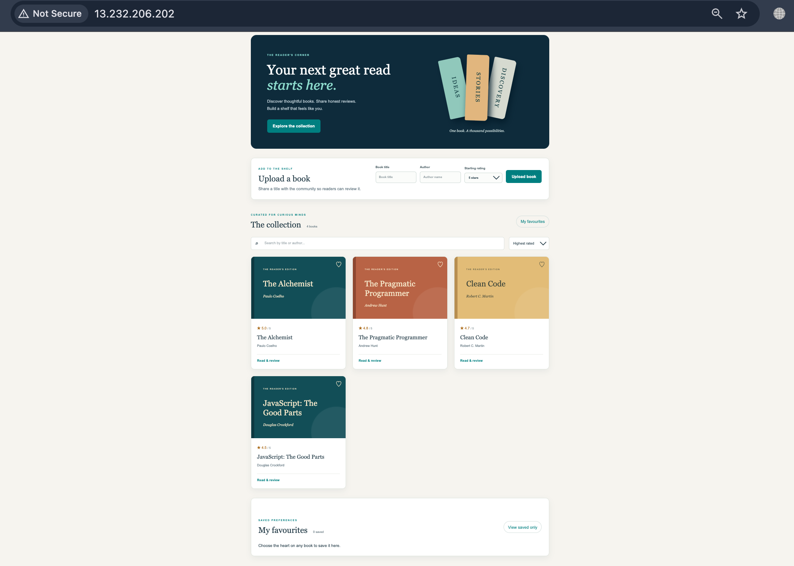

> Saima Usman — Reading Room accessed through the EC2 public IP on port 80, using Nginx as the reverse proxy.

---

#### Screenshot 22 — Proxy Routing and CORS Document

Add a screenshot showing the contents of:

```text
docs/04-proxy-routing-and-cors.md
```

Explain the proxy routes and state whether CORS was required and why.

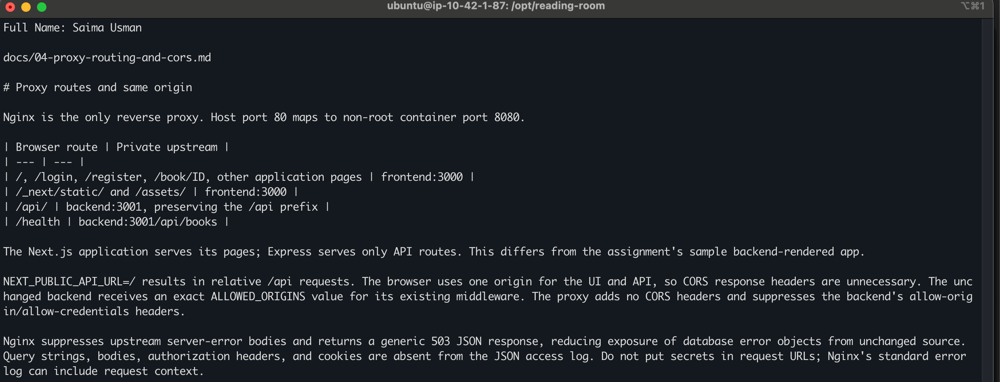

---

# Task 5 — Prove Data Persistence, Backup, and Restore

## Goal

Verify MySQL persistence and perform a controlled backup and restore drill.

### Evidence

#### Screenshot 23 — MySQL Volume Configuration

Add a terminal screenshot showing the `db_data` named volume and its MySQL mount configuration.

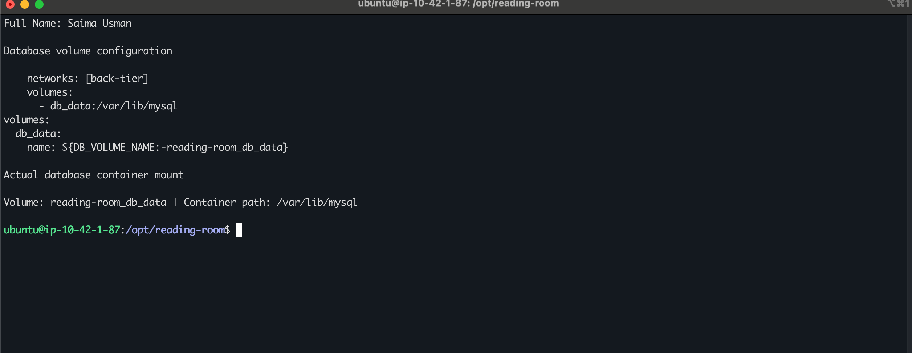

---

#### Screenshot 24 — Test Data Before Backup

Add a terminal screenshot showing the selected test data before the backup and restore drill.

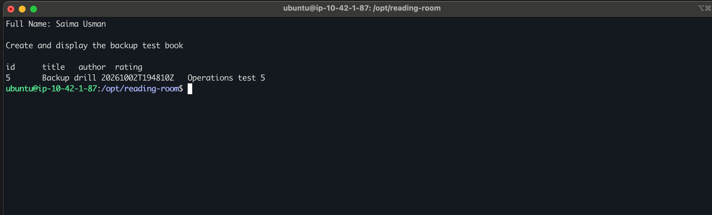

---

#### Screenshot 25 — Successful Backup Creation

Add a terminal screenshot showing successful backup creation and the backup file stored in the host backup directory.

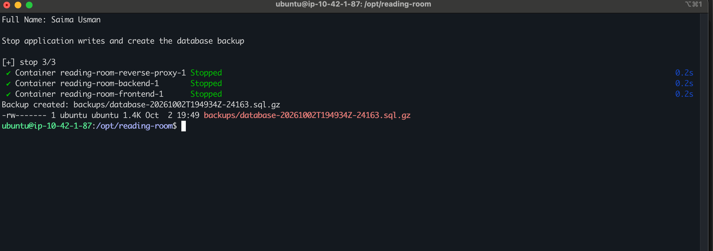

---

#### Screenshot 26 — Controlled Data-Loss Test

Add a terminal screenshot showing that the selected test record was removed during the controlled data-loss test.

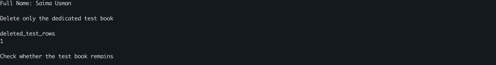

---

#### Screenshot 27 — Restore Verification

Add a terminal screenshot showing successful restore and verification that the deleted test record is available again.

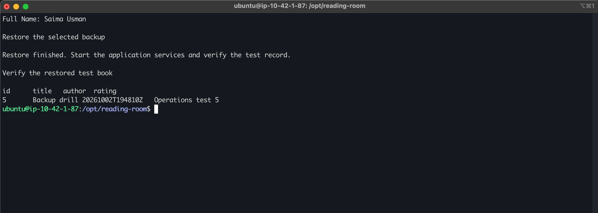

---

#### Screenshot 28 — Persistence After Down/Up Cycle

Add a terminal screenshot showing that database data remains available after a non-destructive Docker Compose down/up cycle.

Do not use `docker compose down -v`.

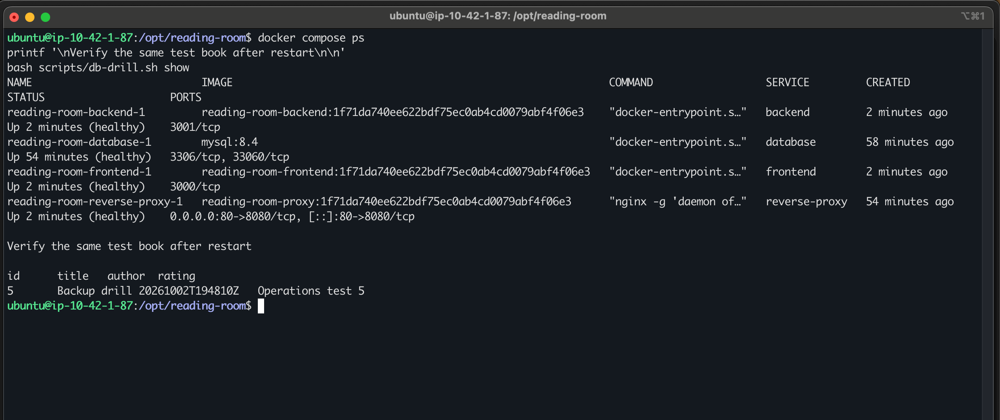

---

#### Screenshot 29 — Persistence and Backup Document

Add a screenshot showing the contents of:

```text
docs/05-persistence-and-backup.md
```

Include the backup plan and restore procedure.

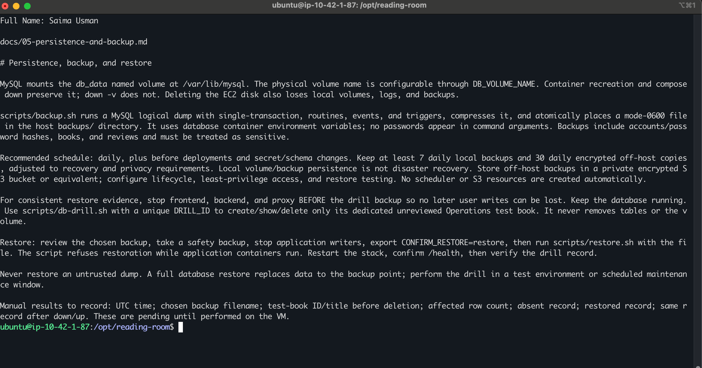

---

# Task 6 — Configure Logging and Observability

## Goal

Configure useful reverse-proxy and backend logs without exposing sensitive information.

### Evidence

#### Screenshot 30 — Logging Configuration

Add a screenshot showing:

- Configuration for the selected reverse proxy
- Proxy log format
- Docker Compose host log-directory bind mount

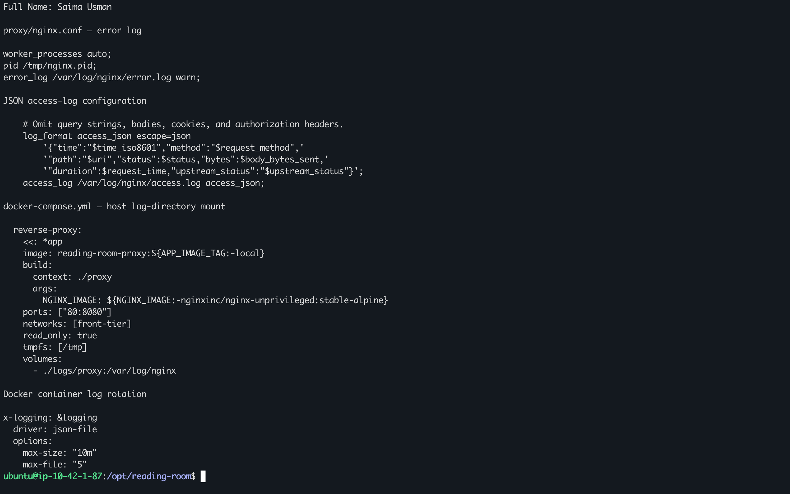

---

#### Screenshot 31 — Persistent Proxy Logs and Backend Logs

Add a terminal screenshot showing:

- Selected reverse-proxy logs available from the host directory after a proxy restart
- Backend logs displayed through Docker Compose

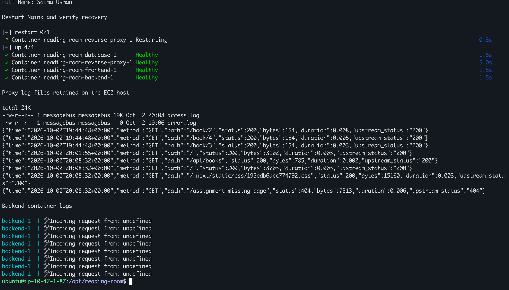

---

### Notes

Write a short note covering:

- The selected reverse proxy
- Host path used for reverse-proxy logs
- How backend logs are viewed
- Whether JSON or standard text logs were used
- Why passwords, tokens, headers, and database connection strings must not appear in logs

Nginx is the reverse proxy. Its logs are stored on the EC2 host at /opt/reading-room/logs/proxy, so they remain available after the proxy restarts. Access logs use JSON, while Nginx error logs and existing backend messages use standard text. Backend logs are viewed with docker compose logs backend. Passwords, tokens, authorization headers, and database connection strings must be excluded because logs and screenshots could expose credentials.

---

# Task 7 — Deploy and Verify the Stack on a Cloud VM

## Goal

Deploy the completed Docker Compose stack on an AWS or Azure VM and verify public access.

### Evidence

#### Screenshot 32 — VM Public IP and Inbound Rules

Add a cloud-console screenshot showing:

- VM public IP address
- SSH port 22 restricted to your IP address
- HTTP port 80 allowed from Anywhere

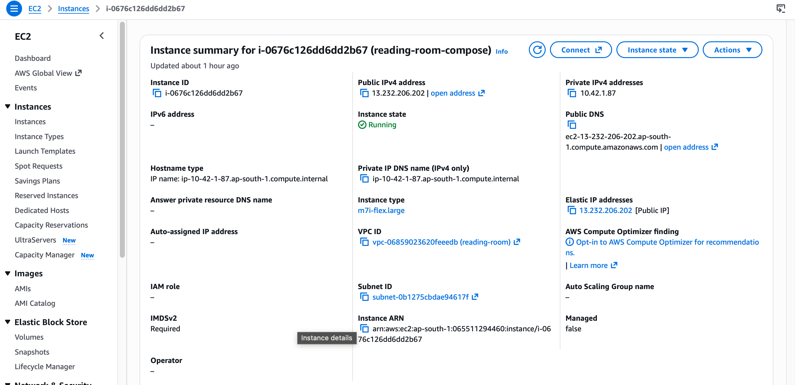
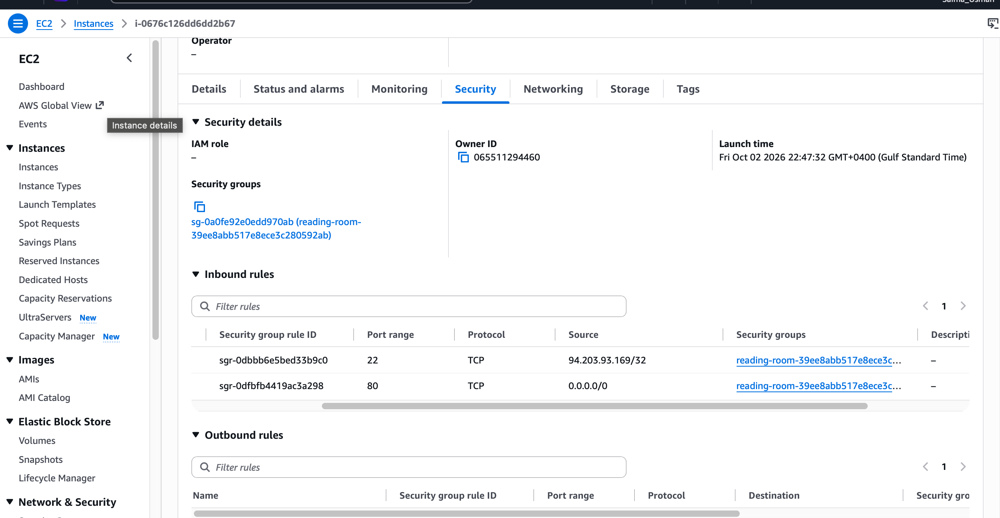

> Saima Usman — EC2 deployment in Mumbai, with public HTTP access and SSH restricted to my IP.

---

#### Screenshot 33 — Cloud VM Stack Verification

Add a VM terminal screenshot showing:

- Docker Compose service status
- Successful public health or API response
- No published database, frontend, or backend ports

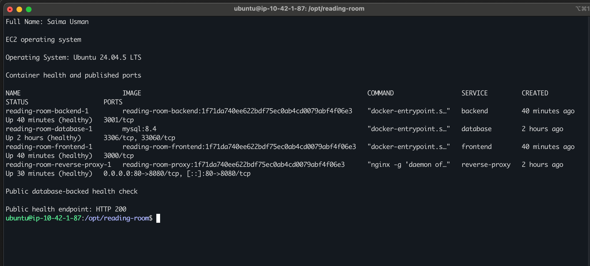

---

#### Screenshot 34 — EpicBook Application on Cloud VM

Add a browser screenshot showing the EpicBook application loaded through the VM public IP address.

Add your full name as a clear caption below the screenshot.

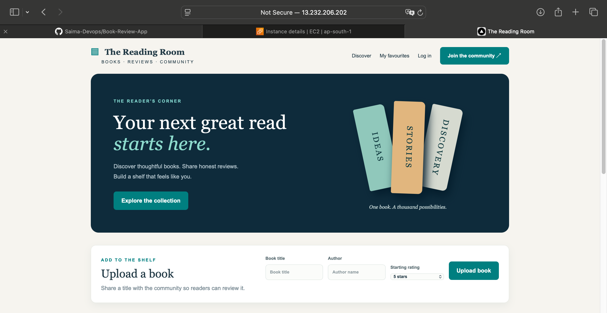
by **Saima Usman**

---

### Notes

Write a short note covering:

- Cloud provider used
- VM operating system
- Public port exposed
- Security rules configured
- Confirmation that the application and backend API worked through the reverse proxy

The application was deployed on AWS EC2 in the ap-south-1 (Mumbai) region using Ubuntu 24.04 and Docker Compose.

Public ports 80 (HTTP) and 443 (HTTPS) were exposed through the Nginx reverse proxy. The security group restricted SSH port 22 to 94.203.93.169/32. 

Frontend port 3000, backend port 3001, and MySQL port 3306 remained private.

Verification confirmed that the application pages, static assets, backend /api/books endpoint, and database-backed health check worked through the reverse proxy.

---

# Task 8 — Automate Deployment with CI/CD (Optional)

## Goal

Optionally automate image build, image push, and deployment through GitHub Actions or Azure Pipelines.

### Optional Evidence

#### Optional Screenshot — Successful CI/CD Pipeline Run

Add a screenshot showing a successful pipeline run with build, image push, deployment, and verification stages.

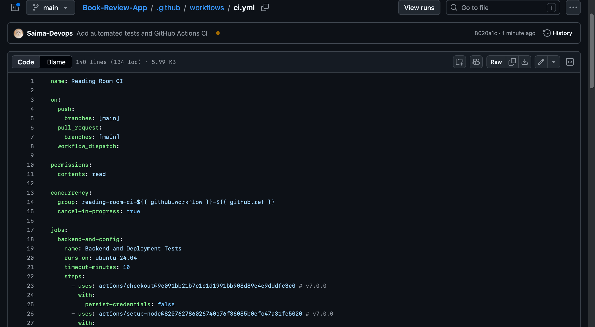

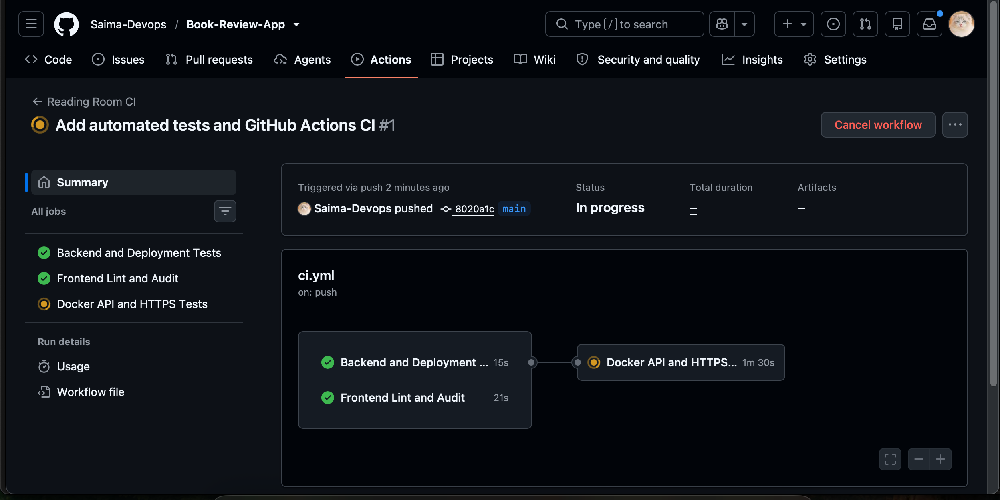

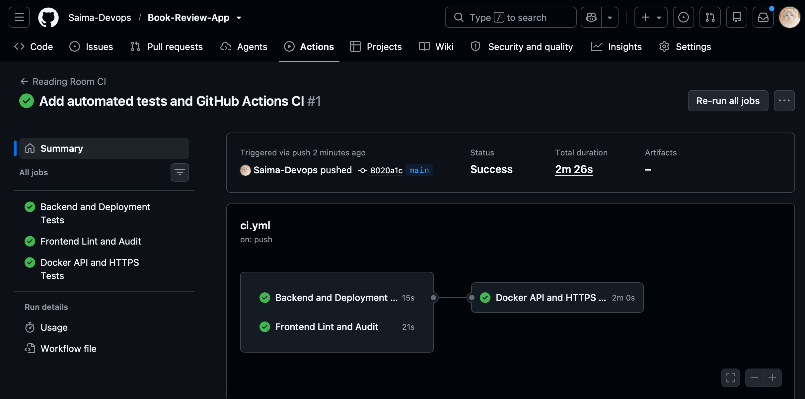

---

### Optional Notes

Write a short note covering:

- CI/CD platform used
- Image-tagging method
- Registry used
- Deployment trigger
- Manual approval or secret-handling approach

**CI/CD platform:** GitHub Actions runs automated tests, dependency audits, and Docker build checks. EC2 deployment remains human-approved.

**Image tagging:** Application images use the deployment commit SHA; CI images use ci-<commit-SHA> for traceability.

**Registry:** Docker Hub supplies base images. Application images are built locally on EC2 or the CI runner; they are not pushed to a registry.

**Triggers:** CI runs on pushes and pull requests to main, or manual workflow dispatch. Deployment is initiated manually using the deployment scripts.

**Approval and secrets:** Infrastructure changes require plan review and explicit confirmation. Production secrets remain in a protected, Git-ignored .env; CI uses synthetic test credentials and no AWS or SSH secrets provided.

---

# Task 9 — Perform Reliability Tests and Create an Operations Runbook

## Goal

Test controlled service failures and document safe operating procedures.

### Evidence

#### Screenshot 35 — Backend Failure and Recovery

Add a terminal screenshot showing:

- Backend failure test
- Expected unavailable response through the reverse proxy
- Backend restart
- Successful health-check recovery

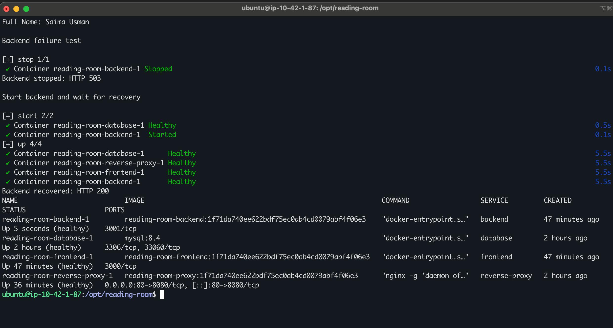
by **Saima Usman**

---

#### Screenshot 36 — Database Failure and Recovery

Add a terminal screenshot showing:

- Database outage test
- Failed database-dependent request
- Database restart
- Successful application recovery

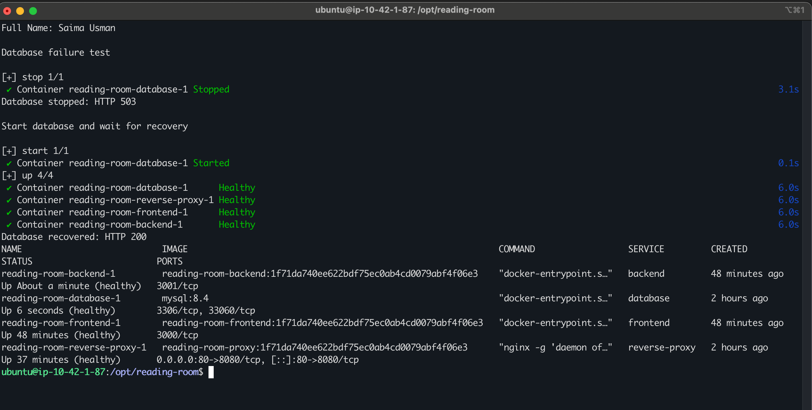
by **Saima Usman**

---

### Notes

Write a short operations runbook covering:

- Safe restart procedure for reverse proxy, frontend, backend, and database
- Backup and restore procedure
- Secret-rotation approach
- Database recovery procedure
- What to check when the application returns an error
- Results of backend and database reliability tests

Stopping the backend caused the API request through Nginx to return `HTTP 503`. Starting the backend restored `HTTP 200` responses. 

Stopping MySQL caused the database-dependent API request to return `HTTP 503`. After MySQL restarted, the backend reconnected and the API returned `HTTP 200`. 

Final application checks passed, and no database volume or application data was deleted.

---

# Final Public Application URL

**EpicBook URL:** http://13.232.206.202

## Let's Encrypt the App

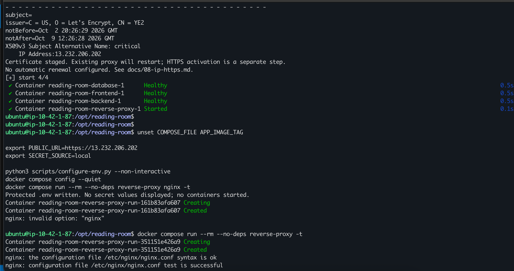

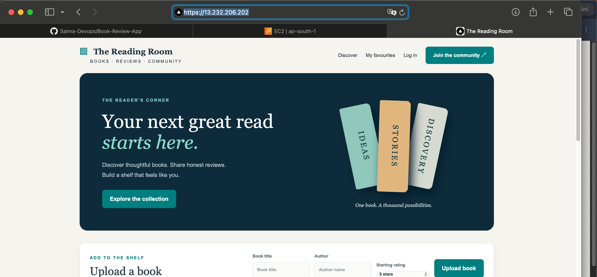

---

# GitHub Repository URL

**Your Fork or Repository URL:** https://github.com/Saima-Devops/Book-Review-App

---

# LinkedIn Requirement

## Goal

Create a professional LinkedIn post of 6–10 lines about your EpicBook capstone deployment.

Your post must include:

- The architectural decision that most improved reliability
- Your biggest image-size reduction, with numbers
- Key production-hardening lessons
- A deployment verification image

### Evidence

**LinkedIn Post URL:** https://lnkd.in/p/etP2Rzad

#### LinkedIn Post Screenshot

Add a screenshot of the published LinkedIn post showing the text body and deployment verification image.

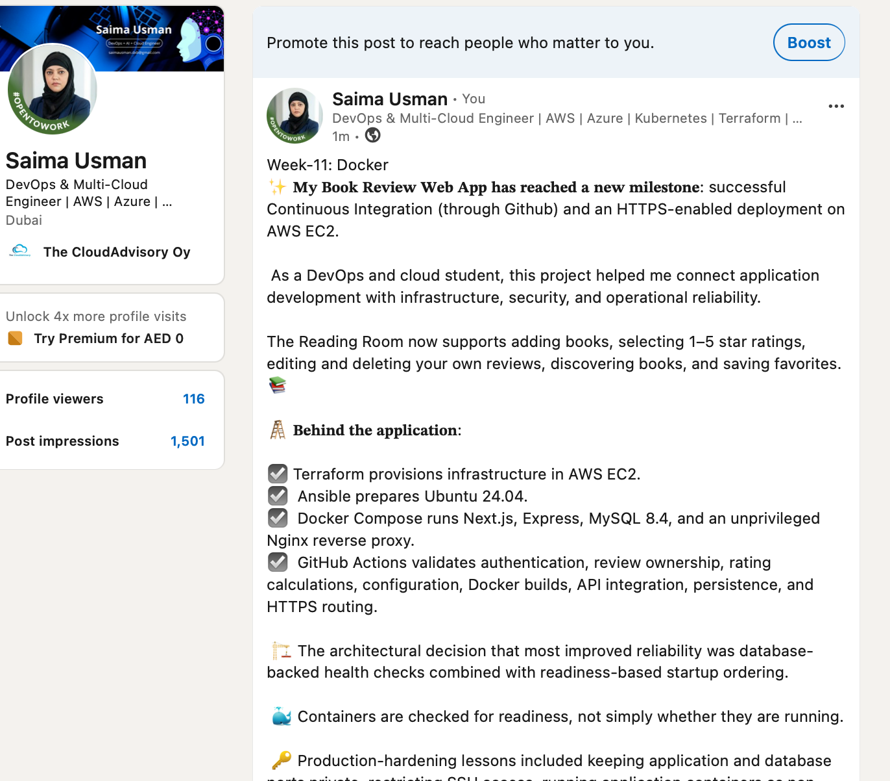

---

# Submission Checklist

- [✅] EpicBook repository reviewed and architecture diagram created
- [✅] Environment variables, ports, persistence, and health-check details documented
- [✅] Backend and frontend production Dockerfiles created
- [✅] Backend runs as a non-root user
- [✅] Docker image-size comparison completed
- [✅] Docker Compose stack includes reverse proxy, frontend, backend, and database
- [✅] `front-tier` and `back-tier` networks configured
- [✅] `db_data` named volume configured
- [✅] MySQL, backend, frontend, and reverse-proxy health checks configured
- [✅] Startup dependencies use `service_healthy`
- [✅] Nginx or Traefik selected as the only public reverse proxy
- [✅] Only reverse-proxy port 80 is publicly published
- [✅] Same-origin routing configured and CORS used only when required
- [✅] Backup, restore, and persistence testing completed
- [✅] Reverse-proxy and backend logs verified
- [✅] Cloud VM deployment verified through the public IP
- [✅] Backend and database reliability tests completed
- [✅] Screenshots 1–36 included
- [✅] Required notes completed
- [✅] LinkedIn post URL and screenshot included
- [✅] Full name visible in required screenshots or captions
- [✅] No passwords, tokens, private keys, account IDs, or other sensitive information exposed

---

## 📌 About DMI & CloudAdvisory

DevOps Micro Internship (DMI) is a project-based DevOps program run by Pravin Mishra (The CloudAdvisory) focused on real-world execution, systems thinking, and career readiness.

It helps learners build strong DevOps foundations with hands-on experience.

---

## 📌 Resources

- 🌐 DMI Official Website: https://dmi.pravinmishra.com?utm_source=github&utm_medium=readme  
- 🎓 University: https://university.pravinmishra.com?utm_source=github&utm_medium=readme  
- 💬 Discord Community: https://discord.pravinmishra.com?utm_source=github&utm_medium=readme  
- 📝 Blog: https://dmi.pravinmishra.com/blog?utm_source=github&utm_medium=readme  
- ▶️ YouTube Playlist: https://www.youtube.com/playlist?list=PLFeSNDtI4Cho  
- 🔗 Pravin Mishra (LinkedIn): https://www.linkedin.com/in/pravin-mishra-aws-trainer/  
- 🏢 CloudAdvisory (LinkedIn): https://www.linkedin.com/company/thecloudadvisory/

---

*This submission is part of DevOps Micro Internship (DMI) — Agentic AI Track.*
